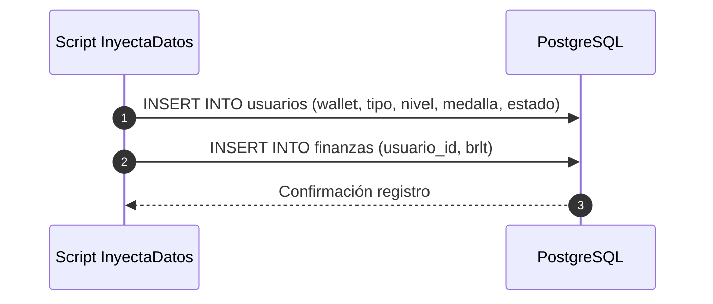
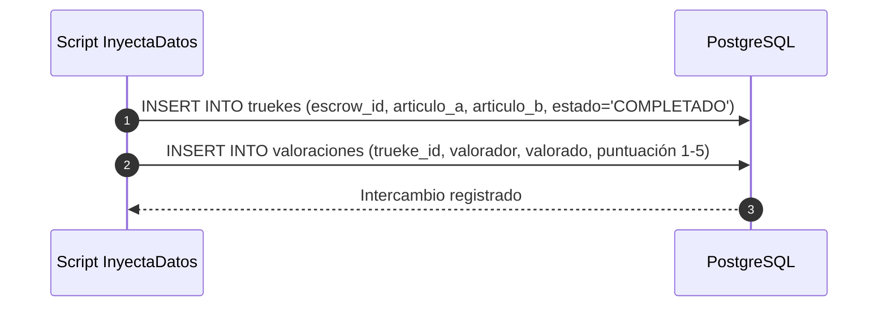

# InyectaDatos — Casos de Uso para Inyección de Datos

Este documento detalla los flujos de simulación e inyección operativa de datos para la plataforma TrueKeate.

## 1. Caso de Uso CUI-01: Inyección de Identidades y Balances
- **Actor**: Script InyectaDatos / Administrador.
- **Precondición**: Cuentas de Anvil disponibles (Índices 2 a 7).
- **Flujo Principal**:
  1. Registra e inscribe la cuenta en la tabla `usuarios` con su tipo (`SOCIO`, `EMPRESA`, `PARTICULAR`), nivel, medalla D28 y consentimiento GDPR.
  2. Crea el registro inicial en `finanzas` asignando el balance en BRLT (2000 BRLT para Socios y Empresas, 1000 BRLT para Comunes).
- **Diagrama Mermaid**:

---

## 2. Caso de Uso CUI-02: Publicación de Ítems Tokenizados
- **Actor**: Usuarios de Anvil (Cuentas 2, 3, 4, 5, 6, 7).
- **Precondición**: Usuario inscrito.
- **Flujo Principal**:
  1. Publica artículos/bienes/servicios en la tabla `articulos` asignando la categoría correspondiente (`ARTICULO`, `BIEN`, `SERVICIO`).
  2. Asigna un `nft_token_id` sintético/simulado correspondiente al Smart Contract `TrueKeateNFT`.
- **Items por Tipo**:
  - **Empresas (Cuentas 4 y 5)**: 2 Artículos, 2 Bienes, 2 Servicios cada una (12 ítems totales).
  - **Socios y Comunes (Cuentas 2, 3, 6 y 7)**: 3 Artículos cada uno (12 ítems totales).

---

## 3. Caso de Uso CUI-03: Generación de Historial Permutado de Intercambios
- **Actor**: Red de 6 Usuarios Inscritos.
- **Precondición**: Usuarios y Artículos creados.
- **Flujo Principal**:
  1. Genera una matriz de permutas de 30 trueques completados en total, garantizando que **cada uno de los 6 usuarios participe exactamente en 10 intercambios**.
  2. Inserta el registro del trueque en `truekes` con estado `COMPLETADO` y cierres concordantes (`CONFORME`).
  3. Inserta valoraciones mutuas en la tabla `valoraciones` con puntajes acordes al perfil de cada usuario:
     - **Socios (Oro)**: Calificaciones promedio 4.8 - 5.0.
     - **Empresas (Plata)**: Calificaciones promedio 4.2 - 4.6.
     - **Comunes (Bronce)**: Calificaciones promedio 3.5 - 4.0.
- **Diagrama Mermaid**:

