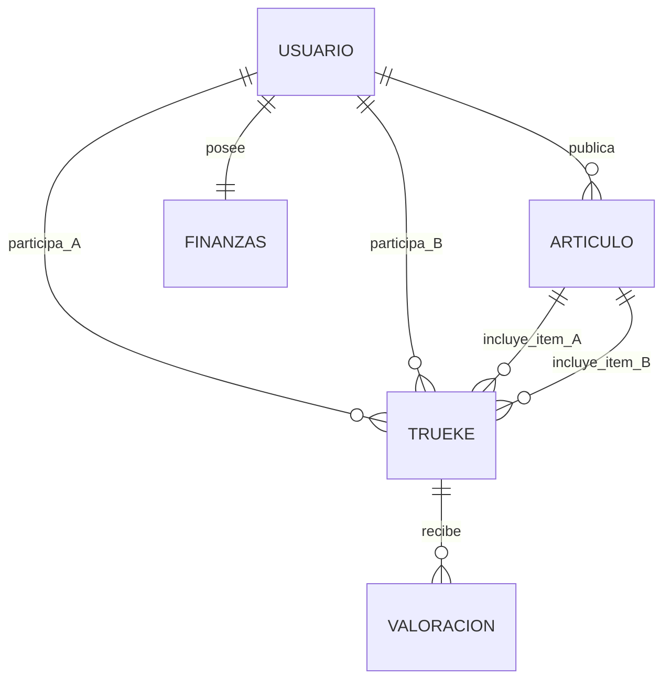

# InyectaDatos — Estructura de Datos Operativos

Este documento describe la arquitectura y estructura de la información necesaria para inyectar un historial operativo realista y coherente en la plataforma TrueKeate.

## 1. Entidades Principales y Campos Relacionados

### `usuarios`
- **Campos claves**: `wallet`, `correo`, `telefono`, `direccion_inscripcion`, `tipo` (`PARTICULAR`, `EMPRESA`, `SOCIO`), `nivel` (`INICIADO`, `COMUN`, `FRECUENTE`, `SOCIO`), `medalla` (`BRONCE`, `PLATA`, `ORO`), `estado` (`INSCRITO`, `VERIFICADO`, `CERTIFICADO`), `consentimiento_gdpr`.
- **Propósito**: Define la identidad off-chain y el nivel dentro de la escalera de verificación D28.

### `finanzas`
- **Campos claves**: `usuario_id`, `brlt`, `nfts_stock`, `criptos`, `fondo_valor`.
- **Propósito**: Mantiene los saldos en BRLT (BorloToken) y el balance de NFTs/criptos del usuario.

### `articulos`
- **Campos claves**: `usuario_id`, `titulo`, `descripcion`, `rubro`, `categoria` (`ARTICULO`, `SERVICIO`, `BIEN`, `CRIPTO`), `nft_token_id`, `disponible`.
- **Propósito**: Catálogo de ítems tokenizados publicados para su trueque.

### `truekes`
- **Campos claves**: `escrow_id`, `articulo_a_id`, `articulo_b_id`, `usuario_a`, `usuario_b`, `estado` (`COMPLETADO`, `CUSTODIADO`, `ACTIVO`), `cierre_a`, `cierre_b`.
- **Propósito**: Registro espejo y off-chain de las operaciones de trueque entre usuarios.

### `valoraciones`
- **Campos claves**: `trueke_id`, `valorador`, `valorado`, `aceptacion`, `honestidad`, `seguridad`, `confiabilidad`, `compromiso`.
- **Propósito**: Evaluación mutua de 1 a 5 estrellas por cada intercambio finalizado.

---

## 2. Diagrama Mermaid de Flujo de Datos Principal

---

## 3. Cuentas Anvil Objetivo para Inyección

| Cuenta Anvil | Rol Requerido | Escalera / Medalla | Fondo BRLT | Ítems a Tokenizar |
|---|---|---|---|---|
| **Cuenta 2** (`0x3C44...93BC`) | **Socio** (Ana López) | CERTIFICADO / Oro | 2000 BRLT | 3 Artículos de valor |
| **Cuenta 3** (`0x90F7...b906`) | **Socio** (Bernardo Silva) | CERTIFICADO / Oro | 2000 BRLT | 3 Artículos de valor |
| **Cuenta 4** (`0x15d3...6A65`) | **Empresa** (EcoTech) | CERTIFICADO / Plata | 2000 BRLT | 6 Ítems (2 Art, 2 Bien, 2 Serv) |
| **Cuenta 5** (`0x9965...A4dc`) | **Empresa** (ServiPro) | CERTIFICADO / Plata | 2000 BRLT | 6 Ítems (2 Art, 2 Bien, 2 Serv) |
| **Cuenta 6** (`0x976E...0aa9`) | **Comun** (Carlos Mendoza) | VERIFICADO / Bronce | 1000 BRLT | 3 Artículos |
| **Cuenta 7** (`0x14dC...9955`) | **Comun** (Diana Rojas) | VERIFICADO / Bronce | 1000 BRLT | 3 Artículos |
