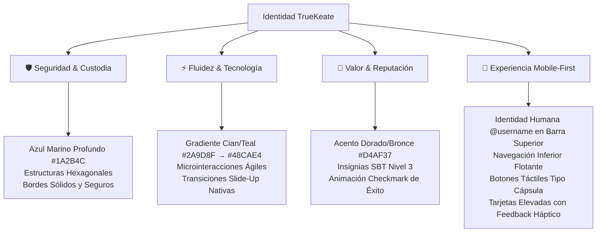

# Propuesta de Entorno Visual y Sistema de Diseño — TrueKeate

> **Documento Maestro de Diseño:** Guía Visual Mobile-First, Design Tokens, Componentes UI y Animaciones  
> **Referencia Base:** `RepoTecnico/PROPUESTA_ENTORNO_VISUAL_TRUEKEAT.md` (este documento) y `TrueKeate/TrueKeate_logo` (assets)  
> **Enfoque de Experiencia:** Bóveda Digital Moderna (Fintech Web3 + Custodia Atómica + RWA)  
> **Fecha:** 28 de Agosto de 2026  
> **Versión:** 2.1 (Actualizada: Identidad `@username` en Barra Superior Móvil)  
> **Integración:** vinculada a los requerimientos como **RNF-08** y **RF-19** en `requerimientos.md`; assets en `TrueKeate/` (ver §0)

---

## 0. Inventario de Activos de Marca (`TrueKeate/`) — RF-19

| Archivo | Formato / Tamaño | Uso |
|---|---|---|
| `TrueKeate_logo.svg` | SVG vector 983×881 pt (fill negro — recoloreable con tokens) | Logo principal vectorial (fuente de marca) |
| `TrueKeate_logo.png` | PNG 983×881 RGBA | Logo raster para UI/imágenes |
| `TrueKeate_logo.ico` | ICO | Favicon del navegador |
| `TrueKeate_logo.JPG` | JPEG 2816×1536 | Preview/presentación |
| `TrueKeate_titulo.svg` | SVG vector 1399×684 pt (fill negro — recoloreable) | Título/logo con texto "TrueKeate" |
| `TrueKeate_titulo.png` | PNG 1399×684 RGBA | Título raster |
| `TrueKeate_titulo.ico` | ICO | Favicon alternativo |
| `Gemini_Generated_Image_aa0kqcaa0kqcaa0k.jpg` | JPEG 2816×1536 | Hero conceptual (landing) |
| `Gemini_Generated_Image_g8iktjg8iktjg8ik.jpg` | JPEG 2816×1536 | Hero conceptual (landing) |
| `Gemini_Generated_Image_pwfd5jpwfd5jpwfd.jpg` | JPEG 2816×1536 | Hero conceptual (landing) |
| `Gemini_Generated_Image_s9l1g1s9l1g1s9l1.jpg` (+ `(1).jpg` duplicado) | JPEG 2816×1536 | Hero conceptual (landing) |
| `Gemini_Generated_Image_saoquksaoquksaoq.jpg` | JPEG 2814×1536 | Hero conceptual (landing) |
| `Guía_sobre_Soulbound_Tokens_(SBT).png` | PNG 1536×2752 | Material de referencia SBT/insignias (RF-03/reputación) |

> Los SVG en `fill="#000000"` se **recolorean** con la paleta del §2.1 vía CSS `currentColor`/`fill` al
> integrarlos en el frontend (véase §7).

---

## 🏛️ 1. Filosofía y Personalidad de Marca

La interfaz de **TrueKeate** está diseñada bajo el concepto de una **"Bóveda Digital Moderna y Fluida"**, combinando la solidez de la custodia criptográfica y el valor tangible (oro, bienes RWA, reputación comunitaria) con la agilidad y fluidez de la economía circular P2P y las meta-transacciones sin gas.



---

## 🎨 2. Tokens de Diseño (Design Tokens) y Paleta Cromática

### 2.1. Paleta de Colores Primaria, Secundaria y de Acento

| Rol Semántico | Color Name | Hex / Valor | Uso Principal en la Interfaz |
| :--- | :--- | :--- | :--- |
| **Color Base / Confianza** | `Deep Navy Blue` | `#1A2B4C` | Textos de encabezados, barras de navegación superior, pie de página, bordes de hexágonos estructurales. |
| **Superficie Oscura** | `Midnight Navy` | `#0A1128` | Fondos de navbar sticky, pie de página y tarjetas en modo oscuro. |
| **Primario de Acción** | `Teal Energy` | `#2A9D8F` | Inicio de gradiente en botones CTA, iconos activos, bordes de inputs en focus, indicadores de éxito. |
| **Secundario de Fluidez** | `Cyan Electric` | `#48CAE4` | Fin de gradiente CTA, líneas de gráficos animados, enlaces interactivos, badges de tecnología. |
| **Acento de Valor** | `Metallic Gold` | `#D4AF37` | Insignias de Verificación Nivel 3 (SBT), estrellas de reputación, check de éxito (`TrueKeat☑`), bordes premium en tarjetas RWA. |
| **Fondo Principal (Lienzo)** | `Smoke White` | `#F8F9FA` | Fondo general de la plataforma (limpio, luminoso y de alto contraste). |
| **Superficie de Tarjetas** | `Pure White` | `#FFFFFF` | Tarjetas de inventario, modales, menús flotantes (`box-shadow: 0 10px 30px rgba(0,0,0,0.05)`). |
| **Error / Alerta Crítica** | `Crimson Alert` | `#E63946` | Estados de error en formularios, disputas activas, botón de cancelación de operaciones. |
| **Advertencia / Atención** | `Coral Warning` | `#F4A261` | Alertas de vencimiento próximo de deadline, ventanas de tiempo de 10 min. |

### 2.2. Gradientes de Identidad

```css
/* Gradiente Principal para Botones CTA y Headers de Acción */
--gradient-primary-cta: linear-gradient(135deg, #1A2B4C 0%, #2A9D8F 100%);

/* Gradiente Secundario para Resaltados y Gráficos */
--gradient-cyan-glow: linear-gradient(90deg, #2A9D8F 0%, #48CAE4 100%);

/* Gradiente de Acento de Valor y Certificación */
--gradient-gold-badge: linear-gradient(135deg, #D4AF37 0%, #F3E5AB 50%, #C5A065 100%);

/* Gradiente Bicolor de Tarjetas Destacadas */
--gradient-card-border: linear-gradient(90deg, #1A2B4C 0%, #2A9D8F 50%, #D4AF37 100%);
```

---

## ✍️ 3. Jerarquía Tipográfica (Typography Scale)

* **Familia Tipográfica de Títulos:** `Montserrat`, `Poppins`, sans-serif (Bold 700 / ExtraBold 800)  
  * *Razón:* Estructura geométrica robusta que evoca tecnología de precisión y solidez institucional.
  * *Ajuste:* `letter-spacing: -0.02em` (-0.5px) para un look compacto y premium.
* **Familia Tipográfica de Cuerpo:** `Inter`, `Roboto`, sans-serif (Regular 400 / Medium 500 / SemiBold 600)  
  * *Razón:* Altura de x optimizada para legibilidad en pantallas táctiles de alta densidad (Retina / OLED).
* **Etiquetas y Metadatos:** Mayúsculas con espaciado amplio (`letter-spacing: 0.08em; font-size: 11px; text-transform: uppercase`).

| Nivel | Elemento | Tamaño / Line-Height | Peso / Tracking | Ejemplo de Aplicación |
| :--- | :--- | :--- | :--- | :--- |
| **Display / Hero** | `H1` | `32px / 38px` (móvil)<br>`44px / 52px` (desktop) | Bold 800<br>`-0.03em` | "El Universo del Intercambio Descentralizado" |
| **Sección** | `H2` | `24px / 30px` | Bold 700<br>`-0.02em` | "Catálogo de Bienes RWA y Vouchers" |
| **Tarjeta / Módulo** | `H3` | `18px / 24px` | SemiBold 600<br>`-0.01em` | "Laptop Lenovo ThinkPad T14 (RWA)" |
| **Cuerpo Principal** | `Body` | `15px / 22px` | Regular 400<br>`normal` | Descripciones de artículos, términos y condiciones. |
| **Identidad / Tag** | `Caption` | `12px / 16px` | Bold 700<br>`+0.02em` | "@superadmin ✓ · N3 CERTIFICADO" |

---

## 🎛️ 4. Arquitectura de Componentes UI y Layout Móvil

### 4.1. Barra Superior Móvil (Top App Bar con `@username`)

En dispositivos móviles, la barra superior prioriza la **identidad legible y humana del usuario** en lugar de mostrar direcciones hexadecimales criptográficas complejas (`0x...`).

```
┌─────────────────────────────────────────────────────────────┐
│ [ ⇄ ] TrueKeat☑        [ ⬡ @particular_carlos ✓  [🔔 2] ]   │
└─────────────────────────────────────────────────────────────┘
```

* **Lado Izquierdo:** Isotipo hexagonal TrueKeate + Logotipo `TrueKeat☑`.
* **Lado Derecho:**
  1. **Cápsula de Identidad:** Muestra el avatar hexagonal con la inicial del usuario, el nombre de usuario `@username` en tipografía clara y el checkmark dorado `✓` que acredita su verificación on-chain.
  2. **Campana de Notificaciones:** Notificaciones de ofertas, cambios de estado en truekes y postulaciones.
  3. Al tocar la cápsula de identidad se despliega el menú completo de usuario (perfil, reputación en 5 dimensiones, balances de tokens y opción de copia de wallet).

---

### 4.2. Botones (Buttons)

1. **Botón Principal (CTA Pill-Shape):**
   * **Forma:** Cápsula completamente redondeada (`border-radius: 9999px` o `50px`).
   * **Fondo:** Gradiente `linear-gradient(135deg, #1A2B4C 0%, #2A9D8F 100%)`.
   * **Sombra:** `0 4px 15px rgba(42, 157, 143, 0.35)`.
   * **Interacción:** `transform: scale(0.96)` en tap/active con efecto Ripple.

2. **Botón Secundario (Outline Geométrico):**
   * **Forma:** Rectángulo con radio de `12px`.
   * **Borde:** `2px solid #1A2B4C`, fondo transparente con hover en tinte suave `#F0FDF4`.

3. **Botón de Acento (Certificación / Arbitraje):**
   * **Forma:** Cápsula con borde o fondo `linear-gradient(135deg, #D4AF37 0%, #C5A065 100%)` y texto oscuro `#1A2B4C`.

---

### 4.3. Elementos de Formulario (Inputs, Toggles, Selects)

* **Inputs de Texto (56px Touch Target):**
  * Altura fija de 56px para facilitar interacción táctil en móviles.
  * Icono contextual a la izquierda a 48px de padding.
  * **Estado Focus:** Borde `2px solid #2A9D8F` con resplandor suave `box-shadow: 0 0 0 4px rgba(42, 157, 143, 0.12)`.
  * **Estado Success:** Borde dorado `#D4AF37` con check animado `checkDraw`.
  * **Estado Error:** Borde carmesí `#E63946` con microanimación de sacudida (`shake 0.4s`).

* **Toggle Switches (56x32px):**
  * Fondo inactivo `#E0E6ED`, fondo activo gradiente navy-teal con thumb dorado `#D4AF37`.

* **Checkbox & Radios:**
  * Checkbox con llenado gradiente y checkmark rebotante; Radios con onda expansiva animada.

---

### 4.4. Tarjeta de Activo (Asset Card — RWA / Service / P2P)

```
┌────────────────────────────────────────────────────────┐
│ [🖼️ FOTOGRAFÍA EN ALTA RESOLUCIÓN / CID IPFS]          │
│                                                        │
│ ┌──────────────────────┐    ┌────────────────────────┐ │
│ │ 🛡️ RWA TOKENIZADO    │    │ 🏷️ DISPONIBLE (3 unid) │ │
│ └──────────────────────┘    └────────────────────────┘ │
├────────────────────────────────────────────────────────┤
│ [⬡] @empresa_tech  ✓ (N3 Certificado · Oro 99.7%)      │
│                                                        │
│ Laptop Lenovo ThinkPad T14 Gen 3 (Intel Core i7, 32GB) │
│                                                        │
│ 🔁 BUSCA A CAMBIO:                                     │
│    "Generador Eléctrico 3.5kVA o 650 BRLT / USDT"      │
│                                                        │
│ 📍 Ubicación: Higuerote, Miranda (≤ 2.4 km de ti)      │
├────────────────────────────────────────────────────────┤
│ [ 🚀 PROPONER TRUEKE ATÓMICO (SIN GAS)              ]  │
└────────────────────────────────────────────────────────┘
```

* **Detalle Exclusivo:** Borde superior o lateral izquierdo con resplandor dorado (`border-left: 4px solid #D4AF37`) para identificar activos con respaldo RWA tokenizado o emitidos por Socios/Empresas certificadas.
* **Avatar Hexagonal:** Contenedor hexagonal geométrico con borde turquesa y checkmark de verificación.

---

### 4.5. Navegación Inferior Flotante (Bottom Navigation Bar)

Para la experiencia móvil, se utiliza una barra de navegación inferior flotante con elevación suave:

* **Estructura:** Barra blanca flotante a 16px del borde inferior con radio de `24px` y `backdrop-filter: blur(12px)`.
* **Iconos:**
  1. 🏠 **Explorar / Mercado**
  2. 💼 **Mi Inventario / RWA**
  3. ⇄ **Trueke Central (Botón Central Elevado en Hexágono Dorado)**
  4. 🏛️ **Gobernanza / Socios**
  5. 👤 **Mi Perfil & Identidad**

---

## ⚡ 5. Sistema de Animaciones y Microinteracciones

### 5.1. Curvas de Aceleración y Tiempos Estándar

```css
:root {
  --ease-natural: cubic-bezier(0.4, 0, 0.2, 1);  /* Movimiento orgánico */
  --ease-bounce:  cubic-bezier(0.34, 1.56, 0.64, 1); /* Rebote para logros y checks */
  --ease-out:     cubic-bezier(0, 0, 0.2, 1);   /* Salidas y revelados */
  
  --duration-fast:   150ms; /* Taps, ripples, tooltips */
  --duration-normal: 300ms; /* Focus de inputs, cards hover */
  --duration-page:   400ms; /* Transición entre páginas (Slide-Up) */
  --duration-slow:   600ms; /* Animación de dibujo de check y gráficos */
}
```

### 5.2. Microinteracciones Principales

1. **Loader Hexagonal de Doble Giro:** En lugar de spinners genéricos, dos hexágonos/flechas concéntricas giran en sentidos opuestos alternando destellos entre Cian `#2A9D8F` y Dorado `#D4AF37`.
2. **Dibujo de Checkmark (`TrueKeat☑`):** Al confirmarse un trueque o validación 2FA/SBT, el checkmark se dibuja vectorialmente con `stroke-dashoffset` y un ligero efecto de rebote elástico.
3. **Elevación Háptica de Tarjetas:** Al pasar el cursor o posar el dedo, la tarjeta se eleva 6px (`translateY(-6px)`), su sombra se difumina y la barra superior de gradiente se expande de izquierda a derecha.

---

## 📱 6. Blueprint de la Sala de Negociación Smart Escrow (UI Móvil)

Cuando dos partes acuerdan un intercambio:

```
┌─────────────────────────────────────────────────────────────┐
│              SALA DE INTERCAMBIO ATÓMICO                    │
├──────────────────────────────┬──────────────────────────────┤
│ TU APORTE                    │ CONTRAPARTE                  │
│ [⬡] @particular_carlos       │ [⬡] @empresa_tech ✓          │
│ 100 TKA (Tokens de Trueke)   │ Laptop ThinkPad T14 (RWA)    │
│ [ ✓ Fondos en Custodia ]     │ [ 🚚 En Tránsito - Guía #88] │
├──────────────────────────────┴──────────────────────────────┤
│                      ESTADO DEL ESCROW                      │
│   (1) Creado  ──►  (2) En Tránsito  ──►  (3) Liquidado      │
│      [●]                [●]                 [○]             │
├─────────────────────────────────────────────────────────────┤
│ 📍 Punto de Encuentro: CC Barlovento Local 14 (Higuerote)   │
│ ⏱️ Ventana de 10 min: Programado para Hoy 4:30 PM           │
│                                                             │
│ [ ✍️ FIRMAR Y COMPLETAR TRUEKE (EIP-712 GASLESS)         ] │
└─────────────────────────────────────────────────────────────┘
```

---

## 🚀 7. Plan de Implementación Visual en el Código Frontend

1. **Barra Superior y Menú de Usuario:**
   * Mostrar de forma permanente el `@username` con el checkmark `✓` en pantallas móviles y desktop.
2. **Tokens en Tailwind Config (`web/tailwind.config.js`):**
   * Incorporar colores `navy: { 900: '#0A1128', 800: '#1A2B4C' }`, `teal: { 500: '#2A9D8F' }`, `cyan: { 400: '#48CAE4' }`, `gold: { 500: '#D4AF37' }`.
   * Registrar sombras suaves y radios `pill: '9999px'`, `card: '16px'`, `modal: '24px'`.
3. **Componentes Base Actualizados:**
   * `Button`: Variantes `pill-primary`, `outline-navy`, `gold-accent`.
   * `Card`: Contenedor con efecto glassmorphism suave, borde gradiente superior y avatar hexagonal.
   * `BottomNav`: Barra flotante PWA para dispositivos móviles con botón central elevado.
   * `StatusBadge`: Badges semánticos enriquecidos con iconos vectoriales.

---

Este blueprint consolida el 100% de los requerimientos de diseño visual (integrados como **RNF-08**
en `requerimientos.md`) con la visualización de identidad humana (`@username`) en dispositivos móviles.
