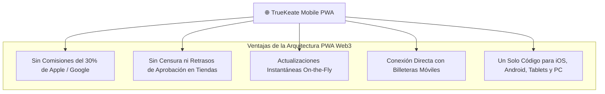
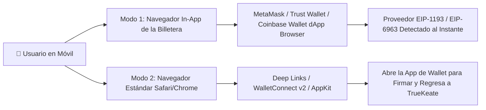

# Propuesta Arquitectónica — Frontend Mobile-First PWA para TrueKeate

> **Documento de Diseño y Arquitectura Frontend**  
> **Plataforma:** TrueKeate Marketplace & Web3 Escrow  
> **Objetivo:** Ejecución nativa fluida en teléfonos y tablets (iOS / Android) como **Progressive Web App (PWA)** sin requerir publicación en tiendas de aplicaciones (App Store / Google Play).

---

## 📱 1. ¿Por qué una PWA Web3 es Superior a una App Nativa?



1. **Cero Comisiones de Tiendas:** Las tiendas de aplicaciones (App Store y Play Store) imponen comisiones del 15% al 30% y restricciones severas sobre transacciones con criptoactivos, RWA y NFTs.
2. **Actualizaciones Instantáneas:** Cada mejora en contratos o frontend se refleja en todos los dispositivos de inmediato, sin esperar revisiones de 48-72 horas.
3. **Instalación en 1 Clic (*Add to Home Screen - A2HS*):** El usuario instala el icono en su pantalla de inicio como una app nativa, funcionando a pantalla completa (sin barra de direcciones del navegador).
4. **Acceso Nativo a Hardware:** La web moderna (HTML5 & Web APIs) permite acceder a la cámara, GPS, vibración háptica, almacenamiento local y notificaciones push.

---

## 📐 2. Estructura de Navegación y Ergonomía Móvil (Thumb Zone)

El 85% de los usuarios de teléfonos operan con una sola mano (el pulgar). La interfaz se organiza respetando la **Zona del Pulgar (*Thumb Zone*)**:

```
+-----------------------------------+  <- Safe Area Top (Notch / Dynamic Island)
| [Logo]        [Red: 31337] [🔔] [👤]|  <- Header Ultra-Compacto (Info esencial)
+-----------------------------------+
|                                   |
|                                   |
|        ÁREA DE CONTENIDO          |  <- Scroll fluido táctil
|      Y TARJETAS DE TRUEKE         |  <- Tarjetas grandes touch-friendly
|   (Bienes RWA, Vouchers, Chat)    |
|                                   |
|                                   |
+-----------------------------------+
|  [🏠]   [🔍]    [➕]   [🔄]   [👤] |  <- Fixed Bottom Bar (Zona del Pulgar)
| Inicio Catálogo Publicar Mis   Mi |
|                  Trueke Truekes Perfil
+-----------------------------------+  <- Safe Area Bottom (Barra de gestos iOS/Android)
```

### 🧭 Componentes Clave de Navegación:

1. **Barra de Navegación Inferior Fija ([`BottomNav.tsx`](file:///c:/Users/lucci/MasterCodeCripto/GitLab/escrow/web/components/BottomNav.tsx)):**
   - 🏠 **Inicio (`/`):** Dashboard rápido, estadísticas comunitarias y avisos.
   - 🔍 **Catálogo (`/items`):** Búsqueda y filtrado de productos físicos y servicios.
   - ➕ **Botón de Acción Flotante (`/items/create`):** Destacado en el centro para publicar un nuevo trueque.
   - 🔄 **Mis Truekes (`/operations`):** Monitoreo en tiempo real de swaps en custodia y despachos `En Tránsito`.
   - 👤 **Centro de Identidad (`/identity` o `/profile`):** Gestión de nivel (1, 2, 3), 2FA y SBTs.

2. **Hojas Deslizables Inferiores (*Bottom Sheets*):**
   - En lugar de modales flotantes centrados (inconvenientes en pantallas verticales), todos los filtros, confirmaciones de intercambio y firmas Web3 se abren como hojas que suben desde el borde inferior de la pantalla.

---

## 👛 3. Integración de Billeteras Web3 en Dispositivos Móviles

En móviles, los usuarios interactúan con la dApp a través de dos modalidades fluidas:



1. **Navegadores dApp de Billeteras:** Al abrir `https://truekeate.com` dentro de MetaMask Mobile, Rabby, Trust Wallet o Phantom, el proveedor inyectado (`window.ethereum`) se detecta automáticamente sin pasos adicionales.
2. **Deep Linking Universal:** Desde Safari o Chrome, al pulsar *"Conectar Billetera"*, un enlace universal (`metamask.app.link/dapp/...` o WalletConnect) abre la app de billetera instalada, solicita la firma y regresa a la aplicación.
3. **Meta-Transacciones EIP-712 (Gasless):** El usuario en móvil solo firma un mensaje tipado claro en su pantalla; el backend relayer paga el gas, eliminando la fricción de requerir tokens nativos para operar.

---

## 📸 4. Acceso a Hardware del Teléfono vía Web APIs

TrueKeate utiliza las capacidades nativas del hardware sin código compilado:

| Función de TrueKeate | Web API Utilizada | Comportamiento Móvil |
| :--- | :--- | :--- |
| **Cámara para Fotos RWA** | HTML5 Media Capture (`capture="environment"`) | Abre directamente la cámara trasera del teléfono para tomar la foto del producto y calcular el hash SHA-256 en el navegador. |
| **Escaneo QR de Encuentros** | Barcode Detection API / WebRTC Camera Stream | Escanea el código QR de la contraparte en el punto de encuentro para el apretón de manos digital sin apps extras. |
| **Geolocalización $\le 10\text{ km}$** | `navigator.geolocation.getCurrentPosition()` | Obtiene la posición GPS con alta precisión para validar que el punto de encuentro esté en el radio seguro. |
| **Feedback Háptico** | `navigator.vibrate([50, 30, 50])` | El teléfono vibra suavemente al confirmar una firma, completar un trueque o recibir una oferta. |
| **Compartir Truekes** | Web Share API (`navigator.share()`) | Despliega el menú nativo de compartir de iOS/Android para enviar el trueque a WhatsApp, Telegram o Twitter. |
| **Notificaciones Push** | Web Push API + Service Worker | Notificaciones push en la pantalla de bloqueo (soportado en Android y en iOS 16.4+ en modo standalone). |

---

## 🎨 5. Configuración de Estilo y Viewport Móvil (CSS / Tailwind)

### 📏 Reglas de Optimización Móvil en `web/app/globals.css`:

```css
/* 1. Soporte de Safe Areas para iPhone con Notch e Islas Dinámicas */
.safe-area-pt {
  padding-top: env(safe-area-inset-top, 0px);
}
.safe-area-pb {
  padding-bottom: env(safe-area-inset-bottom, 16px);
}

/* 2. Prevención de Zoom Molesto en iOS al tocar Inputs */
input, select, textarea {
  font-size: 16px !important; /* iOS no hace zoom automático si es >= 16px */
}

/* 3. Desplazamiento Nativo Elástico */
html, body {
  overscroll-behavior-y: contain;
  -webkit-tap-highlight-color: transparent;
  touch-action: manipulation;
}

/* 4. Tamaño de Toque Mínimo Accesible (Touch Target >= 44x44px) */
button, a {
  min-height: 44px;
  min-width: 44px;
}
```

---

## 📦 6. Manifest PWA y Modo Standalone ([`manifest.ts`](file:///c:/Users/lucci/MasterCodeCripto/GitLab/escrow/web/app/manifest.ts))

Configuración que permite la experiencia a pantalla completa idéntica a una app nativa:

```typescript
export default function manifest(): MetadataRoute.Manifest {
  return {
    name: 'TrueKeate — Mercado Web3 & Trueke RWA',
    short_name: 'TrueKeate',
    description: 'Intercambio seguro de bienes, servicios y tokens en Web3',
    start_url: '/',
    display: 'standalone', // Oculta la barra de direcciones del navegador
    orientation: 'portrait-primary',
    background_color: '#FAF8F5', // Color Alabaster del tema Velvety
    theme_color: '#D4A373',      // Color Camel para la barra de estado
    icons: [
      { src: '/icon-192.png', sizes: '192x192', type: 'image/png', purpose: 'maskable' },
      { src: '/icon-512.png', sizes: '512x512', type: 'image/png', purpose: 'any' },
    ],
  }
}
```

---

## 🚀 7. Resumen de la Experiencia del Usuario

1. El usuario entra en `truekeate.com` desde su teléfono o tablet.
2. El navegador le muestra un banner elegante: *"Instalar TrueKeate en tu pantalla de inicio"*.
3. Al añadirla, se abre como una **app nativa a pantalla completa**.
4. Puede tomar fotos de sus productos con la cámara, verificar su ubicación GPS, firmar con su billetera móvil y recibir alertas en tiempo real.
