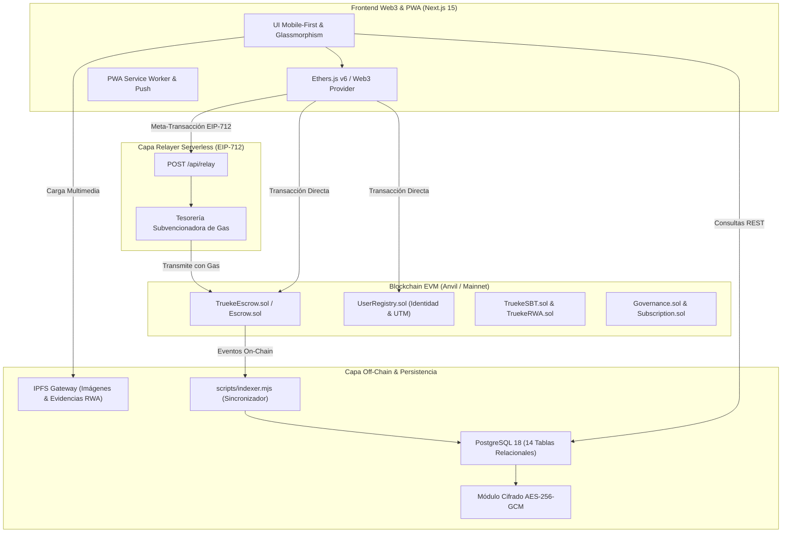
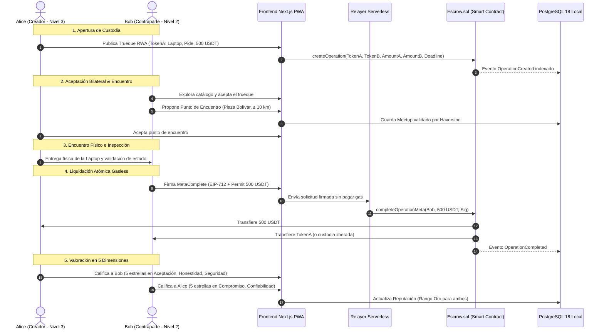

# 📊 Casos de Uso y Diagramas de Secuencia — Protocolo TrueKeat

Este documento describe la interacción funcional, los diagramas de secuencia criptográfica y los casos de uso fundamentales que garantizan un ecosistema de intercambio sin fricción y 100% confiable.

---

## 1. Diagrama de Arquitectura Global

---

## 2. Diagrama de Secuencia: Trueque Bilateral Atómico con Encuentro Presencial

---

## 3. Matriz de Casos de Uso del Sistema

### CU-01: Inscripción de Billetera con Georreferenciación On-Chain
* **Actor Principal**: Usuario Nuevo (Billetera no registrada).
* **Precondición**: Billetera Web3 conectada a la red local/testnet.
* **Flujo Principal**:
  1. El usuario accede a la plataforma y es redirigido a `/register`.
  2. Ingresa su `@username` único, correo electrónico, teléfono y dirección de referencia.
  3. Presiona **Detectar mi GPS** para obtener Latitud/Longitud y generar las coordenadas UTM automáticas.
  4. Acepta los términos comunitarios y firma la transacción `register(...)` en `UserRegistry.sol`.
  5. El indexador detecta el evento y cifra los datos sensibles en PostgreSQL con AES-256-GCM.
* **Resultado**: Usuario obtiene **Nivel 1 (Inscrito)** con cuota de 1 trueque activo.

---

### CU-02: Creación de Intercambio RWA con Evidencias IPFS
* **Actor Principal**: Usuario Nivel 3 (Certificado con SBT).
* **Precondición**: Usuario posee un Soulbound Token Nivel 3.
* **Flujo Principal**:
  1. El usuario accede a `/items/new` y selecciona la categoría **Bien Físico RWA**.
  2. Sube fotografías de alta resolución del bien (frente, reverso, número de serie).
  3. Las imágenes se anclan en IPFS obteniendo un hash CID inmutable.
  4. Define el token de garantía o el bien solicitado a cambio y el plazo límite (*deadline*).
  5. Deposita la custodia en `Escrow.sol`.
* **Resultado**: El activo aparece en el catálogo con insignia dorada `🛡️ Bien RWA` y borde izquierdo `#D4AF37`.

---

### CU-03: Coordinación de Punto de Encuentro Seguro ($\le 10\text{ km}$)
* **Actor Principal**: Creador o Contraparte del trueque.
* **Precondición**: Trueque en estado `Active` aceptado bilateralmente.
* **Flujo Principal**:
  1. El usuario presiona **📍 Proponer Punto de Encuentro**.
  2. El mapa interactivo Leaflet despliega los límites geográficos de la comunidad.
  3. El usuario marca la ubicación y selecciona fecha/hora.
  4. El backend calcula la distancia geodésica con respecto a ambas partes.
  5. Si la distancia es $\le 10.0\text{ km}$, se crea el registro con estado `Programado`.
* **Resultado**: Ambas partes reciben notificación y el tracker de la operación avanza a **Etapa 3: En Tránsito**.

---

### CU-04: Arbitraje Comunitario en Caso de Disputa
* **Actor Principal**: Socio Árbitro designador por la Gobernanza.
* **Precondición**: Operación en estado `Disputed`.
* **Flujo Principal**:
  1. Una de las partes reporta inconformidad con el bien o inasistencia al encuentro y ejecuta `disputeOperation(opId)`.
  2. El Socio Árbitro accede al panel `/governance/socio-voting` y revisa las evidencias IPFS y el log del encuentro.
  3. Si la queja es fundada, el árbitro ejecuta `resolveDispute(opId, favorUser1 = true/false)`.
  4. `Escrow.sol` restituye los fondos inmediatamente a la parte afectada.
* **Resultado**: La operación pasa a `Completed` y se actualiza la métrica de disputas en el perfil del infractor.
