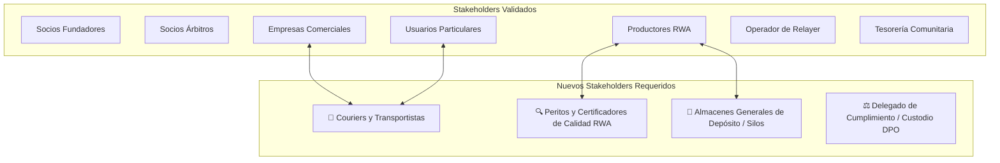
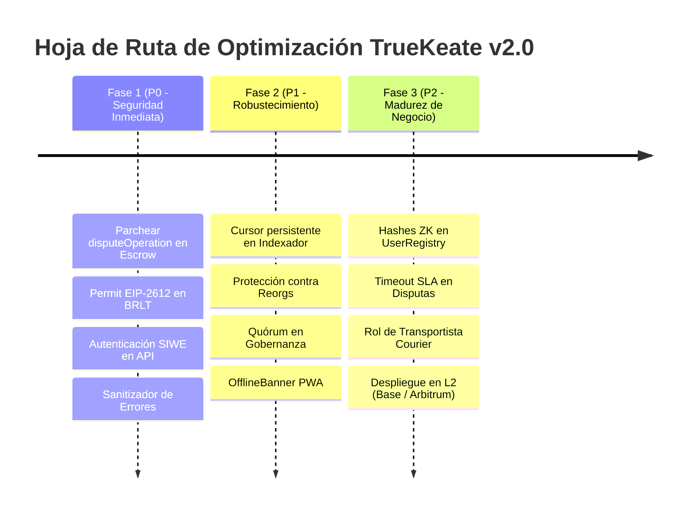

# 📑 Informe Integral de Auditoría Multidisciplinaria y Plan de Optimización — Ecosistema TrueKeat

**Fecha de Emisión:** 28 de Agosto de 2026  
**Versión del Protocolo:** TrueKeate v2.0 Web3  
**Equipo Auditor:** Subagentes Multidisciplinarios Especializados (Smart Contracts, Backend & Criptografía, Requisitos & Stakeholders, Frontend & PWA)

---

## 🎯 Resumen Ejecutivo

Un equipo de 4 agentes especializados realizó una auditoría profunda de 360° sobre todo el ecosistema de TrueKeat: contratos inteligentes (`sc/src/`), capa de datos y backend (`web/server/`, `web/scripts/`), API serverless (`web/app/api/`), interfaz frontend (`web/app/`, `web/components/`) y la base documental (`docs/`, `RepoTecnico/`).

El protocolo demuestra una arquitectura innovadora y sólida que combina custodia atómica bilateral en EVM, meta-transacciones EIP-712 sin gas para particulares, tokenización de activos del mundo real (RWA ERC-721), vouchers de servicios quemables (ERC-1155), reputación en 5 dimensiones y geoseguridad comunitaria ($\le 10\text{ km}$). 

No obstante, se han detectado **hallazgos críticos de seguridad, privacidad y consistencia** que deben subsanarse para garantizar un despliegue seguro y escalable en producción:

```text
+-------------------------------------------------------------------------------------------------------+
|                                    MATRIZ DE HALLAZGOS POR ÁREA                                       |
+------------------------------------+----------------+-------------------------------------------------+
| Área Auditada                      | Nivel Crítico  | Hallazgo Principal                              |
+------------------------------------+----------------+-------------------------------------------------+
| 1. Smart Contracts & Tokenomics    | 🔴 CRÍTICO     | Secuestro en `disputeOperation`, falta de       |
|                                    |                | `ERC20Permit` en BRLT y SafeERC20.             |
| 2. Backend, DB & Criptografía      | 🔴 CRÍTICO     | Fuga de PII en `/api/identity` y riesgo de      |
|                                    |                | drenaje de gas en relayer EIP-712.              |
| 3. Requisitos & Stakeholders       | 🟠 ALTO        | PII en claro en `UserRegistry.sol` (GDPR),      |
|                                    |                | falta de transportistas y timeout en disputas.  |
| 4. Frontend, PWA & UX/UI           | 🟡 MEDIO       | Colores legacy en PWA manifest, contraste de    |
|                                    |                | oro sobre blanco y sanitización de errores Web3.|
+------------------------------------+----------------+-------------------------------------------------+
```

---

## 1. Auditoría de Smart Contracts y Tokenomics (`sc/src/`)

### 🔴 Hallazgos Críticos:
1. **Secuestro de Garantías en Disputas (`Escrow.sol` L406-448):**
   * *Problema:* La función `disputeOperation(id)` permite que cualquier tercero no participante llame a la función y se convierta en `user2`. Si el árbitro falla contra `user1`, el atacante recibe el 100% de `TokenA` sin haber depositado nada.
   * *Solución:* Restringir `disputeOperation` exclusivamente a `msg.sender == user1 || msg.sender == user2`.
2. **Incompatibilidad de Meta-Transacciones con BRLT (`BRLT.sol`):**
   * *Problema:* `Escrow.sol` exige `IERC20Permit.permit(...)` en meta-transacciones sin gas, pero `BRLT.sol` solo hereda `ERC20` estándar.
   * *Solución:* Hacer que `BRLT.sol` herede `ERC20Permit("BorloTokens")`.
3. **Falta de `SafeERC20` y Patrón CEI (Checks-Effects-Interactions):**
   * *Problema:* Se usan transferencias crudas antes de actualizar el estado del contrato (`status = Cancelled`), exponiendo a reentrancy en tokens con hooks.
   * *Solución:* Implementar `using SafeERC20 for IERC20` y actualizar siempre el estado antes de transferir.
4. **Admisión de Socios sin Quórum en Gobernanza (`Governance.sol`):**
   * *Problema:* `resolveSocioApplication` no valida `minQuorum` y acepta cualquier token de depósito no verificado.
   * *Solución:* Exigir lista blanca de tokens de depósito (`allowedDepositTokens`) y quórum mínimo obligatorio.

---

## 2. Auditoría de Backend, Base de Datos y Criptografía

### 🔴 Hallazgos Críticos:
1. **Fuga de Datos Sensibles en `/api/identity/[address]`:**
   * *Problema:* El parámetro `requester` se pasa como query param sin firma criptográfica ni sesión, permitiendo que cualquiera consulte emails, teléfonos y secretos 2FA descifrados de cualquier cuenta.
   * *Solución:* Implementar **Sign-In with Ethereum (SIWE)** y validar la firma ECDSA del llamador antes de entregar PII.
2. **Vulnerabilidad de Drenaje de Gas en Relayer (`/api/relay`):**
   * *Problema:* El relayer no simula previamente la transacción con `staticCall`, permitiendo a atacantes forzar transacciones fallidas que consumen el saldo de gas de la tesorería.
   * *Solución:* Pre-ejecutar `staticCall`, aplicar rate limiting por IP/Wallet y alertar si el saldo del relayer baja de 0.05 ETH.
3. **Idempotencia y Resiliencia del Indexador (`indexer.mjs`):**
   * *Problema:* El indexador no almacena el bloque de sincronización persistente (`last_synced_block`) y re-escanea desde el bloque 0 en cada reinicio, duplicando notificaciones históricas.
   * *Solución:* Crear tabla `indexer_state` y calcular IDs deterministas para notificaciones `sha256(txHash + logIndex)`.
4. **Validación TOTP 2FA Real (`lib.js`):**
   * *Problema:* La función `confirm2FA` solo validaba que el código fuera de 6 dígitos numéricos sin cotejar el algoritmo TOTP (RFC 6238).
   * *Solución:* Integrar `otplib` para validación temporal con clave Base32.

---

## 3. Auditoría de Requisitos, Stakeholders y Negocio



### 🟠 Requisitos No Funcionales (RNF) y Privacidad:
1. **Conflicto de Privacidad On-Chain (RGPD / Habeas Data):**
   * *Problema:* `UserRegistry.sol` guarda emails, teléfonos y direcciones físicas en claro en la blockchain pública.
   * *Solución:* Almacenar únicamente hashes criptográficos `bytes32` on-chain y mantener los datos reales cifrados con AES-256-GCM en PostgreSQL.
2. **SLA y Timeout en Disputas Arbitrales:**
   * *Problema:* Una operación en disputa queda congelada indefinidamente si el árbitro no actúa.
   * *Solución:* Incorporar un timeout de 14 días (`DISPUTE_RESOLUTION_WINDOW`) tras el cual el creador puede solicitar el reembolso automático.
3. **Estandarización de Marca y Nomenclatura:**
   * Unificar el nombre comercial en **TrueKeate** (con subtítulo de protocolo *TrueKeat*), y el token comunitario como **BarloTokens (BRLT)**.

---

## 4. Auditoría de Frontend, Ergonomía Móvil y PWA

### 🟡 Mejoras UI/UX y Accesibilidad:
1. **Unificación de la Landing Page:**
   * Conectar directamente `LandingPage.tsx` con el Sistema de Diseño 2.0 (Deep Navy `#1A2B4C`, Teal `#2A9D8F`, Gold `#D4AF37`) en la ruta raíz `/`.
2. **PWA Manifest y Colores de Tema:**
   * Actualizar `manifest.ts` de los colores tierra legacy (`#2D2A26`) a la paleta oficial (`theme_color: '#1A2B4C'`, `background_color: '#F8F9FA'`).
3. **Banner de Estado Offline PWA:**
   * Implementar `OfflineBanner.tsx` con detección en tiempo real para alertar al usuario en zonas con intermitencia de red.
4. **Sanitización de Errores Web3 (`getFriendlyError`):**
   * Interceptar rechazos de firma de MetaMask (código `4001` / `ACTION_REJECTED`) para mostrar mensajes claros en español en lugar de trazas crudas.
5. **Cumplimiento WCAG 2.1 AA:**
   * Ajustar contraste del color oro sobre fondos claros y añadir atributos `aria-modal`, `role="dialog"` y soporte para cierre con tecla `Escape` en modales.

---

## 5. Plan de Acción y Hoja de Ruta Priorizada



---

## 6. Conclusión

El ecosistema **TrueKeat / TrueKeate** posee un diseño conceptual y técnico de vanguardia. La ejecución del presente plan de optimización garantizará un estándar bancario de seguridad, pleno cumplimiento de privacidad de datos y una experiencia de usuario fluida y confiable en dispositivos móviles y de escritorio.
