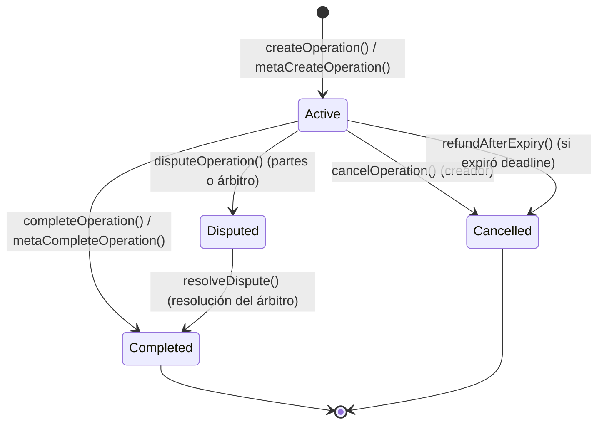

# Manual Técnico: Plataforma Escrow & TrueKeate DApp

---

## 1. Visión General del Sistema

La plataforma **Escrow DApp / TrueKeate** es un ecosistema descentralizado desarrollado para facilitar intercambios bilaterales y seguros de tokens ERC20, así como trueques P2P de bienes y servicios con respaldo en la blockchain.

El sistema combina:
1. **Contratos Inteligentes en Solidity**: Custodia atómica (escrow), gobernanza comunitaria, registro on-chain de identidades y suscripciones para empresas.
2. **Meta-Transacciones EIP-712 / EIP-2612**: Permite transacciones sin gas (gasless) para usuarios finales mediante un Relayer.
3. **Frontend React / Next.js 16 (App Router)**: Interfaz responsiva con Tailwind CSS v4 y conexión directa a Web3 mediante Ethers.js v6.
4. **Backend Off-Chain y Base de Datos Local**: API routes serverless y SQLite (`db.js`) para elementos sociales y logísticos (items, citas físicas/meetups, valoraciones, avales).

### 1.1 Diagrama de Arquitectura del Sistema

```text
+-----------------------------------------------------------------------------------+
|                                 CAPA DE CLIENTE                                   |
|  - Next.js 16 (App Router) + React 19 + TypeScript + Tailwind CSS v4             |
|  - Ethers.js v6 (Conexión RPC y Gestión de Wallet Injected / MetaMask)            |
|  - Componentes: AccessGate, OperationCard, CreateOperationModal, MeetupModal, etc|
+------------------------------------------+----------------------------------------+
                                           |
                    +----------------------+----------------------+
                    | (Llamadas Web3 / RPC)                       | (HTTP / REST API)
                    v                                             v
+------------------------------------------+  +-------------------------------------+
|         CAPA BLOCKCHAIN (Solidity)       |  |      BACKEND OFF-CHAIN & API        |
|  - Escrow.sol (Custodia Atómica y Swaps) |  |  - Endpoints Serverless (/api/*)    |
|  - UserRegistry.sol (Perfiles On-Chain)  |  |  - Relayer EIP-712 (/api/relay)     |
|  - Governance.sol (Socios y Sanciones)   |  |  - SQLite / db.js (Items, Meetups,  |
|  - Subscription.sol (Membresías BRLT)    |  |    Ratings, Vouches, Campañas)      |
|  - Tokens ERC20 (MockERC20, BRLT)        |  |  - PWA Support y Notificaciones     |
+------------------------------------------+  +-------------------------------------+
```

---

## 2. Capa de Smart Contracts (Solidity)

Los contratos están ubicados en `sc/src/` y desarrollados bajo el framework **Foundry** con **Solidity ^0.8.13**.

### 2.1 Contrato de Custodia e Intercambio: `Escrow.sol`
*Ruta:* `sc/src/Escrow.sol`

Garantiza que ninguna parte entregue sus tokens sin recibir la contraprestación pactada (intercambio atómico) y previene bloqueos indefinidos de capital mediante cancelación voluntaria, expiración y resolución de disputas por arbitraje.

#### Máquina de Estados de una Operación



#### Estructura de Datos de una Operación
```solidity
enum Status {
    Active,
    Completed,
    Cancelled,
    Disputed
}

struct Operation {
    uint256 id;           // Identificador numérico único incremental
    address user1;        // Creador de la oferta de intercambio
    address tokenA;       // Dirección del token depositado por user1
    address tokenB;       // Dirección del token solicitado a user2
    uint256 amountA;      // Cantidad de tokenA en custodia
    uint256 amountB;      // Cantidad de tokenB requerida a user2
    Status status;        // Estado actual de la operación
    uint256 createdAt;    // Marca de tiempo UNIX de creación
    uint256 deadline;     // Marca de tiempo UNIX de vencimiento (0 = sin límite)
    uint256 closedAt;     // Marca de tiempo UNIX de cierre
}
```

#### Resumen de Funciones Principales

| Función | Modificadores | Descripción |
| :--- | :--- | :--- |
| `createOperation(tokenA, tokenB, amountA, amountB, deadline)` | `onlyAllowedToken`, `nonReentrant` | Bloquea `amountA` en el contrato y crea la operación con estado `Active`. |
| `completeOperation(operationId)` | `nonReentrant` | `user2` transfiere `amountB` a `user1` y recibe `amountA` de la custodia en una misma transacción atómica. |
| `cancelOperation(operationId)` | `nonReentrant` | Permite a `user1` recuperar `amountA` y cerrar la operación en `Cancelled`. |
| `refundAfterExpiry(operationId)` | `nonReentrant` | Permite a `user1` recuperar sus fondos una vez transcurrido el `deadline`. |
| `disputeOperation(operationId)` | Ninguno | Abre una disputa sobre una operación activa si existe un árbitro configurado. |
| `resolveDispute(operationId, favorUser1, recipient)` | `onlyArbiter`, `nonReentrant` | Resuelve el conflicto: devuelve fondos a `user1` o los transfiere a `recipient`. |
| `addToken(token)` | `onlyOwner` | Habilita un token ERC20 verificando código on-chain (`extcodesize > 0`) y soporte de `symbol()`. |
| `setArbiter(_arbiter)` | `onlyOwner` | Designa la cuenta con rol de árbitro para resolución de disputas. |
| `getOperations(offset, limit)` | `view` | Retorna un arreglo de operaciones para paginación on-chain eficiente. |

#### Meta-Transacciones (Gasless EIP-712 + Permit EIP-2612)
* `metaCreateOperation`: El usuario firma el permiso EIP-2612 para autorizar `tokenA` y la intención EIP-712. El Relayer paga el gas de la transacción en la red.
* `metaCompleteOperation`: El usuario contraparte firma el permiso para `tokenB` y la intención EIP-712; el Relayer procesa el swap.
* Cuenta con un mapping `metaNonces[address]` para protección contra ataques de repetición.

---

### 2.2 Registro On-Chain de Usuarios: `UserRegistry.sol`
*Ruta:* `sc/src/UserRegistry.sol`

* Administra la identidad descentralizada de los usuarios mediante un `username` único (entre 3 y 20 caracteres).
* Es utilizado por el frontend (`AccessGate.tsx`) para permitir o denegar el acceso a las funciones operativas de la plataforma.
* Métodos: `register(username)`, `updateUsername(newUsername)`, `isRegistered(wallet)`, `getUserProfile(wallet)`, `getRegisteredWalletsPaged(offset, limit)`.

---

### 2.3 Gobernanza de Socios: `Governance.sol`
*Ruta:* `sc/src/Governance.sol`

* Modela el nivel de **Socios** (supervisores y mediadores comunitarios).
* Permite crear propuestas de sanción para usuarios infractores (`proposeSanction`).
* Votación binaria (Sí / No) dentro de una ventana de 3 días (`VOTING_WINDOW`).
* Ejecución automática de sanciones alcanzando quórum mínimo (`minQuorum`).

---

### 2.4 Membresías y Suscripciones: `Subscription.sol`
*Ruta:* `sc/src/Subscription.sol`

* Modelo de suscripción en token `BRLT` para empresas (Nivel Frecuente).
* Períodos de 30 días acumulables (`subscribe(uint256 months)`).
* Verificación de vigencia mediante `isActive(address company)`.
* Fondo común administrable por el owner/gobernanza.

---

## 3. Capa Frontend y Arquitectura Web

Ubicación: `web/`

### 3.1 Estructura de Directorios

```text
web/
├── app/
│   ├── layout.tsx                  # Proveedor global de Web3 y estilos
│   ├── page.tsx                    # Landing page pública y métricas
│   ├── (platform)/                 # Rutas protegidas por AccessGate
│   │   ├── operations/page.tsx     # Explorador interactivo de Escrows y filtros
│   │   ├── items/page.tsx          # Marketplace de productos y servicios
│   │   ├── balances/page.tsx       # Consulta de saldos y minteo de tokens de prueba
│   │   ├── campaigns/page.tsx      # Promociones y campañas activas
│   │   ├── profile/page.tsx        # Perfil del usuario, reputación y avales
│   │   └── add-token/page.tsx      # Panel de administración de tokens
│   └── api/                        # Rutas de API Serverless
│       ├── relay/route.ts          # Relayer para ejecución de meta-transacciones
│       ├── items/route.ts          # Publicación y consulta de items
│       ├── meetups/route.ts        # Coordinación de citas físicas seguras
│       ├── ratings/route.ts        # Calificaciones por estrellas y feedback
│       └── vouches/route.ts        # Avales de confianza entre usuarios
├── components/                     # Componentes React modulares
│   ├── AccessGate.tsx              # Control de acceso según wallet e inscripción
│   ├── OperationCard.tsx           # Tarjeta interactiva de operación de escrow
│   ├── CreateOperationModal.tsx    # Modal de creación (aprobación + depósito en 1 flujo)
│   ├── MeetupModal.tsx             # Programación de encuentros físicos
│   └── RateOperationModal.tsx      # Calificación de la contraparte
├── lib/
│   ├── contracts.ts                # ABIs, direcciones y tipados TypeScript
│   ├── hooks.ts                    # Custom Hooks (useEscrow, useRegistration, etc.)
│   ├── ethereum.tsx                # Contexto y proveedor Web3
│   └── relay.ts                    # Construcción y firma de mensajes EIP-712
└── server/
    ├── db.js                       # Base de datos SQLite y esquemas de tablas
    └── lib.js                      # Helpers y lógica de datos del servidor
```

### 3.2 Flujo de Autenticación (`AccessGate`)
1. **Wallet Desconectada**: Muestra pantalla solicitando conectar billetera compatible (MetaMask / Injected).
2. **Wallet Conectada pero No Registrada**: Consulta `UserRegistry.isRegistered(wallet)`. Si devuelve `false`, bloquea la vista y abre el modal de registro.
3. **Wallet Registrada**: Da acceso completo a todas las secciones de la plataforma.

---

## 4. Entorno de Desarrollo, Pruebas y Despliegue

### 4.1 Requisitos del Sistema
* Node.js v18.0.0 o superior.
* Foundry (`forge`, `anvil`, `cast`).
* Git.

### 4.2 Scripts de Control del Entorno (Raíz)

| Script | Descripción |
| :--- | :--- |
| `./start.sh` | Orquesta todo el entorno local: inicia Anvil, compila y despliega contratos, mintea tokens de prueba, genera `.env.local` y levanta el frontend Next.js en el puerto 3000. |
| `./setup.sh` | Realiza la compilación, despliegue y minteo sin iniciar el servidor web. |
| `./stop.sh` | Detiene limpiamente los procesos de Anvil y Next.js. |
| `./verify-setup.sh` | Diagnóstico de salud del nodo RPC, contratos y dependencias. |
| `./accounts.sh` | Muestra la lista de cuentas y claves privadas de prueba precargadas en Anvil. |

### 4.3 Variables de Entorno (`web/.env.local`)

```env
NEXT_PUBLIC_ESCROW_ADDRESS=0x5FbDB2315678afecb367f032d93F642f64180aa3
NEXT_PUBLIC_USER_REGISTRY_ADDRESS=0xe7f1725E7734CE288F8367e1Bb143E90bb3F0512
NEXT_PUBLIC_TOKEN_A_ADDRESS=0x9fE46736679d2D9a65F0992F2272dE9f3c7fa6e0
NEXT_PUBLIC_TOKEN_B_ADDRESS=0xCf7Ed3AccA5a467e9e704C703E8D87F634fB0Fc9
NEXT_PUBLIC_BRLT_ADDRESS=0xDc64a140Aa3E981100a9becA4E685f962f0cF6C9
NEXT_PUBLIC_RPC_URL=http://127.0.0.1:8545
NEXT_PUBLIC_CHAIN_ID=31337
RELAYER_PRIVATE_KEY=0xac0974bec39a17e36ba4a6b4d238ff944bacb478cbed5efcae784d7bf4f2ff80
```

### 4.4 Pruebas Automatizadas

```bash
# Pruebas de Smart Contracts con Foundry
cd sc
forge test -vvv

# Pruebas específicas de Escrow y Meta-transacciones
forge test --match-contract EscrowTest -vvv
forge test --match-contract EscrowMetaTest -vvv

# Pruebas del Frontend con Vitest
cd ../web
npm test
```
