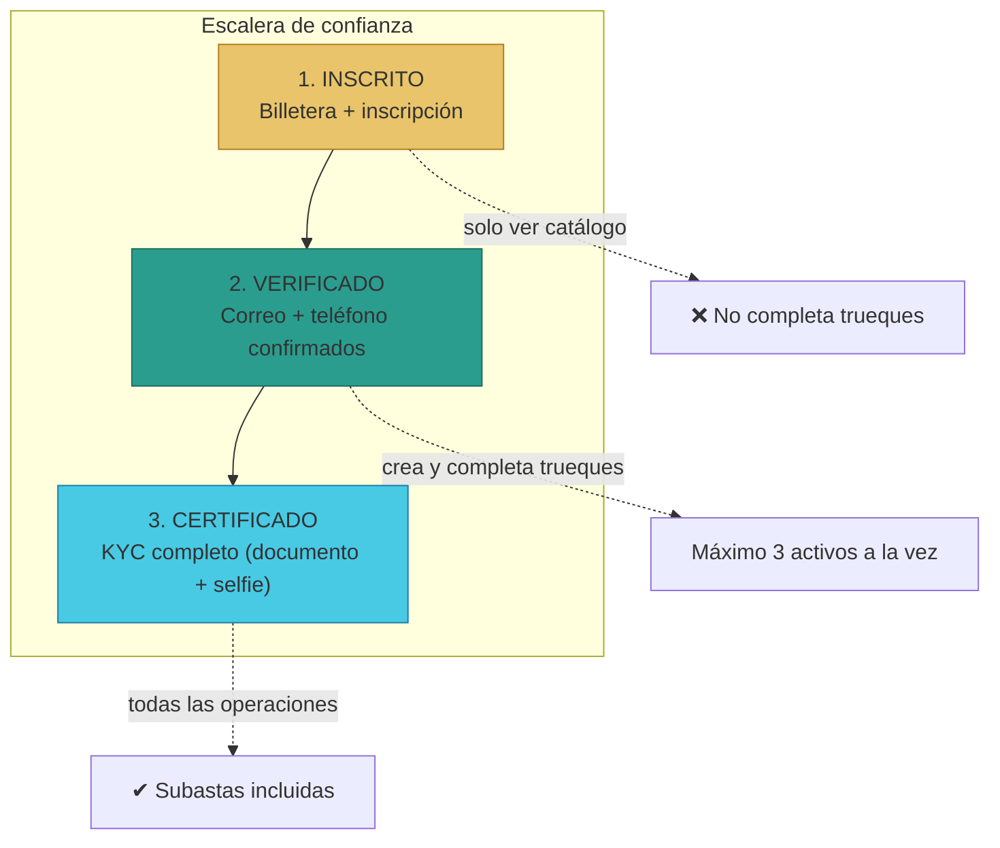
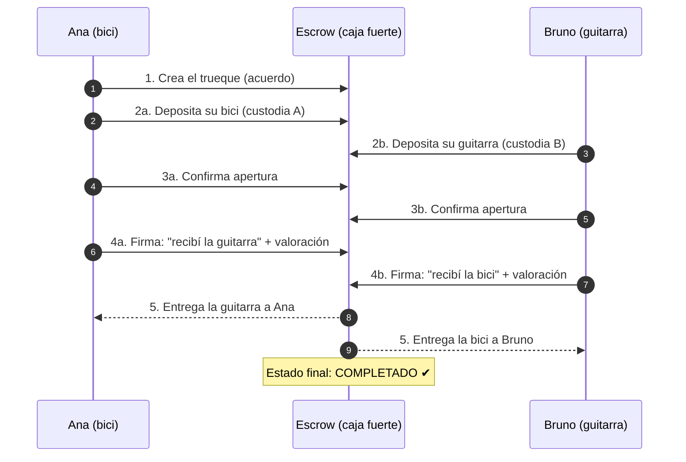
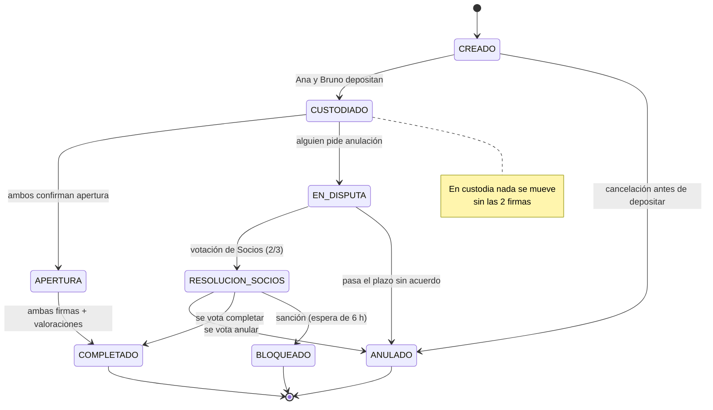

# Manual · TrueKeate para todos

> Versión en lenguaje sencillo del manual técnico de plataforma.
> Si quieres ver cómo funciona un trueque con escrow paso a paso, lee este documento.

---

## 1. Empezar en 5 minutos

TrueKeate es una plataforma para **intercambiar cosas directamente entre personas**:
sin dinero de por medio, o mezclando objetos, servicios y criptos.

Un ejemplo muy simple:

1. Ana tiene una bicicleta y quiere una guitarra.
2. Bruno tiene una guitarra y quiere una bicicleta.
3. Ambos se ponen de acuerdo en la plataforma.
4. Ninguno entrega su objeto "a ciegas": los dos lo depositan en una **caja fuerte digital** (el escrow).
5. Cuando Ana recibe la guitarra y Bruno recibe la bici, **los dos firman** que todo llegó bien.
6. Solo entonces la caja fuerte se abre y cada uno se queda con lo suyo.

La caja fuerte es un **contrato inteligente** (un programa que nadie puede engañar).
Se llama **escrow**.

> ¿Qué más necesitas saber en 5 minutos?
> - Para participar necesitas una **billetera digital** (como MetaMask).
> - Hay tres niveles de usuarios: **Inscrito**, **Verificado** y **Certificado** (ver sección 4).
> - Los trueques se guardan en la **blockchain** (un registro público que no se puede borrar).
> - Las personas particulares **no pagan comisiones de gas** por operar; las empresas sí (ver sección 6).

---

## 2. ¿Qué es TrueKeate?

### 2.1 La idea en una frase

TrueKeate es una **DApp Web3 de trueques**: una aplicación descentralizada donde
personas y empresas intercambian bienes, productos, servicios y criptos/NFTs
de forma **segura y confiable**.

En español llano: es un "mercadillo digital" donde **no hace falta dinero**
para conseguir lo que quieres: se intercambia.

### 2.2 ¿Qué se puede intercambiar?

| Tipo | Ejemplo real |
|---|---|
| Bienes | Una bici por una guitarra |
| Productos | Ropa, libros, tecnología |
| Servicios | Clases de inglés por arreglo de una bici |
| Criptos y NFTs | Un "token" digital por un objeto físico |

La plataforma representa los objetos como **NFTs** (certificados digitales de
propiedad) o **criptomonedas** (como BRLT, la moneda propia de TrueKeate).

### 2.3 ¿Qué NO es TrueKeate?

- No es una tienda: no compras, intercambias.
- No es una red social: su propósito es el trueque seguro, no publicar contenido.
- La plataforma **no guarda tu dinero**: los activos se custodian en el escrow
  solo durante el trueque.

---

## 3. ¿Quiénes participan?

| Participante | ¿Quién es? | Ejemplo |
|---|---|---|
| **Particular** | Una persona con billetera digital | Ana, que cambia su bici |
| **Empresa** | Negocio certificado con nivel "Oro" | Una tienda que cambia stock |
| **Socio** | Miembro de la comunidad que vota | Ayuda a resolver disputas |
| **Owner** | El administrador de la plataforma | Mantiene el sistema y revisa casos delicados |

### Cómo entra cada uno

1. **Particular**: conecta su billetera y se inscribe con correo, teléfono y dirección.
2. **Empresa**: pasa una certificación y paga una suscripción.
3. **Socio**: pide entrar formalmente y los demás Socios votan si lo aceptan.
4. **Owner**: es la cuenta que crea (despliega) la plataforma. Guarda las llaves
   secretas del sistema en un lugar especial llamado Secret Manager.

> Nota de verificación: los tipos de usuario están escritos en la base de datos
> (`backend/db/schema.sql:14`): `PARTICULAR`, `EMPRESA` y `SOCIO`.

---

## 4. La escalera de verificación

Para que el trueque sea seguro, TrueKeate usa una **escalera de confianza**.
Cada peldaño da más permisos:

| Peldaño | ¿Cómo se sube? | ¿Qué puedes hacer? |
|---|---|---|
| **1. INSCRITO** | Conectar billetera + inscribirte | Ver ofertas y catálogo. **No** puedes completar trueques. |
| **2. VERIFICADO** | Confirmar un código en tu correo y otro en tu teléfono | Crear y completar trueques. Máximo **3 activos** a la vez. |
| **3. CERTIFICADO** | Verificación de identidad completa (documento + selfie) | Todo lo anterior + subastas. |

Ejemplo real: Ana se inscribe hoy → solo mira ofertas.
Mañana confirma su correo y teléfono → ya puede crear su primer trueque de la bici.
Si luego completa el KYC (documento + selfie) → podrá participar en subastas.

**Dato curioso**: tu identidad se guarda "encriptada". La plataforma demuestra
que estás verificado **sin revelar quién eres** (usa una prueba matemática
llamada *merkle root*). Ver manual de tecnología web3.

<!-- GENERAR_IMAGEN: escalera-verificacion.svg -->

---

## 5. Cómo funciona un trueque con escrow

### 5.1 El problema que resuelve

En un trueque normal por internet, alguien tiene que entregar primero.
Y eso da miedo: "¿y si el otro no cumple?".

TrueKeate lo resuelve con **custodia atómica**:
nada se entrega de verdad hasta que **ambas partes** confirman que recibieron bien.

### 5.2 Los pasos de un trueque (con ejemplo)

Ana (bici) y Bruno (guitarra) hacen su trueque:

1. **Crear el trueque**: Ana ofrece su bici NFT y acepta la guitarra de Bruno.
   Se registra el acuerdo. *(Estado: CREADO)*
2. **Depositar (custodiar)**: Ana mete su bici en el escrow. Luego Bruno mete
   su guitarra. *(Estado: CUSTODIADO)*
3. **Abrir el trueque**: ambos confirman que quieren seguir. Hay una ventana de
   tiempo para hacerlo (unos minutos de margen). *(Estado: APERTURA)*
4. **Recibir y firmar**: cuando cada uno recibe lo suyo, **firma** la recepción.
   Además, cada uno valora la experiencia del 1 al 5.
5. **Cierre**: con las dos firmas y las dos valoraciones, el escrow libera los
   activos **en cruz**: la bici va a Bruno y la guitarra a Ana. *(Estado: COMPLETADO)*

> Regla de oro: **nadie puede liberar un activo solo**. Hacen falta las dos
> firmas (o una votación de Socios en caso de conflicto).

<!-- GENERAR_IMAGEN: flujo-truque.svg -->

### 5.3 ¿Qué pasa si algo sale mal?

| Situación | Qué hace TrueKeate |
|---|---|
| El acuerdo aún no tiene objetos depositados | Cualquiera de los dos puede **cancelar** sin problemas. |
| Uno no aparece / no quiere seguir | Se abre una **disputa** dentro de un plazo (máximo 5 días). |
| La disputa no se resuelve entre ellos | **Los Socios votan** (se necesita 2 de cada 3 votos a favor). |
| Alguien rompe las reglas | La plataforma puede **bloquear** el trueque y congelar los activos. |

Los estados por los que pasa un trueque son 9:

<!-- GENERAR_IMAGEN: estados-escrow.svg -->

> Verificación: los 9 estados existen de verdad en el contrato Escrow
> (`sc/src/Escrow.sol:39-49`) y en la base de datos (`backend/db/schema.sql:31-35`).
> El estado "ACTIVO" aparece en el código como sinónimo de "CREADO".

---

## 6. ¿Quién paga los gastos? El "fondo de valor"

### 6.1 Gas: el combustible de la blockchain

Cada operación en la blockchain cuesta un pequeño "peaje" llamado **gas**.
TrueKeate quiere que sea fácil para las personas:

- **Particulares: no pagan gas.** La plataforma firma y paga por ellos
  (son las llamadas *meta-transacciones*).
- **Empresas: sí pagan su propio gas.** Son operaciones grandes y la plataforma
  no las subvenciona.

### 6.2 El fondo de valor

Para pagar esos gastos (servidores, gas, red), TrueKeate recoge un pequeño
porcentaje en un **fondo común** administrado por el Owner:

| Fuente | Porcentaje | Ejemplo |
|---|---|---|
| Trueque completado | **1 %** del valor | Un trueque de 100 € aporta 1 € |
| Suscripción de empresa | **10 %** | Una empresa paga suscripción; el 10 % va al fondo |
| Emisión de BRLT (moneda propia) | **5 %** | Al crear BRLT nuevo, el 5 % va al fondo |

El Owner puede cambiar esos porcentajes desde su panel. Si el fondo se queda
sin dinero, la plataforma **avisa al Owner** para que lo reponga.

> ⚠️ Pendiente de confirmar: en el código actual se ve la aportación del 10 %
> (suscripciones) y del 5 % (emisión de BRLT). La aportación del 1 % por trueque
> completado está declarada en el diseño pero **no se ha observado** su llamada
> dentro del contrato Escrow. No afirmamos que funcione hasta verificarlo.

---

## 7. Dónde vive cada dato (en una frase)

TrueKeate tiene tres capas:

1. **Blockchain (on-chain)**: guarda los estados del escrow. Es la **única fuente
   de verdad**: lo que dice la cadena es lo que vale.
2. **Base de datos (off-chain)**: guarda el "volumen": publicaciones, chat,
   datos de verificación cifrados, ubicación, estadísticas. Sirve para mostrar
   información rápido.
3. **Servidores (orquestación)**: conectan la app con la blockchain y la base
   de datos (el *backend*). Se explican en el manual 03-stack-backend.

Regla importante: **la base de datos nunca puede cambiar el estado de un
trueque por su cuenta**. Solo la blockchain decide.

---

## 8. Estado actual y qué falta confirmar

### 8.1 Lo que está verificado

- Los contratos inteligentes existen y funcionan en pruebas (ver manual 02-stack-web3).
- El backend (vigilantes de eventos + servidor API) existe y pasa sus pruebas.
- La página web existe (ver manual 04-stack-frontend).

### 8.2 Pendiente de confirmar

Marcamos con honestidad lo que **aún no podemos afirmar**:

1. El README del proyecto dice que el desarrollo está "pendiente", pero ya hay
   mucho código escrito. La coherencia de esa información **pendiente de confirmar**.
2. La aportación del 1 % al fondo por trueque completado **pendiente de confirmar** (ver 6.2).
3. Un sistema de "certificado de imagen" (para demostrar que una foto no fue
   retocada) está en diseño, pero no se ha decidido dónde se ancla en la cadena.
4. El estado real del entorno en la nube (GCP) **pendiente de confirmar** (ver manual 04-Despliegue).

---

## 9. Glosario mínimo de este manual

| Palabra | Significado simple |
|---|---|
| **DApp** | Aplicación que funciona sobre blockchain |
| **Web3** | Internet con blockchain y billeteras digitales |
| **Escrow** | Caja fuerte digital que custodia los objetos durante el trueque |
| **NFT** | Certificado digital de propiedad de un objeto único |
| **Wallet / billetera** | Programa que guarda tus claves y firma por ti |
| **Gas** | Peaje que se paga por usar la blockchain |
| **KYC** | Verificación de identidad (documento + selfie) |
| **On-chain / off-chain** | Dentro de la blockchain / fuera de ella (base de datos) |

¿Quieres profundizar? Continúa con los manuales:
- 02-stack-web3: la tecnología blockchain en palabras simples.
- 03-stack-backend: los servidores que vigilan los trueques.
- 04-stack-frontend: la app web y móvil.
