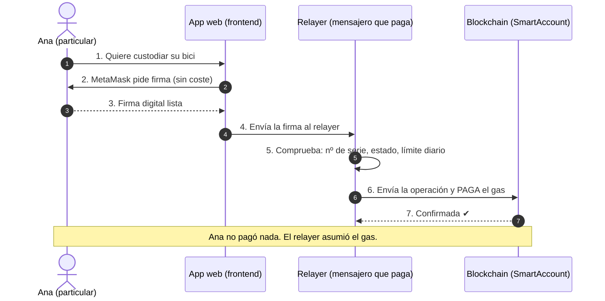
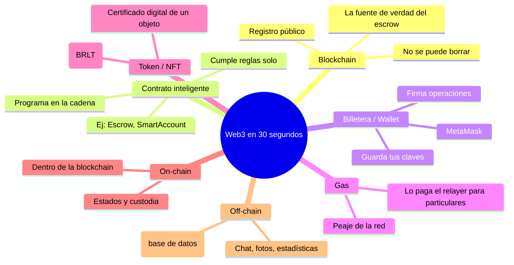

# Manual · La tecnología blockchain en palabras simples

> Versión en lenguaje sencillo del manual técnico del stack Web3.
> Aquí explicamos los "contratos inteligentes" de TrueKeate sin tecnicismos.

---

## 1. Empezar en 5 minutos

Cuando haces un trueque en TrueKeate, detrás hay **programas que viven dentro
de la blockchain**. Se llaman **contratos inteligentes**. Son como empleados
digitales que cumplen las reglas al pie de la letra y no pueden mentir.

Las 4 ideas clave:

1. **Blockchain**: un registro público y compartido. Todos ven lo mismo y nadie
   puede borrar lo escrito.
2. **Contrato inteligente**: un programa que vive en ese registro y ejecuta las
   reglas de forma automática.
3. **Billetera (wallet)**: un llavero digital. Guardas tus claves y con ellas
   firmas tus operaciones. TrueKeate usa billeteras como **MetaMask**.
4. **Gas**: el pequeño "peaje" de la red por cada operación. Los particulares
   no lo pagan en TrueKeate: la plataforma paga por ellos.

> Los contratos de TrueKeate están probados con herramientas profesionales
> (Foundry) y librerías reconocidas mundialmente (OpenZeppelin). Eso no
> garantiza que sean perfectos, pero sí que siguen buenas prácticas.

---

## 2. ¿Qué hay "debajo del capó"? (sin asustarse)

TrueKeate construye su parte blockchain con estas piezas:

| Pieza | Qué es en simple | Marca/versión |
|---|---|---|
| **Solidity** | El idioma en que se escriben los contratos | versión 0.8.24 |
| **Foundry** | El "taller" donde se crean y prueban | forge, anvil, cast |
| **OpenZeppelin** | Librería de piezas ya hechas y muy usadas | versión 5.0.2 |
| **anvil** | Una blockchain de pruebas que corre en tu ordenador | red 31337 |

Piensa en Foundry como el taller, Solidity como el idioma, y OpenZeppelin como
una caja de piezas estándar (candados, cerraduras) que ya están bien probadas.

---

## 3. Los contratos de TrueKeate y para qué sirven

TrueKeate tiene 6 contratos principales (más 2 de prueba):

| Contrato | Trabajo que hace | Analogía |
|---|---|---|
| **Escrow** | Custodia los trueques y controla sus estados | La caja fuerte del trueque |
| **SmartAccount** | Tu "cuenta personal" que firma por ti | Tu carnet de identidad digital |
| **SmartAccountFactory** | Crea las cuentas personales | La oficina que expide carnets |
| **BRLT** | La moneda propia de TrueKeate | El "vale" interno de la plataforma |
| **FondoDeValor** | Recoge los porcentajes para gastos | La hucha común (ver manual de plataforma) |
| **SociosRegistry** | Lleva el padrón de Socios y sus votos | El censo electoral |
| **SuscripcionEmpresa** | Gestiona las suscripciones de empresas | El abono de las empresas |

> Nota de verificación: estos contratos existen de verdad en la carpeta
> `sc/src/` del proyecto y cada uno cita qué requisito cumple.

---

## 4. Tu cuenta personal: la SmartAccount

### 4.1 ¿Por qué necesitas una cuenta dentro de la blockchain?

Tu billetera (MetaMask) es tu "puerta de entrada". Pero TrueKeate te crea una
**cuenta propia dentro de la plataforma** llamada SmartAccount.

Ejemplo real:

1. Ana conecta MetaMask por primera vez.
2. La plataforma crea su SmartAccount automáticamente (sin que Ana haga nada raro).
3. Desde ese momento, todas sus operaciones de trueque se firman desde esa cuenta.

### 4.2 La escalera de verificación, dentro de la cadena

Recuerda los niveles INSCRITO → VERIFICADO → CERTIFICADO (manual de plataforma).
Ese estado también se guarda en la blockchain, dentro de la SmartAccount.
Así, el sistema sabe "en cadena" qué puede hacer cada uno, sin necesidad de
confiar solo en la base de datos.

### 4.3 Recuperación social: si pierdes tu billetera

Perder la billetera es un problema serio en el mundo blockchain: normalmente,
quien tiene la clave, tiene el dinero. TrueKeate tiene un plan de rescate:

1. Al crear tu cuenta eliges **3 guardianes** (personas de confianza).
2. Si pierdes el acceso, al menos **2 de esos 3** deben aprobar tu solicitud.
3. Se abre una **espera de 48 horas** (para que nadie te robe por sorpresa).
4. Pasada la espera, recuperas el control de tu cuenta... **sin mover los fondos**,
   que siguen custodiados.

> Ejemplo: Ana pierde su teléfono. Bruno y Carla (sus guardianes) aprueban la
> recuperación. Esperan 48 h y Ana vuelve a controlar su cuenta.

---

## 5. Firmar sin pagar gas (las meta-transacciones)

### 5.1 El problema

Cada operación en blockchain cuesta **gas** (dinero). Si cada trueque de Ana
costara gas, usar la plataforma sería caro y complicado.

### 5.2 La solución de TrueKeate

Ana **firma** la operación con su billetera (solo un clic, sin pagar nada).
Después, un servidor especial llamado **relayer** (mensajero) toma esa firma,
la revisa y la envía a la blockchain **pagando él el gas**.

Es como firmar un cheque en blanco con condiciones muy estrictas:
- La firma solo sirve una vez (número de serie único por operación).
- Solo puede usarla la cuenta correcta de Ana.
- Ana no puede hacer más de **20 operaciones gratis al día** (para evitar abusos).
- Si algo falla 3 veces en 10 minutos, se pausa esa cuenta durante 1 hora.

<!-- GENERAR_IMAGEN: meta-transaccion.svg -->

> Regla importante: **las empresas no usan el mensajero**. Ellas envían sus
> operaciones directamente y pagan su propio gas, porque son operaciones
> grandes de negocio.

---

## 6. Protecciones anti-abuso (el mensajero es exigente)

El relayer no firma cualquier cosa. Antes de enviar una operación comprueba:

1. Que la red sea la correcta (no vayas a firmar en la red equivocada).
2. Que la cuenta no esté bloqueada por intentos fallidos.
3. Que no se supere el límite diario de 20 operaciones gratis.
4. Que el número de serie (nonce) no se haya usado antes (anti-repetición).
5. Que la cuenta esté **verificada** (no valen cuentas solo "inscritas").
6. Recién entonces envía la operación a la blockchain.

<!-- GENERAR_IMAGEN: glosario-web3.svg -->

---

## 7. Las pruebas: ¿cómo sabemos que no se rompe?

Los contratos se prueban con **Foundry**, un taller de pruebas profesional:

- **Pruebas normales**: se simulan trueques completos y se comprueba cada paso.
- **Fuzzing**: la máquina lanza miles de datos aleatorios buscando fallos.
- **Invariantes**: comprueba las "reglas de oro" una y otra vez. Por ejemplo:
  "nunca se entrega un objeto custodiado sin las dos firmas".

Ejemplo de regla de oro que se prueba siempre:

1. Ana deposita su bici.
2. Bruno NO ha firmado la recepción.
3. El sistema debe negarse a entregar la bici. Siempre. Pase lo que pase.

---

## 8. Qué falta confirmar

Marcamos con honestidad lo que **aún no podemos afirmar**:

1. Existe una idea de **certificado de imagen** (demostrar que una foto no fue
   retocada usando matemáticas). Está en diseño, pero no hay contrato terminado
   y no se ha decidido dónde se guardará la prueba → **pendiente de confirmar**.
2. La versión de la herramienta Foundry no está fijada en el proyecto (se usa
   la instalada en el entorno de desarrollo) → **pendiente de confirmar**.
3. No se ha verificado una tubería automática de pruebas en la nube (CI) →
   **pendiente de confirmar**.
4. La versión de Node.js (el motor que corre los servidores) no está fijada en
   el repositorio → **pendiente de confirmar**.

---

## 9. Glosario visual rápido

| Palabra | Significado |
|---|---|
| **Blockchain** | Libro de registro digital compartido e inmutable |
| **Contrato inteligente** | Programa que vive en la blockchain y cumple reglas |
| **ERC-20 / ERC-721** | Estándares de criptomonedas y de NFTs |
| **EIP-712** | Forma estándar de firmar mensajes legibles |
| **Nonce** | Número de serie único que evita repetir firmas |
| **CREATE2** | Truco matemático para saber de antemano dónde nacerá una cuenta |
| **KYC** | Verificación de identidad con documento y selfie |

Continúa con el manual **03-stack-backend** para conocer a los servidores
que vigilan todo esto.
