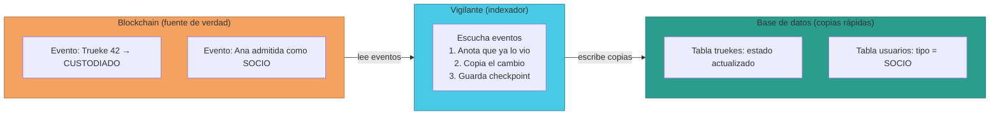
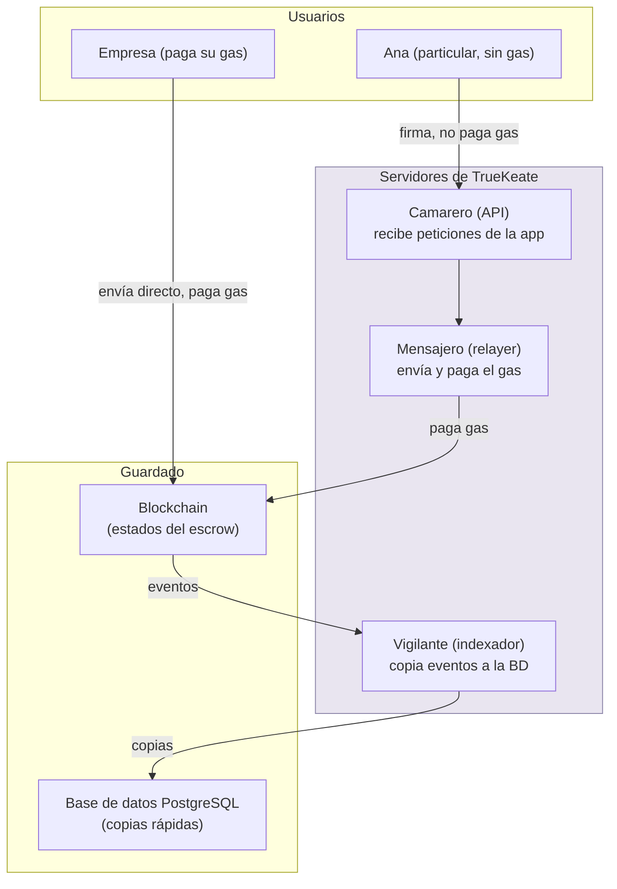

# Manual · Los servidores que vigilan los trueques

> Versión en lenguaje sencillo del manual técnico del backend (Node.js).
> Aquí contamos qué hacen los "trabajadores invisibles" de TrueKeate.

---

## 1. Empezar en 5 minutos

TrueKeate no es solo blockchain: detrás hay **servidores** (ordenadores siempre
encendidos) que hacen tres trabajos:

1. **El vigilante de eventos (indexador)**: mira la blockchain y copia lo que
   pasa a la base de datos, para que la app sea rápida.
2. **El mensajero que paga (relayer)**: envía las operaciones de los usuarios
   particulares a la blockchain y paga el gas por ellos.
3. **El camarero de peticiones (API)**: atiende a la app web/móvil: "dame el
   catálogo", "crea un trueque", "inicia sesión".

Es como un restaurante:

- La **API** es el camarero que toma los pedidos de los clientes.
- El **indexador** es el que anota en el libro de contabilidad lo que ocurre en la cocina.
- El **relayer** es el repartidor que lleva los pedidos a la blockchain pagando el envío.

Los tres hablan el mismo idioma que la blockchain (una librería llamada
**ethers**) y guardan datos en una base de datos llamada **PostgreSQL**.

---

## 2. El camarero: la API (REST)

### 2.1 ¿Qué es una API?

Una API es la "boca" de los servidores: un conjunto de puertas (direcciones)
por las que la app pide cosas.

Ejemplo real: cuando Ana abre el catálogo, su app le pide a la API:
"dame los artículos disponibles". La API responde con la lista.

### 2.2 Qué puertas existen

| Área | Para qué sirve | Ejemplo de petición |
|---|---|---|
| `/auth` | Entrar y registrarse | "iniciar sesión con mi firma" |
| `/kyc` | Subir en la escalera de verificación | "envié mi documento y selfie" |
| `/catalog` | Publicar y ver artículos | "publicar mi bici", "ver encargos" |
| `/truekes` | Gestionar trueques | "crear trueque", "firmar recepción" |
| `/admin` | Panel del Owner | "ver usuarios", "estado de los servidores" |
| `/reputacion` | Ver la reputación | "¿qué puntuación tengo?" |
| `/subastas` | Subastas de empresas | "hacer una puja" |

### 2.3 Reglas de negocio que la API hace cumplir

1. Para crear un trueque necesitas sesión iniciada y estar **VERIFICADO** o **CERTIFICADO**.
2. Si estás VERIFICADO, máximo **3 trueques activos** a la vez.
3. Las valoraciones son de 1 a 5 en cinco aspectos.

### 2.4 ¿Cómo sabe la API quién eres?

Cuando Ana inicia sesión:

1. La app le pide firmar un mensaje con MetaMask: *"TrueKeate: iniciar sesión"*.
2. Con esa firma, la API sabe que Ana es Ana (la matemática lo demuestra).
3. La API le entrega un **pase de sesión** (un código secreto temporal).
4. Con ese pase, Ana puede pedir cosas durante un tiempo sin volver a firmar.

> Nota de verificación: hoy los datos de la API viven en la **memoria** del
> servidor (como un bloc rápido) imitando las tablas de la base de datos.
> La conexión definitiva con PostgreSQL está prevista en una fase de
> integración posterior → **pendiente de confirmar**.

---

## 3. La base de datos: PostgreSQL (el almacén)

### 3.1 ¿Para qué sirve si ya está la blockchain?

La blockchain es segura pero **lenta para buscar**. Imagina buscar una aguja en
un pajar cada vez que quieres ver el catálogo.

PostgreSQL es el almacén veloz: guarda **copias** de lo que pasa en la
blockchain + todos los datos de uso (artículos, chats, valoraciones,
ubicaciones, estadísticas).

### 3.2 Regla de oro

**Solo el vigilante (indexador) escribe las copias del estado de los trueques.**
Nadie más puede tocar esas copias desde la base de datos. Si alguien modificara
la base de datos a mano, no cambiaría nada en la blockchain: la cadena manda.

### 3.3 Datos personales protegidos

Los datos sensibles (correo, teléfono, dirección, documento de identidad,
selfie) están marcados para guardarse **cifrados** (encriptados). Eso significa
que aunque alguien robara la base de datos, no podría leerlos.

> ⚠️ Pendiente de confirmar: el cifrado está marcado en el diseño del esquema,
> pero **no se ha verificado** el mecanismo concreto que lo implementa.

### 3.4 ¿Dónde está la base de datos?

TrueKeate reutiliza un servicio de base de datos en la nube de Google (GCP)
llamado internamente `mcc-postgres`, con una herramienta de administración
llamada pgAdmin. Ver manual 04-Despliegue.

---

## 4. El vigilante: el indexador

### 4.1 Su trabajo

La blockchain emite **eventos** cuando algo pasa (un "grito" público):
"¡El trueque 42 pasó a CUSTODIADO!", "¡Ana fue admitida como SOCIO!".

El indexador está **siempre escuchando**. Cuando oye un evento:

1. Anota en su libro (auditoría) que ya lo vio, para no repetirlo.
2. Copia el cambio a la base de datos (tablas espejo).
3. Guarda la marca de hasta dónde ha leído (checkpoint).

<!-- GENERAR_IMAGEN: indexador-copia.svg -->

### 4.2 ¿Y si se pierde algo?

Si el vigilante se cae o se pierde un evento, se puede **reprocesar**:
volver a leer la blockchain desde un bloque anterior y rehacer las copias.
Como cada evento tiene un número de serie único, no se duplican (el sistema
omite lo que ya está anotado).

### 4.3 El vigilante también informa

El indexador calcula el **retraso** (lag): cuántos eventos hay entre lo último
que leyó y lo último que pasó en la blockchain. Si el retraso crece, algo va
mal y el Owner lo ve en su panel.

---

## 5. El mensajero: el relayer

### 5.1 Su trabajo en simple

Cuando Ana quiere hacer una operación sin pagar gas:

1. Ana firma con su billetera (ver manual 02-stack-web3).
2. La API recibe la firma y llama al relayer.
3. El relayer **revisa todo** (red, bloqueos, límite diario, número de serie,
   estado de verificación).
4. Si todo está bien, envía la operación a la blockchain pagando el gas.

<!-- GENERAR_IMAGEN: servidores-vigilantes.svg -->

### 5.2 Su salud: ¿está todo bien?

El relayer se hace un chequeo médico periódico:

- ¿Tiene saldo la cuenta que paga el gas? Si baja de **0,5 ETH**, avisa al Owner.
- ¿Está conectado a la red correcta?

### 5.3 ¿Y si el mensajero se cae?

Está previsto un plan B (**D39**): si el relayer falla más de una hora, el
usuario puede pagar el gas directamente y la plataforma le reembolsa en BRLT
(la moneda propia) si la caída fue culpa del operador.

> ⚠️ Pendiente de confirmar: ese plan B está documentado como requisito, pero
> **no se ha verificado** su implantación operativa.
> También **pendiente de confirmar**: que el relayer corra como servicio
> independiente con 2 copias y cola de reintentos (así lo pide el diseño D15).

---

## 6. Seguridad: límites y frenos

La API y el relayer tienen frenos para evitar abusos:

| Freno | Qué hace |
|---|---|
| **Límite de peticiones** | Máximo 120 peticiones por minuto a la API |
| **Límite diario** | Máximo 20 operaciones gratis por usuario y día |
| **Bloqueo temporal** | 3 fallos en 10 minutos → pausa de 1 hora |
| **Pase de sesión** | Las zonas privadas exigen tu pase válido |

---

## 7. Cómo se sabe que todo funciona: pruebas

El backend se prueba con pruebas automáticas:

- **Pruebas del vigilante**: ¿copia bien los eventos? ¿no duplica?
- **Pruebas del mensajero**: ¿rechaza firmas repetidas? ¿aplica los frenos?
- **Pruebas del camarero**: ¿responden bien todas las puertas de la API?

Documentado: **19 de 19 pruebas pasan** en el momento de escribir el manual técnico.

---

## 8. Qué falta confirmar

1. El diseño pedía escribir el backend en TypeScript, pero el código real está
   en JavaScript → desviación del diseño, **pendiente de confirmar** si es intencional.
2. El cifrado real de datos personales en la base de datos → **pendiente de confirmar**.
3. La API guarda datos en memoria; la conexión definitiva con PostgreSQL está
   en fase de integración → **pendiente de confirmar**.
4. El relayer como servicio independiente con 2 instancias → **pendiente de confirmar**.
5. En el mapa de contratos del indexador, la dirección de las SmartAccounts de
   cada usuario figura como "pendiente" (las cuentas se crean una a una) →
   **pendiente de confirmar** cómo se resolverá en producción.

---

## 9. Glosario de este manual

| Palabra | Significado |
|---|---|
| **API** | Puertas de los servidores por las que la app pide cosas |
| **Endpoint** | Una puerta concreta de la API (una dirección + una acción) |
| **Evento** | Aviso público que emite la blockchain cuando algo pasa |
| **Checkpoint** | Marca de hasta dónde ha leído el vigilante |
| **Lag / retraso** | Distancia entre lo último leído y lo último ocurrido |
| **Pool** | Conjunto de conexiones preparadas a la base de datos |
| **Rate limiting** | Freno que limita peticiones por minuto |
| **Health-check** | Chequeo de salud de un servidor |

Continúa con el manual **04-stack-frontend**: la app que ven las personas.
