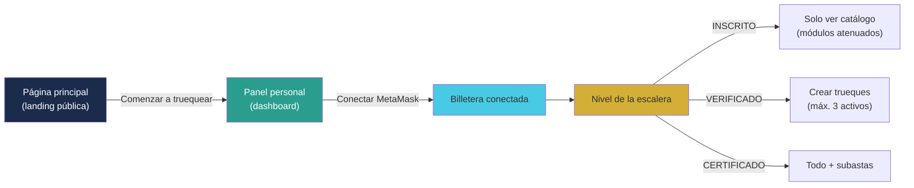
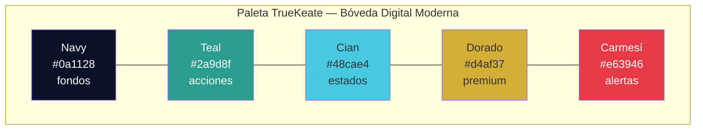

# Manual · La app web y móvil de TrueKeate

> Versión en lenguaje sencillo del manual técnico del frontend (Next.js).
> Aquí contamos qué ves y qué tocas cuando usas TrueKeate.

---

## 1. Empezar en 5 minutos

TrueKeate tiene una **página web** (la app) hecha con tecnologías modernas.
Esto es lo que encontrarás:

1. **Página principal** (landing): explica qué es TrueKeate y tiene un botón
   "Comenzar a truequear".
2. **Panel personal** (dashboard): tu espacio dentro de la app. Aquí conectas tu
   billetera y ves tu nivel (INSCRITO, VERIFICADO o CERTIFICADO).
3. **Menú inferior** con 5 botones: Mercado, Inventario, Trueke, Socios y Perfil.

Para empezar a usar la app en 5 minutos:

1. Abre la página principal.
2. Pulsa "Comenzar a truequear".
3. Conecta tu billetera MetaMask (un clic para aceptar).
4. Mira tu panel: verás tu nivel de la escalera y qué módulos puedes usar.
5. Si estás solo INSCRITO, verás el catálogo pero no podrás crear trueques
   todavía: verifica tu correo y teléfono para subir de nivel.

> Ejemplo real: Ana abre la app, conecta MetaMask y aparece como "INSCRITO".
> Los módulos de crear trueques están atenuados (grises). Después de confirmar
> su correo y teléfono, pasa a "VERIFICADO" y ya puede empezar a truequear.

<!-- GENERAR_IMAGEN: recorrido-app.svg -->

---

## 2. Con qué está construida la app

| Pieza | Qué es | En simple |
|---|---|---|
| **Next.js** | El marco principal de la web | El "esqueleto" de la app |
| **React** | Librería de pantallas | Piezas de interfaz reutilizables |
| **TypeScript** | JavaScript con red de seguridad | Evita errores de tipos antes de publicar |
| **Tailwind CSS** | Sistema de estilos | Define colores y formas de forma ordenada |
| **ethers** | Puente con la blockchain | Conecta con MetaMask y los contratos |

> Verificación: versión exacta de Next.js 16.3.4, React 19.2.8, Tailwind v4 y
> ethers 6.17.0 (leídos de los archivos de bloqueo de versiones).

---

## 3. La página principal (landing)

Es la puerta de entrada, abierta a todo el mundo (no hace falta iniciar sesión).

Muestra:

- El nombre y logo de TrueKeate.
- Las **4 ventajas** del trueque digital:
  1. **Custodia atómica**: nadie se queda sin su parte.
  2. **Trueke sin gas**: los particulares no pagan comisiones de red.
  3. **Reputación real**: las valoraciones construyen confianza.
  4. **Economía circular**: las cosas se reutilizan entre personas.
- Un botón grande: **"Comenzar a truequear"**, que lleva al panel personal.

---

## 4. El panel personal (dashboard)

Es la única pantalla de la zona privada que ya está **totalmente funcional**.

### 4.1 Qué hace

1. Muestra un botón **"Conectar MetaMask"** si no tienes la billetera conectada.
2. Al conectar, muestra tu **nivel de la escalera** (INSCRITO → VERIFICADO → CERTIFICADO).
3. Activa o atenúa los módulos según tu nivel:
   - Explorar ofertas
   - Mis truekes (máximo 3 activos si eres VERIFICADO)
   - Reputación
   - Punto de encuentro

### 4.2 La barra superior

Dentro de la app, arriba aparece la marca `TrueKeat☑` y tu nombre de usuario con
una palomita (✓) si estás verificado.

### 4.3 El menú inferior (BottomNav)

Una barra flotante abajo con 5 botones:

| Botón | Ícono | Qué es |
|---|---|---|
| Mercado | 🏠 | El panel principal |
| Inventario | 💼 | Tus artículos (en construcción) |
| **Trueke** | ⇄ | El trueque (botón central dorado, hexagonal) |
| Socios | 🏛️ | Gobernanza y votaciones (en construcción) |
| Perfil | 👤 | Tu perfil (en construcción) |

> ⚠️ Importante (verificado): los módulos **Inventario, Trueke, Socios y Perfil
> son lugares reservados (placeholders)**. Dentro de cada uno pone:
> "módulo en construcción — se completa en el Ciclo 8". No afirmamos que
> funcionen todavía.

---

## 5. Identidad visual: el estilo "Bóveda Digital Moderna"

TrueKeate tiene un sistema de diseño propio con esta paleta:

| Color | Uso | Código |
|---|---|---|
| Azul marino oscuro | Fondos principales | `#0a1128` / `#1a2b4c` |
| Verde azulado (teal) | Acciones y éxito | `#2a9d8f` |
| Cian | Detalles y estados activos | `#48cae4` |
| Dorado | Lo premium y el botón central | `#d4af37` |
| Rojo carmesí | Alertas y peligro | `#e63946` |
| Coral | Avisos suaves | `#f4a261` |

Las piezas visuales (botones, tarjetas, insignias) ya existen como componentes
reutilizables. Los activos de marca (logos) están en la carpeta pública de la web.

<!-- GENERAR_IMAGEN: estilo-visual.svg -->

---

## 6. Conectar la billetera: cómo funciona

Cuando pulsas "Conectar MetaMask":

1. La app pide permiso a MetaMask (aparece una ventanita de MetaMask).
2. Tú aceptas. MetaMask guarda en la app la dirección de tu cuenta.
3. La app **recuerda tu cuenta**: si recargas la página, vuelve a conectar solo.
4. Si cambias de cuenta en MetaMask, la app se entera y se actualiza.

> En el teléfono, la firma se delega a la **wallet móvil** (MetaMask mobile)
> cuando la app se instala como PWA (aplicación instalable).

---

## 7. La app como "aplicación instalable" (PWA)

TrueKeate puede instalarse en el teléfono como una app normal:

- Tiene su **manifest** (la tarjeta de presentación que permite instalarla).
- Al instalarla, se abre a pantalla completa, sin barra del navegador.
- El acceso rápido está pensado para que el panel personal sea la primera pantalla.

> ⚠️ Pendiente de confirmar: existe la tarjeta de instalación, pero **no se ha
> encontrado** el "trabajador de servicio" (service worker) que permite el modo
> sin conexión y la caché completa. Hoy, instalable sí; 100 % offline, a confirmar.
> La app nativa (Android/iOS) es una mejora futura prevista, no algo ya hecho.

---

## 8. ¿Cómo sabemos que la app funciona? Pruebas automáticas

La app se prueba con una herramienta llamada **Playwright**, que abre un
navegador de verdad y comprueba:

1. Que la página principal muestre el logo, las ventajas y el botón.
2. Que el botón lleve al panel personal.
3. Que dentro del panel se vea la escalera y que un usuario INSCRITO **no pueda**
   crear trueques (los botones están bloqueados).

Se prueba en dos tamaños de pantalla: ordenador (Chrome) y móvil (como un
Pixel 5), porque TrueKeate es **móvil primero**.

---

## 9. Qué falta confirmar

1. Los módulos Inventario, Trueke, Socios y Perfil son espacios reservados;
   su contenido real se completará en una fase posterior → **pendiente de confirmar**.
2. La integración real con el servidor (sesión, verificación KYC y envío de
   operaciones firmadas) hoy se simula en el panel para demostrar el diseño →
   **pendiente de confirmar** en la integración.
3. El service worker de la PWA (modo sin conexión) → **pendiente de confirmar**.
4. Las direcciones de los contratos cargadas en la app corresponden al entorno
   de pruebas; en producción deben cargarse del servidor → **pendiente de confirmar**.

---

## 10. Glosario de este manual

| Palabra | Significado |
|---|---|
| **Frontend** | La parte de la app que ves y tocas (web y móvil) |
| **Landing** | Página principal de presentación |
| **Dashboard** | Panel personal con tus datos y acciones |
| **Placeholder** | Espacio reservado que aún no tiene contenido |
| **PWA** | Aplicación web que se puede instalar como app |
| **Service worker** | Programa en segundo plano que permite usar la app sin conexión |
| **E2E** | Pruebas de principio a fin, como un usuario real |
| **Componente** | Pieza de interfaz reutilizable (botón, tarjeta...) |

Continúa con el manual **02-Dependencias** para conocer las piezas que usa
TrueKeate por dentro.
