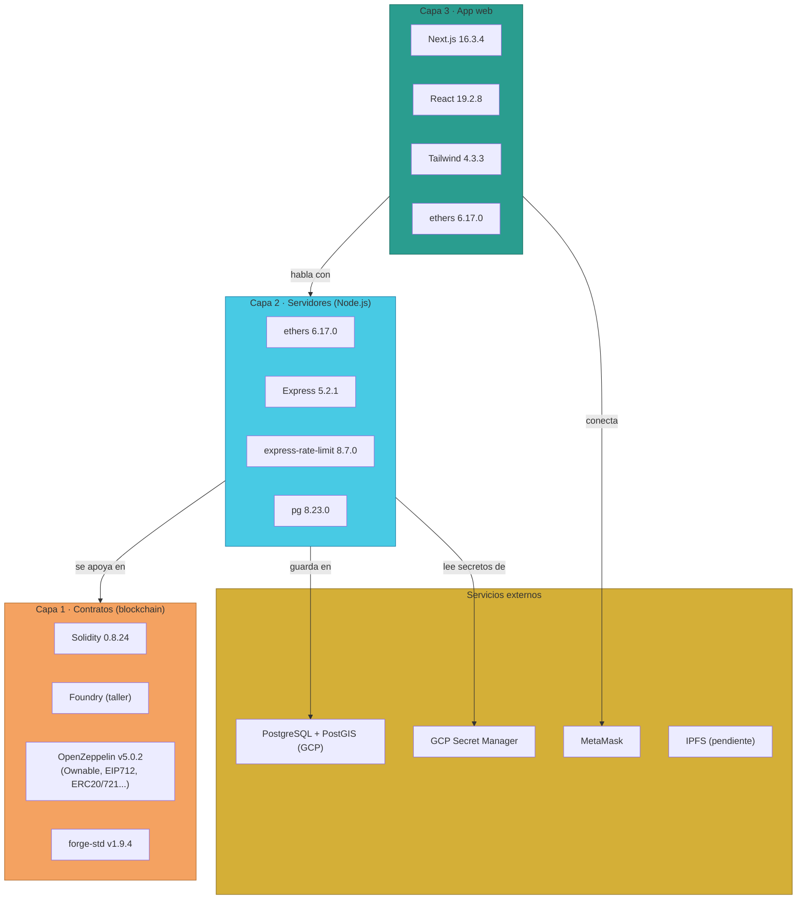

# Manual · Las piezas que usa TrueKeate por dentro

> Versión en lenguaje sencillo del manual técnico de dependencias.
> Aquí explicamos, sin tecnicismos, de qué piezas está hecha TrueKeate.

---

## 1. Empezar en 5 minutos

Una app moderna no se construye desde cero: usa **piezas ya hechas** llamadas
librerías o dependencias. Son como los ingredientes de una receta.

TrueKeate se cocina con estos ingredientes principales:

1. **Solidity** (idioma de los contratos) con el compilador fijado en la
   versión 0.8.24.
2. **OpenZeppelin** (caja de piezas de seguridad probadas) versión 5.0.2.
3. **Node.js** (motor de los servidores) con librerías como **Express**
   (servidor web) y **ethers** (puente con la blockchain).
4. **Next.js + React + Tailwind** (la app web) y **TypeScript** (red de seguridad).
5. **PostgreSQL** (base de datos) y servicios en la nube de Google (GCP).

> Para qué sirve saber esto: cuando TrueKeate se actualiza o algo falla,
> conocer las piezas ayuda a encontrar la causa. Y si usas la plataforma,
> te da confianza saber que se apoya en piezas muy usadas y conocidas.

---

## 2. Cómo se leen las versiones

Las versiones se escriben con un formato llamado **semver**: `mayor.menor.parches`.

- Ejemplo: `ethers ^6.17.0` significa "versión 6.17.0 o superior compatible".
- El símbolo `^` permite actualizaciones menores automáticas.
- Para saber la **versión exacta** instalada, se mira el "lockfile"
  (el recibo de la compra exacta de las piezas).

TrueKeate, además, fija algunas piezas **por commit** (una huella digital
exacta del código). Así nadie cambia una pieza sin querer.

---

## 3. Las piezas de los contratos (capa blockchain)

| Pieza | Versión exacta | Para qué sirve |
|---|---|---|
| Solidity (idioma) | 0.8.24 | Escribir los contratos inteligentes |
| Foundry (taller) | sin fijar ⚠️ | Crear y probar contratos |
| forge-std (caja de pruebas) | v1.9.4 | Utilidades de prueba |
| OpenZeppelin (piezas de seguridad) | v5.0.2 | Candados y cerraduras estándar |

### Qué piezas de OpenZeppelin se usan

- **Ownable**: "solo el dueño puede hacer esto" (el dueño es el Owner).
- **ReentrancyGuard**: evita que un contrato sea atacado con trucos de re-llamada.
- **EIP712 y ECDSA**: firma digital segura de mensajes.
- **MerkleProof**: demuestra que algo está en una lista sin mostrar la lista.
- **ERC20 y ERC721**: estándares de criptomonedas y NFTs.
- **SafeERC20**: transferencias de criptos sin sorpresas.

> Analogía: OpenZeppelin es como comprar cerraduras certificadas en lugar de
> inventar la tuya. Son piezas revisadas por mucha gente experta.

---

## 4. Las piezas de los servidores (capa backend)

| Pieza | Versión exacta | Para qué sirve |
|---|---|---|
| Node.js (motor) | sin fijar ⚠️ | Ejecuta los servidores |
| ethers | 6.17.0 | Hablar con la blockchain |
| Express | 5.2.1 | Crear el servidor de la API |
| express-rate-limit | 8.7.0 | Freno de peticiones (anti-abuso) |
| pg | 8.23.0 | Conectar con PostgreSQL |
| supertest | 7.2.2 | Probar las puertas de la API |

Ejemplo real de para qué sirve **express-rate-limit**: si alguien lanza miles
de peticiones por minuto para saturar la app, este freno corta el abuso.

---

## 5. Las piezas de la app web (capa frontend)

### 5.1 Piezas de funcionamiento

| Pieza | Versión exacta | Para qué sirve |
|---|---|---|
| Next.js | 16.3.4 | El esqueleto de la web |
| React | 19.2.8 | Las pantallas |
| react-dom | 19.2.8 | Dibujar las pantallas |
| ethers | 6.17.0 | Conectar MetaMask y contratos |

### 5.2 Piezas de desarrollo (solo para quien construye)

| Pieza | Versión exacta | Para qué sirve |
|---|---|---|
| TypeScript | 5.9.3 | Red de seguridad contra errores |
| Tailwind CSS | 4.3.3 | Los estilos visuales |
| Playwright | 1.62.1 | Pruebas automáticas como usuario real |
| ESLint | 9.39.5 | Revisa calidad del código |

> Las piezas de desarrollo no llegan a los usuarios: solo ayudan a quien
> construye a trabajar mejor.

---

## 6. Las piezas externas (servicios que no son código)

TrueKeate también depende de servicios:

| Servicio | Para qué sirve | Estado |
|---|---|---|
| **PostgreSQL + PostGIS** | Base de datos + mapas | Reutiliza un servicio en Google Cloud (GCP) |
| **IPFS** | Guardar imágenes y archivos de forma descentralizada | Decidido, sin desplegar ⚠️ |
| **OpenStreetMap (OSM)** | Mapas y rutas para el punto de encuentro | Decidido, sin integrar ⚠️ |
| **Nodemailer + SMTP** | Enviar correos y códigos de verificación | Decidido, sin integrar ⚠️ |
| **MetaMask** | La billetera del usuario | Verificado en la app |
| **GCP Secret Manager** | Guardar claves secretas | Verificado en los scripts |

> ⚠️ Varios servicios están **decididos en el diseño** (elegidos) pero aún no
> integrados en el código. Los marcamos como **pendiente de confirmar**.

---

## 7. Licencias: ¿de quién es cada pieza?

| Pieza | Licencia | Qué significa en simple |
|---|---|---|
| Contratos de TrueKeate | MIT | Código abierto y libre |
| Backend de TrueKeate | ISC | Permisiva, similar a MIT |
| App web | privada | Sin licencia pública declarada |
| OpenZeppelin | MIT | Libre (autor upstream) |
| forge-std | MIT/Apache-2.0 | Libre (autor upstream) |

> No se ha hecho una revisión completa legal de las licencias de todas las
> piezas secundarias (las que traen otras piezas) → **pendiente de confirmar**
> si el proyecto necesita esa revisión.

---

## 8. Mapa visual: las piezas por capa

<!-- GENERAR_IMAGEN: mapa-piezas.svg -->

---

## 9. Qué falta confirmar

1. La versión de Node.js no está fijada en el proyecto → **pendiente de confirmar**.
2. La versión de Foundry no está fijada → **pendiente de confirmar**.
3. La versión del servicio PostgreSQL en la nube → **pendiente de confirmar**.
4. IPFS, mapas (OSM) y correos (SMTP) están elegidos en el diseño pero no
   integrados → **pendiente de confirmar**.
5. No existe política escrita de actualización de piezas (ni robot automático
   de actualizaciones) → **pendiente de confirmar**.
6. Revisión legal completa de licencias → **pendiente de confirmar**.

---

## 10. Glosario de este manual

| Palabra | Significado |
|---|---|
| **Dependencia** | Pieza de software que otro software usa |
| **Librería** | Conjunto de piezas listas para usar |
| **Versión** | Número que identifica una edición del código |
| **Lockfile** | Recibo con las versiones exactas instaladas |
| **Submódulo** | Pieza guardada en otro repositorio, fijada por huella digital |
| **Semver** | Formato de versiones: mayor.menor.parche |
| **Licencia** | Permiso legal de uso del código |
| **Runtime** | El motor que ejecuta el programa (p. ej. Node.js) |

Continúa con el manual **04-Despliegue**: dónde vive TrueKeate y cómo se
actualiza.
