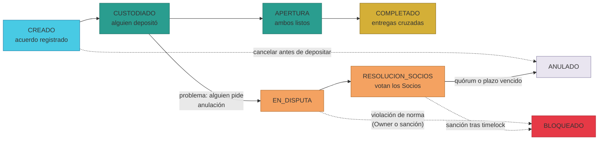
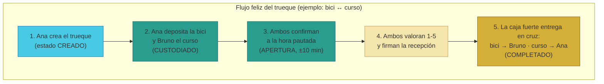
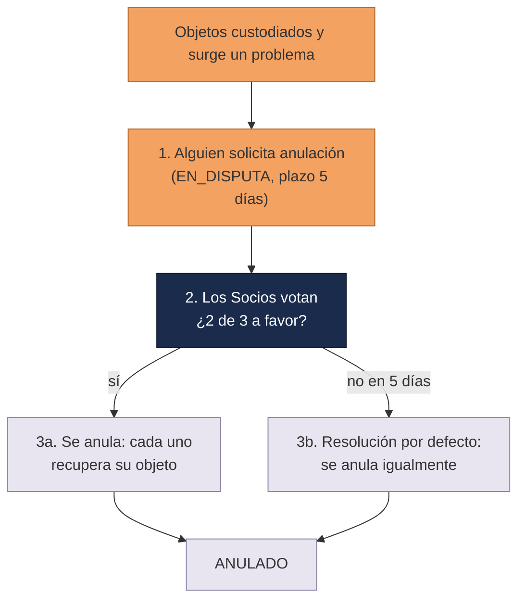

# Manual · El Escrow: la caja fuerte de tu trueque

> Versión en lenguaje sencillo del manual técnico del contrato **Escrow**.
> Aquí contamos, con ejemplos de la vida diaria, qué pasa cuando creas,
> custodias y completas un trueque en TrueKeate.

---

## 1. Empezar en 5 minutos

Un trueque en TrueKeate funciona como un trueque de verdad, pero con una
**caja fuerte digital** por medio. Nadie puede quedarse con lo suyo sin
cumplir su parte.

Las 4 ideas básicas:

1. **Acuerdas**: tú y otra persona se ponen de acuerdo en qué intercambian.
2. **Depositan**: cada uno entrega su objeto a la caja fuerte (el escrow).
3. **Se encuentran**: confirman que están listos para el intercambio.
4. **Reciben**: cuando ambos dicen "lo recibí bien", la caja fuerte entrega
   a cada uno lo del otro. Nadie se queda sin su parte.

Ejemplo rápido de 5 minutos:

- Ana ofrece su **bicicleta** a cambio del **curso de fotografía** de Bruno.
- Ana crea el trueque. La caja fuerte queda marcada como **CREADO**.
- Ana deposita la bici y Bruno deposita el curso.
- Ambos confirman la entrega. La caja fuerte manda la bici a Bruno y el
  curso a Ana. Trueque terminado: **COMPLETADO**.

Si algo sale mal, la caja fuerte no suelta nada hasta que se resuelva
(disputa, anulación o bloqueo). Eso es lo que hace segura a la plataforma.

---

## 2. Qué es el escrow y por qué existe

**Escrow** es la palabra inglesa para "depósito en manos de un tercero de
confianza". En TrueKeate, ese tercero es un **contrato inteligente**: un
programa que vive dentro de la blockchain y que **no puede ser engañado ni
cambiado a mitad de camino**.

Imagina una caja fuerte con dos cerraduras:

- La caja solo se abre con **dos llaves a la vez**: la tuya y la de la otra
  persona.
- Mientras las dos no giren, el contenido está congelado.

Por eso funciona el intercambio **entre dos personas (AtoA = "a to a")**:
ni tú puedes quedarte con el objeto de Bruno sin entregar el tuyo, ni Bruno
con el tuyo sin entregar el suyo.

> La blockchain es la **única fuente de verdad**: el estado del trueque
> (creado, completado, anulado...) vive en la cadena, no en los servidores
> de la plataforma. Si la plataforma se apagara, la caja fuerte seguiría
> guardando todo.

---

## 3. Los 9 estados del trueque (con ejemplos cotidianos)

Cada trueque tiene un **estado**, como una etiqueta que dice en qué momento
está. Son 9:

| # | Estado | Qué significa | Ejemplo cotidiano |
|---|---|---|---|
| 0 | **CREADO** | Se registró el acuerdo, todavía nadie depositó | "Quedamos en intercambiar, pero aún no llevamos nada" |
| 1 | **ACTIVO** | Lo mismo que CREADO (nombre antiguo para leer) | — |
| 2 | **CUSTODIADO** | Al menos uno (o ambos) ya depositó su objeto | "Ana ya dejó la bici en la caja fuerte" |
| 3 | **APERTURA** | Ambos confirmaron que están listos en la ventana de tiempo | "Los dos llegan a la cita a la hora acordada" |
| 4 | **EN_DISPUTA** | Alguien pidió anular el trueque | "Bruno dice que el curso no era lo que ofrecía" |
| 5 | **RESOLUCION_SOCIOS** | Los Socios están votando qué hacer | "Un jurado de vecinos está deliberando" |
| 6 | **COMPLETADO** | Ambos firmaron y valoraron: se entregó todo en cruz | "¡Trueque hecho! Cada uno tiene lo suyo" |
| 7 | **ANULADO** | Se canceló (antes de custodiar, o por votación) | "No se hizo, y cada uno recuperó lo suyo" |
| 8 | **BLOQUEADO** | Alguien violó una norma: los objetos quedan congelados | "La caja fuerte se sella a la espera de sanción" |

> ⚠️ Detalle técnico (pendiente de confirmar su utilidad): el estado
> **ACTIVO** existe en la lista, pero el programa nunca lo usa al crear un
> trueque (crea en CREADO). Solo lo acepta como estado de entrada en
> algunas funciones. En la práctica no lo verás en pantalla.

<!-- GENERAR_IMAGEN: estados-escrow.svg -->

---

## 4. Crear un trueque (paso a paso)

**Quién puede crearlo**: cualquier persona registrada (parte A). La parte A
crea el acuerdo ofreciendo su objeto y pidiendo el de la parte B.

Pasos:

1. La parte A indica quién es la parte B.
2. Describe su objeto (lo que ofrece) y el objeto que quiere de B.
3. Propone una **hora pautada**: cuándo se hará el encuentro.
4. El sistema registra el acuerdo y lo marca como **CREADO**.
5. Se emite una "notificación en cadena" (un evento llamado
   `TruekeCreado`) que sirve para que los vigilantes del sistema lo anoten.

Reglas básicas:

- No puedes hacerte un trueque a ti mismo.
- Cada objeto debe ser válido: una cripto (token) o un NFT con su número de
  identificación.
- No existe un botón "aceptar oferta": la parte B participa directamente
  depositando su objeto (paso siguiente).

> Un **NFT** es un "certificado digital único" (como una obra de arte
> firmada). Una **cripto** es dinero digital divisible (como monedas
> fraccionables).

---

## 5. Custodiar: depositar los objetos (paso a paso)

**Custodiar** = entregar tu objeto a la caja fuerte. Puede hacerse en
cualquier orden: primero uno, luego el otro.

1. La parte A deposita su objeto (la bici) con un clic.
2. El sistema pide **permiso previo** (aprobación) para mover tu objeto.
   Es como firmar una autorización: "puedes mover mi bici a la caja
   fuerte".
3. El objeto sale de tu billetera y entra al escrow. El estado pasa a
   **CUSTODIADO**.
4. La parte B hace lo mismo con el suyo (el curso).

Reglas importantes:

- Solo el dueño del objeto puede custodiarlo.
- No puedes depositar dos veces el mismo objeto.
- Cuando los dos objetos están dentro, el trueque está "cargado" y listo
  para el encuentro.

---

## 6. El encuentro: apertura y la ventana de 10 minutos

Antes de que la caja fuerte entregue nada, **ambas partes confirman que
están listas**. Esto se llama **apertura**.

Las reglas de tiempo son como las de una cita presencial:

- Solo puedes confirmar si **los dos objetos ya están custodiados**. No se
  abre la puerta con la caja medio vacía.
- Debes hacerlo cerca de la **hora pautada**: como máximo 10 minutos antes
  o después. Si llegas tarde, el sistema te avisa: "fuera de la ventana de
  apertura".
- Si el otro ya abrió, tú debes abrir **a lo sumo 10 minutos después**.
  Es como decir: "los dos llegamos a la cita con poca diferencia".

> ⚠️ Detalle técnico (observación): el programa permite, en rigor, firmar
> la recepción sin pasar por la apertura si ambos ya depositaron. En la
> práctica documentada y probada, el paso de apertura existe siempre. La
> secuencia completa no se impone por fuerza en el contrato → queda como
> observación, no como fallo.

---

## 7. Completar: firmas dobles + valoración (paso a paso)

Aquí ocurre la magia. Para que la caja fuerte se abra hacen falta **cuatro
gestos**:

1. La parte A marca que **valoró** el trueque (estrella 1-5, opcional en
   pantalla pero necesaria para cerrar).
2. La parte B marca que **valoró** el trueque.
3. La parte A **firma la recepción**: "recibí el curso de Bruno y está
   bien".
4. La parte B **firma la recepción**: "recibí la bici de Ana y está bien".

Cuando las dos valoraciones y las dos firmas están, el sistema **libera en
cruz**:

- El curso va de la caja fuerte a la billetera de Ana.
- La bici va de la caja fuerte a la billetera de Bruno.

El trueque queda **COMPLETADO** y nadie puede deshacerlo.

> 💡 Por qué es seguro: la entrega ocurre **después** de que ambos firmaron
> y valoraron, y las dos entregas ocurren en el mismo movimiento. No existe
> "primero tú y luego yo".

<!-- GENERAR_IMAGEN: flujo-truque.svg -->

---

## 8. Cancelar antes de custodiar

Si **nadie ha depositado todavía**, cualquiera de las dos partes puede
cancelar sin problemas:

1. Pulsas "cancelar".
2. El trueque pasa a **ANULADO**. Sin castigos, sin comisiones.

Pero si **algo ya está custodiado**, **no se puede cancelar por las buenas**:
alguien podría depositar y luego irse. En ese caso, para salir se usa el
camino de la disputa (sección siguiente) o se completa el trueque.

> Ejemplo: Ana y Bruno quedaron, pero Bruno se arrepintió antes de depositar
> nada → cancelación limpia. Si Bruno ya depositó el curso y luego desaparece
> → no hay botón de "me arrepiento": entra la disputa.

---

## 9. Disputas: anulación con votos de Socios (paso a paso)

Si algo se rompe con los objetos ya depositados, cualquiera de las dos
partes puede **solicitar la anulación** y contar su motivo.

1. La parte afectada solicita la anulación (solo una vez por trueque).
2. El trueque pasa a **EN_DISPUTA**. Se abre un plazo de **5 días**.
3. Los **Socios** (miembros con buena reputación de la comunidad) votan a
   favor o en contra de anular.
4. Regla de votación: se necesitan **2 de cada 3 votos a favor** (mayoría
   cualificada de dos tercios).
5. Si se alcanza el quórum a favor → los objetos vuelven a sus dueños
   (**ANULADO**).
6. Si en 5 días no se alcanza → el sistema **resuelve por defecto** y anula
   igualmente. Nadie queda esperando para siempre.

Puntos importantes:

- Solo se puede pedir anulación si hay objetos custodiados (si no, se
  cancela directo, ver sección 8).
- Cada Socio vota **una sola vez** por trueque.
- ⚠️ Pendiente de confirmar: en el código actual, una vez pedida la
  anulación, el trueque **siempre termina en ANULADO** (por votos o por
  plazo). No existe todavía un camino que diga "no se anula y el trueque
  continúa". Si el diseño prevé esa salida, no está implementada.

<!-- GENERAR_IMAGEN: disputa-anulacion.svg -->

---

## 10. Bloqueo y sanción (cuando alguien rompe las normas)

### 10.1 Bloqueo por el Owner (moderación)

El **Owner** (el administrador de la plataforma) puede **bloquear** un
trueque si se viola una norma:

- Los objetos quedan **congelados** dentro de la caja fuerte.
- No se puede bloquear un trueque ya COMPLETADO o ANULADO.

### 10.2 Sanción con espera de 6 horas

Los Socios pueden además **programar una sanción**:

1. Un Socio programa la sanción (solo en estados BLOQUEADO o en votación).
2. Empieza una **espera de 6 horas** (el "timelock"): tiempo para pensar o
   rectificar.
3. Pasadas las 6 horas, cualquiera puede ejecutarla.
4. El resultado: el trueque queda **BLOQUEADO de forma definitiva**.

> ⚠️ Pendiente de confirmar: la sanción ejecutada por el contrato es el
> bloqueo definitivo **sin liberación** de los objetos. No se ha visto en
> el código un mecanismo que, tras la sanción, devuelva o redistribuya los
> objetos congelados. La interpretación económica exacta queda por
> confirmar.

---

## 11. Qué falta confirmar (resumen)

1. El estado ACTIVO nunca se asigna en el código actual (solo se acepta de
   entrada) → **pendiente de confirmar**.
2. La apertura dual no es un requisito mecánico para completar → observación.
3. No existe ruta de "rechazo de anulación": toda disputa termina en ANULADO
   → **pendiente de confirmar**.
4. BLOQUEADO no tiene salida que libere los objetos; la sanción vuelve a
   BLOQUEADO → **pendiente de confirmar**.
5. La comisión del **1 %** de los trueques completados hacia el Fondo de
   Valor está en el diseño pero **no aparece en este contrato** →
   **pendiente de confirmar** (se integra en ciclos posteriores).
6. La conexión del Escrow con el padrón de Socios no se ejecuta en el guion
   de despliegue actual → **pendiente de confirmar**.

---

## 12. Glosario de este manual

| Palabra | Significado |
|---|---|
| **Escrow** | La caja fuerte digital que guarda los objetos durante el trueque |
| **Contrato inteligente** | Programa que vive en la blockchain y se ejecuta solo |
| **Trueque AtoA** | Intercambio directo entre dos personas |
| **Custodiar** | Depositar tu objeto en la caja fuerte |
| **Apertura** | Confirmación de ambos de que están listos para el intercambio |
| **Hora pautada** | La hora acordada para el encuentro |
| **Firma de recepción** | Tu declaración: "recibí mi parte y está bien" |
| **Valoración** | Tu puntuación 1-5 del trueque |
| **Socios** | Miembros de confianza de la comunidad que votan en disputas |
| **Quórum** | Número mínimo de votos necesarios para decidir (2 de 3) |
| **Timelock** | Espera obligatoria antes de ejecutar algo (6 h en sanciones) |
| **NFT** | Certificado digital único (obra, coleccionable...) |
| **Token / cripto** | Dinero digital (divisible) |

¡Listo! Ya entiendes la caja fuerte de TrueKeate. El siguiente manual
explica tu cuenta inteligente: tu identidad digital en la plataforma.
