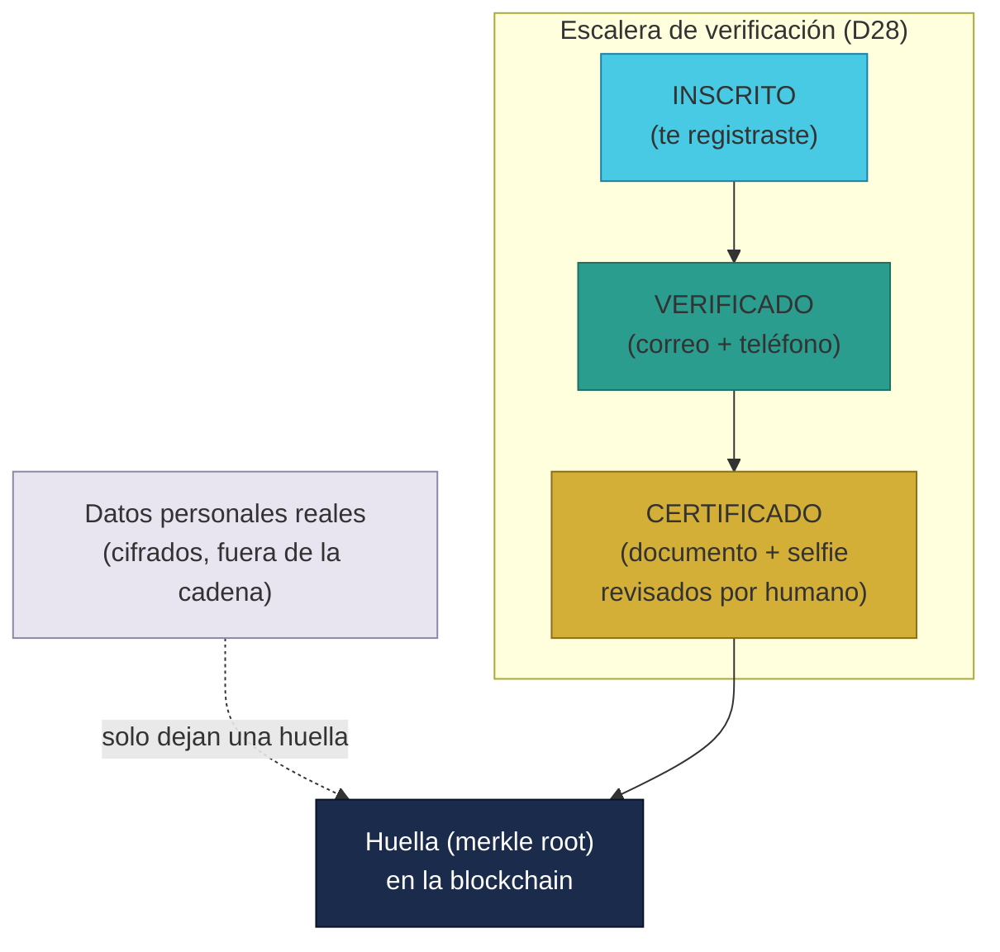
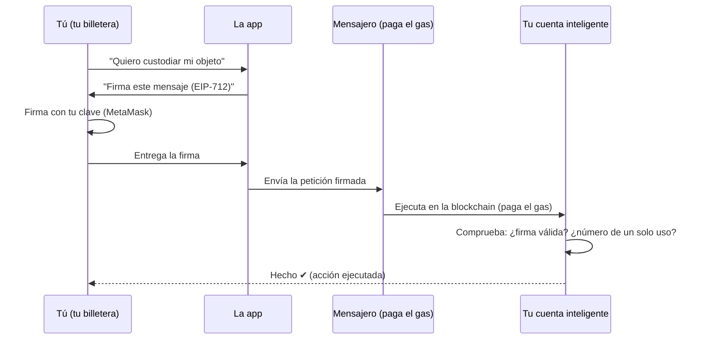
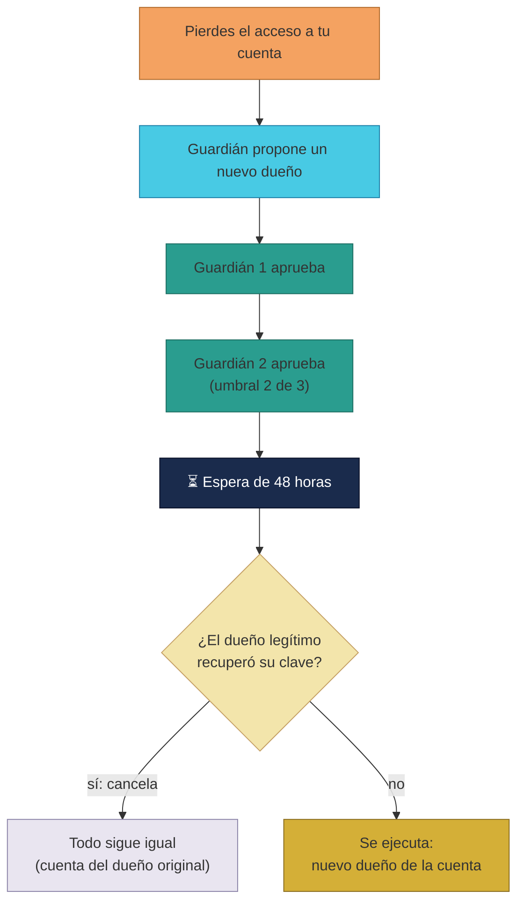

# Manual · Tu cuenta inteligente: identidad, verificación y recuperación

> Versión en lenguaje sencillo del manual técnico de los contratos de
> identidad (**SmartAccount** y **SmartAccountFactory**).
> Aquí contamos qué es tu "cuenta inteligente", cómo se verifica tu
> identidad y cómo recuperar tu cuenta si pierdes el acceso.

---

## 1. Empezar en 5 minutos

TrueKeate te da una **cuenta inteligente** (una identidad digital dentro de
la blockchain) que hace tres cosas por ti:

1. **Te representa**: guarda quién eres (tu estado de verificación).
2. **Firma por ti**: ejecuta acciones solo con tu firma digital.
3. **Te protege**: si pierdes tu clave, 3 guardianes pueden ayudarte a
   recuperarla.

Los 3 conceptos clave:

- **Verificación**: subes por una escalera de confianza: INSCRITO →
  VERIFICADO → CERTIFICADO. Cuanto más subes, más cosas puedes hacer.
- **Firma digital**: tu "firma manuscrita" electrónica que demuestra que
  fuiste tú quien pidió algo.
- **Recuperación**: si pierdes el acceso, necesitas que **2 de tus 3
  guardianes** aprueben la recuperación, y esperar **48 horas**.

En 5 minutos entiendes la idea: tu cuenta es como un **documento de
identidad digital con cerradura propia**, y tú llevas la llave.

---

## 2. Tu cuenta inteligente: qué es y para qué sirve

En las apps normales, tu cuenta vive en los servidores de la empresa. En
TrueKeate, tu identidad vive en la blockchain como un **contrato
inteligente** llamado `SmartAccount` (cuenta inteligente).

Piénsalo como un **casillero personal con tu nombre**, que tiene dos
ventajas grandes:

- **Nadie puede falsificarla**: cada acción necesita tu firma digital.
- **Un ayudante puede pagar por ti**: como tu cuenta solo actúa cuando
  firmas, un **mensajero** (relayer) puede enviar la transacción a la red y
  pagar el gas por ti. Así tú no pagas comisiones de red (gas) en tus
  trueques.

> **Gas** es la "gasolina" que cuesta hacer una operación en la blockchain.
> Normalmente la pagas tú; en TrueKeate, para los particulares, la paga la
> plataforma por ti.

### 2.1 La fábrica de cuentas

Las cuentas no se crean solas: existe una **fábrica** (`SmartAccountFactory`)
que las fabrica **una por persona**. Gracias a una técnica llamada CREATE2,
la dirección de tu cuenta se puede **calcular de antemano**, sin tener que
crearla antes. Esto permite que la plataforma te cree la cuenta sin que tú
pagues nada.

> ⚠️ Detalle técnico: la fábrica no tiene administrador ni control de
> acceso: cualquiera puede pedir que se fabrique una cuenta (quien paga el
> gas). En el flujo real, el que paga es la plataforma.

---

## 3. Tu identidad guarda tres datos

Tu cuenta inteligente guarda:

1. **Quién eres** (`owner`): la dirección de tu billetera (por ejemplo, la
   de MetaMask). Es la única que puede firmar.
2. **Tu nivel de verificación**: un estado de la escalera INSCRITO →
   VERIFICADO → CERTIFICADO.
3. **Una huella de tu verificación** (`kycMerkleRoot`): una "marca" que
   demuestra que tu identidad fue comprobada **sin revelar tus datos
   personales**. Tu documento y tu selfie nunca se guardan en la blockchain:
   viven cifrados fuera de ella. En cadena solo queda la prueba.

Regla de privacidad: la blockchain certifica que "esta persona pasó la
verificación", pero **no muestra quién es realmente** (nombre, DNI,
foto...). Tus datos reales quedan en privado.

---

## 4. La escalera de verificación: INSCRITO → VERIFICADO → CERTIFICADO

Tu cuenta empieza como **INSCRITO** (recién registrado) y puede subir
peldaños:

| Peldaño | Qué significa | Ejemplo cotidiano |
|---|---|---|
| **INSCRITO** | Te registraste con tu billetera | "Entré a la feria, todavía no me conocen" |
| **VERIFICADO** | Confirmaste correo y teléfono (etapa 1) | "Dieron fe de que mi contacto funciona" |
| **CERTIFICADO** | Un humano revisó tu documento y selfie (etapa 2) | "El responsable de la feria vio mi DNI en persona" |

Cómo se sube (en términos simples):

1. El sistema (backend) comprueba tus datos fuera de la cadena.
2. Te pide que firmes un mensaje: "subir mi estado a VERIFICADO".
3. Con tu firma, el sistema actualiza tu cuenta y guarda la nueva "huella".
4. La cuenta emite una notificación (evento) para que el resto del sistema
   se entere.

> ⚠️ Pendiente de confirmar: el contrato acepta cualquier cambio de estado
> si está firmado por ti, incluso "bajar" de CERTIFICADO a INSCRITO o saltar
> directo a CERTIFICADO. La escalera en orden correcto la controla el
> **backend** (fuera del contrato). Cómo se garantiza esa secuencia en el
> backend está **pendiente de confirmar**.

### 4.1 Comprobar la huella (prueba de inclusión)

Cualquiera puede comprobar que tu huella pertenece al "árbol de verificados"
on-chain usando la función `verificarInclusion`. Es como enseñar el sello de
autenticidad de tu documento: se puede verificar **sin abrir** el documento.

<!-- GENERAR_IMAGEN: escalera-verificacion.svg -->

---

## 5. La firma digital: cómo demuestra que fuiste tú

Tu cuenta ejecuta acciones **solo con tu firma**. La firma se hace con tu
billetera (MetaMask u otra) sobre un mensaje con formato estándar llamado
**EIP-712**.

Piénsalo como un **cheque firmado**:

1. La app te muestra: "Vas a ejecutar esta acción en tu cuenta".
2. Tu billetera te pide **firmar** (como estampar tu rúbrica).
3. La firma viaja a la plataforma (no necesitas pagar gas).
4. Un mensajero lleva tu firma a la blockchain.
5. Tu cuenta comprueba que la firma es tuya y ejecuta la acción.

### 5.1 El número de un solo uso (nonce)

Cada firma lleva un **número de orden** (nonce). Sirve para que una firma
**no se pueda usar dos veces** (anti-replay):

- Si alguien copiara tu firma, al intentar usarla otra vez el sistema
  diría: "este número ya se usó, firma inválida".
- Es como numerar los cheques: el cheque número 5 no vale dos veces.

### 5.2 ¿Qué se necesita para que te firmen?

Tu cuenta verifica que la firma corresponde a tu `owner`. Si la firma no es
tuya, la operación se rechaza con **FirmaInvalida**.

> ⚠️ Pendiente de confirmar: el contrato no exige por sí mismo un nivel
> mínimo de verificación para ejecutar acciones. La regla de "solo cuentas
> verificadas pueden operar" la aplica el mensajero (relayer) en el
> backend como protección anti-abuso. Esa política vive fuera del contrato.

<!-- GENERAR_IMAGEN: firma-digital.svg -->

---

## 6. Recuperar tu cuenta con 3 guardianes (paso a paso)

Si pierdes tu clave o te roban el teléfono, no pierdes tu identidad: tus
**guardianes** (personas de confianza) pueden ayudarte. Es la **recuperación
social**: como pedir a 3 amigos que confirmen que tú eres tú.

Reglas de oro:

- La recuperación **solo cambia quién es el dueño** de la cuenta.
- La recuperación **nunca mueve objetos ni dinero**: solo entrega la llave
  a la nueva persona.

### 6.1 Designar guardianes (una sola vez, para siempre)

1. Siendo el dueño, eliges **3 guardianes** (amigos, familiares).
2. Deben ser personas distintas, y **no puedes ser tu propio guardián**.
3. Esta elección es **definitiva**: una vez fijados, no se pueden cambiar.
   Es una protección: un ladrón no podría cambiar a tus guardianes durante
   un ataque.

### 6.2 Proponer la recuperación

Cuando pierdes el acceso:

1. Un guardián (o tú mismo con uno de ellos) propone al nuevo dueño.
2. Cada guardián aprueba la propuesta. Se necesitan **2 de 3**.
3. Al alcanzar 2 aprobaciones, empieza una **espera de 48 horas**.

### 6.3 La espera de 48 horas (para pensar y abortar)

Las 48 horas son el **tiempo de reacción**:

- Si tú (el dueño legítimo) recuperas tu clave durante la espera, puedes
  **cancelar la recuperación** y todo vuelve a la normalidad.
- Solo puedes cancelar si la propuesta ya tiene las 2 aprobaciones.
- ⚠️ Pendiente de confirmar (observación): mientras la propuesta no llegue a
  2 guardianes, el dueño no puede cancelarla por esta vía.

### 6.4 Ejecutar la recuperación

Pasadas las 48 horas, **cualquiera** puede ejecutar el cambio (el sistema o
un mensajero lo hace automáticamente):

1. El nuevo dueño queda registrado.
2. La cuenta emite la notificación "OwnerActualizado".
3. El resto del sistema (vigilantes, app) se entera y actualiza tus datos.

> ⚠️ Observación técnica (para auditoría): el sistema de votos acumula las
> aprobaciones de los guardianes sin comprobar que todos aprueben **al mismo
> nuevo dueño**. Con 2 aprobaciones de guardianes distintos basta para
> arrancar la espera hacia el dueño del último que aprobó. Es un
> comportamiento verificable del código, señalado para revisión.

<!-- GENERAR_IMAGEN: recuperacion-cuenta.svg -->

---

## 7. Qué falta confirmar (resumen)

1. La elección de guardianes es de una sola vez y no permite cambios
   posteriores (decisión de diseño documentada en el código).
2. La secuencia de la escalera (INSCRITO → VERIFICADO → CERTIFICADO) no se
   impone dentro del contrato: depende del backend → **pendiente de
   confirmar** cómo se garantiza fuera de la cadena.
3. No hay límite on-chain de qué acciones permite cada estado de
   verificación (por ejemplo, "máximo 3 trueques activos"): la política se
   aplica en el backend → **pendiente de confirmar**.
4. La firma móvil de la app (deep-link a la billetera móvil) está comentada
   como delegación a la wallet en la PWA, sin código aún → **pendiente de
   confirmar**.
5. Las pruebas del contrato (14 casos en `SmartAccount.t.sol`) cubren
   fábrica, firma con nonce, escalera por huella y recuperación social.

---

## 8. Glosario de este manual

| Palabra | Significado |
|---|---|
| **Cuenta inteligente** | Tu identidad digital en la blockchain |
| **Owner** | El dueño de la cuenta (tu billetera) |
| **Fábrica de cuentas** | El contrato que crea cuentas, una por persona |
| **Firma digital** | Tu "rúbrica" electrónica que autoriza una acción |
| **EIP-712** | Formato estándar y legible para firmar mensajes |
| **Nonce** | Número de un solo uso que evita firmas repetidas |
| **Escalera de verificación** | INSCRITO → VERIFICADO → CERTIFICADO |
| **Huella (merkle root)** | Prueba de verificación sin revelar tus datos |
| **Guardianes** | Personas de confianza que ayudan a recuperar la cuenta |
| **Umbral** | Número mínimo de aprobaciones (2 de 3) |
| **Timelock** | Espera obligatoria (48 h en recuperación) |
| **Gas** | "Gasolina" que cuesta operar en la blockchain |

¡Listo! Ya sabes cómo funciona tu identidad digital. El siguiente manual
explica la moneda de la plataforma (BRLT), el Fondo de Valor y las
suscripciones de empresas.
