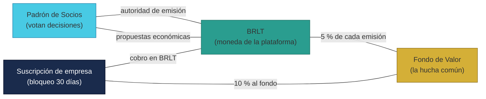
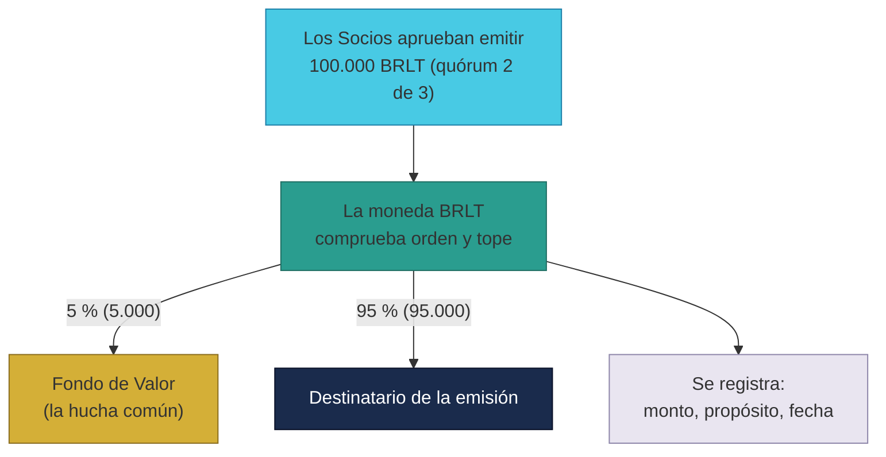
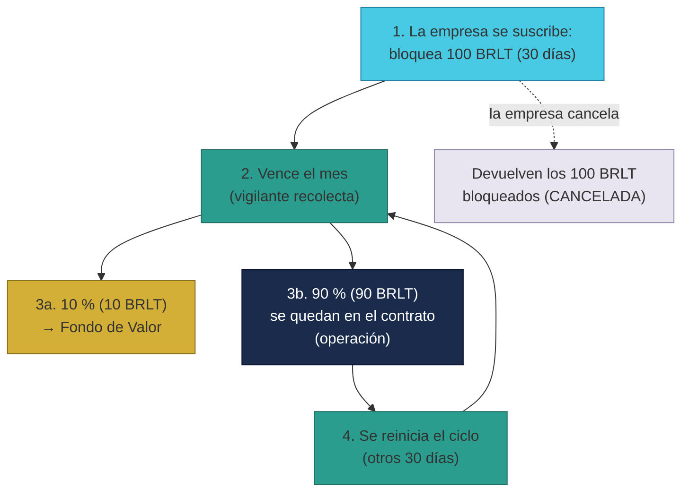

# Manual · Las finanzas de TrueKeate: BRLT, el Fondo de Valor y las empresas

> Versión en lenguaje sencillo del manual técnico de los contratos de
> finanzas y gobernanza: el padrón de **Socios**, la moneda **BRLT**, el
> **Fondo de Valor** y las **suscripciones de empresa**.
> Aquí contamos, sin tecnicismos, cómo se mueve el dinero de la plataforma.

---

## 1. Empezar en 5 minutos

TrueKeate tiene su propia **moneda digital** y un **fondo común** para pagar
los gastos de funcionamiento. Las piezas son cuatro:

1. **BRLT**: la moneda de la plataforma (se llama "BorloTokens").
2. **Fondo de Valor**: la "hucha" que paga los gastos de operación.
3. **Padrón de Socios**: la lista de miembros de confianza que votan las
   decisiones económicas.
4. **Suscripción de empresa**: cómo las empresas pagan por estar en la
   plataforma.

Las 3 ideas en 5 minutos:

- La moneda **no se puede imprimir sin control**: hay un tope máximo de
  **1.000.000 BRLT**, y emitir más exige votación de los Socios.
- Cada vez que se crea moneda o una empresa se suscribe, **un porcentaje
  va a la hucha común** (el Fondo de Valor).
- Las empresas **no pagan cada mes con transferencia**: bloquean su pago
  por adelantado (staking) y el sistema cobra solo la parte del mes.

---

## 2. Las cuatro piezas y cómo se conectan

| Pieza | Qué es | Para qué sirve |
|---|---|---|
| **BRLT** | La moneda de la plataforma | Pagar suscripciones, recibir reembolsos |
| **Fondo de Valor** | La hucha común | Pagar gastos: servidores, gas, red |
| **Padrón de Socios** | Lista + votaciones | Aprobar Socios nuevos y decisiones de dinero |
| **Suscripción de empresa** | Contrato de cobro por bloqueo | Empresas pagan su plan con BRLT bloqueados |

Las piezas se **conectan entre sí** al desplegarse, como enchufar los
aparatos de una casa:

- La moneda se conecta con el padrón (¿quién puede mandar emitir?) y con el
  fondo (¿a dónde va el 5 %?).
- El fondo se conecta con la moneda (para recibir y guardar).
- El padrón se conecta con la moneda (para ejecutar votaciones).
- Las suscripciones se conectan con la moneda y con el fondo.

> Conexión pendiente: el **Escrow** (la caja fuerte de los trueques) también
> debería conectarse con el padrón de Socios para las disputas, pero esa
> conexión no se ejecuta en el guion de despliegue actual → **pendiente de
> confirmar** (ver manual 01).

<!-- GENERAR_IMAGEN: arquitectura-financiera.svg -->

---

## 3. El padrón de Socios: quién decide y cómo vota

### 3.1 ¿Qué es un Socio?

Un **Socio** es un miembro de la comunidad con buena reputación (puntaje
alto) que puede:

- Votar la **admisión de Socios nuevos**.
- Votar **propuestas económicas** (emitir moneda, subir el tope).
- Votar en las **disputas de trueques** (ver manual 01).

La lista de Socios la administra el Owner (el administrador de la
plataforma):

- **Alta directa**: el Owner puede admitir a alguien como Socio (caso
  fundacional).
- **Baja**: el Owner puede quitar a un Socio.

### 3.2 Cómo se admite un Socio nuevo (por votación)

1. El candidato se postula solo (debe tener puntaje ≥ 76, comprobado fuera
   de la cadena).
2. Los Socios votan a favor o en contra.
3. Regla: **2 de cada 3 votos a favor** (mayoría cualificada).
4. Si se alcanza, el candidato **se admite automáticamente**.

> ⚠️ Pendiente de confirmar: el requisito del puntaje ≥ 76 se valida fuera
> de la blockchain; el mecanismo exacto que lo garantiza en el backend está
> **pendiente de confirmar**.

### 3.3 Propuestas económicas

Las decisiones de dinero se toman por votación:

1. El Owner crea la propuesta (por ejemplo: "emitir 50.000 BRLT para un
   programa").
2. Los Socios votan (cada uno, una sola vez por propuesta).
3. Al alcanzar **2 de 3 votos a favor**, la propuesta **se ejecuta sola**:
   el sistema manda la orden a la moneda (emitir) o sube el tope.

> ⚠️ Pendiente de confirmar: una propuesta sin suficientes votos se queda
> abierta para siempre (no expira) y no existe "ejecutar después" si ya se
> aprobó: la ejecución ocurre en el momento en que el último voto alcanza
> el quórum. Además, solo el Owner puede crear propuestas.

---

## 4. BRLT: la moneda de la plataforma (paso a paso)

### 4.1 Características

- Es una moneda digital estándar (ERC-20) llamada **BorloTokens**.
- Tiene un **tope de emisión inicial de 1.000.000 BRLT**.
- Para emitir más moneda hace falta una **votación de los Socios** (no
  puede decidirlo una sola persona).
- Solo el **padrón de Socios** puede dar la orden de emitir (la moneda
  rechaza órdenes de cualquiera que no sea el padrón).

### 4.2 Qué pasa cuando se emite moneda

Cuando los Socios aprueban emitir, por ejemplo, 100.000 BRLT:

1. La moneda comprueba que la orden viene del padrón. ✔
2. Comprueba el tope: ¿100.000 caben dentro del máximo? Si no, **se
   rechaza** con un aviso ("excede el tope").
3. **El 5 % va a la hucha común** (Fondo de Valor): 5.000 BRLT.
4. El resto (95.000 BRLT) va al destinatario de la emisión.
5. La emisión queda **registrada** con su propósito y su fecha (transparencia
   total).

> Ejemplo cotidiano: el ayuntamiento decide crear "vales" para un programa;
> automáticamente, el 5 % de los vales impresos se reserva para los gastos
> del propio programa.

<!-- GENERAR_IMAGEN: emision-brlt.svg -->

---

## 5. El Fondo de Valor: la hucha común

El **Fondo de Valor** guarda BRLT para pagar los **gastos de operación**:
servidores (hosting), gas de la red, etc. Se nutre de **tres fuentes**:

| Fuente | Porcentaje | ¿De dónde sale? | ¿Funciona hoy? |
|---|---|---|---|
| 1. Trueques completados | **1 %** | De cada trueque que termina bien | ⚠️ Pendiente de confirmar (sin implementar) |
| 2. Suscripciones de empresa | **10 %** | De cada ciclo mensual de las empresas | Sí, funciona |
| 3. Emisión de BRLT | **5 %** | De cada emisión aprobada | Sí, funciona |

Cómo entran los fondos (fuentes 2 y 3):

- **Por emisión**: la moneda mintea el 5 % directamente al fondo y avisa.
- **Por suscripción**: la empresa bloquea BRLT; cada mes el sistema mueve el
  10 % hacia el fondo (con tu aprobación previa automática).

Cómo salen los fondos:

- Solo el **Owner** puede retirar BRLT del fondo, y solo **para gastos de
  operación** de la plataforma. Cada retiro queda registrado.

> ⚠️ Pendiente de confirmar: la **fuente 1 (el 1 % de los trueques)** está
> declarada en el diseño, pero **ningún contrato la ejecuta todavía**: ni el
> Escrow ni el Fondo tienen la función que calcule y deposite ese 1 %. Se
> espera en ciclos posteriores. Además, el depósito voluntario siempre se
> registra como "suscripción" (fuente 2) aunque lo haga otra fuente
> autorizada.

---

## 6. Suscripción de empresas: pagar bloqueando (paso a paso)

Las empresas **no pagan cada mes con una transferencia nueva**. En su
lugar, bloquean su pago por adelantado. Se llama **staking bloqueado**:
dejas el dinero "aparcado" y el sistema solo cobra lo que corresponde.

### 6.1 Suscribirse (el primer mes)

1. La empresa elige el plan (el plan base son **100 BRLT al mes**).
2. La empresa **aprueba** que el contrato mueva BRLT (autorización única).
3. El contrato **transfiere los 100 BRLT** del primer ciclo a su casillero
   y los **retiene 30 días**.
4. La empresa queda **ACTIVA**. Ya no tendrá que firmar cada mes.

> Ejemplo cotidiano: pagas el gimnasio dejando el dinero en una taquilla; el
> gimnasio cobra de ahí cada mes sin que tengas que ir a pagar.

### 6.2 Cada mes (el ciclo de 30 días)

Cuando vencen los 30 días, un vigilante del sistema **recolecta el ciclo**:

1. Comprueba que han pasado los 30 días (si no, "ciclo no vencido").
2. Del mes (100 BRLT): **10 % va al Fondo de Valor** (10 BRLT).
3. El **90 % restante se queda en el contrato** como fondos de operación de
   la plataforma.
4. Se reinicia el contador del nuevo ciclo (otros 30 días).

Puntos importantes (comportamiento real del código):

- La empresa **no vuelve a aprobar** por cada mes: la autorización inicial
  basta.
- El bloqueo original **no se gasta ni se repone** por ciclo: el contrato
  solo mueve el 10 % mensual hacia el fondo.
- ⚠️ Pendiente de confirmar: el diseño dice que "si el saldo del contrato no
  cubre el próximo ciclo, la suscripción pasa a IRREGULAR", pero **esa
  comprobación no está implementada**: no hay transición automática a
  IRREGULAR. El único camino a IRREGULAR hoy es la llamada manual del Owner.

### 6.3 Cancelar la suscripción

La empresa puede cancelar en cualquier momento:

1. Solo si está ACTIVA.
2. El contrato **devuelve los 100 BRLT bloqueados** (el monto completo).
3. La empresa pasa a CANCELADA.

> ⚠️ Pendiente de confirmar: la devolución entrega el monto completo **sin
> descontar los días ya usados** del ciclo (sin prorrateo). Además, si los
> ciclos previos ya vaciaron el casillero (10 % × varios meses hacia el
> fondo), la devolución podría fallar por falta de saldo. La política exacta
> de devolución está **pendiente de confirmar**.

<!-- GENERAR_IMAGEN: ciclo-suscripcion.svg -->

---

## 7. Orden de despliegue (cómo se monta todo)

Al desplegar el sistema, el guion crea las piezas en este orden:

1. La caja fuerte de trueques (Escrow).
2. La fábrica de cuentas.
3. Monedas y NFT de prueba.
4. **BRLT → Fondo de Valor → Padrón de Socios → Suscripción de empresa**.
5. Conecta las piezas entre sí (las seis conexiones "enchufe").

> El Owner es la cuenta 0 del entorno de pruebas (la "cuenta principal").

---

## 8. Qué falta confirmar (resumen)

1. El **1 %** de los trueques completados hacia el fondo no tiene
   implementación en ningún contrato → **pendiente de confirmar**.
2. El depósito voluntario en el fondo se registra siempre como fuente 2
   (suscripción), aunque venga de otra fuente → observación.
3. La recolección mensual no comprueba saldo ni detecta fallos repetidos;
   los contadores de fallos están declarados pero sin uso → **pendiente de
   confirmar**.
4. La cancelación de suscripción devuelve el monto íntegro sin prorrateo y
   puede fallar si el casillero quedó vacío → **pendiente de confirmar**.
5. Las propuestas económicas sin quórum no expiran y no hay ejecución
   diferida; solo el Owner crea propuestas → **pendiente de confirmar**.
6. El puntaje ≥ 76 para ser Socio se valida fuera de la cadena →
   **pendiente de confirmar**.
7. Los tests (319 líneas en `Ciclo3.t.sol`) cubren: admisión por quórum,
   emisión con tope y 5 % al fondo, suscripción con 10 % al fondo y
   porcentajes configurables.

---

## 9. Glosario de este manual

| Palabra | Significado |
|---|---|
| **BRLT** | La moneda digital de la plataforma (BorloTokens) |
| **Stablecoin** | Moneda digital pensada para valer siempre lo mismo |
| **Fondo de Valor** | La hucha común que paga los gastos de operación |
| **Padrón de Socios** | La lista oficial de Socios de la comunidad |
| **Quórum** | Votos mínimos para decidir (2 de 3) |
| **Tope de emisión** | Límite máximo de moneda que puede existir |
| **Emisión** | Crear moneda nueva |
| **Staking bloqueado** | Dejar dinero retenido por adelantado |
| **Ciclo** | Período de cobro (30 días) |
| **Prorrateo** | Descontar solo la parte usada del tiempo |
| **Socio** | Miembro de confianza con derecho a voto |
| **ERC-20** | Estándar común de las monedas digitales |

¡Listo! Ya entiendes la economía de TrueKeate. El siguiente manual explica
cómo el sistema anota cada movimiento que ocurre en la blockchain.
