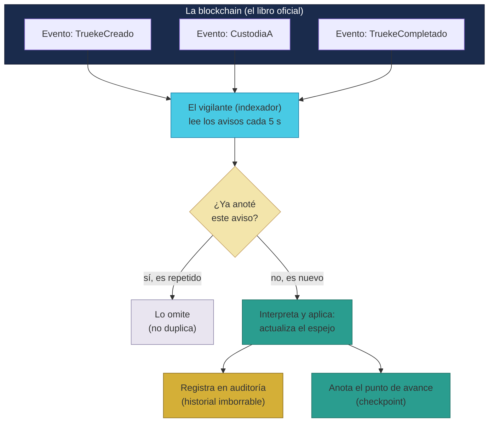

# Manual · El vigilante (indexador): cómo se anota cada movimiento

> Versión en lenguaje sencillo del manual técnico del **indexador de
> eventos** (el "vigilante" de TrueKeate).
> Aquí contamos cómo el sistema se entera de todo lo que pasa en la
> blockchain y lo apunta en su base de datos para que la app funcione
> rápido.

---

## 1. Empezar en 5 minutos

En TrueKeate, la **blockchain** es el libro oficial donde ocurre todo: los
trueques se crean, se custodian, se completan. Pero leer ese libro es lento
y caro. Por eso existe el **vigilante** (indexador):

1. **Mira la blockchain** constantemente.
2. **Detecta los avisos** (eventos) que emiten los contratos: "trueque
   creado", "objeto custodiado", "trueque completado"...
3. **Copia cada aviso** en la base de datos de la plataforma (PostgreSQL),
   donde la app puede consultarlo al instante.
4. **No escribe nunca en la blockchain**: solo lee de la cadena y escribe en
   la base de datos.

En 5 minutos: el vigilante es como un **secretario que lee el acta oficial**
y va anotando en el cuaderno de la oficina cada cosa que pasa, para que
cualquiera de la oficina pueda consultar el cuaderno al momento.

---

## 2. Qué es un evento (y por qué avisan)

Cuando un contrato inteligente hace algo importante, **emite un aviso**
(evento). Es como cuando en una obra de teatro cambian de escena y el
apuntador anuncia el cambio.

Avisos que emite la caja fuerte (Escrow), por ejemplo:

| Aviso | Qué anuncia |
|---|---|
| `TruekeCreado` | Se creó un trueque |
| `CustodiaA` / `CustodiaB` | Alguien depositó su objeto |
| `AperturaA` / `AperturaB` | Alguien confirmó que está listo |
| `TruekeCompletado` | El trueque terminó bien |
| `TruekeCancelado` | Se canceló el trueque |
| `EscrowBloqueado` | El trueque quedó bloqueado |
| `AnulacionSolicitada`, `VotoSocio`... | Movimientos de una disputa |

También avisan las cuentas inteligentes (verificación, cambio de dueño), el
padrón de Socios (nuevo Socio), la moneda BRLT (emisiones) y las
suscripciones de empresa.

---

## 3. Cómo trabaja el vigilante (paso a paso)

El vigilante es un programa (en el lenguaje JavaScript) que corre así:

1. **Se despierta**: puede hacer una pasada única o quedarse en modo
   servicio revisando cada 5 segundos (por defecto).
2. **Pregunta a la blockchain**: "¿hay avisos nuevos de estos contratos?".
3. **Por cada aviso**:
   - Comprueba si **ya lo anotó antes** (para no duplicar; ver sección 4).
   - Lo **interpreta** (¿qué contrato, qué acción, quién participó?).
   - Lo **aplica**: actualiza la copia espejo en la base de datos (por
     ejemplo, cambia el estado del trueque a COMPLETADO).
   - Lo **registra** en la tabla de auditoría (el historial imborrable).
4. **Anota hasta dónde llegó** (checkpoint) para saber por dónde iba.
5. **Mide su retraso**: ¿cuántos avisos lleva pendientes?

> Si un aviso falla al aplicarse, **no rompe la ronda**: lo marca como
> fallido, avisa y sigue con el siguiente.

<!-- GENERAR_IMAGEN: indexador-flujo.svg -->


---

## 4. La regla de oro: nunca duplicar (idempotencia)

La blockchain puede "repetir" información, y el vigilante puede releer
avisos ya vistos. Para no anotar dos veces lo mismo, usa **dos frenos**:

1. **Antes de anotar**, pregunta: "¿este aviso (transacción + posición +
   contrato) ya está en la auditoría?". Si sí, lo salta.
2. **La base de datos lo prohíbe por diseño**: hay una regla (constraint) que
   impide guardar dos veces la misma combinación.

Resultado: aunque el vigilante lea 100 veces el mismo aviso, en la base de
datos solo queda **una anotación**.

---

## 5. Dónde anota cada cosa (el espejo)

El vigilante actualiza una **copia espejo** de lo que pasa en la cadena.
Resumen de qué anota en cada sitio:

| Aviso | Dónde lo anota | Qué actualiza |
|---|---|---|
| Trueke creado / custodiado / apertura / completado / cancelado / bloqueado | Tabla `truekes` | El estado del trueque (CREADO → CUSTODIADO → ... → COMPLETADO) |
| Apertura A / B | Tabla `truekes` | La hora en que cada parte confirmó |
| Huella de verificación actualizada | Tabla `kyc` | La nueva huella de tu verificación |
| Cambio de dueño / recuperación ejecutada | Tabla `usuarios` | Tu nueva billetera (wallet) |
| Nuevo Socio admitido | Tabla `usuarios` | Tu tipo pasa a SOCIO |
| Emisión de BRLT | Tabla `finanzas` | Suma el monto emitido |
| Empresa suscrita | Tabla `suscripciones` | Crea la suscripción con su ciclo de 30 días |

Los estados del trueque en la base de datos son los **mismos 9 estados**
que ya conoces del manual 01 (CREADO, ACTIVO, CUSTODIADO, APERTURA,
EN_DISPUTA, RESOLUCION_SOCIOS, COMPLETADO, ANULADO, BLOQUEADO).

---

## 6. El checkpoint: saber por dónde iba

El vigilante guarda un **marcador** por contrato: "ya leí hasta el bloque
número X". Ese marcador se llama **checkpoint**.

Sirve para dos cosas:

1. **Saber su retraso** (lag): la diferencia entre el último bloque de la
   cadena y el checkpoint.
2. **Poder releer desde un punto** si algo se pierde (reproceso).

> ⚠️ Pendiente de confirmar: en el código actual, en modo servicio el
> vigilante **vuelve a preguntar desde el bloque 0 en cada ronda** (no usa
> el checkpoint para continuar desde donde quedó). La duplicación está
> evitada por la regla de oro de la sección 4, pero la lectura completa en
> cada ronda gasta más recursos. El avance incremental desde el checkpoint
> está **pendiente de confirmar** en ciclos posteriores.

---

## 7. El retraso y la reconciliación

### 7.1 Medir el retraso (lag)

El vigilante calcula y reporta: "la cadena va en el bloque 1.000 y yo voy
por el 950; llevo 50 bloques de retraso". El panel del Owner muestra estas
métricas para detectar si el vigilante va atrasado.

### 7.2 Reconciliar (comprobar que el espejo es fiel)

De vez en cuando, el vigilante **cuenta su espejo**: cuántos trueques tiene
anotados y cuándo se actualizaron por última vez. La comparación fina
(estado real en la cadena vs. estado en el espejo, trueque por trueque) está
prevista pero **no implementada** → **pendiente de confirmar**.

---

## 8. Qué vigila el vigilante (contratos cubiertos)

El vigilante escucha **5 contratos**:

1. **Escrow** (la caja fuerte de trueques).
2. **SmartAccount** (las cuentas inteligentes).
3. **SociosRegistry** (el padrón de Socios).
4. **BRLT** (la moneda).
5. **SuscripcionEmpresa** (las suscripciones).

Los contratos están registrados en un archivo de configuración
(`contratos.json`) con su dirección y su "manual de instrucciones" (ABI),
para que el vigilante sepa interpretar cada aviso.

> ⚠️ Pendiente de confirmar: muchos avisos existen en la cadena pero **aún
> no están mapeados** en el vigilante: los de disputas y votaciones
> (`VotoSocio`, `ResolucionEjecutada`, `SancionProgramada`...), las firmas
> de recepción, las valoraciones y los movimientos de la moneda (Transfer).
> Su efecto sobre las tablas de disputas, valoraciones o imágenes
> certificadas **no está implementado** todavía.

---

## 9. La base de datos por dentro (sin miedo)

El vigilante guarda en una base de datos llamada **PostgreSQL**:

- **14 tablas** (hojas de cálculo organizadas): usuarios, verificación,
  artículos, trueques, valoraciones, puntos de encuentro, disputas, imágenes
  certificadas, suscripciones, campañas, subastas, finanzas, auditoría y
  checkpoints.
- De esas, **el vigilante escribe 7** (trueques, usuarios, verificación,
  finanzas, suscripciones, auditoría y checkpoint).
- Las otras 7 las escribe el **backend** (la API) con datos de la app
  (artículos, valoraciones, disputas, subastas...; ver manual 06).
- La tabla **auditoría** es el historial **que solo crece**: nunca se borra
  ni se modifica lo anotado (append-only). Ahí queda la huella de cada
  evento: quién, qué, cuándo, en qué transacción.

---

## 10. Cómo se enciende el vigilante

Dos modos:

1. **Una pasada rápida**: revisa todo una vez y termina.
   ```
   node backend/indexador-cli.js
   ```
2. **Modo servicio (vigilante de guardia)**: revisa cada 5 segundos sin
   parar.
   ```
   node backend/indexador-cli.js --watch
   ```

Configuración por variables de entorno (con valores por defecto):

| Variable | Por defecto | Qué hace |
|---|---|---|
| `RPC_URL` | `http://127.0.0.1:8545` | Dónde está la blockchain (en pruebas: anvil) |
| `DATABASE_URL` | PostgreSQL local | Dónde está la base de datos |
| `INTERVALO_MS` | 5000 | Cada cuánto revisa en modo servicio |
| `DESDE_BLOQUE` | 0 | Desde qué bloque empieza a leer |

---

## 11. Qué falta confirmar (resumen)

1. No hay suscripción en tiempo real: el vigilante solo se activa por
   intervalo o por pasada manual → **pendiente de confirmar**.
2. No se manejan las "reorganizaciones" de la cadena (cuando la blockchain
   corrige un tramo): el retroceso a un punto seguro está en el diseño pero
   sin implementar → **pendiente de confirmar**.
3. La reconciliación fina (comparar cada trueque con la cadena) no está
   implementada → **pendiente de confirmar**.
4. El avance incremental desde el checkpoint no está implementado (siempre
   relee desde el bloque configurado) → **pendiente de confirmar**.
5. La cobertura de eventos es parcial (disputas, valoraciones, sanciones no
   se reflejan aún en sus tablas) → **pendiente de confirmar**.
6. En los tests no se conecta PostgreSQL real (se simula): la ejecución
   real contra la base de datos **no se verificó en este entorno** →
   **pendiente de confirmar**.
7. Los 5 tests del vigilante están verificados (5/5 verdes) con
   simulaciones en memoria (ver manual 08).

---

## 12. Glosario de este manual

| Palabra | Significado |
|---|---|
| **Indexador** | El vigilante que copia eventos de la cadena a la base de datos |
| **Evento** | Aviso que emite un contrato cuando algo importante ocurre |
| **Blockchain** | El libro oficial e imborrable donde ocurre todo |
| **Base de datos (PostgreSQL)** | El cuaderno donde la app consulta rápido |
| **Espejo** | Copia de los estados de la cadena para consulta rápida |
| **Auditoría** | Historial que solo crece, con cada evento anotado |
| **Idempotencia** | Regla que evita anotar dos veces el mismo evento |
| **Checkpoint** | Marcador de "hasta aquí leí" |
| **Lag (retraso)** | Cuántos bloques lleva el vigilante de retraso |
| **Reconciliación** | Comprobar que el espejo coincide con la cadena |
| **ABI** | El "manual de instrucciones" de un contrato |
| **Bloque** | Página del libro de la blockchain |

¡Listo! Ya sabes cómo se anota cada movimiento. El siguiente manual
explica quién paga la "gasolina" de tus operaciones y qué pasa si el
mensajero falla.
