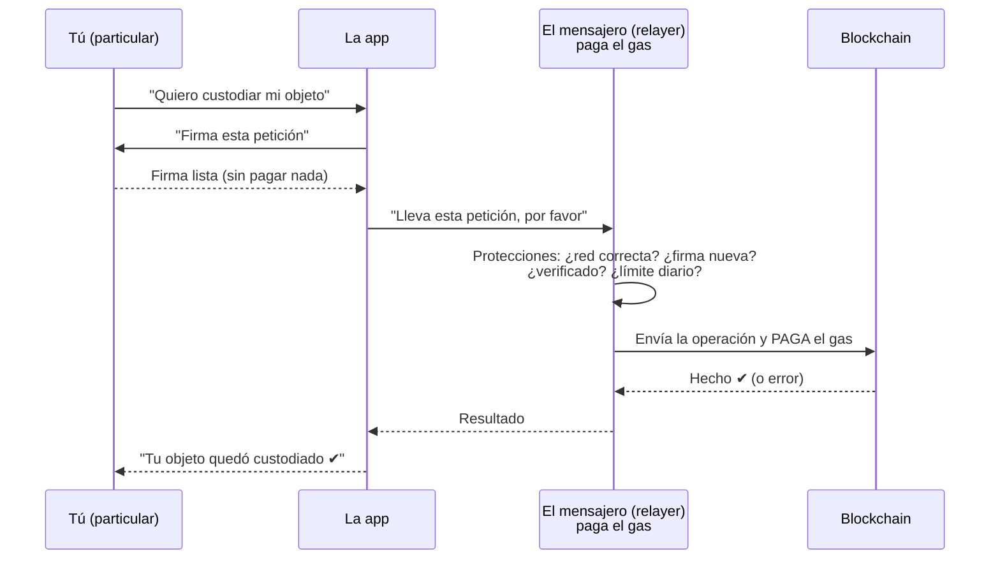
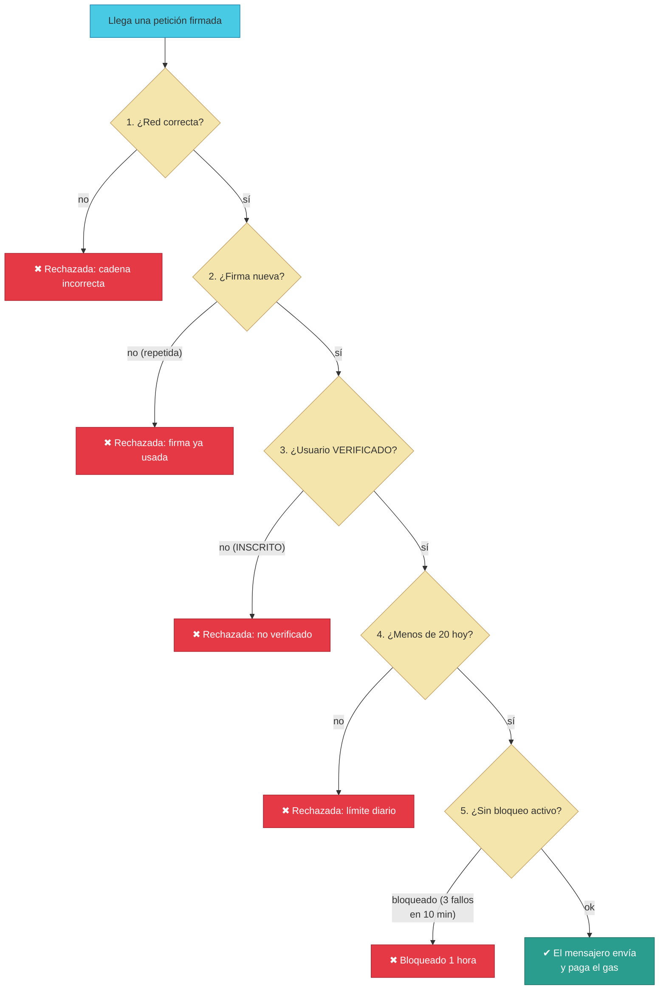

# Manual · El mensajero (relayer): quién paga el gas y qué hacer si falla

> Versión en lenguaje sencillo del manual técnico del **relayer EIP-712**
> (el "mensajero" de TrueKeate).
> Aquí contamos quién paga la "gasolina" de tus operaciones, cómo se
> protege el sistema de abusos y qué pasa si el mensajero falla.

---

## 1. Empezar en 5 minutos

Hacer una operación en la blockchain cuesta **gas** (una pequeña comisión en
cripto). En TrueKeate, si eres **particular**, **no pagas ese gas**: lo paga
la plataforma por ti. El encargado es el **mensajero** (relayer).

Cómo funciona en 5 minutos:

1. Tú quieres hacer algo: custodiar un objeto, firmar una recepción...
2. La app te pide **firmar** la petición (con MetaMask u otra billetera).
3. Tú firmas **sin pagar nada**.
4. El mensajero recoge tu firma, la lleva a la blockchain y **paga el gas**.
5. Tu cuenta inteligente comprueba tu firma y ejecuta la acción.

El mensajero cuida el dinero de la plataforma con **5 protecciones**:

1. Comprueba que la petición viene de la **red correcta**.
2. Comprueba que **no sea una firma repetida** (número de un solo uso).
3. Solo ayuda a usuarios **verificados** (lista de permitidos).
4. Límite de **20 ayudas por persona y día**.
5. Si alguien provoca **3 fallos en 10 minutos**, queda **bloqueado 1 hora**.

---

## 2. Quién paga el gas (y quién no)

| Tipo de usuario | ¿Quién paga el gas? | Por qué |
|---|---|---|
| **Particular** (tú) | La plataforma (el mensajero) | Para que truequear sea gratis y fácil (sin gas) |
| **Empresa** | La propia empresa | Las empresas ya operan con sus propias cuentas |

> Las empresas envían sus transacciones **directamente** a la blockchain,
> pagando su propio gas. El mensajero solo se ocupa de los particulares.

El mensajero paga desde una **billetera propia** (la "cuenta 1" del entorno
de pruebas). Esa billetera necesita tener saldo: si baja de **0,5 ETH**, el
sistema **avisa al Owner** para que la recargue y los trueques no se queden
sin gasolina.

<!-- GENERAR_IMAGEN: relayer-meta-tx.svg -->

---

## 3. Las 5 protecciones del mensajero (paso a paso)

### Protección 1: ¿Vienes de la red correcta?

Cada petición firmada menciona **a qué red** pertenece (por ejemplo, la red
de pruebas 31337). Si alguien intenta usar una firma de otra red, se
rechaza: "cadena incorrecta".

> Ejemplo: un cheque emitido en un banco de otro país no se puede cobrar en
> este banco.

### Protección 2: ¿Es una firma nueva? (número de un solo uso)

Cada petición lleva un **número de orden** (nonce). El mensajero recuerda
los números ya usados:

- Si llega una petición con un número **antiguo o repetido**, se rechaza
  (anti-replay): "esta firma ya se usó".
- Así, una firma robada **no sirve para repetir** la operación.

> ⚠️ Pendiente de confirmar: la comprobación del número se hace en un
> registro local del mensajero (en memoria). La validación estricta contra
> el número consumido en tu cuenta inteligente de la blockchain está
> prevista en el diseño pero **no implementada** → **pendiente de confirmar**.

### Protección 3: ¿Estás en la lista de permitidos? (verificado)

El mensajero comprueba **en la blockchain** si tu cuenta está verificada:

1. Busca tu cuenta inteligente en la fábrica de cuentas.
2. Lee tu estado de verificación (INSCRITO, VERIFICADO o CERTIFICADO).
3. Si estás solo **INSCRITO** (recién registrado), te rechaza: "signer no
   verificado". Debes subir al menos a **VERIFICADO** para operar.

> Ejemplo: el mensajero es como un repartidor que solo entrega paquetes a
> personas con identificación comprobada.

### Protección 4: Límite diario de 20 operaciones

El mensajero cuenta cuántas veces ayuda a cada persona **al día**:

- Máximo **20 meta-operaciones por persona y día**.
- Al llegar a 20, te avisa: "límite diario superado, vuelve mañana".

Es una medida anti-abuso: evita que alguien use el mensajero (que paga el
gas) para miles de operaciones sin coste.

### Protección 5: Bloqueo tras fallos repetidos

Si una operación **falla en la blockchain** (por ejemplo, tu firma no era
válida), se anota el fallo:

- **3 fallos en 10 minutos** → el mensajero te **bloquea 1 hora**.
- Pasada la hora, puedes volver a intentarlo.

> Los rechazos de las protecciones 1-4 (red, firma repetida, no verificado,
> límite) **no cuentan** como fallos de este mecanismo: solo cuentan los
> fallos reales en la cadena.

<!-- GENERAR_IMAGEN: protecciones-relayer.svg -->

---

## 4. Qué pasa cuando el mensajero envía la operación

Dos resultados posibles:

### 4.1 Éxito

- La transacción entra en la blockchain y se confirma.
- El mensajero anota el número usado, suma uno a tu contador diario y
  guarda el coste del gas.
- La app te muestra: "¡Hecho!" (por ejemplo, tu objeto quedó custodiado).

### 4.2 Fallo en la cadena

- La transacción se rechaza (por ejemplo, tu cuenta dijo "firma inválida").
- El mensajero registra el fallo (al tercero en 10 minutos, bloqueo de 1 h).
- La app te muestra un aviso claro: "meta-transacción rechazada".

> ⚠️ Pendiente de confirmar: la app de trueques tiene preparado el cableado
> para usar al mensajero (una función llamada `_enviar`), pero en el ciclo
> actual **ninguna ruta la invoca todavía**: los trueques se guardan en un
> almacén de pruebas y no se envían aún a la blockchain. La conexión
> completa mensajero ↔ trueques está **pendiente de confirmar** en la
> integración final.

---

## 5. El termómetro del mensajero (salud y métricas)

El mensajero se puede vigilar como a un coche con luces en el tablero:

| Chequeo | Qué mira | Alarma |
|---|---|---|
| **Salud** | ¿Tiene saldo su billetera? ¿Está en la red correcta? | Si tiene menos de 0,5 ETH: "saldo bajo" |
| **Métricas** | ¿Cuántas operaciones envió? ¿Cuántas rechazó y por qué? | Panel del Owner |

El panel del administrador muestra: operaciones enviadas, rechazadas (por
firma repetida, no verificado, límite, bloqueo o fallo) y cuántas personas
distintas usan el mensajero.

> ⚠️ Pendiente de confirmar: el diseño prevé **mínimo 2 mensajeros** con
> cola de reintentos y conmutación automática (SLA de disponibilidad ≥ 99 %).
> El código actual solo ofrece el chequeo de salud y las métricas: **no hay
> cola de reintentos ni segunda copia** en este archivo → **pendiente de
> confirmar** (depende de la orquestación del despliegue).

---

## 6. Si el mensajero falla: el plan B (modo degradado)

¿Y si el mensajero se cae mucho rato? El diseño define un **plan B**:

1. Si el mensajero está caído **más de 1 hora**, se activa el **modo
   degradado**.
2. En modo degradado, **tú pagas el gas directamente** con tu billetera
   (como las empresas).
3. Si la caída fue **culpa del operador** de la plataforma, la plataforma te
   **reembolsa en BRLT** lo que pagaste.

> ⚠️ Pendiente de confirmar: este plan B está **documentado** (en la cabecera
> del código y en el diseño), pero **no está implementado**: no existe el
> interruptor de "modo degradado" ni la lógica de reembolso en BRLT. Es una
> política operativa pendiente de activar.

---

## 7. Los datos que recuerda el mensajero

El mensajero recuerda, por cada usuario:

- El **último número de firma** usado.
- El **contador diario** de operaciones.
- Los **fallos recientes** (con hora).
- El **bloqueo** activo (hasta cuándo).

> ⚠️ Pendiente de confirmar: hoy esos datos viven **en la memoria del
> programa**: si el mensajero se reinicia, **se pierden**. El diseño prevé
> guardarlos en la base de datos (PostgreSQL), pero esa persistencia **no
> está implementada** → **pendiente de confirmar**.

---

## 8. Qué falta confirmar (resumen)

1. La validación estricta del número de firma contra tu cuenta en la
   blockchain no está implementada (se usa un registro local) → **pendiente
   de confirmar**.
2. El cableado real de la app de trueques con el mensajero no está activo
   (`_enviar` definido pero sin invocar) → **pendiente de confirmar**.
3. Sin cola de reintentos ni segunda copia del mensajero (SLA ≥ 99 % en
   diseño) → **pendiente de confirmar**.
4. El plan B (modo degradado + reembolso en BRLT) está documentado pero no
   implementado → **pendiente de confirmar**.
5. El estado del mensajero se pierde al reiniciar (persistencia en
   PostgreSQL pendiente) → **pendiente de confirmar**.
6. Los 7 tests del mensajero están verificados (7/7 verdes) con
   simulaciones (ver manual 08).

---

## 9. Glosario de este manual

| Palabra | Significado |
|---|---|
| **Relayer** | El mensajero que envía tus operaciones y paga el gas |
| **Meta-transacción** | Operación firmada por ti pero enviada por otro (el mensajero) |
| **Gas** | La "gasolina" que cuesta operar en la blockchain |
| **Firma EIP-712** | Tu rúbrica digital con formato estándar y legible |
| **Nonce** | Número de un solo uso que evita firmas repetidas |
| **Allowlist** | Lista de cuentas permitidas (usuarios verificados) |
| **Anti-replay** | Protección contra repetir una firma ya usada |
| **Límite diario** | Máximo de operaciones gratis por persona y día (20) |
| **Bloqueo temporal** | Castigo leve por fallos repetidos (1 hora) |
| **Health / salud** | Chequeo de que el mensajero está sano (saldo, red) |
| **Modo degradado** | Plan B cuando el mensajero no puede operar |
| **SLA** | Porcentaje de tiempo que un servicio debe estar disponible |

¡Listo! Ya sabes quién paga el gas y qué pasa si el mensajero falla. El
siguiente manual explica los servicios (la API) que la app usa por dentro.
