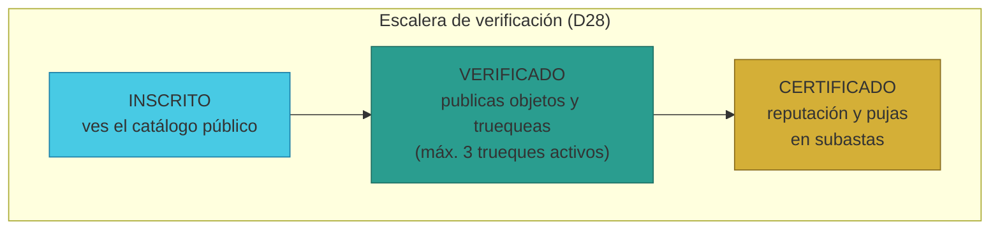

# Manual · Los servicios de TrueKeate (la API): qué puede hacer la plataforma

> Versión en lenguaje sencillo del manual técnico de la **API REST** (la
> "cocina" de TrueKeate).
> Aquí contamos los servicios que la plataforma ofrece por dentro: quién
> puede hacer qué, en qué orden y con qué reglas. Es el manual de referencia
> para entender las capacidades del sistema.

---

## 1. Empezar en 5 minutos

La app que ves en el móvil no guarda los datos: los pide a un **servicio
central** llamado API. La API es como la **cocina de un restaurante**: el
camarero (la app) te toma el pedido, lo pasa a la cocina, y la cocina
prepara el plato con sus reglas (no se sirve alcohol a menores, el chef
revisa cada plato...).

Los servicios se agrupan por **familias**. Hoy son **13**:

| Familia | Prefijo | Qué hace |
|---|---|---|
| **Acceso** | `/auth` | Registrarte, iniciar sesión |
| **Verificación y certificación** | `/kyc` | Verificar tu correo y certificar tu identidad |
| **Catálogo** | `/catalog` | Publicar objetos y ver ofertas |
| **Trueques** | `/truekes` | Crear y seguir trueques |
| **Panel del Owner** | `/admin` | Ver usuarios, contratos y salud (solo el Owner) |
| **Reputación** | `/reputacion` | Calcular tu puntaje y nivel |
| **Subastas** | `/subastas` | Subastas de empresas |
| **VALOR** | `/valor` | Tu sección de criptos, reputación y BRLT (ex "Finanzas") |
| **Disputas** | `/disputas` | Resolver un trueque que salió mal (v2) |
| **Notificaciones** | `/notificaciones` | Los avisos de tu campana 🔔 |
| **Gobernanza** | `/gobernanza` | Propuestas y votación de socios |
| **Puntos de encuentro** | `/puntos-encuentro` | Proponer puntos para encontrarte |
| **Finanzas** *(legado)* | `/finanzas` | La antigua familia de saldos: quedó fuera de la app (la suite usa `/valor`) |

En 5 minutos: la API tiene **3 puertas de entrada** para proteger el
servicio:

1. **Límite de peticiones**: máximo 120 peticiones por minuto (anti-ataque).
2. **Sesión**: para lo privado necesitas iniciar sesión con tu firma.
3. **Estado de verificación**: algunas cosas exigen estar VERIFICADO o
   CERTIFICADO.

> Novedades de 2026-09: la familia **Disputas** fue rediseñada (flujo del
> director: ✗ No Conforme → justificativo → votación de Socios → veredicto),
> nació la sección **VALOR** (criptos contra la plataforma, reputación y BRLT
> con Stripe) y se sumó la **campana de notificaciones** 🔔. Resúmenes en las
> secciones 10 a 12.

---

## 2. La puerta de entrada (reglas generales)

### 2.1 Límite de peticiones (rate limit)

Cualquiera que pida demasiado rápido recibe un aviso: "demasiadas
peticiones". Es la protección contra programas que intentan saturar el
servicio: máximo **120 peticiones por minuto**.

### 2.2 Iniciar sesión con tu firma

Para lo privado, la app pide que firmes el mensaje **"TrueKeate: iniciar
sesión"** con tu billetera. La cocina:

1. Recupera quién firmó (con tu firma, calcula tu dirección).
2. Te crea un **pase temporal** (token) que no es tu clave: es solo un
   "ticket" de entrada válido mientras dure la sesión.
3. Cada petición privada debe mostrar su ticket en la cabecera.

> El ticket **no es un JWT** (aunque los comentarios del código lo llamen
> así): es un código opaco aleatorio. Detalle técnico documentado para no
> confundir.

### 2.3 El estado de verificación manda

Muchos servicios preguntan: "¿en qué peldaño de la escalera estás?"
(INSCRITO, VERIFICADO o CERTIFICADO). Si el servicio exige VERIFICADO y tú
estás INSCRITO, la respuesta es clara: "estado requerido".

---

## 3. Acceso: registrarte e iniciar sesión (/auth)

| Acción | Qué hace | Reglas |
|---|---|---|
| **Conectar billetera** | La app anuncia tu billetera y te **inscribe automáticamente** | La dirección debe tener formato válido (0x...) |
| **Registrarte** | Formalizas tu inscripción con correo y teléfono | **Consentimiento GDPR obligatorio** (protección de datos): sin consentimiento no hay registro |
| **Iniciar sesión** | Firmas el mensaje de sesión y recibes tu ticket | La firma debe ser tuya |

> La **GDPR** es la ley europea de protección de datos personales. TrueKeate
> exige tu consentimiento expreso para tratar tus datos.

> ⚠️ Pendiente de confirmar: el diseño prevé verificar por separado el
> correo y el teléfono (`/auth/verify-email`, `/auth/verify-phone`), y esas
> rutas **siguen sin existir**. La verificación real de tu correo se hace
> dentro de la familia de verificación (KYC), con un código que caduca
> (ver sección 4).

---

## 4. Verificación y certificación: demostrar quién eres (/kyc)

Tu identidad se comprueba en **2 etapas** (la escalera que ya conoces del
manual 02): **INSCRITO → VERIFICADO → CERTIFICADO**. En 2026-09 esta
familia fue **reescrita por completo**: ya no es un simulacro, los códigos
se validan de verdad y la revisión está protegida.

**Etapa 1: llegar a VERIFICADO (verificar tu correo)**
1. Pides empezar la verificación.
2. La cocina genera un **código de 6 dígitos** y lo envía a tu correo.
   El código **caduca en 10 minutos**.
3. Escribes el código.
4. Si es correcto, subes a **VERIFICADO**. Si caducó o falla, te avisa.

> ⚠️ El envío real por correo necesita que la plataforma tenga configurado
> su servidor de email (SMTP). En el **modo demostración** (sin esa
> configuración) el código aparece directamente en la respuesta de la app,
> para poder probar el flujo.

**Etapa 2: llegar a CERTIFICADO — dos caminos**

*Camino A — ya tienes una credencial (SBT).* Si tu billetera ya tiene un
**SBT** (la "insignia digital" de certificación, emitida por TrueKeate o
por otra entidad reconocida), la cocina comprueba tu billetera en la cadena
y puedes pulsar **"Certificarme automáticamente con mi SBT"**: subes a
CERTIFICADO al momento. Si tu insignia venía de otra entidad, la plataforma
te crea su propio SBT nativo como respaldo.

*Camino B — sin SBT: subes tus documentos.*
1. Envías una foto de tu **documento (DNI/cédula)** y una **selfie**
   (formatos de imagen habituales; cada imagen hasta ~4 MB).
2. Las imágenes se guardan de verdad: **solo tú y el Owner** pueden verlas.
3. Tu solicitud queda **PENDIENTE** hasta que el **Owner** la revise.
4. Si aprueba → subes a **CERTIFICADO**. Si rechaza → te avisa.

**La revisión ahora está protegida**: solo el **Owner real** puede aprobar
o rechazar (la cocina lo comprueba en la cadena, contra el registro de
socios). Antes cualquier usuario con sesión podía hacerlo: quedó corregido
en la reescritura.

> En cualquier momento puedes preguntar tu estado con "¿en qué peldaño
> estoy?" y la cocina responde (tu estado y tu ficha de verificación).
>
> El detalle completo del flujo (rutas, imágenes y revisión del Owner) está
> en el manual **03·09-certificacion-sbt.md**.

<!-- GENERAR_IMAGEN: escalera-accesos.svg -->


---

## 5. Catálogo: publicar y buscar (/catalog)

El catálogo es el "escaparate" de la comunidad (AtoA = entre personas).

| Acción | Quién puede | Reglas |
|---|---|---|
| **Publicar un objeto** | VERIFICADO o CERTIFICADO | No superar el **límite de tu nivel** |
| **Ver el catálogo** | Todos (público) | Solo se ven objetos disponibles |
| **Pedir un encargo** | Cualquiera con sesión | Pides un objeto que no está en el mercado |
| **Ver encargos** | Todos | Lista de peticiones activas |

### 5.1 El límite de artículos por nivel

No todos pueden publicar lo mismo. El límite depende de tu **nivel** (no de
tu tipo de cuenta):

| Nivel | Máximo de objetos publicados |
|---|---|
| INICIADO | 5 |
| COMÚN | 50 |
| FRECUENTE | 100 |
| SOCIO | 100 |

> Ejemplo: un INICIADO puede tener hasta 5 objetos a la vez en el
> escaparate. Si ya tiene 5, el sistema responde: "límite de artículos
> alcanzado".

---

## 6. Trueques: crear y seguir (/truekes)

Esta familia coordina la caja fuerte (ver manual 01) con la app.

| Acción | Quién puede | Reglas |
|---|---|---|
| **Crear trueque** | VERIFICADO o CERTIFICADO | Máximo **3 trueques activos** para VERIFICADO |
| **Ver detalle** | Cualquiera | Información de confianza del trueque |
| **Custodiar** | Solo la parte dueña del objeto | Cada lado custodia el suyo |
| **Firmar recepción** | Solo la parte correspondiente | Tu declaración de "recibí bien" |
| **Valorar** | Ambas partes | 5 renglones con nota 1-5: aceptación, honestidad, seguridad, confiabilidad, compromiso |

### 6.1 La regla de los 3 trueques

Un usuario **VERIFICADO** no puede tener más de **3 trueques en marcha** a la
vez (estados CREADO, CUSTODIADO, APERTURA...). Es una regla anti-acaparación:
limita el riesgo de comprometerse de más.

### 6.2 La valoración en 5 dimensiones

Cuando valoras un trueque, puntúas **5 cosas** (de 1 a 5):

1. **Aceptación**: ¿el otro cumplió lo pactado?
2. **Honestidad**: ¿describió bien su objeto?
3. **Seguridad**: ¿el intercambio fue seguro?
4. **Confiabilidad**: ¿fue puntual y serio?
5. **Compromiso**: ¿terminó lo que empezó?

> ⚠️ Pendiente de confirmar: la cocina de trueques tiene preparado el envío
> a la blockchain (por mensajero para particulares, o directo para
> empresas), pero **ninguna ruta lo ejecuta todavía**: los trueques se
> guardan en un almacén de pruebas y custodiar/firmar no comprueban aún el
> estado real en la cadena. Abrir o anular un trueque desde la app también
> sigue pendiente.

### 6.3 El cierre del trueque y el ✗ No Conforme (2026-09)

El trueque termina cuando **ambas partes cierran** (punto 9 del director):

- **✓ Conforme**: firmas que recibiste bien. Cuando ambas están conformes, el
  trueque se **completa** y los objetos se reasignan **en cruz** (el de A va
  a B y el de B va a A).
- **✗ No Conforme**: no estás de acuerdo con lo recibido. La app te pide un
  **motivo** (obligatorio) y **fotos** de evidencia. Ese gesto **dispara la
  disputa** (la familia `/disputas`, sección 10).

La **valoración** (5 renglones del 1 al 5) ahora **se guarda de verdad** en
la base de datos (tabla `valoraciones`, desde 2026-09-09): ya no queda solo
en el espejo, y alimenta la reputación y la lista de "trueques sin valorar"
de VALOR (sección 11).

---

## 7. Panel del Owner: administración (/admin)

El administrador (Owner) tiene su propio tablero. Desde 2026-09-09 el acceso
quedó **endurecido**: ya no entra "cualquier Socio".

| Servicio | Qué muestra | Quién puede |
|---|---|---|
| **Usuarios** | Lista de inscritos | Solo el **Owner real** |
| **Contratos** | Direcciones de los contratos desplegados | Solo el **Owner real** |
| **KPIs de disputas** | Total de trueques y disputas abiertas | Solo el **Owner real** |
| **Base de datos** | Cuántos usuarios, objetos y trueques hay | Solo el **Owner real** |
| **Salud de infraestructura** | Salud y métricas del mensajero y del vigilante | Solo el **Owner real** |
| **¿Quién es el Owner?** | Devuelve la billetera del Owner resuelta (público, sin datos privados) | Todos (sin sesión) |

> ¿Quién es el "Owner real"? No es un "tipo de usuario" en la base: es el
> **dueño on-chain del registro de Socios** (el contrato `SociosRegistry`
> responde quién es su `owner()`). La app lo comprueba en la cadena. Por
> eso, aunque Ana o Bruno figuren como SOCIO, **no ven el panel**: solo la
> billetera dueña del registro (en producción, la cuenta 0 del anvil).
>
> El detalle completo del panel está en el manual **08-Suite-Sistemas /
> 01-panel-sistemas.md**.

---

## 8. Reputación: tu puntaje y tu nivel (/reputacion)

Cada trueque completado alimenta tu **reputación**. La fórmula (de diseño)
mezcla tres ingredientes:

```
Puntaje = 50 % reputación + 30 % volumen efectivo + 20 % (1 − ratio de apelaciones)
```

Se normaliza a una nota de **0 a 100**, y de ahí salen tu nivel y tu
medalla:

| Puntaje | Nivel | Medalla |
|---|---|---|
| 0 – 25 | INICIADO | BRONCE |
| 26 – 50 | COMÚN | PLATA |
| 51 – 75 | FRECUENTE | ORO |
| 76 – 100 | SOCIO | ORO |

Dos reglas especiales:

- **Oro histórico** (requisito de empresa): tener **≥ 1.000 trueques
  efectivos** y un **ratio de éxito ≥ 90 %**.
- **Penalización por inactividad**: 180 días sin actividad + dominar más del
  5 % del mercado → tu puntaje baja (regla anti-monopolio).

> ⚠️ Pendiente de confirmar: en el estado actual, el cálculo usa un
> "volumen máximo del sistema" fijo en 1 (la normalización real queda
> pendiente), el recálculo mensual automático solo responde un aviso (sin
> lote programado) y la penalización por inactividad está definida pero no
> se invoca en ninguna ruta.

---

## 9. Subastas de empresa (/subastas)

Las empresas pueden subastar objetos (RF-17). Reglas claras:

| Acción | Quién puede | Reglas |
|---|---|---|
| **Crear subasta** | Solo empresas | Puja inicial obligatoria; duración por defecto 24 h |
| **Ver subastas** | Todos (público) | Solo subastas abiertas |
| **Pujar** | Solo usuarios CERTIFICADOS | Puja mínima + incremento mínimo |
| **Cerrar** | Sistema/manual | Cuando vence el tiempo |

### 9.1 El desempate (regla D27)

Al cerrar la subasta:

1. Gana la **puja más alta**.
2. Si hay **empate**, gana el de **mayor nivel** (SOCIO > FRECUENTE > COMÚN
   > INICIADO).
3. Si no hubo pujas, la subasta se declara **ANULADA** (sin ganador).

> ⚠️ Pendiente de confirmar: el estado de las subastas vive en la memoria
> del programa (se pierde al reiniciar), el cierre es manual (no hay reloj
> automático de vencimiento) y faltan servicios de detalle y de listado de
> pujas. Persistencia y automatización están **pendientes de confirmar**.

```mermaid
flowchart TB
    APP["La app (móvil / web)"] -->|"peticiones con ticket de sesión"| API["La API (la cocina)<br/>máx. 120 peticiones/min"]
    API --> AUTH["/auth<br/>registro y sesión"]
    API --> KYC["/kyc<br/>verificación y certificación<br/>(ver manual 03·09)"]
    API --> CAT["/catalog<br/>escaparate y encargos"]
    API --> TRU["/truekes<br/>trueques y valoraciones"]
    API --> REP["/reputacion<br/>puntaje, nivel, medalla"]
    API --> SUB["/subastas<br/>subastas de empresa"]
    API --> VAL["/valor<br/>criptos, reputación y BRLT<br/>(ex Finanzas)"]
    API --> DIS["/disputas<br/>disputas v2<br/>(✗ No Conforme → veredicto)"]
    API --> NOT["/notificaciones<br/>la campana 🔔"]
    API --> GOB["/gobernanza<br/>propuestas y votos"]
    API --> PUN["/puntos-encuentro<br/>puntos de encuentro"]
    API --> ADM["/admin<br/>panel del Owner<br/>(solo el Owner real)"]
    API -.-> FIN["/finanzas (legado)<br/>fuera de la navegación:<br/>la suite usa /valor"]
    style APP fill:#48cae4,stroke:#1d7fa8
    style API fill:#1a2b4c,color:#fff,stroke:#0a1128
    style AUTH fill:#2a9d8f,color:#fff,stroke:#1f6f64
    style KYC fill:#2a9d8f,color:#fff,stroke:#1f6f64
    style CAT fill:#2a9d8f,color:#fff,stroke:#1f6f64
    style TRU fill:#2a9d8f,color:#fff,stroke:#1f6f64
    style REP fill:#d4af37,stroke:#8a6d1f
    style SUB fill:#d4af37,stroke:#8a6d1f
    style VAL fill:#2a9d8f,color:#fff,stroke:#1f6f64
    style DIS fill:#f4a261,stroke:#b06a2a
    style NOT fill:#d4af37,stroke:#8a6d1f
    style GOB fill:#d4af37,stroke:#8a6d1f
    style PUN fill:#48cae4,stroke:#1d7fa8
    style ADM fill:#f4a261,stroke:#b06a2a
    style FIN fill:#e9e5f0,stroke:#8d86a9,stroke-dasharray: 4 3
```

<!-- GENERAR_IMAGEN: api-servicios.svg -->


---

## 10. Disputas v2: resolver un trueque que salió mal (/disputas)

> Guía completa para el público: manual **03 · 10-disputas-v2.md**.

La disputa **nace en el cierre del trueque**: cuando una parte marca
**✗ No Conforme** con motivo + fotos (`/truekes/:id/cierre`). A partir de ahí
el flujo tiene 4 estados:

`Reportada → Esperando justificativo → Votación de Socios → Resuelta`

Los **plazos** del director: la parte conforme tiene **3 días** para cargar
su justificativo con fotos, y la votación de los Socios dura **5 días**.

- **El reclamante** (quien marcó ✗ No Conforme) ve su caso y las pruebas.
- **La contraparte conforme** carga su justificativo con fotos
  (`POST /disputas/:id/justificativo`); si no lo hace en 3 días, la disputa
  se resuelve **ANULAR por defecto** (devolución total).
- **La contraparte no conforme** declara su propio reclamo con motivo + fotos
  (`POST /disputas/:id/no-conforme`): ambas partes con pruebas → votación.
- **Los Socios votan** (`POST /disputas/:id/votar`): 1 voto por Socio, y
  quien es parte del trueke no vota. Opciones: **ANULAR** (se anula el
  trueque, devolución total de lo custodiado) o **VALIDO** (se completa y se
  entrega en cruz). Mayoría simple; **empate → ANULA**; votación vencida sin
  votos → **ANULA por defecto**.

Cada avance genera **notificaciones** (campana 🔔): `DISPUTA_REPORTADA`,
`PEDIDO_JUSTIFICATIVO`, `VOTACION_ABIERTA` y `VEREDICTO` (sección 12).

---

## 11. VALOR: criptos, reputación y BRLT (/valor)

> Guía completa para el público: manual **03 · 11-seccion-valor.md**.

VALOR (ex "Finanzas") es la sección personal de dinero y confianza. Tiene
**3 subsecciones**, y su regla de diseño es: los movimientos de cripto son
**siempre con la plataforma** como contraparte (no hay transferencias
directas P2P entre socios fuera del trueke).

1. **4.1 · Criptos (ETH)**: recargar, retirar y convertir ETH ⇄ BRLT
   (`/valor/criptos/recargar`, `/retirar`, `/convertir`). La conversión usa
   la **tasa interna** (1 ETH ≈ 3.000 BRLT por defecto).
2. **4.2 · Reputación**: el mismo puntaje D12/D30 de `/reputacion`, más los
   **trueques completados sin valorar** (puedes valorar 1–5 aquí mismo) y
   los últimos 10 trueques que valoraste.
3. **4.3 · BRLT**: comprar BRLT **con tarjeta** mediante **Stripe Checkout**
   alojado (`/valor/brlt/checkout`); Stripe confirma el pago por *webhook*
   (`/valor/brlt/webhook`) y la plataforma acredita el BRLT. El retiro a
   dinero real queda documentado como **Stripe Payouts** (registra la salida;
   el desembolso requiere cuenta Stripe vinculada).

La **restricción por rol**: VALOR es visible para todo inscrito, pero
**gestionar** criptos y BRLT es de **Empresas, Socios y el Owner**
(el Owner se detecta on-chain). Un Particular ve sus cifras en solo lectura
y su reputación.

---

## 12. La campana de notificaciones 🔔 y la regla de encuentro

### 12.1 Notificaciones (/notificaciones)

La **campana** de la app reúne los avisos importantes: disputas reportadas,
pedidos de justificativo, votaciones abiertas (para Socios) y veredictos.
La API ofrece: `GET /notificaciones` (tus últimos 50 avisos + cuántas sin
leer), `POST /notificaciones/leer-todas` y
`POST /notificaciones/:id/leida`. Cada aviso puede enlazar al trueke o a la
disputa correspondiente.

### 12.2 La regla de encuentro (quién propone)

Cuando dos personas acuerdan un trueque, la regla decide quién propone el
punto, la fecha y la hora del encuentro:

1. **El de mayor nivel** de reputación propone.
2. Si empatan, el de **mayor reputación** (más trueques completados).
3. Si aún empatan, **quien publicó la oferta (A)**.

La contraparte solo **acepta o rechaza**. Al aceptar, ambos objetos quedan
**custodiados automáticamente** (la "caja fuerte").

---

## 13. Los códigos de error (cuando algo sale mal)

Cuando algo falla, la API responde con un **código claro**, no con un
"error 500 misterioso". Ejemplos:

| Código | Qué significa |
|---|---|
| `wallet_invalida` | La dirección de la billetera no tiene formato correcto |
| `consentimiento_requerido` | Falta el consentimiento GDPR |
| `firma_invalida` | La firma no corresponde a tu billetera |
| `estado_requerido` | Necesitas un estado de verificación mayor |
| `limite_articulos` | Ya publicaste el máximo de tu nivel |
| `max_3_activos` | Ya tienes 3 trueques en marcha |
| `valoraciones_1_a_5` | Las notas deben ser enteros de 1 a 5 |
| `solo_owner` | Solo el Owner puede hacer esto |
| `solo_empresa` | Solo las empresas pueden hacer esto |
| `solo_certificado` | Solo CERTIFICADOS pueden hacer esto |
| `solo_socio` | Solo los Socios pueden hacer esto (padrón) |
| `solo_empresa_socio` / `solo_empresa_socio_owner` | Gestión de criptos/BRLT: solo Empresa, Socio u Owner |
| `socio_involucrado` | Un Socio que es parte del trueke no puede votar su disputa |
| `ya_voto` | Un voto por Socio (D21) |
| `no_en_votacion` / `votacion_vencida` | La disputa no está en votación o la votación venció |
| `estado_no_justificable` | La disputa ya no acepta justificativo en este estado |
| `motivo_requerido` / `fotos_requeridas` | Falta el motivo o al menos una foto de evidencia |
| `disputa_inexistente` / `evidencia_inexistente` | La disputa o la evidencia no existe |
| `monto_invalido` / `saldo_insuficiente` | Monto no válido o saldo insuficiente (VALOR) |
| `stripe_no_configurado` | Stripe sin clave: el pago se registra como demo |
| `rate_limit` | Demasiadas peticiones por minuto |
| `not_found` | Lo que buscas no existe |

---

## 14. Qué falta confirmar (resumen)

1. **En desarrollo**, la cocina guarda todo en **memoria** (se pierde al
   reiniciar). **En producción**, la API se conecta a la **base de datos
   PostgreSQL real** y arranca con el mensajero, el vigilante y los
   contratos inyectados.
2. La **verificación de códigos ya es real** (código de correo con
   vencimiento de 10 minutos). Pendiente de confirmar: los códigos se
   guardan en memoria y el envío real por email exige configurar el
   servidor de correo (sin ello, modo demostración).
3. La **revisión del Owner ya está protegida**: solo el Owner real
   (comprobado en la cadena) aprueba o rechaza → resuelto en la
   reescritura de 2026-09 (ver manual 03·09-certificacion-sbt.md).
4. Los **trueques** no envían aún sus órdenes a la blockchain desde la
   cocina (el mensajero está preparado, pero ninguna ruta lo invoca) →
   **pendiente de confirmar**.
5. La **reputación** usa un "volumen máximo del sistema" fijo en 1 y el
   recálculo mensual automático solo responde un aviso → **pendiente de
   confirmar**.
6. Las **subastas** viven en memoria, se cierran a mano y no tienen
   servicios de detalle ni de listado de pujas → **pendiente de confirmar**.
7. Muchos servicios del diseño **ya existen**: VALOR, disputas v2,
   notificaciones, gobernanza y puntos de encuentro están montados
   (13 familias) y la verificación/certificación está reescrita. Siguen
   **pendientes**: las verificaciones separadas de correo y teléfono en
   `/auth`, las apelaciones de KYC, la cola de revisión del Owner, las
   campañas y las variantes de abrir/anular un trueque directo en la cadena
   desde la app. El router `/finanzas` quedó como legado (montado pero fuera
   de la navegación: la suite usa `/valor`).
8. Los **14 exámenes de la API** están verificados (14/14) con el almacén
   en memoria; el backend completo suma 26/26 (ver manual 08).

---

## 15. Glosario de este manual

| Palabra | Significado |
|---|---|
| **API** | Servicio central que la app usa por dentro (la "cocina") |
| **Ruta / endpoint** | Una puerta concreta del servicio (`/truekes`, `/kyc`...) |
| **Sesión** | Tu estado de "logueado" con ticket temporal |
| **Token** | El ticket temporal de tu sesión |
| **Rate limit** | Límite de peticiones por minuto (120) |
| **GDPR** | Ley europea de protección de datos personales |
| **KYC** | Verificación de identidad ("conoce a tu cliente") |
| **Selfie** | Tu foto para verificar que eres tú |
| **SBT** | Insignia digital en la cadena que certifica tu identidad ("soulbound token": no se puede transferir) |
| **Código de verificación** | Código de 6 dígitos enviado a tu correo, válido 10 minutos |
| **AtoA** | Intercambio entre personas (a to a) |
| **Rubro** | Categoría del objeto (arte, tecnología...) |
| **Encargo** | Pedir un objeto que no está en el mercado |
| **Nivel / medalla** | Tu rango según el puntaje (INICIADO... SOCIO) |
| **Apelación** | Recurso contra una decisión (cuenta como disputa) |
| **JWT** | Formato de ticket firmado (no usado aquí: ticket opaco) |
| **Owner** | El dueño real (on-chain) del registro de Socios; único que entra a `/admin` |
| **Padrón de Socios** | La lista oficial de Socios que votan (disputas y propuestas) |
| **No Conforme** | Declaración de que lo recibido no cumple lo acordado (origina la disputa) |
| **Justificativo** | Las fotos que carga la parte conforme de una disputa |
| **Veredicto ANULAR / VALIDO** | Resultado de la votación: se anula el trueque (devolución) o se completa |
| **VALOR** | La sección de criptos, reputación y BRLT (ex "Finanzas") |
| **BRLT** | La moneda interna de la plataforma (BorloTokens) |
| **Contraparte (plataforma)** | El "otro lado" de tus movimientos de cripto/BRLT en VALOR |
| **Stripe** | Empresa que cobra con tarjeta (Checkout alojado) y paga retiros (Payouts) |
| **Webhook** | Aviso automático que Stripe manda cuando un pago se confirma |
| **Campana 🔔** | El centro de avisos in-app (`/notificaciones`) |
| **Encuentro** | La cita (punto, fecha y hora) que una parte propone y la otra acepta |

¡Listo! Ya conoces todos los servicios de la plataforma. El siguiente manual
es la guía de la app: pantallas, conexión con MetaMask y navegación.
