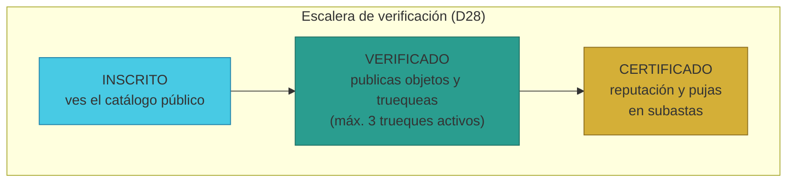
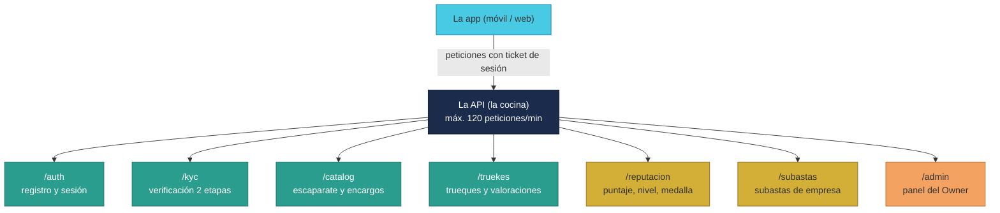

# Manual · Los servicios de TrueKeate (la API): qué puede hacer la plataforma

> Versión en lenguaje sencillo del manual técnico de la **API REST** (la
> "cocina" de TrueKeate).
> Aquí contamos los servicios que la plataforma ofrece por dentro: quién
> puede hacer qué, en qué orden y con qué reglas. Es el manual de referencia
> para entender las capacidades del sistema.

---

## 1. Empezar en 5 minutos

La app que ves en el móvil no guarda los datos: los pide a un **servicio
central** llamado API. La API es como la **cocina de un restaurante**: el
camarero (la app) te toma el pedido, lo pasa a la cocina, y la cocina
prepara el plato con sus reglas (no se sirve alcohol a menores, el chef
revisa cada plato...).

Los servicios se agrupan por **familias**:

| Familia | Prefijo | Qué hace |
|---|---|---|
| **Acceso** | `/auth` | Registrarte, iniciar sesión |
| **Verificación** | `/kyc` | Subir tu escalera de confianza |
| **Catálogo** | `/catalog` | Publicar objetos y ver ofertas |
| **Trueques** | `/truekes` | Crear y seguir trueques |
| **Panel del Owner** | `/admin` | Ver usuarios, contratos y salud |
| **Reputación** | `/reputacion` | Calcular tu puntaje y nivel |
| **Subastas** | `/subastas` | Subastas de empresas |

En 5 minutos: la API tiene **3 puertas de entrada** para proteger el
servicio:

1. **Límite de peticiones**: máximo 120 peticiones por minuto (anti-ataque).
2. **Sesión**: para lo privado necesitas iniciar sesión con tu firma.
3. **Estado de verificación**: algunas cosas exigen estar VERIFICADO o
   CERTIFICADO.

---

## 2. La puerta de entrada (reglas generales)

### 2.1 Límite de peticiones (rate limit)

Cualquiera que pida demasiado rápido recibe un aviso: "demasiadas
peticiones". Es la protección contra programas que intentan saturar el
servicio: máximo **120 peticiones por minuto**.

### 2.2 Iniciar sesión con tu firma

Para lo privado, la app pide que firmes el mensaje **"TrueKeate: iniciar
sesión"** con tu billetera. La cocina:

1. Recupera quién firmó (con tu firma, calcula tu dirección).
2. Te crea un **pase temporal** (token) que no es tu clave: es solo un
   "ticket" de entrada válido mientras dure la sesión.
3. Cada petición privada debe mostrar su ticket en la cabecera.

> El ticket **no es un JWT** (aunque los comentarios del código lo llamen
> así): es un código opaco aleatorio. Detalle técnico documentado para no
> confundir.

### 2.3 El estado de verificación manda

Muchos servicios preguntan: "¿en qué peldaño de la escalera estás?"
(INSCRITO, VERIFICADO o CERTIFICADO). Si el servicio exige VERIFICADO y tú
estás INSCRITO, la respuesta es clara: "estado requerido".

---

## 3. Acceso: registrarte e iniciar sesión (/auth)

| Acción | Qué hace | Reglas |
|---|---|---|
| **Conectar billetera** | La app anuncia tu billetera y te **inscribe automáticamente** | La dirección debe tener formato válido (0x...) |
| **Registrarte** | Formalizas tu inscripción con correo y teléfono | **Consentimiento GDPR obligatorio** (protección de datos): sin consentimiento no hay registro |
| **Iniciar sesión** | Firmas el mensaje de sesión y recibes tu ticket | La firma debe ser tuya |

> La **GDPR** es la ley europea de protección de datos personales. TrueKeate
> exige tu consentimiento expreso para tratar tus datos.

> ⚠️ Pendiente de confirmar: el diseño lista verificaciones de correo y
> teléfono (`/auth/verify-email`, `/auth/verify-phone`) que **no están
> implementadas** en este ciclo.

---

## 4. Verificación: subir la escalera (/kyc) — 2 etapas

La verificación ocurre en **2 etapas** (la escalera que ya conoces del
manual 02):

**Etapa 1: llegar a VERIFICADO**
1. Pides iniciar la verificación.
2. El sistema dice: "se enviaron códigos a tu correo y teléfono".
3. Escribes ambos códigos.
4. Subes a **VERIFICADO**.

> ⚠️ Pendiente de confirmar: en el código actual, los códigos solo deben
> **estar presentes** (no se comprueban contra los reales enviados). El
> envío real por correo (email) y la validación con vencimiento están
> previstos pero **no implementados** → **pendiente de confirmar**.

**Etapa 2: llegar a CERTIFICADO**
1. Envías la **referencia de tu documento** y la de tu **selfie**.
2. Tu solicitud queda **PENDIENTE**: la revisa un **humano** (el Owner).
3. Si aprueba → subes a **CERTIFICADO**. Si rechaza → te avisa.

> ⚠️ Pendiente de confirmar (observación de seguridad): la ruta de revisión
> no comprueba que quien aprueba sea realmente el Owner: **cualquier usuario
> con sesión** podría aprobar o rechazar una verificación en el estado
> actual. Está señalado para corregir.

<!-- GENERAR_IMAGEN: escalera-accesos.svg -->


---

## 5. Catálogo: publicar y buscar (/catalog)

El catálogo es el "escaparate" de la comunidad (AtoA = entre personas).

| Acción | Quién puede | Reglas |
|---|---|---|
| **Publicar un objeto** | VERIFICADO o CERTIFICADO | No superar el **límite de tu nivel** |
| **Ver el catálogo** | Todos (público) | Solo se ven objetos disponibles |
| **Pedir un encargo** | Cualquiera con sesión | Pides un objeto que no está en el mercado |
| **Ver encargos** | Todos | Lista de peticiones activas |

### 5.1 El límite de artículos por nivel

No todos pueden publicar lo mismo. El límite depende de tu **nivel** (no de
tu tipo de cuenta):

| Nivel | Máximo de objetos publicados |
|---|---|
| INICIADO | 5 |
| COMÚN | 50 |
| FRECUENTE | 100 |
| SOCIO | 100 |

> Ejemplo: un INICIADO puede tener hasta 5 objetos a la vez en el
> escaparate. Si ya tiene 5, el sistema responde: "límite de artículos
> alcanzado".

---

## 6. Trueques: crear y seguir (/truekes)

Esta familia coordina la caja fuerte (ver manual 01) con la app.

| Acción | Quién puede | Reglas |
|---|---|---|
| **Crear trueque** | VERIFICADO o CERTIFICADO | Máximo **3 trueques activos** para VERIFICADO |
| **Ver detalle** | Cualquiera | Información de confianza del trueque |
| **Custodiar** | Solo la parte dueña del objeto | Cada lado custodia el suyo |
| **Firmar recepción** | Solo la parte correspondiente | Tu declaración de "recibí bien" |
| **Valorar** | Ambas partes | 5 renglones con nota 1-5: aceptación, honestidad, seguridad, confiabilidad, compromiso |

### 6.1 La regla de los 3 trueques

Un usuario **VERIFICADO** no puede tener más de **3 trueques en marcha** a la
vez (estados CREADO, CUSTODIADO, APERTURA...). Es una regla anti-acaparación:
limita el riesgo de comprometerse de más.

### 6.2 La valoración en 5 dimensiones

Cuando valoras un trueque, puntúas **5 cosas** (de 1 a 5):

1. **Aceptación**: ¿el otro cumplió lo pactado?
2. **Honestidad**: ¿describió bien su objeto?
3. **Seguridad**: ¿el intercambio fue seguro?
4. **Confiabilidad**: ¿fue puntual y serio?
5. **Compromiso**: ¿terminó lo que empezó?

> ⚠️ Pendiente de confirmar: la app de trueques tiene preparado el envío a
> la blockchain (por mensajero para particulares, o directo para empresas),
> pero en el ciclo actual **ninguna ruta lo ejecuta**: los trueques se
> guardan en un almacén de pruebas y las acciones de custodiar/firmar no
> comprueban aún el estado real en la cadena. La integración completa está
> **pendiente de confirmar**. También faltan las rutas de apertura,
> anulación y disputa desde la app (en el diseño, no implementadas).

---

## 7. Panel del Owner: administración (/admin)

El administrador (Owner) tiene su propio tablero:

| Servicio | Qué muestra |
|---|---|
| **Usuarios** | Lista de inscritos (solo Owner o Socios) |
| **Contratos** | Direcciones de los contratos desplegados |
| **KPIs de disputas** | Total de trueques y disputas abiertas |
| **Base de datos** | Cuántos usuarios, objetos y trueques hay |
| **Salud de infraestructura** | Salud y métricas del mensajero y del vigilante |

> ⚠️ Observación: el servicio de contratos no exige rol de Owner (solo
> sesión), y el de salud responde vacío cuando no hay mensajero ni vigilante
> conectados (como ocurre en el modo de pruebas actual).

---

## 8. Reputación: tu puntaje y tu nivel (/reputacion)

Cada trueque completado alimenta tu **reputación**. La fórmula (de diseño)
mezcla tres ingredientes:

```
Puntaje = 50 % reputación + 30 % volumen efectivo + 20 % (1 − ratio de apelaciones)
```

Se normaliza a una nota de **0 a 100**, y de ahí salen tu nivel y tu
medalla:

| Puntaje | Nivel | Medalla |
|---|---|---|
| 0 – 25 | INICIADO | BRONCE |
| 26 – 50 | COMÚN | PLATA |
| 51 – 75 | FRECUENTE | ORO |
| 76 – 100 | SOCIO | ORO |

Dos reglas especiales:

- **Oro histórico** (requisito de empresa): tener **≥ 1.000 trueques
  efectivos** y un **ratio de éxito ≥ 90 %**.
- **Penalización por inactividad**: 180 días sin actividad + dominar más del
  5 % del mercado → tu puntaje baja (regla anti-monopolio).

> ⚠️ Pendiente de confirmar: en el estado actual, el cálculo usa un
> "volumen máximo del sistema" fijo en 1 (la normalización real queda
> pendiente), el recálculo mensual automático solo responde un aviso (sin
> lote programado) y la penalización por inactividad está definida pero no
> se invoca en ninguna ruta.

---

## 9. Subastas de empresa (/subastas)

Las empresas pueden subastar objetos (RF-17). Reglas claras:

| Acción | Quién puede | Reglas |
|---|---|---|
| **Crear subasta** | Solo empresas | Puja inicial obligatoria; duración por defecto 24 h |
| **Ver subastas** | Todos (público) | Solo subastas abiertas |
| **Pujar** | Solo usuarios CERTIFICADOS | Puja mínima + incremento mínimo |
| **Cerrar** | Sistema/manual | Cuando vence el tiempo |

### 9.1 El desempate (regla D27)

Al cerrar la subasta:

1. Gana la **puja más alta**.
2. Si hay **empate**, gana el de **mayor nivel** (SOCIO > FRECUENTE > COMÚN
   > INICIADO).
3. Si no hubo pujas, la subasta se declara **ANULADA** (sin ganador).

> ⚠️ Pendiente de confirmar: el estado de las subastas vive en la memoria
> del programa (se pierde al reiniciar), el cierre es manual (no hay reloj
> automático de vencimiento) y faltan servicios de detalle y de listado de
> pujas. Persistencia y automatización están **pendientes de confirmar**.

<!-- GENERAR_IMAGEN: api-servicios.svg -->


---

## 10. Los códigos de error (cuando algo sale mal)

Cuando algo falla, la API responde con un **código claro**, no con un
"error 500 misterioso". Ejemplos:

| Código | Qué significa |
|---|---|
| `wallet_invalida` | La dirección de la billetera no tiene formato correcto |
| `consentimiento_requerido` | Falta el consentimiento GDPR |
| `firma_invalida` | La firma no corresponde a tu billetera |
| `estado_requerido` | Necesitas un estado de verificación mayor |
| `limite_articulos` | Ya publicaste el máximo de tu nivel |
| `max_3_activos` | Ya tienes 3 trueques en marcha |
| `valoraciones_1_a_5` | Las notas deben ser enteros de 1 a 5 |
| `solo_owner` | Solo el Owner puede hacer esto |
| `solo_empresa` | Solo las empresas pueden hacer esto |
| `solo_certificado` | Solo CERTIFICADOS pueden hacer esto |
| `rate_limit` | Demasiadas peticiones por minuto |
| `not_found` | Lo que buscas no existe |

---

## 11. Qué falta confirmar (resumen)

1. La API guarda todo en **memoria** (se pierde al reiniciar): el puente a
   la base de datos PostgreSQL real está declarado como trabajo de la
   integración final → **pendiente de confirmar**.
2. Verificación real de códigos de correo/teléfono y envío por email no
   implementados → **pendiente de confirmar**.
3. Sin control de rol Owner en la revisión de verificación (observación de
   seguridad).
4. Los trueques no se envían aún a la blockchain desde la app → **pendiente
   de confirmar**.
5. Reputación con volumen máximo fijo en 1 y recálculo mensual solo
   simulado → **pendiente de confirmar**.
6. Subastas en memoria, sin cierre automático ni persistencia →
   **pendiente de confirmar**.
7. Muchos servicios del diseño no existen aún: verificación por email/
   teléfono, apelaciones, cola de revisión, rutas de disputas y votaciones,
   apertura/anulación de trueques, puntos de encuentro, campañas y finanzas
   → **pendientes de confirmar** (integración final o ciclos posteriores).
8. Los 14 tests de la API están verificados (14/14 verdes) con el almacén
   en memoria (ver manual 08).

---

## 12. Glosario de este manual

| Palabra | Significado |
|---|---|
| **API** | Servicio central que la app usa por dentro (la "cocina") |
| **Ruta / endpoint** | Una puerta concreta del servicio (`/truekes`, `/kyc`...) |
| **Sesión** | Tu estado de "logueado" con ticket temporal |
| **Token** | El ticket temporal de tu sesión |
| **Rate limit** | Límite de peticiones por minuto (120) |
| **GDPR** | Ley europea de protección de datos personales |
| **KYC** | Verificación de identidad ("conoce a tu cliente") |
| **Selfie** | Tu foto para verificar que eres tú |
| **AtoA** | Intercambio entre personas (a to a) |
| **Rubro** | Categoría del objeto (arte, tecnología...) |
| **Encargo** | Pedir un objeto que no está en el mercado |
| **Nivel / medalla** | Tu rango según el puntaje (INICIADO... SOCIO) |
| **Apelación** | Recurso contra una decisión (cuenta como disputa) |
| **JWT** | Formato de ticket firmado (no usado aquí: ticket opaco) |

¡Listo! Ya conoces todos los servicios de la plataforma. El siguiente manual
es la guía de la app: pantallas, conexión con MetaMask y navegación.
