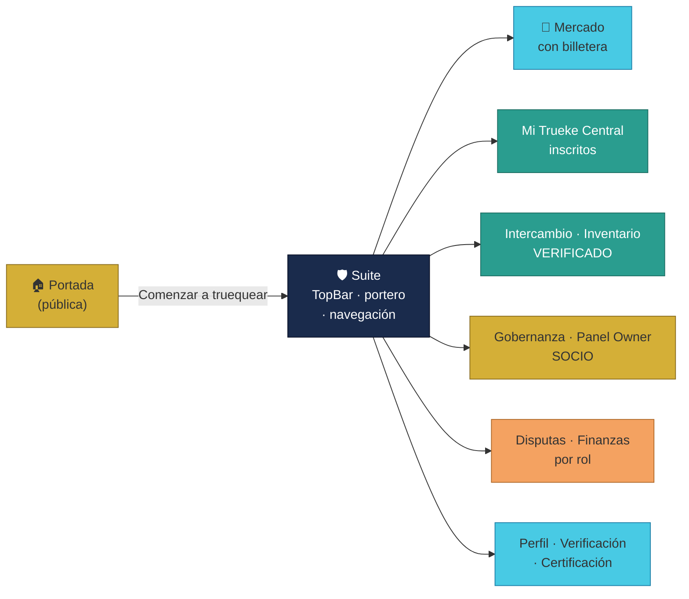
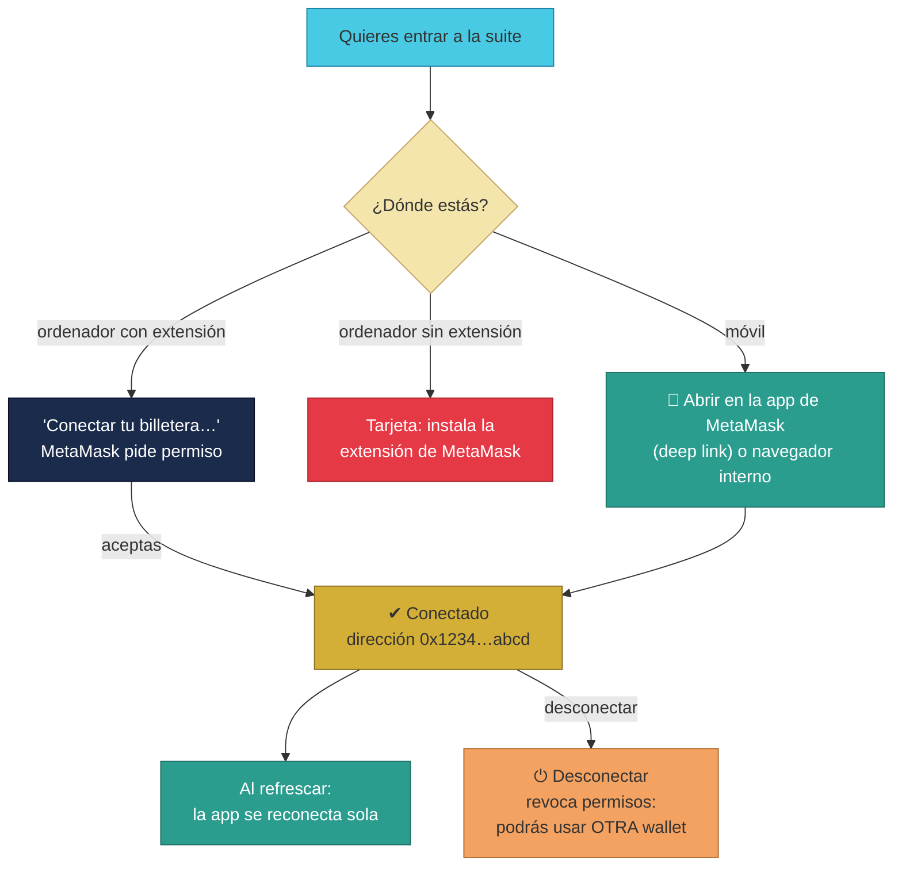
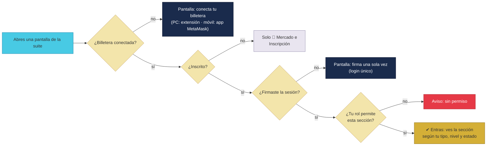

# Manual · La app de TrueKeate: pantallas, MetaMask y navegación

> Versión en lenguaje sencillo del manual técnico del **frontend** de
> TrueKeate (la app web hecha con Next.js).
> Aquí contamos las pantallas que existen hoy, cómo conectar tu billetera
> (MetaMask) y cómo moverte por la app.

---

## 1. Empezar en 5 minutos

La app de TrueKeate es una **página web** (también instalable en el móvil
como una app, gracias a la tecnología PWA). Todo lo privado vive en la
**suite**, la zona a la que se entra con tu billetera.

Para empezar en 5 minutos:

1. Abre la **portada** (`/`): es la única página pública.
2. Pulsa **"Comenzar a truequear"**.
3. **Conecta tu billetera** (MetaMask u otra compatible). En el móvil puedes
   abrir la app dentro del navegador de MetaMask (ver sección 4).
4. Si es tu primera vez, completa la **inscripción**: correo, teléfono,
   dirección y consentimiento de protección de datos.
5. **Firma una sola vez** el mensaje de sesión. La app recuerda tu ticket
   durante 24 horas: no tendrás que volver a firmar en cada pantalla.
6. Ya estás en **Mi Trueke Central**: la escalera te muestra tu peldaño
   (INSCRITO → VERIFICADO → CERTIFICADO) y ves las secciones que tu rol te
   permite.

> Dato clave: lo que ves no lo decide la pantalla. Tu estado (inscripción,
> verificación y certificación) lo guarda el servidor central, y la app solo
> lo muestra. Según subas de peldaño se te van desbloqueando secciones:
> Intercambio e Inventario piden VERIFICADO; Disputas, CERTIFICADO o SOCIO;
> Finanzas, EMPRESA o SOCIO; y la Gobernanza, SOCIO.

---

## 2. El mapa de la app (pantallas y quién las ve)

Hoy la suite tiene estas pantallas, todas **funcionales** (ya no hay páginas
"en construcción" con una sola tarjeta):

| Pantalla | Ruta | Qué encuentras | Quién puede verla |
|---|---|---|---|
| **Portada** | `/` | Hero, ventajas del trueque, filosofía y botón de inicio | Todos (pública) |
| **Suite (marco)** | `/suite` | Barra superior + portero de acceso + navegación inferior | Todos entran; el portero decide el contenido |
| **Mi Trueke Central** | `/suite/dashboard` | Escalera de verificación y accesos rápidos | Inscritos |
| **Mercado** | `/suite/mercado` | Catálogo de ofertas abiertas | Con billetera (no hace falta estar inscrito) |
| **Intercambio** | `/suite/intercambio` | Crear y completar trueques | VERIFICADO o CERTIFICADO |
| **Inventario** | `/suite/inventario` | Publicar y despublicar tus objetos | VERIFICADO o CERTIFICADO |
| **Gobernanza / Socios** | `/suite/gobernanza` | Propuestas y votación | SOCIO (y el Owner) |
| **Disputas** | `/suite/disputas` | Seguir disputas | CERTIFICADO las ve; SOCIO las resuelve |
| **Finanzas** | `/suite/finanzas` | Saldos propios y globales | EMPRESA o SOCIO |
| **Panel del Owner** | `/suite/admin` | Administración de la plataforma | El Owner |
| **Mi Perfil** | `/suite/perfil` | Tu @username, tu billetera completa y tu reputación | Inscritos |
| **Inscripción** | `/suite/inscripcion` | Formulario de inscripción (correo, teléfono, dirección, GDPR) | Con billetera, sin inscribir |
| **Verificación** | `/suite/verificacion` | Verificar tu correo (escalera, etapa 1) | Inscritos |
| **Certificación** | `/suite/certificacion` | Certificarte con SBT o documentos (etapa 2) | Inscritos |
| **Ayuda / Manual** | `/help/manual` | Este manual, navegable dentro de la app | Todos |

Cada usuario ve un **menú distinto**: la app consulta una matriz única de
navegación y muestra solo lo que permiten tu tipo (PARTICULAR, EMPRESA,
SOCIO), tu nivel y tu estado. Las pantallas de proceso (inscripción,
verificación y certificación) siempre están a mano para seguir subiendo la
escalera.

<!-- GENERAR_IMAGEN: pantallas-app.svg -->

---

## 3. La portada (la carta de presentación)

La portada pública cuenta qué es TrueKeate:

- **Hero** con el logo, el titular y las cifras de la plataforma (usuarios,
  trueques, volumen...).
- **"¿Qué es un Trueke Digital?"** con las 4 ventajas:

  1. **Custodia atómica**: nadie pierde su parte (la caja fuerte).
  2. **Trueke sin gas**: la plataforma paga el gas por ti.
  3. **Reputación real**: tu historial te precede.
  4. **Economía circular**: dar nueva vida a las cosas.

- **Filosofía**: confianza recompensada, seguridad por diseño, sin barreras.
- **Botón final** "Comenzar a truequear" → te lleva a la suite.

> La portada es la **única** pantalla pública de la app: no pide billetera.
> Todo lo demás queda detrás del portero de la suite (sección 5).

---

## 4. Conectar tu billetera (paso a paso)

**MetaMask** es una "billetera" (wallet) de cripto: una extensión del
navegador (o app móvil) que guarda tus llaves y firma por ti. TrueKeate la
usa para saber quién eres. La app también acepta **wallets modernas que se
anuncian solas** (estándar EIP-6963): no depende de que una extensión
concreta esté instalada.

### 4.1 En el ordenador (con la extensión instalada)

1. Abre la suite (o pulsa "Comenzar a truequear").
2. Pulsa el botón **"Conectar tu billetera…"**.
3. MetaMask te pregunta: *"¿Permites que este sitio vea tus cuentas?"*
   → Acepta.
4. Tu dirección aparece resumida (por ejemplo `0x1234…abcd`).

### 4.2 En el ordenador (sin extensión)

La app te avisa: **"Conecta tu billetera…"**. Te muestra una tarjeta para
**instalar la extensión** de MetaMask (o usar una wallet compatible). Sin
billetera no puedes entrar a la suite: es privada.

### 4.3 En el móvil: dos vías (sin extensión)

En el móvil no hay extensiones, pero hay **dos caminos**:

1. **"📲 Abrir en la app de MetaMask"**: un *deep link* (enlace profundo)
   que abre TrueKeate dentro de la **app de MetaMask**. Su navegador interno
   sí puede conectar tu billetera.
2. Abrir el **navegador interno** de tu wallet y escribir la dirección de la
   app (te la muestra la propia tarjeta).

> El detalle operativo de conectar en el móvil está en el manual
> **07·09-conexion-wallet-movil.md**.

### 4.4 Al refrescar la página (volver a entrar)

La app recuerda tu cuenta (en el almacén local del navegador):

1. Al abrir la página, intenta **reconectarse sola** con tu cuenta guardada.
2. Si tu billetera está **bloqueada** (con contraseña), conserva tu
   dirección pero sin firma disponible hasta que la desbloquees.

### 4.5 Cambiar de cuenta o desconectar

- Si cambias de cuenta **dentro de MetaMask**, la app se entera al momento
  y actualiza la pantalla (escucha el aviso `accountsChanged`).
- Al pulsar **"⏻ Desconectar billetera"** la app no solo borra su recuerdo:
  también **revoca los permisos** en MetaMask. Así, la próxima vez MetaMask
  vuelve a preguntarte qué cuenta usas y puedes entrar con **otra wallet**.

### 4.6 El inicio de sesión único (login único)

Conectar, comprobar si estás inscrito y firmar la sesión ocurre **en un solo
botón**:

1. Conectas la billetera.
2. La app pregunta al servidor: "¿esta cuenta está inscrita?".
3. Si lo está, te pide **una sola firma** ("TrueKeate: iniciar sesión").
4. Guardas un ticket que dura **24 horas**: al navegar entre secciones no se
   vuelve a pedir la firma.

> ⚠️ Pendiente de confirmar: conectar en el móvil con wallets **distintas de
> MetaMask** (estándar WalletConnect universal) está anotado como mejora
> futura: hoy la vía móvil es la app de MetaMask con su navegador interno.

<!-- GENERAR_IMAGEN: conexion-metamask.svg -->

---

## 5. El portero de la suite (quién entra a cada pantalla)

La suite es privada. Antes de mostrar cualquier pantalla, un **portero**
(*guard*) revisa tres cosas en orden:

### 5.1 ¿Tienes billetera conectada?

Si no, te muestra la pantalla de **conexión** (la que viste en la sección 4).
Sin billetera, la suite no deja pasar: solo la portada es pública.

### 5.2 ¿Estás inscrito?

Con la billetera conectada pero **sin inscribirte**, solo puedes visitar dos
sitios:

- **🛒 Mercado**: ver las ofertas abiertas.
- **Inscripción**: el formulario para completar tus datos (correo, teléfono,
  dirección y consentimiento GDPR).

El resto de la suite muestra el aviso: *"primero completa tu inscripción"*.

### 5.3 ¿Firmaste la sesión?

Ya inscrito, si aún no firmaste, te muestra la pantalla de **iniciar sesión**
(una sola firma, nunca una por página — el login único de la sección 4.6).

### 5.4 ¿Tienes permiso para esta sección?

Con tu ticket en regla, el portero compara la pantalla pedida con tu
**matriz de navegación** (tipo, nivel y estado). Si la sección no es tuya,
te avisa: *"no tienes permiso"*. Las rutas de proceso (verificación y
certificación) siempre están permitidas para subir la escalera.

> En resumen, el portero hace de verdad lo que antes solo se insinuaba: ya
> no basta con que un botón se vea atenuado. Quien no tiene el rol no entra,
> y la verdad del estado la aplica el servidor central, no la pantalla.

<!-- GENERAR_IMAGEN: acceso-por-rol.svg -->

---

## 6. Mi Trueke Central (el panel personal)

Es tu pantalla principal dentro de la suite. Muestra:

1. **Tu billetera** conectada (o el botón para conectar).
2. **Tu escalera de verificación**: INSCRITO → VERIFICADO → CERTIFICADO,
   dibujada como pasos. Los alcanzados se ven en color (azul marino →
   verde azulado).
3. **Tus accesos rápidos**: las secciones que tu rol permite, listas para
   entrar.
4. Lo que aún no puedes usar se ve **atenuado** (por ejemplo, "requiere
   estado VERIFICADO") y, si lo pulsas, el portero te explica el motivo.

> El panel no inventa tu estado: pregunta al servidor central (tu sesión y
> tu ficha de verificación). La pantalla solo pinta lo que el servidor dice.

---

## 7. La barra superior única y la navegación inferior

### 7.1 La barra superior (en el ordenador)

La app usa **una sola barra superior** que junta tres zonas:

- **Marca**: el **logo + el título** de TrueKeate (en pantallas muy
  pequeñas se oculta el título y queda el logo). Al pulsarla vuelves a Mi
  Trueke Central.
- **Secciones en iconos**: cada sección es **solo un icono** en un botón
  redondo. El nombre aparece al **pasar el cursor** (tooltip) y en la
  descripción para lectores de pantalla. La sección activa se ilumina con
  fondo dorado.
- **Tu botón de usuario**: `👤` con tu **estado** al lado, en un solo
  emoji: 🟡 INSCRITO · 🟢 VERIFICADO · 🥇 CERTIFICADO.

> Sin billetera, la barra muestra el texto "Conecta tu billetera…". Con
> billetera pero sin inscribir, solo muestra el icono 🛒 Mercado y un aviso.

### 7.2 Tu menú de usuario

Al pulsar tu botón se abre un desplegable con:

- **Título**: tu `@username` **· tu nivel** (en dorado). Si aún no elegiste
  nombre, aparece tu dirección corta (`0x1234…abcd`).
- **Subtítulo**: tu tipo **· tu medalla** de reputación (🥉/🥈/🥇 con su
  etiqueta).
- **Acciones**: "Completar inscripción" (si aún no lo hiciste), Mi perfil,
  Gobernanza/Socios, Ayuda/Manuales y **"⏻ Desconectar billetera"** (que
  también cierra la sesión).

### 7.3 La barra inferior (en el móvil)

En pantallas pequeñas, la navegación pasa a una **barra inferior fija y
flotante** (fondo blanco translúcido, esquinas redondeadas):

- Hasta **5 accesos** según tu rol, elegidos por la misma matriz de
  navegación.
- El **botón central es hexagonal y dorado**: es **Intercambio**, el
  corazón de la app (crear trueques).
- Si tu rol tiene más secciones de las que caben, se agrupan en un botón
  **"⋯ Más"**.
- Sin billetera o sin inscribir, la barra solo muestra **🛒 Mercado**.

---

## 8. El estilo de la app (la "Bóveda Digital Moderna")

TrueKeate tiene su propia identidad visual:

- **Colores**: azul marino profundo (confianza), verde azulado (teal) y
  dorado (prestigio). Rojo y coral solo para alertas y estados de error.
- **Formas**: botones en cápsula (pill), tarjetas con esquinas redondeadas y
  la tarjeta "premium" con borde dorado para activos certificados.
- **Fuentes**: tipografías limpias y modernas (Geist y sus variantes).
- **Detalle de marca**: el check **☑** que se dibuja con una animación al
  completar una verificación (el "TrueKeat☑").
- **Estados con colores** (badges):

| Estado | Color de la etiqueta |
|---|---|
| INSCRITO, CREADO, CUSTODIADO | Azul marino |
| VERIFICADO | Verde azulado |
| CERTIFICADO, COMPLETADO | Dorado |
| EN_DISPUTA, RESOLUCION_SOCIOS, APERTURA | Coral |
| RECHAZADO, ANULADO, BLOQUEADO | Rojo |
| Otros | Gris |

---

## 9. Qué falta confirmar (resumen)

1. La **capa de contratos** (ABIs) está preparada pero **no se activa en
   ninguna pantalla**: no hay todavía lectura on-chain funcional desde el
   navegador → **pendiente de confirmar**.
2. La escalera se muestra **atenuada por estado** en las pantallas, pero la
   **verdad del estado la aplica el servidor** (inscripción, verificación,
   certificación): el frontend no decide.
3. **WalletConnect universal** (móvil, fuera de MetaMask): documentado como
   mejora futura con projectId.
4. **Tooltips en táctil**: en tabletas en modo ordenador el tooltip de los
   iconos no aparece de forma nativa; la accesibilidad está cubierta con
   descripciones (aria-label).
5. La **PWA** tiene su archivo de instalación (manifest) pero **sin service
   worker** observado: funcionar sin conexión queda **pendiente de
   confirmar**.

---

## 10. Glosario de este manual

| Palabra | Significado |
|---|---|
| **Frontend** | La parte visible de la app (lo que ves) |
| **PWA** | App web que se puede instalar como una app del móvil |
| **Wallet / billetera** | Programa que guarda tus llaves y firma (MetaMask) |
| **MetaMask** | La billetera más conocida (extensión o app móvil) |
| **EIP-6963** | Estándar para que las wallets se anuncien solas y la app las detecte |
| **Conectar** | Vincular tu billetera a la app |
| **Deep link** | Enlace que abre la app dentro de otra app (p. ej. dentro de MetaMask) |
| **Suite** | La zona privada de la app tras conectar la billetera |
| **Portero (guard)** | Control que revisa billetera, inscripción, sesión y permiso antes de cada pantalla |
| **Login único** | Firmar una sola vez al entrar; el ticket dura 24 horas |
| **Tooltip** | Etiqueta que aparece al pasar el cursor sobre un icono |
| **Dashboard** | Panel resumen (Mi Trueke Central) |
| **Escalera D28** | INSCRITO → VERIFICADO → CERTIFICADO |
| **SBT** | Insignia digital en la cadena que certifica tu identidad |
| **Landing** | Página de bienvenida pública (portada) |
| **Hero** | La primera imagen grande de la portada |
| **Manifest** | Archivo que permite instalar la PWA |
| **Service worker** | Programa que permite la app sin conexión (pendiente) |

¡Listo! Ya sabes moverte por la app y conectar tu billetera. El último
manual de esta sección explica cómo sabemos que todo esto funciona: las
pruebas.
