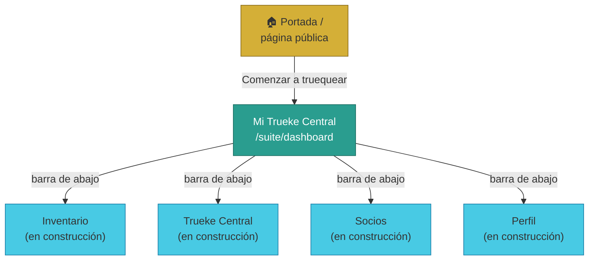
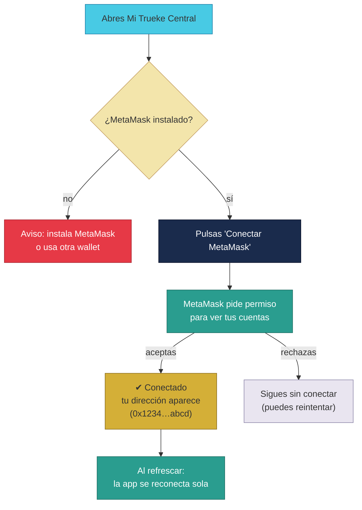

# Manual · La app de TrueKeate: pantallas, MetaMask y navegación

> Versión en lenguaje sencillo del manual técnico del **frontend** de
> TrueKeate (la app web hecha con Next.js).
> Aquí contamos las pantallas que existen hoy, cómo conectar tu billetera
> (MetaMask) y cómo moverte por la app.

---

## 1. Empezar en 5 minutos

La app de TrueKeate es una **página web** (también instalable en el móvil
como una app, gracias a la tecnología PWA). Sus pantallas principales:

1. **Portada** (`/`): la página de bienvenida pública.
2. **Mi Trueke Central** (`/suite/dashboard`): tu panel personal tras entrar.
3. **Inventario, Intercambio, Socios y Perfil**: accesos desde la barra de
   abajo (algunos en construcción).

Para empezar en 5 minutos:

1. Abre la portada y pulsa **"Comenzar a truequear"**.
2. Se abre tu panel personal (Mi Trueke Central).
3. Pulsa **"Conectar MetaMask"** para conectar tu billetera.
4. Verás tu dirección resumida (por ejemplo `0x1234…abcd`).
5. Ya estás dentro de la suite: la escalera de verificación te muestra en
   qué peldaño estás (INSCRITO por ahora).

> ⚠️ Pendiente de confirmar: hoy el panel muestra tu estado **simulado**
> (siempre INSCRITO). En la integración final, ese estado vendrá del
> backend (tu sesión y tu verificación real). Mientras tanto, la app es una
> demostración visual del diseño.

---

## 2. Las pantallas que existen hoy (mapa de la app)

| Pantalla | Ruta | Qué encuentras | Estado |
|---|---|---|---|
| **Portada** | `/` | Hero, ventajas del trueque, filosofía y botón de inicio | Funcional |
| **Suite (marco)** | `/suite` | Barra superior + navegación inferior | Funcional |
| **Mi Trueke Central** | `/suite/dashboard` | Tu estado, módulos por verificación, conectar MetaMask | Funcional (estado simulado) |
| **Inventario** | `/suite/inventario` | Tus objetos | En construcción (placeholder) |
| **Trueke Central** | `/suite/intercambio` | Crear y ver trueques | En construcción (placeholder) |
| **Socios** | `/suite/gobernanza` | Gobernanza y votaciones | En construcción (placeholder) |
| **Perfil** | `/suite/perfil` | Tus datos | En construcción (placeholder) |

Los módulos "en construcción" muestran el aviso: *"Este módulo se completa
en la integración final. Acceso según rol y estado"*.

> Rutas del diseño que **todavía no existen**: historial, zona de empresa,
> zona de socio, panel de administración, subastas, campañas y la sala de
> intercambio. No están prometidas como funcionales.

<!-- GENERAR_IMAGEN: pantallas-app.svg -->

---

## 3. La portada (la carta de presentación)

La portada pública cuenta qué es TrueKeate:

- **Hero** con el logo, el titular y las cifras de la plataforma (usuarios,
  trueques, volumen...).
- **"¿Qué es un Trueke Digital?"** con las 4 ventajas:

  1. **Custodia atómica**: nadie pierde su parte (la caja fuerte).
  2. **Trueke sin gas**: la plataforma paga el gas por ti.
  3. **Reputación real**: tu historial te precede.
  4. **Economía circular**: dar nueva vida a las cosas.

- **Filosofía**: confianza recompensada, seguridad por diseño, sin barreras.
- **Botón final** "Comenzar a truequear" → te lleva a tu panel.

> ⚠️ Pendiente de confirmar: las cifras de la portada (usuarios, trueques,
> volumen) son **contenido de maqueta** (estático), no datos reales del
> backend.

---

## 4. Conectar tu billetera con MetaMask (paso a paso)

**MetaMask** es una "billetera" (wallet) de cripto: una extensión del
navegador (o app móvil) que guarda tus llaves y firma por ti. TrueKeate la
usa para saber quién eres.

### 4.1 Primera vez (conectar)

1. Instala MetaMask en tu navegador (o usa una wallet compatible).
2. Abre **Mi Trueke Central**.
3. Pulsa el botón **"Conectar MetaMask"**.
4. MetaMask te pregunta: *"¿Permites que este sitio vea tus cuentas?"*
   → Acepta.
5. Tu dirección aparece en la pantalla (resumida: `0x1234…abcd`).

Si MetaMask **no está instalado**, la app te avisa claramente: "MetaMask no
está instalado. Instálalo o usa una wallet compatible".

### 4.2 Al refrescar la página (volver a entrar)

La app recuerda tu cuenta (en el almacén local del navegador):

1. Al abrir la página, intenta **reconectarse sola**.
2. Si tu billetera está **bloqueada** (con contraseña), conserva tu
   dirección pero sin firma disponible hasta que la desbloquees.

### 4.3 Cambiar de cuenta o desconectar

- Si cambias de cuenta **dentro de MetaMask**, la app se entera al momento
  y actualiza la pantalla (escucha el aviso `accountsChanged`).
- Si cierras sesión, la app borra el recuerdo y vuelve al estado inicial.

> ⚠️ Pendiente de confirmar: la **firma desde el móvil** (firmar con la app
> móvil de MetaMask, "deep-link") está comentada como delegación a la wallet
> móvil, pero **sin código todavía**. La instalabilidad completa de la PWA
> (funcionar sin conexión) también queda **pendiente de confirmar**: existe
> el archivo de manifiesto pero no se observó el "service worker".

<!-- GENERAR_IMAGEN: conexion-metamask.svg -->

---

## 5. Mi Trueke Central (el panel personal)

Esta es tu pantalla principal dentro de la suite. Muestra:

1. **Tu billetera** conectada (o el botón para conectar).
2. **Tu escalera de verificación**: INSCRITO → VERIFICADO → CERTIFICADO,
   dibujada como pasos. Los alcanzados se ven en color (azul marino →
   verde azulado).
3. **Tus módulos disponibles según tu estado**:

| Módulo | Qué necesitas | Qué pasa si no lo tienes |
|---|---|---|
| **Explorar ofertas** | Cualquiera (hasta INSCRITO) | Siempre activo: puedes ver el mercado |
| **Mis truekes** | VERIFICADO | Se ve atenuado con el aviso "Requiere estado Verificado" |
| **Reputación** | CERTIFICADO | Se ve atenuado hasta que subas de estado |

4. **La barra de abajo** (navegación inferior) con 5 accesos.

> La lógica de "qué puedes hacer según tu estado" es **visual** (los botones
> se atenúan), no hay todavía bloqueo real de rutas por rol.

---

## 6. La barra superior y la barra inferior

### 6.1 Barra superior (marco de la suite)

- Logo textual **⇄ TrueKeat☑** (el "☑" es el check on-chain, la marca de
  confianza).
- Tu nombre de usuario con check: **@usuario ✓**.
- Un icono de **notificaciones** con un contador.

> ⚠️ Pendiente de confirmar: el nombre de usuario y el contador de
> notificaciones son **estáticos** (dibujados), no vienen de datos reales
> del backend.

### 6.2 Barra inferior (navegación)

La barra de abajo es fija y flotante (siempre a la vista). Tiene 5 botones:

1. **Mercado** → Mi Trueke Central.
2. **Inventario** → tus objetos.
3. **Trueke Central** (el botón del centro, destacado en dorado y elevado):
   el corazón de la app, para crear trueques.
4. **Socios** → gobernanza.
5. **Perfil** → tus datos.

El botón de la pantalla donde estás se ilumina en color verde azulado.

---

## 7. El estilo de la app (la "Bóveda Digital Moderna")

TrueKeate tiene su propia identidad visual:

- **Colores**: azul marino profundo (confianza), verde azulado (teal) y
  dorado (prestigio). Rojo y coral solo para alertas y estados de error.
- **Formas**: botones en cápsula (pill), tarjetas con esquinas redondeadas y
  la tarjeta "premium" con borde dorado para activos certificados.
- **Fuentes**: tipografías limpias y modernas (Geist y sus variantes).
- **Detalle de marca**: el check **☑** que se dibuja con una animación al
  completar una verificación (el "TrueKeat☑").
- **Estados con colores** (badges):

| Estado | Color de la etiqueta |
|---|---|
| INSCRITO, CREADO, CUSTODIADO | Azul marino |
| VERIFICADO | Verde azulado |
| CERTIFICADO, COMPLETADO | Dorado |
| EN_DISPUTA, RESOLUCION_SOCIOS, APERTURA | Coral |
| RECHAZADO, ANULADO, BLOQUEADO | Rojo |
| Otros | Gris |

---

## 8. Qué falta confirmar (resumen)

1. El panel muestra un estado de verificación **simulado** (INSCRITO): no
   consume aún los servicios del backend (sesión, estado de verificación)
   → **pendiente de confirmar**.
2. Ninguna pantalla hace llamadas reales al backend (catálogo, reputación,
   trueques) → **pendiente de confirmar**.
3. La capa de contratos (ABIs) está lista pero **no se activa en ninguna
   pantalla**: no hay todavía lectura on-chain funcional → **pendiente de
   confirmar**.
4. Cuatro módulos de la suite son **placeholders** (inventario, intercambio,
   gobernanza, perfil).
5. Datos estáticos: nombre de usuario, notificaciones y cifras de la
   portada son maqueta.
6. La PWA tiene su archivo de instalación (manifest) pero **sin service
   worker** observado (offline incompleto) → **pendiente de confirmar**.
7. Firma móvil (RF-16.3) y los roles de Empresa/Socio/Owner no están
   implementados en la app → **pendiente de confirmar**.
8. Las pruebas de la app (Playwright, 18 ejecuciones) cubren portada y
   panel con estado estático; no ejercitan una billetera real (ver manual
   08).

---

## 9. Glosario de este manual

| Palabra | Significado |
|---|---|
| **Frontend** | La parte visible de la app (lo que ves) |
| **PWA** | App web que se puede instalar como una app del móvil |
| **Wallet / billetera** | Programa que guarda tus llaves y firma (MetaMask) |
| **MetaMask** | La billetera más conocida (extensión o app móvil) |
| **Conectar** | Vincular tu billetera a la app |
| **Suite** | La zona privada de la app tras entrar |
| **Dashboard** | Panel resumen (Mi Trueke Central) |
| **Escalera D28** | INSCRITO → VERIFICADO → CERTIFICADO |
| **Placeholder** | Pantalla provisional "en construcción" |
| **Landing** | Página de bienvenida pública (portada) |
| **Hero** | La primera imagen grande de la portada |
| **Manifest** | Archivo que permite instalar la PWA |
| **Service worker** | Programa que permite la app sin conexión (pendiente) |

¡Listo! Ya sabes moverte por la app y conectar tu billetera. El último
manual de esta sección explica cómo sabemos que todo esto funciona: las
pruebas.
