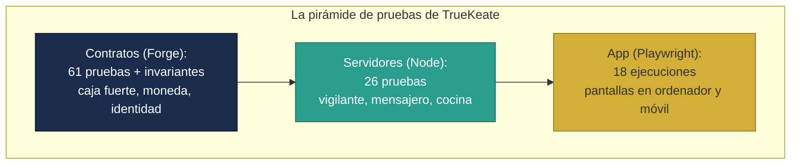

# Manual · Cómo sabemos que TrueKeate funciona (las pruebas)

> Versión en lenguaje sencillo del manual técnico de la estrategia y
> evidencia de **pruebas** de TrueKeate.
> Aquí contamos cómo el equipo comprueba que la caja fuerte, la moneda, los
> servidores y la app hacen lo que deben, y qué resultados hay registrados.

---

## 1. Empezar en 5 minutos

Antes de dar algo por bueno, TrueKeate lo **prueba en tres frentes**:

1. **Los contratos (la caja fuerte y la moneda)**: se prueban con "robots de
   prueba" (Foundry/Forge) que lanzan miles de situaciones, incluso ataques
   y casos raros.
2. **Los servidores (vigilante, mensajero y cocina)**: se prueban con
   simulaciones (Node.js) de la blockchain y la base de datos.
3. **La app**: se prueban las pantallas con un "navegador robot"
   (Playwright) que hace clics como una persona real, en ordenador y móvil.

Los resultados registrados (Fase 4):

| Frente | Resultado registrado |
|---|---|
| Contratos (Forge) | **62/62** pruebas verdes |
| Servidores (Node) | **26/26** pruebas verdes (verificado en este análisis) |
| App (Playwright) | **18/18** ejecuciones verdes |
| Cobertura de contratos | **89,55 %** de las líneas de código probadas |

> La **cobertura** mide qué porcentaje del código fue "tocado" por las
> pruebas. La regla de TrueKeate (gate D38): **al menos 80 % por ciclo**.

En 5 minutos, la idea es simple: como en un restaurante, **nada sale a la
mesa sin pasar el control del chef**. Cada pieza tiene su control antes de
darla por servida.

---

## 2. Cómo se prueban los contratos (Forge)

Los contratos son programas delicados (manejan objetos de valor), así que se
prueban con tres técnicas:

### 2.1 Pruebas normales (unit)

Casos escritos a mano: "si creo un trueque, el estado debe ser CREADO";
"si un extraño intenta custodiar, debe ser rechazado". Hay **61 pruebas**
de este tipo repartidas así:

| Archivo de pruebas | Cuántas | Qué prueban |
|---|---|---|
| Caja fuerte (Escrow.t.sol) | 18 | La máquina de estados del trueque |
| Ciclo 3 (Ciclo3.t.sol) | 20 | Moneda, fondo, socios y suscripciones juntos |
| Cuenta inteligente (SmartAccount.t.sol) | 14 | Firma, verificación, recuperación |
| Caja fuerte, ciclo 8 (EscrowCiclo8.t.sol) | 9 | Disputas, valoraciones, sanciones |

### 2.2 Pruebas con datos al azar (fuzz)

El robot lanza **256 combinaciones aleatorias** por prueba: montos extraños,
fechas raras, direcciones inventadas... Si algo se rompe, lo encuentra.

### 2.3 Pruebas de invariantes (las reglas que nunca se rompen)

Son las "leyes de la física" de la plataforma. El robot juega **64 rondas de
100 movimientos aleatorios** y comprueba que las leyes se cumplan siempre:

| Invariante | La ley que nunca se rompe |
|---|---|
| **I1 · Conservación de activos** | La caja fuerte nunca crea ni destruye saldo: lo que entra, sale |
| **I2 · Sin cancelación con custodia** | No se puede cancelar por las buenas si alguien ya depositó |
| **I4 · Anulaciones resueltas a tiempo** | Toda disputa se resuelve dentro del plazo |
| **I5 · Sanción solo tras espera** | La sanción nunca se ejecuta antes del tiempo de espera |
| **I7 · Completar exige firmas y valoración** | Ningún trueque se completa sin las 2 firmas y 2 valoraciones |

> ⚠️ Pendiente de confirmar: el archivo menciona "invariantes I1 a I7" pero
> solo existen **5 funciones** (I1, I2, I4, I5, I7). Las invariantes I3
> (ventanas de apertura) e I6 no tienen función en el archivo actual →
> **pendiente de confirmar** cómo se cubren.

<!-- GENERAR_IMAGEN: piramide-pruebas.svg -->


---

## 3. Cómo se prueban los servidores (Node)

Los servidores (vigilante, mensajero, cocina) se prueban **sin necesidad de
una blockchain ni una base de datos reales**: se crean **simulaciones**
(mocks) que imitan su comportamiento.

| Servidor | Cómo se simula | Qué se comprueba |
|---|---|---|
| **Vigilante** (indexador) | Base de datos "de mentira" en memoria + blockchain simulada | Que anota los eventos, no duplica, y guarda su avance |
| **Mensajero** (relayer) | Billetera falsa + blockchain simulada | Las 5 protecciones (red, firma, verificado, límite, bloqueo) |
| **Cocina** (API) | Servicio real con almacén en memoria | Registro, verificación, catálogo, trueques, panel, salud |

Resultados verificados en este análisis: **26/26 verdes**. Por archivo:

| Archivo | Pruebas | Resultado |
|---|---|---|
| Vigilante (indexador.test.js) | 5 | 5/5 ✔ |
| Mensajero (relayer.test.js) | 7 | 7/7 ✔ |
| Cocina (api.test.js) | 7 | 7/7 ✔ |
| Ciclo 8 (ciclo8.test.js) | 7 | 7/7 ✔ |

> ⚠️ Nota importante: el comando oficial `npm test` solo ejecuta 19 pruebas
> (vigilante + mensajero + cocina). El archivo del Ciclo 8 (7 pruebas) **no
> está incluido** en ese comando y debe ejecutarse aparte para llegar a las
> 26. Detalle técnico documentado.

---

## 4. Cómo se prueba la app (Playwright)

La app se prueba con un **navegador robot** que hace clics como una persona:

1. Se prepara la versión final de la app (`build`) y se sirve en el puerto
   3000.
2. El robot abre las páginas en **2 dispositivos**: un ordenador (Chrome) y
   un **móvil** (Pixel 5, porque TrueKeate es "móvil primero").
3. Cada caso se ejecuta en ambos → 9 casos × 2 dispositivos = **18
   ejecuciones**.

Qué comprueban los 9 casos:

**Portada (4 casos):**
1. El hero con la marca y el titular aparece.
2. Las cifras de la plataforma se ven.
3. Las ventajas del trueque se ven.
4. El botón lleva a la suite.

**Mi Trueke Central (5 casos):**
1. La barra superior muestra @usuario y el logo TrueKeat☑.
2. La escalera de verificación se ve.
3. El módulo bloqueado para INSCRITO se ve atenuado.
4. El botón "Conectar MetaMask" aparece sin sesión.
5. La barra inferior con su botón central funciona.

Resultado registrado: **18/18 verdes** (dato reportado en el estado del
proyecto — ver pendientes más abajo).

> Límite de alcance: estas pruebas **no usan una billetera real** (MetaMask
> no está automatizado), ni el backend real, ni la blockchain: son pruebas
> de las pantallas y del contenido estático.

---

## 5. Cómo reproducir las pruebas (por si quieres verlas)

### 5.1 Contratos

```bash
cd sc
forge test            # 62/62 reportado
forge coverage        # gate: ≥ 80 % líneas (89,55 % reportado)
```

### 5.2 Servidores

```bash
cd backend
npm test              # 19 pruebas (comando oficial)
node --test test/*.test.js   # 26 pruebas (incluye ciclo 8) — verificado 26/26
```

### 5.3 App

```bash
cd web
npm run build         # necesario antes (el robot sirve la versión final)
npx playwright test   # 9 casos × 2 dispositivos (ordenador + móvil)
```

---

## 6. Qué falta confirmar (resumen)

1. **Contratos**: no fue posible re-ejecutar `forge test` en el entorno de
   análisis (faltaba el programa `forge`): el resultado 62/62 y la cobertura
   89,55 % son **datos reportados** en `estado_proyecto.md` →
   **pendiente de confirmar** con una re-ejecución local.
2. **Invariantes**: el archivo declara 5 (I1/I2/I4/I5/I7); I3 e I6 sin
   función en el archivo actual → **pendiente de confirmar**.
3. **Sin pruebas con base de datos real (PostgreSQL)**: el vigilante y la
   cocina se prueban con simulaciones; la conexión real y la reconciliación
   contra la base de datos quedan **sin evidencia** → **pendiente de
   confirmar**.
4. **App**: el resultado 18/18 es un **dato reportado** (no hay archivos de
   resultados en el repositorio) → **pendiente de confirmar** con una
   re-ejecución.
5. **E2E estático**: 4 de los 9 casos cubren páginas provisionales o
   contenido de maqueta; sin billetera ni backend reales.
6. **Mensajero**: las pruebas cubren las protecciones con simulaciones; la
   integración real mensajero ↔ cuenta inteligente en la blockchain no
   forma parte de `npm test`.
7. **Documentación antigua**: un archivo (`sc/README.md`) conserva métricas
   de ciclos anteriores (94,96 % de cobertura, por ejemplo) que **no
   coinciden** con el consolidado vigente de la Fase 4 (89,55 %); la
   referencia actual es `estado_proyecto.md`.

---

## 7. Glosario de este manual

| Palabra | Significado |
|---|---|
| **Prueba (test)** | Comprobación automática de que algo funciona |
| **Unit** | Prueba de una pieza concreta con un caso escrito |
| **Fuzz** | Prueba con miles de datos al azar |
| **Invariante** | Regla que debe cumplirse siempre, pase lo que pase |
| **Cobertura** | Porcentaje del código que las pruebas tocan |
| **Gate** | Regla de calidad obligatoria (≥ 80 % de cobertura) |
| **Mock / simulación** | "Doble de mentira" que imita a blockchain o base de datos |
| **E2E** | Prueba de extremo a extremo (pantallas completas) |
| **Playwright** | Navegador robot que prueba la app |
| **Forge / Foundry** | Herramienta que prueba los contratos |
| **Suite** | Conjunto de pruebas de un área |
| **Verde** | Prueba que pasó correctamente (rojo = falló) |
| **Handler** | "Manos" del robot que hacen movimientos aleatorios en invariantes |

¡Fin de la sección de implementación! Con estos 8 manuales entiendes la
caja fuerte (01), tu identidad (02), las finanzas (03), el vigilante (04),
el mensajero (05), los servicios (06), la app (07) y las pruebas (08) de
TrueKeate.
