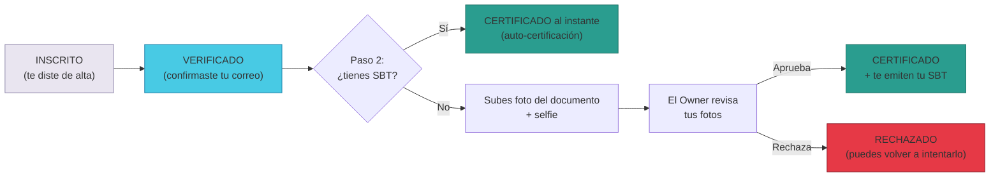
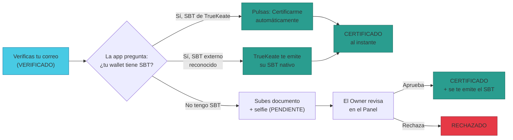
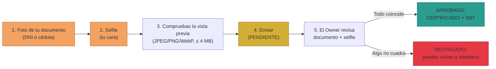

# Manual · Certifícate en TrueKeate: la credencial SBT que abre puertas

> Versión en lenguaje sencillo del manual técnico
> "Certificación con SBT (escalera D28, etapa 2)"
> (`RepoTecnico/Manuales/03-Implementacion/09-certificacion-sbt.md`).
> Aquí contamos cómo demuestras **quién eres** en TrueKeate para llegar al
> nivel más alto de confianza (**CERTIFICADO**): con tu credencial SBT al
> instante, o con tus fotos de documento + selfie revisadas por una persona
> (el Owner). Pensado para público general: sin jerga técnica sin explicar.

---

## 1. Empezar en 5 minutos

TrueKeate te pide probar tu identidad en dos peldaños:

1. **Paso 1 — Verifica tu correo**: la plataforma te envía un código de
   6 dígitos y tú lo escribes. Ya estás **VERIFICADO**.
2. **Paso 2 — Certifícate**, por una de estas dos vías:
   - **Vía rápida (SBT)**: si tu billetera ya tiene una credencial SBT
     (la de TrueKeate u otra reconocida), pulsas un botón y quedas
     **CERTIFICADO** al momento.
   - **Vía con fotos**: si no tienes SBT, subes una foto de tu documento
     (DNI/cédula) y una **selfie**. Una persona responsable (el Owner)
     revisa tus fotos y te aprueba.

> La credencial SBT es un **certificado digital que no se puede regalar ni
> vender**: va ligado a tu billetera y solo existe uno por persona. Es como
> un título académico: está a tu nombre y no se transfiere.

**En resumen**: verifica el correo → elige tu vía (SBT automático o fotos con
revisión humana) → consigue tu **badge de CERTIFICADO** y disfruta de los
niveles más altos de la plataforma.

---

## 2. El panorama: piezas y camino de decisión

### 2.1 Qué piezas intervienen

| Pieza (nombre técnico) | Para qué sirve, en cristiano |
|---|---|
| **Contrato `TrueKeateSBT`** | La fábrica de credenciales: emite tu SBT y garantiza que no se transfiera |
| **Helper SBT del backend** | El "vigilante" que mira en la cadena si tu billetera tiene SBT y emite el tuyo |
| **Servicios `/kyc` de la API** | Los trámites: verificar correo, certificar, subir fotos, revisar |
| **Base de datos (PostgreSQL)** | Guarda tu estado, tus fotos y tu número de SBT |
| **Página de certificación** | La pantalla donde tú haces los pasos (`/suite/certificacion`) |
| **Revisión del Owner** | La persona que aprueba o rechaza tus fotos cuando no hay SBT |

### 2.2 El cruce de caminos (decisión 2026-09)

Cuando llegas al peldaño de certificación, el sistema se pregunta:

1. **¿Tu billetera tiene un SBT?** → **Certificación automática** al instante
   (y si el SBT era de otra plataforma reconocida, TrueKeate te emite el suyo
   propio como credencial).
2. **¿No tienes SBT?** → Subes **documento + selfie** y queda en
   **PENDIENTE** → el **Owner** revisa tus fotos y **aprueba** (quedas
   CERTIFICADO y se te emite el SBT) o **rechaza**.

La escalera completa de confianza tiene tres peldaños: primero te **inscribes**
(INSCRITO), luego **verificas tu correo** (VERIFICADO) y por último te
**certificas** (CERTIFICADO). Este manual explica ese último peldaño.

<!-- GENERAR_IMAGEN: escalera-d28-2026.svg -->

---

## 3. La credencial SBT: lo que es y lo que no es

### 3.1 Un certificado "atado" a tu billetera

- El SBT (por sus siglas en inglés, *Soulbound Token*) es un **token de
  colección especial**: representa tu certificación de identidad.
- Es **no transferible**: no se puede regalar, vender ni pasar a otra
  billetera. Solo puede nacer (emisión) o morir (quemado).
- Regla importante: **un solo SBT por billetera**. Si ya tienes uno, el
  sistema no te emite otro.
- Cumple los estándares ERC-721 (colección) y ERC-5192 (token bloqueado).
  Su símbolo técnico es **TKSBT** y su nombre "TrueKeate SBT".

### 3.2 Quién puede emitir credenciales (el "minter")

- No cualquiera puede fabricar SBTs: solo la **cuenta emisora** (el
  *minter*), que en la práctica es **la propia plataforma** (cuenta del
  relayer).
- El dueño del contrato puede cambiar quién es el minter; hoy lo opera
  TrueKeate, no los usuarios.

### 3.3 Cómo nace tu SBT (la emisión)

Cuando la plataforma te certifica, ocurre esto en la cadena:

1. Se comprueba que no tengas ya un SBT.
2. Se crea el token con su número (tokenId) y sus metadatos: el certificado
   con tu billetera y el esquema **"D28-CERTIFICADO"**.
3. Se guarda el enlace entre tu billetera y ese número de SBT (relación
   1 a 1) y queda registrado para siempre en la cadena.

> Técnicamente, el SBT vive en el contrato `TrueKeateSBT`. En la versión de
> producción de pruebas (2026-09) está desplegado en el anvil de GCP en la
> dirección `0x8705…3638`, y el comando exacto de su despliegue aún no está
> versionado → **pendiente de confirmar**.

### 3.4 ¿Se puede comprobar? Sí, y está probado

- Cualquiera puede preguntar en la cadena: *¿qué SBT tiene esta billetera?*
  y *¿está bloqueado?* (siempre responde que sí).
- El contrato supera **6 de 6 pruebas automáticas** (que solo el minter
  emite, que no hay dos SBT por billetera, que no se puede transferir, que
  el Owner cambia el minter, y que cumple ERC-5192).

---

## 4. La "cocina": cómo comprueba TrueKeate si tienes SBT

### 4.1 El chequeo on-chain (dos fuentes)

Antes de certificarte, el sistema mira en la cadena si tu billetera posee:

1. **SBT nativo**: el `TrueKeateSBT` de TrueKeate (el de la dirección
   `0x8705…3638` en producción).
2. **SBT externo reconocido**: credenciales de otras plataformas incluidas
   en una lista blanca de confianza (hoy la lista está **vacía**: no se
   reconoce ningún SBT externo todavía).

Si el contrato no responde (problemas de red), el sistema lo ignora y sigue
sin darte por certificado: **no inventa resultados**.

### 4.2 La emisión por parte de la plataforma

- Cuando te toca certificación y hace falta emitirte el SBT, lo firma la
  **billetera de la plataforma** (no la tuya, así no pagas gas).
- Si la plataforma no tiene configurada la clave de emisión, el minteo se
  **simula** (queda registrado en la base, pero no llega a la cadena) →
  la certificación SBT quedaría incompleta. Es un modo de desarrollo.

### 4.3 Los metadatos del certificado

El SBT guarda una tarjeta de presentación digital con el nombre
**"TrueKeate · Certificación de identidad (KYC)"** y el esquema
**D28-CERTIFICADO**. Es lo que verías si inspeccionas el token.

---

## 5. Los trámites de certificación (servicios `/kyc`)

### 5.1 Peldaño 1 — Verificar tu correo

1. La plataforma te envía un **código de 6 dígitos** a tu correo.
2. El código **caduca a los 10 minutos**.
3. Lo escribes y quedas **VERIFICADO** (tu usuario pasa a estado
   VERIFICADO y el trámite avanza a su etapa 2).

> Si el equipo no ha configurado el envío real de correos, el sistema
> funciona en **modo demostración** y te muestra el código directamente en
> pantalla. Los códigos viven en la memoria de la API: si se reinicia el
> servicio, se pierden → **pendiente de confirmar** su guardado permanente.

### 5.2 El chequeo: *¿tienes SBT?* (un servicio que solo pregunta)

La app consulta `GET /kyc/sbt` y la API le responde: **sí/no**, de qué
fuente (nativo o externo), de qué contrato y con qué número de token. No
cambia nada: solo mira.

### 5.3 Vía rápida — Certificarte automáticamente con tu SBT

Cuando pulsas "Certificarme automáticamente con mi SBT":

1. El sistema comprueba que ya estás VERIFICADO (si no, te lo recuerda).
2. Comprueba de nuevo que tu billetera tiene SBT.
3. Si el SBT era **externo**, la plataforma te emite **el SBT nativo de
   TrueKeate**; si ya era nativo, se conserva el tuyo.
4. ¡Listo! Tu usuario pasa a **CERTIFICADO** y tu trámite queda APROBADO
   por la vía del SBT, con el número de token y el contrato registrados.

<!-- GENERAR_IMAGEN: flujo-certificacion-sbt.svg -->

### 5.4 Vía con fotos — Subir documento + selfie

Cuando no tienes SBT, la pantalla te pide **dos imágenes reales**:

1. **Foto de tu documento** (DNI/cédula) — delante de ti.
2. **Tu selfie** — tu cara, para comparar que el documento es tuyo.

Reglas de las fotos:

- Formatos admitidos: **JPEG, PNG o WebP**.
- Tamaño máximo: unos **4 MB por imagen** (la app te muestra una vista
  previa antes de enviar).

Al enviarlas, tu trámite queda **PENDIENTE**: ahora decide una persona.

<!-- GENERAR_IMAGEN: kyc-imagenes-dni-selfie.svg -->

### 5.5 Tus fotos están a salvo

- La foto de tu documento y tu selfie **solo las puede ver** la persona
  dueña de la cuenta (tú) y el Owner. Nadie más.
- Se guardan en la base de datos (con su huella digital para detectar
  alteraciones) y la web no las muestra en público.

### 5.6 El Owner decide (aprobar o rechazar)

- El Owner ve en su **Panel** (`/suite/admin`) la lista de solicitudes
  PENDIENTES con las **dos fotos** de cada persona.
- **Aprobar** → la persona pasa a CERTIFICADO y se le emite su SBT nativo.
- **Rechazar** → el trámite queda RECHAZADO y la persona puede volver a
  intentarlo.
- Solo el Owner puede hacer esto: el sistema comprueba su identidad en la
  cadena (que sea el dueño del registro de Socios de TrueKeate).

### 5.7 Consultar tu estado cuando quieras

En cualquier momento puedes preguntar "¿en qué punto estoy?" y la app te
responde: tu estado (INSCRITO / VERIFICADO / CERTIFICADO / RECHAZADO), si
fuiste certificado por SBT, el número de tu token y si tienes fotos
pendientes de revisión.

### 5.8 Modos y límites del estado actual

- El **modo demostración** (sin correos reales ni clave de emisión) sirve
  para probar, pero la certificación SBT de verdad necesita la
  configuración completa.
- Sin la clave del minter, la emisión del SBT se simula → **pendiente de
  confirmar** para producción real de otras redes.

---

## 6. Dónde se guarda todo (la base de datos)

Tu trámite de certificación toca varias "carpetas" de la base de datos:

| Carpeta (tabla) | Qué guarda de tu certificación |
|---|---|
| **`kyc`** | Tu estado, la vía (SBT o fotos), el contrato y número de tu SBT, y las referencias a tus fotos |
| **`imagenes_certificadas`** | Las fotos (documento y selfie) con su tipo, contenido y huella digital |
| **`usuarios`** | Tu estado general (VERIFICADO → CERTIFICADO) |

- La tabla de fotos distingue el tipo: foto de **documento (KYC_DNI)** o
  **selfie (KYC_SELFIE)**, y en este trámite las sube la propia plataforma
  (no necesitan firma tuya).
- Estos cambios se aplican con una **migración** que se puede ejecutar
  varias veces sin romper nada (es idempotente).

---

## 7. La página de certificación en la app

- Entras en la sección **Certificación** de la suite (rutas
  `/suite/verificacion` → `/suite/certificacion`).
- Al abrirla, la app ya consulta tu estado y si tienes SBT, y te muestra la
  pantalla que te corresponde:
  - **Ya certificado** → ves tu badge "Certificado automáticamente con tu
    SBT".
  - **Con SBT y sin certificar** → botón de certificación automática.
  - **Sin SBT** → formulario de subida de documento + selfie.
  - **Enviado** → aviso de que tu solicitud está PENDIENTE de revisión del
    Owner.
  - **Solo inscrito** → recordatorio de que primero debes verificar tu
    correo.
- El Owner, por su parte, tiene su panel de revisión con las solicitudes y
  sus fotos, y los botones Aprobar/Rechazar.

---

## 8. El viaje completo, paso a paso

1. Te das de alta en TrueKeate (**INSCRITO**).
2. Verificas tu correo con el código de 6 dígitos (**VERIFICADO**).
3. Entras en Certificación; la app mira en la cadena si tu billetera tiene
   SBT.
4. **¿Tienes SBT?** Pulsas "Certificarme automáticamente" → **CERTIFICADO**
   al instante.
5. **¿No tienes SBT?** Subes documento + selfie → **PENDIENTE**.
6. El **Owner** revisa tus fotos y aprueba → **CERTIFICADO** y se te emite
   tu SBT (o rechaza → RECHAZADO).

¡Y ya está! Con tu SBT, la plataforma sabe que eres tú y puedes usar los
servicios del nivel más alto de confianza.

---

## 9. Lo que falta por confirmar (resumen)

1. El comando exacto con el que se desplegó el contrato `TrueKeateSBT` (no
   está en el script de despliegue habitual; la dirección de producción sí
   está registrada).
2. Guardar los códigos de verificación de correo de forma permanente (hoy
   viven en la memoria de la API y se pierden al reiniciar).
3. Aclarar el uso real de las columnas antiguas de documento/selfie que
   conviven con el nuevo sistema de fotos.
4. La comprobación de SBTs externos solo mira si la billetera tiene *algún*
   token de esa colección: no verifica todavía quién lo emitió de verdad.

---

## 10. Glosario de este manual

| Palabra | Significado |
|---|---|
| **SBT** | Credencial digital "atada" a tu billetera: no se transfiere |
| **Certificar** | Demostrar quién eres para llegar al nivel CERTIFICADO |
| **Minter** | La cuenta autorizada a emitir SBTs (hoy, la plataforma) |
| **KYC** | Trámite de conocer al cliente: verificar identidad con correo y/o fotos |
| **Selfie** | Tu foto de frente para comparar con el documento |
| **Owner** | La persona responsable de TrueKeate que revisa las solicitudes |
| **On-chain / cadena** | El registro público donde viven los contratos y los SBTs |
| **Token / tokenId** | La credencial digital y su número de serie |
| **PENDIENTE / RECHAZADO** | Estados de tu trámite: esperando revisión / denegado |
