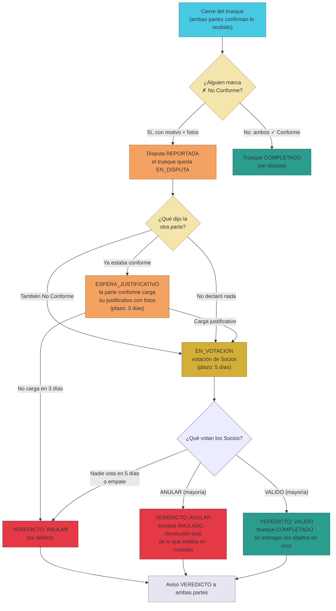

# Manual · Disputas en TrueKeate: qué pasa cuando un trueque sale mal

> Versión en lenguaje sencillo del manual técnico "Disputas v2"
> (`RepoTecnico/Manuales/03-Implementacion/10-disputas-v2.md`).
> Aquí contamos, paso a paso y sin jerga, cómo se resuelve un problema entre
> dos personas que hicieron un trueque: quién reclama, quién se defiende,
> cómo votan los Socios y qué significa cada veredicto. Pensado para público
> general: si te pasa, sabrás exactamente qué hacer.

---

## 1. Empezar en 5 minutos

Un **trueque** en TrueKeate termina bien cuando **ambas partes** dicen "✓
Recibido, conforme". Pero si una parte dice "✗ No conforme" (no estoy de
acuerdo con lo que recibí), el trueque entra en **disputa** y se resuelve
entre todos. El camino es este:

1. **Declaras "✗ No Conforme"** al cerrar el trueque: escribes el **motivo**
   y subes **fotos** como prueba. Nace la disputa.
2. **La otra parte responde**: si está conforme, carga su **justificativo**
   con fotos (tiene **3 días**); si tampoco está de acuerdo, declara su
   propio No Conforme con motivo y fotos.
3. **Los Socios votan** durante **5 días**: cada uno elige entre
   **ANULAR** (se cancela el trueque y cada uno recupera lo suyo) o
   **VALIDO** (el trueque es válido y se completa).
4. **Se aplica el veredicto** y ambas partes reciben un aviso con el
   resultado y el motivo.

> Regla de oro: la disputa **solo puede nacer en el cierre del trueque**,
> cuando una parte marca "✗ No Conforme" y explica por qué con motivo y
> fotos. No se puede abrir una disputa "de la nada" sobre un trueque que ya
> se cerró conforme.

---

## 2. El camino completo, paso a paso

<!-- GENERAR_IMAGEN: flujo-disputas-v2.svg -->

### 2.1 Los estados que verás en la pantalla

| Estado | Qué significa, en cristiano |
|---|---|
| **Reportada** | Acabas de declarar ✗ No Conforme (o te lo declararon a ti). La disputa existe y espera la postura de la otra parte |
| **Esperando justificativo del conforme** | La otra parte está conforme y tiene **3 días** para cargar sus fotos de justificativo |
| **Votación de Socios abierta** | Ya hay pruebas de ambas partes (o venció el justificativo) y los **Socios** están votando durante **5 días** |
| **Resuelta** | Hay veredicto: **ANULAR** o **VALIDO**, con su explicación |

---

## 3. Si eres tú quien reclama (el reclamante)

Pasos concretos:

1. En el cierre del trueque, pulsa **"✗ No Conforme"** (botón de *Trueke
   Central*).
2. Completa el **formulario**:
   - **Motivo** (obligatorio): describe qué no coincide con lo acordado.
     Ejemplo: *"Lo que recibí no coincide con lo acordado: la cámara tiene
     una raya en el lente que no aparecía en las fotos."*
   - **Fotos** (obligatorias, mínimo 1): fotos claras de lo que recibiste y
     del problema.
3. Envías. La disputa queda **reportada** y la otra parte recibe un aviso
   para que declare su postura.
4. Desde **⚖️ Disputas** (tu sección de la suite) puedes seguir el avance y
   pulsar **"🔍 Ver pruebas de ambas partes"** cuando haya respuestas.

> Tú **no cargas justificativo**: ese paso es de la parte que está conforme.
> Tampoco votas: la votación es de los Socios (ver sección 5).

---

## 4. Si eres la otra parte (la contraparte)

Tienes **dos caminos**, y la pantalla te los muestra con botones:

### 4.1 Estás conforme con lo que recibiste → carga tu justificativo

1. Pulsa **"✓ Estoy conforme — cargar justificativo"**.
2. Sube **fotos** que demuestren tu versión (mínimo 1; puedes subir hasta 5).
   Ejemplo: *foto del objeto tal como lo enviaste, del embalaje, del envío*.
3. Envías. Con tus fotos, la disputa pasa a **votación de Socios**.
   ⚠️ Si **no cargas nada en 3 días**, la disputa se resuelve **ANULAR por
   defecto**: el trueque se cancela y se devuelve todo. ¡No dejes pasar el
   plazo!

### 4.2 Tampoco estás conforme → declara tu propio No Conforme

1. Pulsa **"✗ También No Conforme"**.
2. Escribe tu **motivo** (obligatorio) y sube tus **fotos** de evidencia.
3. Envías. Como **ambas partes aportaron pruebas**, la disputa pasa
   directamente a **votación de Socios** (sin esperar justificativo).

> Importante: si tú eras quien ya estaba conforme (lo firmaste al cerrar),
> tu camino es el **justificativo**. El "También No Conforme" solo aparece si
> aún no habías firmado tu postura en el cierre.

---

## 5. Si eres Socio: votas la disputa

Los **Socios** son los miembros de confianza de la comunidad (buena
reputación) que resuelven los desacuerdos. Si eres Socio, en tu sección
**⚖️ Disputas** verás la pestaña **"🏛️ Votación de Socios"** con las disputas
en votación.

1. Pulsa **"📂 Ver caso y votar"**: se abre la ventana (flotante) con el
   caso completo.
2. **Observa las pruebas de ambas partes**: las fotos del **reclamo** del
   reclamante y las del **justificativo** del conforme. Pulsa cada foto para
   ampliarla (🔍).
3. Lee el **motivo** del reclamo y el conteo de votos actual
   (n ANULAR · m VALIDO).
4. Vota:
   - **🗳️ ANULAR — devolución total**: crees que el trueque no se cumplió y
     hay que anularlo (cada uno recupera lo que dejó en custodia).
   - **🗳️ VALIDO — completar trueke**: crees que el trueque es válido y debe
     completarse (los objetos se entregan en cruz: A recibe lo de B y B lo
     de A).

Reglas de la votación (punto 4 del director):

- **1 voto por Socio** y por disputa.
- Si **eres parte** del trueque en disputa, **no puedes votar** (estás
  involucrado).
- Si la votación vence (5 días) **sin votos**, se aplica **ANULAR por
  defecto**. Si venció **con votos**, gana la **mayoría simple**; si hay
  **empate**, se aplica **ANULAR**.
- Si votan **todos** los Socios elegibles antes del plazo, el veredicto se
  aplica en ese momento (no hace falta esperar los 5 días).

---

## 6. Los dos veredictos posibles

| Veredicto | Qué pasa con el trueque | Qué pasa con los objetos |
|---|---|---|
| **ANULAR** | El trueque queda **ANULADO** (se deshace) | **Devolución total**: cada parte recupera el objeto que dejó en custodia |
| **VALIDO** | El trueque queda **COMPLETADO** | **Entrega en cruz**: el objeto de A pasa a B y el de B pasa a A |

Cuando se resuelve, **ambas partes** reciben un aviso (campana 🔔) de tipo
**"Veredicto de tu disputa"** con el resultado y su explicación. El caso
queda cerrado en tu sección de Disputas con su estado **Resuelta**, el
veredicto y la resolución.

> Ejemplo real: Ana envía su bicicleta y recibe de Bruno un curso que
> resultó no ser lo prometido. Ana marca ✗ No Conforme con fotos del correo
> prometido vs. lo recibido. Bruno estaba conforme → carga su justificativo
> (fotos del programa). Los Socios ven ambas pruebas. Si votan ANULAR, Ana
> recupera su bici y Bruno su curso; si votan VALIDO, el trueque se completa
> y ambos se quedan con lo recibido.

---

## 7. Preguntas frecuentes

**¿Puedo abrir una disputa después de haber cerrado conforme?**
No. La disputa nace **solo** en el momento del cierre, cuando marcas ✗ No
Conforme con motivo y fotos. Si ya cerraste conforme, el trueque sigue su
curso normal.

**¿Qué pasa si la otra parte no hace nada?**
Si estaba conforme y no carga su justificativo en **3 días**, ganas por
defecto: la disputa se resuelve **ANULAR** (devolución total).

**¿Cuánto dura una disputa?**
Depende: el justificativo tiene **3 días** y la votación **5 días**. Si se
resuelve antes (por ejemplo, todos los Socios votan enseguida o ambas partes
declaran No Conforme de entrada), puede cerrarse en minutos.

**¿Un Socio puede votar si es parte del trueque?**
No. Los Socios involucrados en el trueque no votan (evita conflictos de
interés).

**¿Dónde veo mis disputas?**
En la suite, sección **⚖️ Disputas** (`/suite/disputas`). Ahí ves tus
disputas activas, el botón para ver las pruebas de ambas partes y (si eres
Socio) la votación abierta.

**¿Y si no soy Socio? ¿Puedo ver la votación?**
La votación es de los Socios, pero si eres **parte** de la disputa siempre
puedes abrir tu caso y ver las pruebas de ambas partes y los votos.

---

## 8. Glosario de este manual

| Palabra | Significado |
|---|---|
| **No Conforme** | Tu declaración de que lo recibido no cumple lo acordado |
| **Justificativo** | Las fotos que carga la parte conforme para defender su versión |
| **Reclamante** | Quien declaró ✗ No Conforme primero |
| **Contraparte** | La otra persona del trueque |
| **Socio** | Miembro de confianza de la comunidad que vota las disputas |
| **EN_DISPUTA** | Estado del trueque mientras hay disputa abierta |
| **RESOLUCION_SOCIOS** | Estado del trueque mientras los Socios votan |
| **ANULAR** | Veredicto: se deshace el trueque y se devuelve todo |
| **VALIDO** | Veredicto: el trueque se completa y se entrega en cruz |
| **Evidencia** | Las fotos que sube cada parte como prueba |
| **Votación** | Período (5 días) en que los Socios eligen el veredicto |

¡Listo! Ya sabes cómo se resuelven los desacuerdos en TrueKeate. El siguiente
manual explica la sección **VALOR**: tus criptos, tu reputación y la moneda
BRLT.
