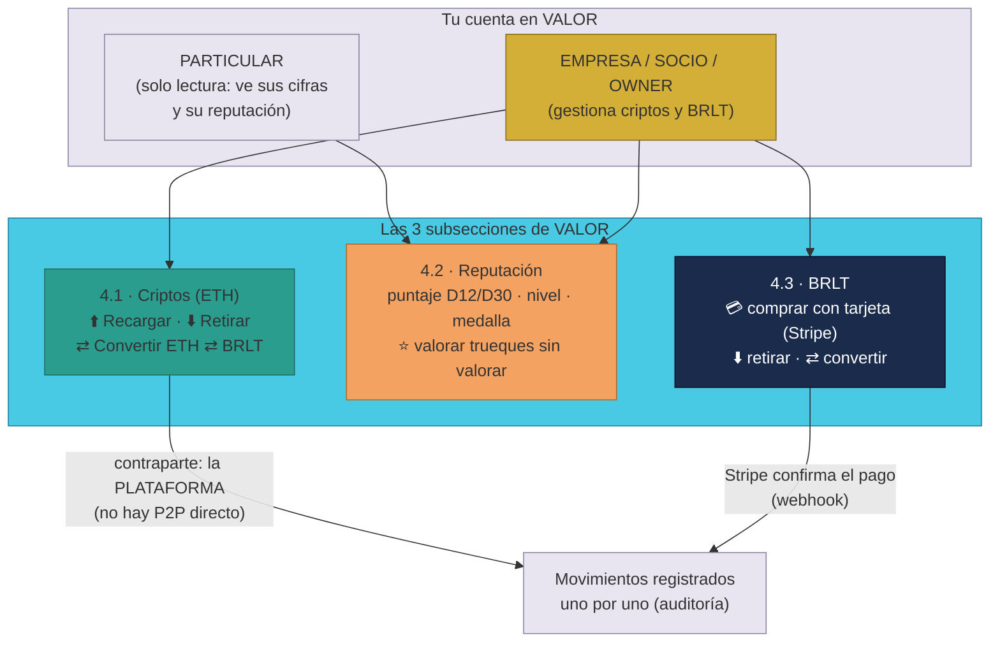

# Manual · Tu sección VALOR: criptos, reputación y BRLT

> Versión en lenguaje sencillo del manual técnico "Sección VALOR"
> (`RepoTecnico/Manuales/03-Implementacion/11-seccion-valor.md`).
> Aquí contamos qué es la sección **💎 VALOR** de la suite (antes llamada
> "Finanzas"): tus criptos, tu reputación y la moneda de la plataforma
> (BRLT). Pensado para público general: con ejemplos de montos y pasos
> numerados.

---

## 1. Empezar en 5 minutos

**VALOR** es tu sección personal de dinero y confianza dentro de TrueKeate.
Tiene **3 subsecciones**:

1. **4.1 · Criptos**: tu saldo de ETH. Puedes **recargar**, **retirar** o
   **convertir** a BRLT. Regla importante: los movimientos son **siempre con
   la plataforma** — entre personas la cripto solo se mueve a través de un
   Trueke (nada de enviar cripto "de mano en mano").
2. **4.2 · Reputación**: tu puntaje (de 0 a 100), tu nivel y tu medalla. Aquí
   también valoras (del 1 al 5) a las personas con las que completaste
   trueques y aún no valoraste.
3. **4.3 · BRLT**: la moneda de la plataforma. Puedes **comprarla con tu
   tarjeta** (pago alojado por Stripe), convertirla y retirarla.

> ¿Quién puede usar cada parte? **Todo inscrito** ve su VALOR (sus saldos y
> su reputación). Pero **gestionar** criptos y BRLT (recargar, retirar,
> comprar con tarjeta) es de **Empresas, Socios y el Owner**. Si tu cuenta es
> Particular, verás tus cifras con "—" y un aviso explicándote la regla.

---

## 2. El panorama de la sección

<!-- GENERAR_IMAGEN: valor-seccion.svg -->

> La idea central de diseño (decisión del director): **tu cripto siempre se
> mueve contra la plataforma**, nunca en transferencias directas entre
> usuarios. Entre dos personas, la cripto solo viaja dentro de un trueque
> (que ya tiene su propia custodia). Esto hace los movimientos ordenados,
> auditables y seguros.

---

## 3. 4.1 · Criptos (ETH): recargar, retirar y convertir

### 3.1 Qué ves

Una tarjeta "4.1 · Criptos" con tu saldo de **ETH** (por ejemplo `0,5 ETH`)
y el botón de estado: "Gestionás cripto" (verde) o "Solo lectura" (gris).

### 3.2 Recargar ETH (paso a paso)

1. Escribe el **monto** en el campo (por ejemplo `0,5`).
2. Pulsa **"⬆️ Recargar ETH"**.
3. La plataforma te acredita el ETH (la contraparte del movimiento es la
   plataforma). Verás el aviso: *"✅ 0,5 ETH recargados (contraparte: la
   plataforma)"*.

### 3.3 Retirar ETH

1. Escribe el **monto**.
2. Pulsa **"⬇️ Retirar ETH"**.
3. La plataforma envía el ETH **a tu billetera**. El movimiento queda
   registrado como retiro.

### 3.4 Convertir ETH ⇄ BRLT

1. Escribe la **cantidad**.
2. Pulsa **"⇄ ETH → BRLT"** (o **"⇄ BRLT → ETH"**).
3. La conversión usa la **tasa interna de la plataforma**
   (1 ETH ≈ 3.000 BRLT, configurable). Ejemplo: conviertes `0,5 ETH` →
   recibes `1.500 BRLT`. Si conviertes `1.500 BRLT` → recibes `0,5 ETH`.

> Si tu saldo no alcanza para retirar o convertir, la app te avisa:
> **"Saldo insuficiente"**.

---

## 4. 4.2 · Reputación y valoraciones pendientes

### 4.1 Tus tres números

En la tarjeta "4.2 · Reputación" ves:

- **Puntaje (D12/D30)**: un número de 0 a 100 que mezcla tu reputación
  (50 %), tu volumen de trueques (30 %) y tu historial sin apelaciones
  (20 %).
- **Media de valoraciones**: el promedio de las notas (1–5) que te pusieron.
- **Trueques completados**: cuántos trueques cerraste con éxito.

De tu puntaje salen tu **nivel** (INICIADO, COMÚN, FRECUENTE, SOCIO) y tu
**medalla** (🥉 BRONCE, 🥈 PLATA, 🥇 ORO).

### 4.2 Valorar a alguien con quien truequeaste (paso a paso)

Después de un trueque completado, TrueKeate te invita a valorar a la otra
persona. Si no lo hiciste, el trueque aparece en **"Trueques sin valorar"**:

1. Localiza el trueque pendiente (por ejemplo: *"Bicicleta ⇄ Curso, con
   0x1234…abcd, completado el 05/09/2026"*).
2. Pulsa **"⭐ Valorar 1–5"**.
3. Se despliegan las **5 dimensiones**: Aceptación, Honestidad, Seguridad,
   Confiabilidad y Compromiso. En cada una eliges un número del 1 al 5.
   Ejemplo: aceptación 5, honestidad 4, seguridad 5, confiabilidad 5,
   compromiso 4.
4. La app te pide **una firma** con tu billetera ("valorar trueque").
5. Pulsa **"Enviar valoración"**. Verás: *"✅ Valoración enviada (D18)"*.

Debajo verás la tabla **"Tus últimos 10 trueques valorados"** con el
promedio ★ de cada uno.

---

## 5. 4.3 · BRLT: la moneda de la plataforma

**BRLT** (BorloTokens) es la moneda interna de TrueKeate. Gestionarla es de
**Empresas, Socios y el Owner**; quien no la gestiona ve el aviso y su saldo
como "—".

### 5.1 Comprar BRLT con tu tarjeta (paso a paso)

1. Escribe cuántos **BRLT** quieres comprar (por ejemplo `500`).
2. Pulsa **"💳 Comprar con Stripe"**.
3. La plataforma crea una página de pago **alojada por Stripe** (no guarda
   tus datos de tarjeta): se abre en otra pestaña y pagas con tu tarjeta
   (fiat, por ejemplo dólares).
4. Cuando Stripe **confirma el pago**, la plataforma te **acredita los
   BRLT** (lo confirma automáticamente por su *webhook*).
5. Vuelves a VALOR con el aviso *"✅ Abriendo Stripe Checkout..."* y tu saldo
   BRLT actualizado.

> ⚠️ En el entorno de pruebas/demostración (sin la clave secreta de Stripe
> configurada), el botón no abre el pago real: registra el movimiento como
> **demo** y te informa del número de movimiento creado. En producción, con
> la clave configurada, el pago con tarjeta funciona de verdad.

### 5.2 Retirar BRLT

1. Escribe el **monto**.
2. Pulsa **"⬇️ Retirar BRLT"**.
3. Se debita tu saldo y queda registrado el retiro. El **desembolso real a
   dinero fiat** se haría por **Stripe Payouts** cuando la cuenta Stripe esté
   vinculada; en este entorno se registra la salida y se te avisa.

### 5.3 Convertir BRLT ⇄ ETH

Usa los botones de la subsección 4.1 (⇄ ETH → BRLT o ⇄ BRLT → ETH) a la tasa
interna (1 ETH ≈ 3.000 BRLT).

---

## 6. Movimientos recientes (tu historial)

Al pie de la sección verás **"Movimientos recientes"**: las últimas 10
operaciones de tu VALOR, una por línea, con su tipo, moneda y monto.
Ejemplos de lo que verás:

| Tipo | Moneda | Monto | Qué fue |
|---|---|---|---|
| `RECARGA_CRIPTO` | ETH | 0,5 | Recargaste ETH |
| `CONVERSION` | ETH→BRLT | 0,5 | Convertiste 0,5 ETH a BRLT |
| `RETIRO_BRLT` | BRLT | 300 | Retiraste BRLT |
| `RETIRO_CRIPTO` | ETH | 0,2 | Retiraste ETH a tu billetera |

---

## 7. Preguntas frecuentes

**¿Puedo enviar ETH directamente a otro usuario?**
No por VALOR: los movimientos de cripto son **siempre con la plataforma**
como contraparte. Si quieres intercambiar cripto con otra persona, hazlo a
través de un **Trueke** (el flujo de trueque custodia y libera).

**¿Por qué mi saldo aparece como "—"?**
Porque tu cuenta es **PARTICULAR**: la gestión de criptos y BRLT es de
**Empresas, Socios y el Owner**. Tu reputación y tus valoraciones sí están
disponibles siempre.

**¿Cuál es la tasa ETH ⇄ BRLT?**
La define la plataforma: por defecto **1 ETH ≈ 3.000 BRLT** (configurable por
variables de entorno). La app siempre te muestra la tasa vigente.

**¿Cómo sé que un pago con tarjeta se acreditó?**
Stripe confirma el pago y la plataforma lo procesa automáticamente (webhook):
tu saldo BRLT sube y el movimiento aparece en tu historial. En demostración
(sin Stripe configurado) el movimiento se registra como demo y se te avisa.

**¿Qué pasa con mis trueques completados sin valorar?**
Quedan en la lista "Trueques sin valorar" de 4.2 hasta que valores (1–5 en
las 5 dimensiones) o desaparezcan de la lista. Valorar ayuda a toda la
comunidad: alimenta la reputación de la otra persona.

**¿Retirar BRLT me da dinero en mi banco?**
En este entorno el retiro **se registra** y se te avisa; el desembolso real a
fiat requiere **Stripe Payouts** con la cuenta vinculada (pendiente de
configurar en producción).

---

## 8. Glosario de este manual

| Palabra | Significado |
|---|---|
| **VALOR** | Tu sección de criptos, reputación y BRLT (antes "Finanzas") |
| **ETH** | La cripto (ether) que puedes recargar, retirar y convertir |
| **BRLT** | La moneda interna de TrueKeate (BorloTokens) |
| **Contraparte** | El "otro lado" del movimiento: en VALOR siempre es la plataforma |
| **P2P** | Enviar cripto directamente entre personas (no se usa en VALOR) |
| **Tasa de conversión** | Cuántos BRLT vale 1 ETH (por defecto 3.000) |
| **Reputación** | Tu puntaje 0–100 con nivel y medalla (D12/D30) |
| **Valoración** | Nota del 1 al 5 en 5 dimensiones que dejas al cerrar un trueque |
| **Stripe** | Empresa que cobra con tarjeta; aloja la página de pago |
| **Webhook** | Aviso automático de Stripe que confirma el pago |
| **Stripe Payouts** | El mecanismo para pagarte en fiat cuando retiras (pendiente) |
| **Fondo de Valor** | La hucha común de la plataforma (ver manual de finanzas) |

¡Listo! Ya conoces tu sección VALOR. El manual de disputas (anterior) te
explica cómo se resuelve un trueque problemático.
