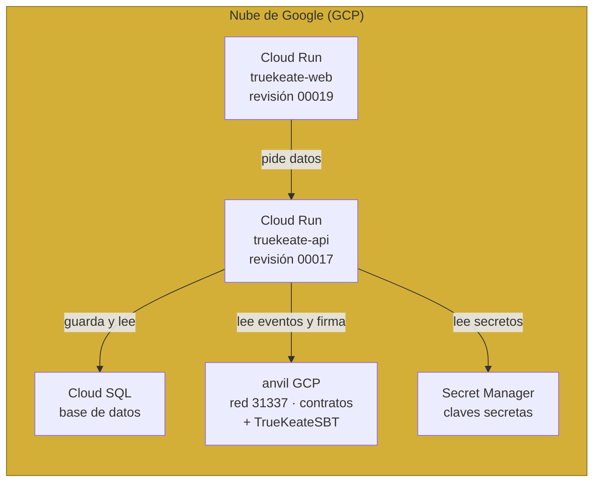
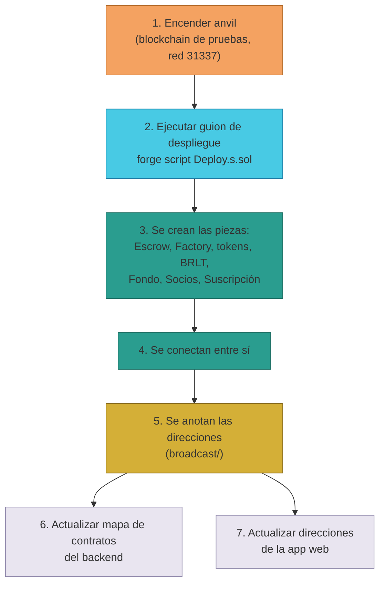
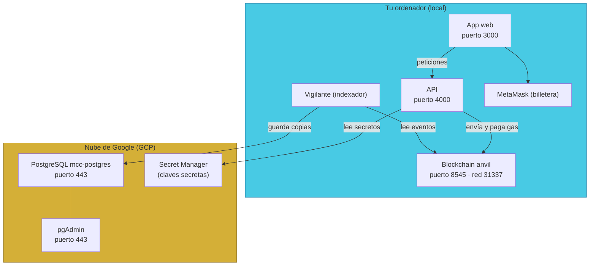

# Manual · Dónde vive TrueKeate y cómo se actualiza

> Versión en lenguaje sencillo del manual técnico de despliegue.
> Aquí contamos en qué "casas" vive TrueKeate y cómo se levanta y actualiza.

---

## 1. Empezar en 5 minutos

TrueKeate corre en dos tipos de "casa":

1. **Tu ordenador (local)**: una blockchain de pruebas llamada **anvil** que
   simula todo. Útil para probar.
2. **La nube de Google (GCP)**: donde viven los servicios compartidos de
   datos y donde, desde 2026-09, también corre la versión de **producción**
   de TrueKeate.

Para levantar TrueKeate en tu ordenador, el camino es:

1. Arranca la blockchain de pruebas: `anvil` (red 31337).
2. Despliega los contratos: un comando de Foundry los crea.
3. Prepara la base de datos: aplica el esquema (una sola vez).
4. Enciende los servidores: vigilante (indexador), camarero (API) y app web.
5. ¡Listo! Abres http://localhost:3000 y TrueKeate funciona.

> El mensajero (relayer) no tiene botón propio: la API lo usa por dentro
> (ver manual 03-stack-backend).

---

## 2. Las dos casas de TrueKeate

### 2.1 Casa local: anvil (red 31337)

anvil es un simulador de blockchain que corre en tu ordenador. Es rápido y
gratis, perfecto para probar sin miedo a romper nada.

Dos cuentas importantes en las pruebas:

| Cuenta | Quién es | Para qué sirve |
|---|---|---|
| Cuenta 0 | El Owner | Crea (despliega) los contratos |
| Cuenta 1 | La plataforma | El relayer: paga el gas |

### 2.2 Casa en la nube: GCP (proyecto `truekeate-main`)

En la nube, TrueKeate reutiliza servicios de Google compartidos con otros
proyectos:

- Una blockchain anvil (red 31337) para probar en la nube.
- PostgreSQL (base de datos) con pgAdmin (herramienta de administración).
- **Secret Manager**: la caja fuerte de Google donde se guardan las claves
  secretas (contraseñas de la base de datos, llaves privadas).

**¡Buenas noticias! Desde 2026-09 ya existe un despliegue de producción
operativo en la nube** (registrado en el estado del proyecto):

- La API y la web corren en **Cloud Run** (servicios `truekeate-api` y
  `truekeate-web`).
- La base de datos vive en **Cloud SQL**.
- Los contratos, en el anvil remoto de GCP (red 31337), incluida la
  credencial de certificación **TrueKeateSBT** (`0x8705…3638`).
- Últimas versiones publicadas (2026-09-08): **API revisión 00017 · web
  revisión 00019**.

<!-- GENERAR_IMAGEN: produccion-gcp.svg -->


> ⚠️ Pendiente de confirmar: los archivos de configuración del entorno siguen
> apuntando a un proyecto de Google llamado "MCC" (de otro proyecto). El
> despliegue de producción existe y funciona, pero sus datos operativos
> concretos (nombres y puertos exactos de servicios) no están versionados en
> este repositorio → el detalle fino queda **pendiente de confirmar**.

### 2.3 Las recetas automáticas (contenedores y tuberías CI)

TrueKeate también trae "recetas" para levantar sus servidores de forma
repetible:

- `backend/Dockerfile`: la receta del backend como contenedor.
- `scripts/cloudbuild.yaml`: la tubería de Google Cloud Build que construye
  la imagen de la web y la publica en Cloud Run.
- `deploy-gcp.sh` y `deploy-local.sh`: botones para desplegar en la nube o en
  tu ordenador (junto a `deploy-local.ps1`, `start*.sh`, `stop*.sh` y
  `verify-setup.sh` para encender y apagar todo).

> ⚠️ Ojo con una discrepancia: esas recetas mencionan nombres de contratos
> (p. ej. `SBTRegistry`, `UserRegistry`, `Exchange` o `Subscription`) que **no
> coinciden** con los contratos reales del código (`sc/src/` ni
> `backend/contratos.json`). Su correspondencia exacta está **pendiente de
> confirmar**. El registro fiable de qué versión está desplegada es el
> documento interno "estado del proyecto" (revisiones api/web por ciclo).

---

## 3. Las llaves secretas: el Secret Manager

Los secretos son como las llaves de casa: nadie debe verlas.

- TrueKeate guarda en el Secret Manager: la contraseña de la base de datos,
  la clave del administrador y la clave del relayer.
- Un script (llamado `gcp-env.sh`) las lee **sin imprimirlas nunca** en
  pantalla ni guardarlas en archivos.
- El Owner es el **custodio** de las llaves principales y debe **rotarlas**
  (cambiarlas) periódicamente.

Desde 2026-09, la **certificación con carné SBT** trajo otras variables de
entorno. No todas son secretas: unas son direcciones públicas y otras sí son
llaves de casa:

| Variable | Qué es, en cristiano | ¿Es secreta? |
|---|---|---|
| `SBT_ADDRESS` | La dirección del contrato `TrueKeateSBT` (la "fábrica de carnés"). Sirve para mirar si tu billetera ya tiene carné o para emitirte uno. En producción: `0x8705…3638` | No (es una dirección pública) |
| `SBT_ALLOWLIST` | La lista de carnés SBT **de otras plataformas** que TrueKeate reconoce como válidos (direcciones separadas por coma) | No (son direcciones públicas) |
| `MINTER_PRIVATE_KEY` | La llave del "minter": quien firma la emisión de tu carné. Si no se configura, se usa la del relayer | **Sí** |
| `KYC_EMAIL_USER` / `KYC_EMAIL_PASS` | Usuario y contraseña del correo que envía el **código de verificación** | **Sí** |
| `KYC_EMAIL_HOST` / `KYC_EMAIL_PORT` | Servidor y puerto de ese correo (por defecto `smtp.gmail.com` y `465`) | No |

> ⚠️ Sin correo configurado, la plataforma entra en **modo demostración** y usa
> un código de ejemplo. Y si falta la llave del minter, el carné se **simula**:
> la certificación SBT queda incompleta en la cadena.

Regla de seguridad:

1. Nunca escribas una clave secreta en un archivo del proyecto.
2. Nunca pegues una clave en un chat o en un correo.
3. Usa siempre el Secret Manager para leerlas.

---

## 4. Cómo se despliegan los contratos (paso a paso)

### 4.1 Antes de empezar

Necesitas:

1. La blockchain de pruebas encendida (anvil) o un acceso remoto.
2. La clave privada del Owner (cuenta 0).
3. Las librerías de contratos descargadas.

### 4.2 El comando mágico

```
forge script script/Deploy.s.sol --rpc-url http://localhost:8545 \
  --private-key <clave-del-owner> --broadcast
```

Traducción: "taller de Foundry, ejecuta el guion de despliegue contra la red
local, firmando con la clave del Owner, y publica el resultado".

### 4.3 Qué crea el guion, en orden

1. El **Escrow** (la caja fuerte).
2. La **fábrica de cuentas** (SmartAccountFactory).
3. Dos **criptos de prueba** (para simular trueques).
4. Un **NFT de prueba**.
5. La **moneda BRLT**, el **Fondo de Valor**, el **padrón de Socios** y las
   **suscripciones de empresa**.
6. **Conecta las piezas** entre sí (por ejemplo: la moneda con el fondo).
7. Anota las direcciones de cada pieza (como si apuntara las direcciones de
   las nuevas tiendas en un mapa).

### 4.4 Después del despliegue

1. Actualiza el **mapa de contratos** del backend (para que el vigilante sepa
   dónde escuchar). En producción (2026-09) ese mapa ya incluye la clave
   **`TrueKeateSBT`** con su dirección `0x8705…3638`.
2. Actualiza las **direcciones** en la app web si es necesario.

<!-- GENERAR_IMAGEN: despliegue-contratos.svg -->


> ⚠️ Pendiente de confirmar: el guion conecta el Escrow con el padrón de
> Socios en el código del contrato, pero **esa conexión no se ejecuta** en el
> guion de despliegue actual. Esa vinculación queda **pendiente de confirmar**
> en un guion posterior.

### 4.5 El carné de certificación (TrueKeateSBT)

TrueKeateSBT es el contrato que emite los **carnés de certificación** (los
SBT: ver manual 03 · certificación SBT). Su despliegue es un caso aparte:

- **No lo crea el guion normal.** El guion de despliegue habitual
  (`Deploy.s.sol`) no despliega TrueKeateSBT.
- Se desplegó **de forma puntual** sobre el anvil de GCP, con la cuenta 1 (la
  de la plataforma) como *minter* (quien firma la emisión). El comando exacto
  de ese despliegue no está guardado en el repositorio → **pendiente de
  confirmar**.
- En funcionamiento, la API encuentra el contrato leyendo `SBT_ADDRESS` o la
  dirección guardada en el mapa de contratos (`contratos.TrueKeateSBT`), y
  firma las emisiones con `RELAYER_PRIVATE_KEY` o `MINTER_PRIVATE_KEY`.

---

## 5. Cómo se encienden los servidores

### 5.1 Preparar la base de datos (solo la primera vez)

```
psql "$DATABASE_URL" -f backend/db/schema.sql
```

Crea las tablas y tipos. Es seguro repetirlo: si algo ya existe, no lo duplica.

### 5.2 El vigilante (indexador)

```
node backend/indexador-cli.js          # una pasada rápida
node backend/indexador-cli.js --watch  # modo vigilante: escucha siempre
```

El modo `--watch` revisa la blockchain cada 5 segundos (por defecto) y copia
lo nuevo a la base de datos.

### 5.3 El camarero (API)

```
npm run api
```

Arranca la API en http://127.0.0.1:4000 (puerto configurable). Puedes
comprobar que vive con un chequeo de salud: `GET /healthz`.

### 5.4 La app web

```
cd web
npm run dev      # desarrollo: http://localhost:3000
npm run build    # preparar la versión final
npm start        # servir la versión final
```

---

## 6. El mapa de conexiones (red y puertos)

<!-- GENERAR_IMAGEN: red-puertos.svg -->


| Componente | Dónde está | Puerta (puerto) |
|---|---|---|
| Blockchain de pruebas | local | 8545 (red 31337) |
| API | local | 4000 |
| App web | local | 3000 |
| API de producción (`truekeate-api`) | nube de Google (Cloud Run) | internet · detalle **pendiente de confirmar** |
| App web de producción (`truekeate-web`) | nube de Google (Cloud Run) | internet · detalle **pendiente de confirmar** |
| Base de datos de producción | nube de Google (Cloud SQL) | detalle **pendiente de confirmar** |
| Carné de certificación (TrueKeateSBT) | anvil de la nube (GCP) | dirección `0x8705…3638` (red 31337) |
| PostgreSQL (compartido) | nube de Google | 443 |
| pgAdmin | nube de Google | 443 |

---

## 7. Cómo saber que todo está sano: chequeos de salud

Cada servidor tiene un termómetro:

| Servicio | Chequeo | Qué mira |
|---|---|---|
| API | `GET /healthz` | Responde "ok, servicio: truekeate-api" |
| Vigilante | métricas de retraso | ¿Cuántos eventos lleva de retraso? |
| Mensajero | chequeo de salud | ¿Tiene saldo? ¿Está en la red correcta? |

Si el mensajero tiene menos de **0,5 ETH** de saldo, avisa al Owner para que
recargue (así no se quedan los trueques sin gas).

---

## 8. Respaldo y recuperación

El objetivo declarado:

- **Copia de seguridad diaria**: como mucho se pierden 24 h de datos.
- **Recuperación en 48 h**: si algo se rompe, se restaura en 2 días.
- **Pruebas de restauración**: cada 3 meses se ensaya recuperar todo.
- **Reproceso del vigilante**: si se pierde un evento, se vuelve a leer desde
  un punto anterior (ver manual 03-stack-backend).

> ⚠️ Pendiente de confirmar: estos objetivos están escritos en el diseño, pero
> **no se ha verificado** la implementación operativa de las copias en el
> repositorio.

---

## 9. Qué falta confirmar (resumen)

1. El detalle fino del entorno de producción en la nube (`truekeate-api`,
   `truekeate-web`, Cloud SQL, anvil GCP): el despliegue existe y funciona
   desde 2026-09, pero **no está versionado** en este repositorio y los
   archivos de configuración siguen apuntando al proyecto "MCC" →
   **pendiente de confirmar**.
2. Las recetas automáticas (Docker, Cloud Build y `deploy-gcp.sh`) usan
   nombres de contratos distintos a los reales (`SBTRegistry`,
   `UserRegistry`...) → **pendiente de confirmar**.
3. La conexión Escrow ↔ Socios en el guion de despliegue → **pendiente de confirmar**.
4. El mensajero (relayer) como servicio independiente con 2 copias y cola de
   reintentos → **pendiente de confirmar**.
5. La cadena pública definitiva de producción no está decidida: hoy la
   versión de producción corre sobre el anvil de GCP (red de pruebas 31337)
   → **pendiente de confirmar**.
6. Las copias de seguridad operativas y el plan B del mensajero →
   **pendiente de confirmar**.
7. El comando exacto del despliegue de TrueKeateSBT no está versionado (no
   está en el guion habitual; la dirección de producción sí está registrada)
   → **pendiente de confirmar**.

---

## 10. Glosario de este manual

| Palabra | Significado |
|---|---|
| **Despliegue** | Poner el software a funcionar en un lugar |
| **Entorno** | Un lugar donde corre el software (local, nube...) |
| **Cloud Run** | Servicio de Google que ejecuta la API y la web de producción |
| **Cloud SQL** | Base de datos gestionada de Google (producción) |
| **Contenedor** | Paquete con la app y todo lo que necesita para funcionar |
| **CI / tubería** | Receta automática que construye y publica la app |
| **RPC** | La puerta por la que se habla con la blockchain |
| **Broadcast** | Publicar la transacción en la red |
| **Secret Manager** | Caja fuerte de Google para claves secretas |
| **SBT / carné** | Credencial digital de certificación que no se transfiere |
| **Health-check** | Chequeo de salud de un servicio |
| **Backup** | Copia de seguridad |
| **Puerto** | Número de puerta por el que entra el tráfico |

¡Fin de los manuales de TrueKeate! Ya conoces la plataforma (01), su
tecnología web3 (02), sus servidores (03), su app (04), sus piezas (dependencias)
y sus casas (despliegue).
