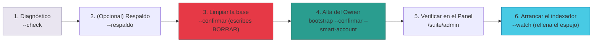

# Manual · Reiniciar TrueKeate y dar de alta al Owner

> Versión en lenguaje sencillo del manual técnico
> "Operación: reinicio limpio y bootstrap del Owner"
> (`RepoTecnico/Manuales/04-Despliegue/02-reinicio-y-bootstrap.md`).
> Aquí contamos, para quien opera TrueKeate, cómo hacer una **limpieza
> completa de la base de datos** (sin tocar la cadena) y cómo **dar de
> alta al Owner** como CERTIFICADO y SOCIO para que pueda usar el Panel.
> Complementa al manual de despliegue `04-Despliegue/01-despliegue.md`.

---

## 1. Empezar en 5 minutos

Si necesitas volver a empezar con datos limpios, la receta es:

1. **Diagnostica**: `reiniciar-plataforma.sh --check` (solo mira, no
   borra).
2. **Limpia** (cuando el director lo ordene):
   `reiniciar-plataforma.sh --confirmar` — borra los datos de las 14
   "carpetas" de la base. **La cadena (anvil) no se toca**.
3. **Da de alta al Owner**:
   `bootstrap-owner.sh --confirmar --smart-account` — registra al Owner
   (cuenta 0) como CERTIFICADO + SOCIO en la base y como Socio en la
   cadena.
4. **Verifica** en el Panel del Owner (`/suite/admin`): usuarios, contratos
   e infraestructura.
5. **Vuelve a llenar el espejo**: arranca el indexador en modo servicio.

> ⚠️ Estos comandos **borran datos**. Siempre se empieza con `--check` y,
> antes de borrar, conviene hacer un respaldo con `--respaldo`.

---

## 2. Las dos cuentas clave (contexto)

| Cuenta | Dirección (anvil por defecto) | Su papel |
|---|---|---|
| **0** | `0xf39F…2266` | **Owner / deployer**: despliega los contratos y es el dueño de ellos |
| **1** | `0x7099…79C8` | **Relayer**: la cuenta general de la plataforma (paga el gas, firma operaciones) |

**El motivo de este manual**: al desplegar, la cuenta 0 queda como Owner
**en la cadena**, pero nadie la da de alta **en la base de datos** como
usuario CERTIFICADO y SOCIO. Sin ese alta, el Panel del Owner
(`/suite/admin`) rechaza la entrada, porque exige que el usuario sea
SOCIO. Por eso existe el "bootstrap" (sembrar al Owner).

---

## 3. Limpiar la base de datos (sin tocar la cadena)

### 3.1 Qué hace el reinicio

- Borra **todos los datos** de las **14 carpetas (tablas)** de la base:
  usuarios, certificaciones, artículos, trueques, valoraciones, puntos de
  encuentro, disputas, imágenes, suscripciones, campañas, subastas,
  finanzas, auditoría y puntos de control del indexador.
- Los números de serie vuelven a empezar (como si las carpetas fueran
  nuevas).

### 3.2 Qué NO hace (a propósito)

- ❌ **No** reinicia ni detiene la **cadena** (anvil): los contratos
  desplegados quedan intactos.
- ❌ **No** vuelve a desplegar contratos ni toca los secretos, los
  servidores en la nube, el relayer ni la API.
- ❌ **No** borra el esquema ni las extensiones especiales (mapas,
  criptografía): solo los datos.

### 3.3 Cómo se usa (con cuidado)

```bash
source /home/dsh/workspace/gcp-env.sh                       # prepara conexiones y claves
bash backend/scripts/reiniciar-plataforma.sh --check        # diagnóstico: conteos, sin borrar
bash backend/scripts/reiniciar-plataforma.sh --confirmar    # borra (te pide escribir BORRAR)
bash backend/scripts/reiniciar-plataforma.sh --confirmar --respaldo   # respaldo previo
```

- **Seguridad**: sin la palabra `--confirmar`, el script solo muestra el
  modo de uso y **no modifica nada**. Con ella, te pide escribir
  **BORRAR** para confirmar.
- Con `--respaldo`, antes de borrar hace una copia de seguridad en la
  carpeta `backups/`.

### 3.4 Después del reinicio

- Para volver a llenar el espejo desde la cadena, arranca el indexador:
  `node backend/indexador-cli.js --watch`. Empieza desde el bloque 0 y
  reconstruye los datos.
- Después, ejecuta el alta del Owner (sección 4) para recuperar la
  identidad operativa.

<!-- GENERAR_IMAGEN: secuencia-reinicio-bootstrap.svg -->


---

## 4. Dar de alta al Owner (el "bootstrap")

### 4.1 Qué hace el script, en orden

1. **Comprueba** que la clave que le das coincide con el Owner on-chain
   del registro de Socios.
2. **Te muestra** la cuenta del relayer (para que sepas con qué clave se
   firmarán las operaciones).
3. **En la base de datos**: registra (o actualiza) al Owner como usuario
   **CERTIFICADO**, tipo y nivel **SOCIO**, medalla **ORO** y con su
   consentimiento de datos personales (GDPR) marcado.
4. **En la cadena**: lo admite como **Socio** en el registro de Socios si
   aún no lo era (la firma el propio Owner).
5. Con la opción `--smart-account`: le despliega su **cuenta inteligente**
   si no existe (arranca en el peldaño INSCRITO de la escalera).

### 4.2 Cómo se usa

```bash
source /home/dsh/workspace/gcp-env.sh
export OWNER_PRIVATE_KEY=<clave privada de la cuenta 0>   # o ADMIN_PRIVATE_KEY
bash backend/scripts/bootstrap-owner.sh --confirmar                  # base + Socio on-chain
bash backend/scripts/bootstrap-owner.sh --confirmar --smart-account  # además, su SmartAccount
```

### 4.3 Nota de honestidad técnica

- La escalera **on-chain** (VERIFICADO/CERTIFICADO) de la cuenta
  inteligente se fija con la **huella real (merkle root)** que genera el
  servicio de certificación cuando alguien hace KYC de verdad.
- Este script registra el CERTIFICADO en la **base de datos** (que es lo
  que el Panel usa para dar permisos) y la admisión como **Socio en la
  cadena**, que es lo comprobable sin un KYC real. Cuando el servicio KYC
  emita la huella, la cuenta inteligente deberá actualizarse a mano con esa
  huella (función técnica `cambiarEstadoVerificacion`).

---

## 5. La secuencia recomendada (producción limpia)

1. `bash backend/scripts/reiniciar-plataforma.sh --check` → diagnóstico.
2. (Solo cuando el director lo ordene)
   `--confirmar --respaldo` → copia de seguridad y limpieza.
3. `bash backend/scripts/bootstrap-owner.sh --confirmar --smart-account` →
   alta del Owner.
4. **Verificar** con la sesión de la cuenta 0:
   - `/admin/usuarios` responde con el Owner presente.
   - `/admin/contratos` muestra las direcciones de los contratos.
   - El relayer aparece en `/admin/infra/health`.
5. Arrancar el indexador en modo servicio (`--watch`) para re-poblar el
   espejo desde la cadena.

---

## 6. Dónde viven los scripts

```
backend/scripts/
├─ reiniciar-plataforma.sh   # entrada: limpieza total de la base (--confirmar)
├─ reiniciar-plataforma.mjs  # motor: borra las 14 tablas (PostgreSQL)
├─ bootstrap-owner.sh        # entrada: alta del Owner CERTIFICADO/SOCIO (--confirmar)
├─ bootstrap-owner.mjs       # motor: base + admisión de Socio + SmartAccount
└─ backups/                  # respaldos opcionales (--respaldo)
```

---

## 7. Glosario de este manual

| Palabra | Significado |
|---|---|
| **Reinicio / limpiar** | Borrar los datos de la base sin tocar la cadena |
| **Bootstrap / sembrar** | Dar de alta al Owner para que pueda operar |
| **Owner** | Cuenta 0: dueña de los contratos y responsable de TrueKeate |
| **Relayer** | Cuenta 1: firma las operaciones de la plataforma |
| **Espejo** | La base que copia lo que ocurre en la cadena |
| **Indexador** | El servicio que llena el espejo leyendo la cadena |
| **SmartAccount** | La cuenta inteligente de un usuario en la cadena |
| **GDPR** | Normativa de protección de datos personales |
| **On-chain** | Lo que vive en la cadena (contratos y cuentas) |
