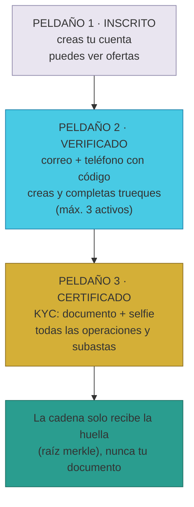
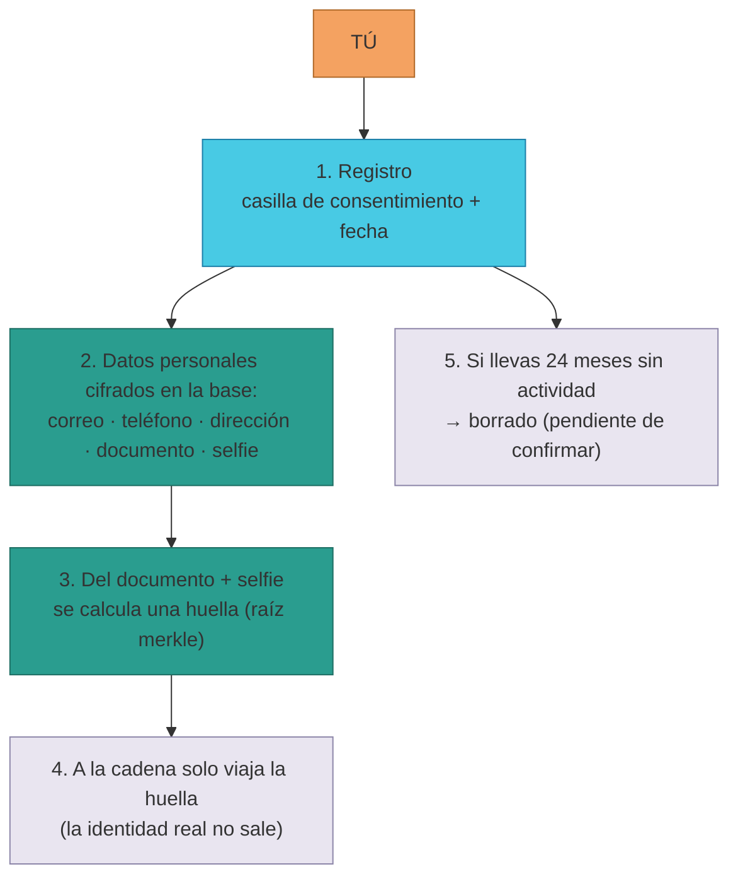
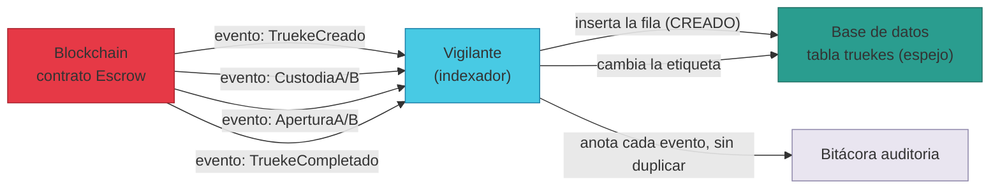

# Manual · Lo que TrueKeate guarda en su base de datos

> Versión en lenguaje sencillo del manual técnico 05 — Diccionario de Datos.
> Aquí contamos qué "carpetas" usa TrueKeate para recordar quién eres, qué
> ofreces y en qué punto está cada trueque, y qué hace con tus datos
> personales.

---

## 1. Empezar en 5 minutos

Cada vez que usas TrueKeate, la plataforma guarda información en una base de
datos (PostgreSQL). Esa información se organiza en **21 carpetas** (los
técnicos las llaman "tablas"). Cada carpeta guarda un tema: tu identidad, tus
artículos, tus trueques, tus notas, tus puntos de encuentro, tus disputas,
tus avisos, tus movimientos de dinero...

Para leer este manual solo necesitas 6 palabras:

| Palabra | Qué significa | Ejemplo |
|---|---|---|
| **Trueque** | Intercambio entre dos personas (AtoA: "de una a otra") | Ana da su bicicleta y recibe el curso de Bruno |
| **Custodia** | El momento en que depositas lo que ofreces en la "caja fuerte" digital (el escrow) | Ana deja su bicicleta guardada |
| **Valoración** | Nota del 1 al 5 que dejas de la otra persona al terminar | Bruno puntúa a Ana al cerrar el trueque |
| **Estado (o etiqueta)** | La marca que dice en qué momento está el trueque (hay 9 posibles) | CREADO, CUSTODIADO, COMPLETADO... |
| **Espejo** | Copia que la base mantiene de lo que ocurre en la blockchain | La ficha del trueque en la base |
| **Wallet** | Tu dirección pública en la blockchain (empieza por "0x"): el DNI digital de tu cuenta | `0x1234...abcd` |

Un paseo de 5 minutos por lo que guarda TrueKeate:

1. Te registras. La base crea tu ficha en la carpeta **usuarios** (con tu
   consentimiento y la fecha, como pide el GDPR).
2. Verificas tu correo y tu teléfono. Subes peldaños de la **escalera de
   verificación** (sección 3.3).
3. Publicas tu bicicleta. Nace una ficha en **articulos**.
4. Tú y Bruno crean el trueque. Nace una ficha en **truekes** que une tus dos
   artículos y tus dos direcciones, con la etiqueta **CREADO**.
5. Cada movimiento en la cadena actualiza esa ficha: cuando alguien deposita
   su objeto pasa a **CUSTODIADO**; cuando ambos terminan, a **COMPLETADO**.
   Esto lo hace el **vigilante** (el indexador), nunca una persona.
6. Al terminar, cada uno deja sus notas: dos fichas nuevas en **valoraciones**.

Y una promesa importante (**D17 / GDPR**): tus datos personales se guardan
**cifrados** y con tu **consentimiento**. De tu documento de identidad solo
viaja a la cadena una "huella" (hash); el documento nunca sale de la base.

---

## 2. Las 21 carpetas y quién las llena

### 2.1 Cuatro clases de carpetas

El esquema separa quién puede escribir cada carpeta. Hay **4 clases**:

| Clase | Carpetas | Quién las escribe | Fuente de verdad |
|---|---|---|---|
| **Espejo de la cadena** | `truekes` y parte de `kyc`, `usuarios`, `finanzas`, `suscripciones` | El **vigilante** (indexador) con los eventos; ⚠️ desde 2026-09 la propia plataforma también actualiza `truekes` en el cierre y las disputas | La blockchain (sus eventos) |
| **Negocio fuera de la cadena** | `articulos`, `valoraciones`, `puntos_encuentro`, `puntos_favoritos`, `disputas`, `evidencias_disputa`, `votos_disputa`, `notificaciones`, `imagenes_certificadas`, `campanas`, `subastas`, `sesiones` | La plataforma (su API) | La propia base + evidencias (fotos, votos, avisos) |
| **Finanzas del socio (VALOR)** | `finanzas` (saldos), `movimientos_valor`, `movimientos_brlt` | La plataforma (sección VALOR) y Stripe (webhook) | La propia base + Stripe |
| **Cocina interna del vigilante** | `auditoria`, `indexador_checkpoint` | El vigilante | El registro de eventos procesados |

La regla más importante: **la blockchain es la única fuente de verdad para
los estados del escrow**. El vigilante solo copia (nunca escribe en la
cadena), y nadie edita el espejo a mano: son los **programas** (vigilante y,
desde 2026-09, la propia plataforma en el flujo de cierre/disputa) quienes
escriben.

### 2.2 El inventario de las 21 carpetas

| Carpeta | Para qué sirve | Ejemplo |
|---|---|---|
| `usuarios` | Quién eres y tu identidad (con tu `@nombre` público desde 2026-09) | La ficha de Ana con su @ana |
| `kyc` | Tu verificación de identidad (documento y selfie), cifrada; desde 2026-09 guarda también la certificación con carné SBT | El trámite de Bruno para ser CERTIFICADO |
| `articulos` | Lo que la gente ofrece al trueque | La bicicleta de Ana |
| `truekes` | Cada trueque y su estado (espejo del escrow) | El trueque bici ↔ curso |
| `valoraciones` | Las notas 1-5 al cierre (se guardan de verdad desde 2026-09-09) | Bruno puntúa a Ana |
| `puntos_encuentro` | Lugares físicos de encuentro (con mapa) | El parque a 3 km |
| `puntos_favoritos` | Los últimos puntos de encuentro que cada persona usa (favoritos) | Bruno guarda el parque como favorito |
| `disputas` | Conflictos del trueque (flujo v2 2026-09-08) con plazos y veredicto | Bruno declara ✗ No Conforme |
| `evidencias_disputa` | **Nueva (2026-09-08)**: las fotos de cada parte de la disputa | Las fotos del reclamo de Bruno y del justificativo de Ana |
| `votos_disputa` | **Nueva (2026-09-08)**: los votos ANULAR/VALIDO de los Socios | 3 votos: 2 ANULAR, 1 VALIDO |
| `notificaciones` | **Nueva (2026-09-08)**: los avisos de tu campana 🔔 | "Veredicto de tu disputa" |
| `imagenes_certificadas` | Fotos con "sello" (huella + firma): anuncios, recepciones y, desde 2026-09, documento y selfie del KYC | La foto certificada de la bici o el DNI de Bruno |
| `suscripciones` | El pago mensual de las empresas | La empresa de Ana paga su mes |
| `campanas` | Ventas masivas o recolectas solidarias | Recolecta de juguetes |
| `subastas` | Subastas de empresas | Subasta del último NFT |
| `finanzas` | Saldos del socio: criptos, BRLT y el Fondo de Valor | El saldo de Bruno |
| `movimientos_valor` | **Nueva (2026-09-09)**: tu historial de movimientos de cripto/BRLT (uno por uno, sin borrar) | "Recarga 0,5 ETH · contraparte: la plataforma" |
| `movimientos_brlt` | **Nueva (2026-09-09)**: tus compras de BRLT con tarjeta (Stripe) y su estado | "500 BRLT · PENDIENTE → PAGADO" |
| `auditoria` | Bitácora: cada evento procesado, sin borrar nada | "Evento CustodiaA, 12:03" |
| `indexador_checkpoint` | Marcapáginas del vigilante | "Contrato Escrow: leído hasta el bloque 1.024" |
| `sesiones` | Tus inicios de sesión con la billetera (tokens de sesión) | "Bruno entró el martes a las 10:03" |

<!-- GENERAR_IMAGEN: glosario-datos.svg -->
```mermaid
flowchart TB
    subgraph espejo["Espejo de la cadena<br/>(el vigilante escribe; la API ajusta truekes en cierres/disputas)"]
        T1[truekes<br/>estado del trueque]
        T2[kyc · huella merkle]
        T3[usuarios · parte]
        T4[finanzas · saldo BRLT]
        T5[suscripciones]
    end
    subgraph negocio["Negocio fuera de la cadena<br/>(la escribe la plataforma)"]
        N1[articulos]
        N2[valoraciones]
        N3[puntos_encuentro]
        N4[disputas + evidencias_disputa<br/>+ votos_disputa]
        N5[notificaciones · campana]
        N6[imagenes_certificadas]
        N7[campanas]
        N8[subastas]
        N9[puntos_favoritos]
        N10[sesiones]
    end
    subgraph valor["Finanzas del socio · VALOR<br/>(plataforma + Stripe)"]
        V1[movimientos_valor<br/>cripto/BRLT, uno por uno]
        V2[movimientos_brlt<br/>compras con tarjeta (Stripe)]
    end
    subgraph cocina["Cocina interna del vigilante"]
        C1[auditoria · bitácora]
        C2[indexador_checkpoint]
    end
    CADENA["Blockchain<br/>(única fuente de verdad)"] -->|"eventos"| VIGILANTE["Vigilante<br/>(indexador)"]
    VIGILANTE --> espejo
    VIGILANTE --> cocina
    PLATAFORMA["Plataforma<br/>(API)"] --> negocio
    PLATAFORMA --> valor
    STRIPE["Stripe<br/>(webhook de pago)"] --> valor
    style CADENA fill:#e63946,stroke:#a8232d
    style VIGILANTE fill:#48cae4,stroke:#1d7fa8
    style espejo fill:#2a9d8f,stroke:#1f6f64
    style negocio fill:#f4a261,stroke:#b06a2a
    style valor fill:#d4af37,stroke:#8a6d1f
    style cocina fill:#e9e5f0,stroke:#8d86a9
    style STRIPE fill:#1a2b4c,color:#fff,stroke:#0a1128
```

### 2.3 Carpetas que el diseño prometió y aún no existen

> ⚠️ Pendiente de confirmar: el diseño habla de algunas carpetas que **aún no
> tienen tabla en la base**:
> - **`encargos`**: pedir un artículo que no está en el mercado.
> - **Marcador de valoración**: saber "ambas partes ya valoraron" existe como
>   evento en la cadena, pero la base aún no guarda esa marca.
> - **Guardianes** de la recuperación de cuenta: viven solo en el contrato
>   (2 de 3, espera de 48 h); no tienen carpeta en esta base.
> - Detalle de las **emisiones de BRLT**: en la base solo hay el saldo total.

---

## 3. Las etiquetas fijas (los "enum")

### 3.1 Qué es una etiqueta fija

Una **etiqueta fija** (enum) es una lista cerrada de valores permitidos. Así
la base no acepta errores de escritura: el estado de un trueque solo puede ser
uno de los 9 valores de la lista, nunca "completadooo".

### 3.2 Las 9 etiquetas del trueque

| Etiqueta | Qué significa | Quién la escribe en la base |
|---|---|---|
| `CREADO` | Acuerdo registrado, nadie ha depositado aún | El vigilante (evento `TruekeCreado`) |
| `ACTIVO` | Nombre antiguo de CREADO, solo para leer | ⚠️ Pendiente de confirmar: ningún evento la escribe hoy |
| `CUSTODIADO` | Al menos uno de los dos ya depositó su objeto | El vigilante (eventos de custodia) |
| `APERTURA` | Ambos abrieron en su ventana de tiempo | El vigilante (eventos de apertura) |
| `EN_DISPUTA` | Hay una disputa abierta en el trueque | ⚠️ Desde 2026-09-08 la escribe **la plataforma** al abrir la disputa (antes pendiente) |
| `RESOLUCION_SOCIOS` | Los Socios están votando la disputa | ⚠️ Desde 2026-09-08 la escribe **la plataforma** al abrir la votación (antes pendiente) |
| `COMPLETADO` | Firmas dobles + valoraciones; todo entregado | El vigilante (evento de completado) y, en el flujo nuevo, **la plataforma** cuando el veredicto es VALIDO |
| `ANULADO` | Anulado por votación o por vencimiento de plazo | El vigilante (evento de cancelación) y, en el flujo nuevo, **la plataforma** cuando el veredicto es ANULAR |
| `BLOQUEADO` | Violación de norma; objetos congelados | El vigilante (evento de bloqueo) |

> ⚠️ Pendiente de confirmar: el vigilante solo escribe 6 de las 9 etiquetas
> (`ACTIVO` queda sin escritor). Desde el **flujo afinado 2026-09-08/09**,
> los estados `EN_DISPUTA`, `RESOLUCION_SOCIOS` y los `COMPLETADO`/`ANULADO`
> por veredicto los escribe **la plataforma misma** en el espejo al cerrar o
> disputar un trueque del flujo abierto-acordado (además, `PROPUESTO` es 100 %
> fuera de la cadena, para las ofertas del Mercado). La sincronización de
> esos estados con el contrato en la cadena queda **pendiente de confirmar**.

### 3.3 La escalera de verificación (D28)

Tu nivel de confianza se sube por una **escalera de 3 peldaños**:

| Peldaño | Qué necesitas | Qué puedes hacer |
|---|---|---|
| `INSCRITO` | Crear tu cuenta (wallet + inscripción) | Ver ofertas; **no** puedes completar trueques |
| `VERIFICADO` | Confirmar con códigos tu correo y tu teléfono | Crear y completar trueques; hasta **3 trueques activos** |
| `CERTIFICADO` | Certificar tu identidad: con tu **carné SBT** (automático) o con **documento + selfie** revisados por el Owner | Todas las operaciones, incluida la compra en subastas |

Lo bonito de la privacidad: para certificar tu peldaño en la cadena, solo se
usa una **huella** (raíz merkle) de tu documento, nunca el documento mismo.

<!-- GENERAR_IMAGEN: escalera-verificacion.svg -->


### 3.4 El resto de etiquetas fijas

| Etiqueta | Valores posibles | Dónde se usa |
|---|---|---|
| Tipo de usuario | `PARTICULAR` / `EMPRESA` / `SOCIO` | Tu rol en la ficha `usuarios` |
| Nivel de usuario | `INICIADO` / `COMUN` / `FRECUENTE` / `SOCIO` | Tu nivel por reputación |
| Medalla | `BRONCE` / `PLATA` / `ORO` | Tu insignia (las empresas necesitan ORO) |
| Tipo de artículo | `ARTICULO` / `SERVICIO` / `BIEN` / `CRIPTO` | Qué tipo de cosa ofreces (objeto, servicio, bien o cripto) |
| Estado del KYC | `PENDIENTE` / `APROBADO` / `RECHAZADO` / `APELACION` | Tu trámite de identidad |
| Tipo de imagen | `PUBLICACION` / `RECEPCION` / `KYC_DNI` / `KYC_SELFIE` | Foto del anuncio, foto al recibir o, desde 2026-09, tu documento y tu selfie del KYC |
| Estado de suscripción | `ACTIVA` / `IRREGULAR` / `CANCELADA` | Empresas que pagan |
| Tipo de campaña | `VENTA` / `RECOLECTA` | Campañas de empresa |
| Estado de subasta | `ABIERTA` / `CERRADA` / `ANULADA` | Subastas |

> ⚠️ Cuidado con una palabra trampa: **`SOCIO`** aparece dos veces con
> significados distintos. Como *tipo* de usuario, SOCIO es un rol de
> gobernanza (vota en los conflictos). Como *nivel*, SOCIO es el nivel máximo
> de reputación. No son lo mismo.

---

## 4. Tu identidad: qué guarda TrueKeate de ti

### 4.1 La carpeta `usuarios` (una ficha por persona)

Cada cuenta tiene una ficha con:

| Dato | Para qué sirve |
|---|---|
| `wallet` | Tu dirección pública; es única (una cuenta por dirección) |
| `username` | Tu **apodo público** con @ (2026-09): el menú lo muestra en vez de la dirección larga |
| Correo, teléfono y dirección de inscripción | Contacto y zona; **se guardan cifrados** (D17) |
| Tu posición en el mapa (`geog`) | Para la regla de los 10 km (sección 7) |
| Tipo, nivel, medalla | Tu rol, tu reputación y tu insignia |
| Estado de verificación | Tu peldaño en la escalera D28 |
| `smart_account` | La dirección de tu cuenta inteligente (el contrato que te representa) |
| Consentimiento GDPR y su fecha | La casilla que marcaste al registrarte |
| Última actividad | Para saber cuándo borrar cuentas inactivas |

### 4.2 La carpeta `kyc` (verificación de identidad)

Aquí vive tu trámite de identidad. Desde 2026-09 hay **dos caminos** para
certificarte:

**Camino A — con tu carné SBT (automático).**
Si tu billetera ya tiene un carné de certificación (SBT de TrueKeate u otro
reconocido), la plataforma puede marcarte como `APROBADO` sin persona de por
medio. La ficha guarda entonces:

- `via_sbt`: que te certificaste con carné (sí o no).
- `sbt_contrato`: qué contrato emitió tu carné.
- `sbt_token_id`: el número de tu carné.

**Camino B — con fotos (documento + selfie).**
1. Subes tu **documento** y tu **selfie**. Las fotos no se guardan dentro de
   esta carpeta: van a `imagenes_certificadas` (tipos `KYC_DNI` y
   `KYC_SELFIE`) y aquí se anota su número de ficha
   (`documento_img_id` y `selfie_img_id`).
2. De ellas se calcula una **huella** (raíz merkle) que viaja al contrato de
   tu cuenta inteligente. Tu documento nunca sale de la base.
3. Una persona responsable (el Owner) revisa tu trámite y lo marca
   `APROBADO`, `RECHAZADO` o, si pides revisión, `APELACION`.

En los dos caminos, cuando la huella cambia (por ejemplo, al actualizar tu
documento), el vigilante copia la nueva huella en la base. Los campos antiguos
de documento y selfie guardados aquí mismo quedaron como legado del diseño
original.

> Los detalles de la certificación por SBT están en el manual 03 ·
> certificación (09). El cambio se aplicó con un parche especial a la base
> (`migracion_sbt.sql`) que es seguro repetir.

### 4.3 Privacidad: cifrado, consentimiento y borrado (D17 / GDPR)

Lo que TrueKeate guarda de ti, y cómo lo protege:

1. **Solo lo necesario**: correo, teléfono, dirección de inscripción, los
   datos de tu trámite de identidad (KYC) con sus fotos de documento y
   selfie, los puntos de encuentro que registras y tu actividad. Nada más.
   Desde 2026-09, las fotos del KYC viven en la carpeta `imagenes_certificadas`
   (sección 5.3) y solo las ves tú y el Owner.
2. **Cifrado en reposo**: los datos de contacto y del trámite se guardan
   cifrados. Aunque alguien robara la base, no podría leerlos sin la llave.
3. **Consentimiento explícito**: al registrarte marcas una casilla y la base
   guarda la fecha. Sin consentimiento no hay cuenta (es lo que pide el GDPR,
   la ley europea de protección de datos; D17 es la decisión del proyecto que
   la aplica).
4. **Borrado por inactividad**: si llevas **24 meses** sin entrar, tus datos
   pueden borrarse. La base guarda tu última actividad para saberlo.
   ⚠️ Pendiente de confirmar: el detalle del borrado automático.

<!-- GENERAR_IMAGEN: que-guarda-truekeate.svg -->


### 4.4 Qué pasa si pierdes tu cuenta (recuperación)

Si pierdes el acceso a tu cuenta, tus **guardianes** (2 de 3) pueden ayudarte
a recuperarla. Cuando cambia el dueño de la cuenta inteligente, el vigilante
actualiza la dirección (`wallet`) en tu ficha de `usuarios`. Por eso, las
fichas de trueques pasados guardan la dirección tal como era en ese momento
(historia que no se reescribe).

---

## 5. Catálogo, intercambio y fotos con sello

### 5.1 `articulos`: lo que se ofrece

Publicar algo (un objeto, un NFT, una cripto, un servicio) crea una ficha en
`articulos`:

- Título y **rubro** (categoría) para las búsquedas.
- La foto certificada que lo avala (sección 5.3).
- Si es un NFT, su número de token en la cadena (`nft_token_id`).
- `disponible`: si ya se está truequeando, deja de ofrecerse a nuevas
  propuestas.
- `alta_disponibilidad`: ⚠️ es un **cálculo automático** de la plataforma,
  no un dato que tú escribes.

### 5.2 `truekes`: la carpeta reina del intercambio

Cada trueque es una fila que guarda:

- `escrow_id`: el número del trueque **en la cadena** (es único: un escrow =
  una fila). Para las **ofertas abiertas del Mercado** (estado `PROPUESTO`,
  100 % fuera de la cadena) usa un número sintético.
- **Los 2 artículos** (el tuyo y el de la otra persona).
- **Las 2 direcciones** (`usuario_a` y `usuario_b`).
- Su **etiqueta** (los 9 estados de la sección 3.2).
- La **hora pautada** del encuentro, quién lo propuso y si fue aceptado o
  rechazado (`encuentro_propuesto_por`, `encuentro_estado`).
- Tu postura en el **cierre**: `cierre_a`/`cierre_b` (`CONFORME` /
  `NO_CONFORME`, punto 9 del director).
- El **punto de encuentro** elegido.
- El recibo de la cadena: hash de la transacción y bloque.

¿Y qué es una **custodia** en la práctica? Cuando Bruno deposita su curso en
la caja fuerte digital, la cadena emite un evento y el vigilante cambia la
etiqueta a `CUSTODIADO`: "al menos uno de los dos ya entregó su objeto".

**¿Quién escribe en `truekes`?** El **vigilante** copia los estados de la
cadena (custodia, apertura, completado...). ⚠️ Desde el **flujo afinado
2026-09-08/09** la **plataforma misma** también escribe en el espejo: al
acordar una oferta, proponer/aceptar el encuentro, cerrar ✓/✗ y pasar el
trueque a disputa (estados `EN_DISPUTA`, `RESOLUCION_SOCIOS`,
`COMPLETADO`/`ANULADO` por veredicto). Ninguna persona edita a mano: son los
programas (vigilante y API) quienes lo hacen.

<!-- GENERAR_IMAGEN: origen-de-los-datos.svg -->


### 5.3 `imagenes_certificadas`: las fotos con sello

Las fotos importantes llevan un **sello digital** para que no puedas
engañar con una foto falsa. Desde 2026-09, esta carpeta guarda también el
**archivo** de la foto (para poder mostrarla en la app):

1. Se calcula la **huella** de la imagen (SHA-256).
2. Se guarda el archivo **`contenido`** y su tipo **`mime`** (jpeg, png,
   webp…). La referencia a IPFS se mantiene.
3. El autor **firma** la huella con su clave. ⚠️ Desde 2026-09 la firma es
   **opcional**: las fotos del KYC (documento y selfie) las guarda la propia
   plataforma, sin firma del usuario.
4. Se guarda el tipo, que dice a qué ficha apunta la foto:
   - `PUBLICACION`: foto del anuncio → la ficha del artículo.
   - `RECEPCION`: foto al recibir el objeto → la ficha del trueque.
   - `KYC_DNI` y `KYC_SELFIE` (2026-09): tu documento y tu selfie del trámite
     de identidad → la ficha de `kyc` (sección 4.2).

> ⚠️ Pendiente de confirmar: el diseño prevé anclar la huella de todas las
> fotos en la cadena, pero los contratos actuales no lo declaran todavía.

---

## 6. Confianza y resolución: valoraciones y disputas

### 6.1 `valoraciones`: las notas al terminar

Para cerrar un trueque, **ambas partes deben valorarse**. Cada valoración son
**5 preguntas** (aceptación, honestidad, seguridad, confiabilidad y
compromiso) y cada una se puntúa de **1 a 5**:

1. Ana valora a Bruno: 5 preguntas del 1 al 5.
2. Bruno valora a Ana: lo mismo.
3. La base no deja votar dos veces: **una valoración por persona y por
   trueque**.

Tus notas alimentan tu **nivel de reputación** (se recalcula cada mes). El
contenido de la nota no viaja a la cadena: la cadena solo recibe la marca de
"ya valoró". ⚠️ Pendiente de confirmar: si esa marca se sincronizará en la
base en un ciclo posterior.

> ✅ Desde 2026-09-09 la valoración **se guarda de verdad** en la base: al
> valorar (desde el cierre o desde la sección VALOR 4.2), la plataforma
> escribe la fila en `valoraciones` (5 renglones 1–5, una por persona y
> trueque). Esa persistencia alimenta la lista de "trueques sin valorar" y
> los últimos 10 valorados de tu VALOR.

### 6.2 `disputas` v2: cuando algo sale mal (2026-09-08)

Desde 2026-09-08 la disputa sigue el **flujo del director** y guarda en la
base **4 carpetas** que trabajan juntas:

**`disputas`** — la ficha del conflicto:
- **Quién** lo pidió (el reclamante) y **por qué** (el motivo).
- Su **estado** (texto, no etiqueta fija): `REPORTADA → ESPERA_JUSTIFICATIVO
  → EN_VOTACION → RESUELTA`.
- Los **plazos**: `justificativo_vence_at` (**3 días** para el conforme) y
  `votacion_vence_at` (**5 días** de la votación).
- El **veredicto** (`ANULAR` o `VALIDO`), cuándo se resolvió
  (`resuelta_en`) y el **detalle** de la resolución.

**`evidencias_disputa`** — las **fotos** de cada parte (nueva 2026-09-08):
- El **reclamo** del reclamante (tipo `RECLAMO`) y el **justificativo** del
  conforme (tipo `JUSTIFICATIVO`). La base guarda el archivo y su tipo.

**`votos_disputa`** — los **votos de los Socios** (nueva 2026-09-08):
- Cada voto es `ANULAR` o `VALIDO`, **un voto por Socio y por disputa**
  (la base lo impide con una llave compuesta). Los Socios involucrados en el
  trueke no votan.

**`notificaciones`** — los **avisos de la campana** (nueva 2026-09-08):
- Disputa reportada, pedido de justificativo, votación abierta (para los
  Socios) y veredicto: cada aviso apunta al trueke o a la disputa.

Reglas del flujo (ver manual 03 · 10-disputas-v2.md):

- Si el conforme **no carga su justificativo en 3 días** → la disputa se
  resuelve **ANULAR por defecto** (devolución total).
- Si la votación **vence (5 días) sin votos** → **ANULA por defecto**.
- Si vence **con votos** → gana la **mayoría simple**; **empate → ANULA**.
- **ANULAR** → trueque anulado, cada parte recupera lo suyo.
  **VALIDO** → trueque completado y entrega **en cruz** (lo de A va a B y lo
  de B va a A).

> ⚠️ Pendiente de confirmar: la plataforma escribe estos estados y votos en
> la base (flujo fuera de la cadena); la sincronización con los eventos de
> disputa del contrato en la cadena sigue pendiente en este ciclo.

---

## 7. Geografía: los puntos de encuentro y la regla de los 10 km

TrueKeate tiene memoria de mapas gracias a una extensión de la base llamada
**PostGIS**. Con ella guarda, en `puntos_encuentro`:

- La **dirección** del punto (cifrada, es dato personal) y sus **coordenadas**.
- Su **radio** de búsqueda (por defecto, 10 km).
- Si es un **establecimiento de retiro aprobado por los Socios** (para
  recoger compras de campañas o subastas).

La regla de convivencia (RF-08): **las partes de un trueque deben estar a
menos de 10 km** según su dirección de inscripción y el punto de encuentro.
La base lo comprueba sola: busca puntos de encuentro que estén a menos de
10.000 metros (10 km) de ti.

> ⚠️ Pendiente de confirmar: la plataforma planea una consulta tipo
> "puntos de encuentro cercanos" (latitud, longitud y radio), pero el punto
> exacto de la API aún no está implementado.

---

## 8. Empresas y dinero: suscripciones, campañas, subastas y finanzas

### 8.1 `suscripciones`: cómo pagan las empresas (D33)

Las empresas no pagan con tarjeta: **congelan una cantidad de BRLT durante
30 días** (staking bloqueado). Esa congelación cuenta como el pago del mes.

Cada ciclo de suscripción guarda: el plan, el monto congelado, la fecha de
inicio y de fin (30 días) y su estado (`ACTIVA` / `IRREGULAR` /
`CANCELADA`).

> ⚠️ Pendiente de confirmar: solo el evento de alta (`Suscrita`) está
> mapeado. Los eventos de cobro del ciclo, suscripción irregular y
> cancelación existen en el contrato pero aún no se sincronizan.

### 8.2 `campanas`: ventas masivas y recolectas

Las empresas pueden organizar una campaña de tipo **VENTA** (vender varios
artículos) o **RECOLECTA** (reunir donaciones para una causa social). La
ficha guarda los artículos incluidos, la causa (en recolectas), la fecha de
fin y si los **Socios la aprobaron**.

### 8.3 `subastas`: pujas de empresa

Una empresa subasta un artículo con: duración, **puja inicial**, **incremento
mínimo** y el historial de pujas. Al cerrar, la ficha guarda al **ganador**,
el **valor de su puja** y su **nivel de reputación**, porque si dos personas
ofrecen lo mismo, **gana la de mayor nivel** (regla de desempate D27).

### 8.4 `finanzas`, `movimientos_valor` y `movimientos_brlt`: la sección VALOR (2026-09-09)

Cada persona tiene **una** ficha financiera (relación 1 a 1 con su identidad)
en `finanzas`, que guarda:

- Su stock declarado de **NFTs** y **criptos** (p. ej. `{ETH: n}`).
- Su saldo de **BRLT**. Dos vías reales: cuando se emite BRLT en la cadena,
  el vigilante suma el saldo en la base; y desde **2026-09-09**, la sección
  **VALOR** de la app lo opera directamente (recargas con tarjeta,
  conversiones y retiros).
- El **Fondo de Valor**: la base guarda los **porcentajes** que el Owner
  puede configurar (por defecto: 1% de cada trueque, 10% de suscripciones y
  5% de BRLT).

Junto a esa ficha viven dos carpetas **nuevas (2026-09-09)** que registran
**cada movimiento**, como un recibo que no se borra:

- **`movimientos_valor`**: cada recarga, retiro o conversión de cripto/BRLT,
  con la **contraparte** (siempre la **plataforma**) y su detalle.
- **`movimientos_brlt`**: cada compra de BRLT **con tarjeta** (Stripe):
  guarda la sesión de pago y su estado (`PENDIENTE` → `PAGADO` cuando Stripe
  confirma por *webhook*).

> ⚠️ Pendiente de confirmar: los eventos del contrato del Fondo de Valor
> (contribuciones, cambios de porcentaje, retiros) no están mapeados en el
> vigilante; el mantenimiento automático del fondo queda pendiente. El
> desembolso fiat real de un retiro BRLT requiere Stripe Payouts (ver manual
> 03 · 11-seccion-valor.md).

---

## 9. La cocina interna del vigilante: bitácora y marcapáginas

### 9.1 `auditoria`: la bitácora que no se borra

Cada evento que el vigilante procesa se anota en la bitácora `auditoria`:

- Qué contrato fue (`Escrow`, por ejemplo) y qué evento (`CustodiaA`).
- Quién lo emitió, en qué transacción y en qué bloque.
- Los datos del evento y si ya se procesó.

Es una bitácora de **solo añadir**: nada se borra ni se cambia. Y tiene una
"triple llave" (transacción + posición en la transacción + contrato) que
impide procesar el mismo evento dos veces (los técnicos dicen:
**idempotencia**).

### 9.2 `indexador_checkpoint`: el marcapáginas

Por cada contrato, el vigilante guarda el **último bloque que leyó**. Es como
un marcapáginas: si el vigilante se apaga, al volver continúa exactamente
donde estaba, y puede incluso reprocesar desde cualquier bloque anterior.

---

## 10. Reglas de oro de los datos

1. **La cadena manda**: los estados del escrow viven en la blockchain; la
   base solo los copia y nadie los edita a mano. (⚠️ Desde 2026-09, la
   propia plataforma también escribe en el espejo del trueque en el flujo de
   cierre/disputa, siempre con la cadena como verdad final.)
2. **Nada se procesa dos veces**: cada evento tiene su triple llave única.
3. **Un escrow = una fila**: cada trueque de la cadena tiene una sola ficha.
4. **Un voto por persona y por trueque**, y las notas van de **1 a 5**.
5. **Un voto por Socio y por disputa**, con voto `ANULAR` o `VALIDO` (votos
   de disputas, 2026-09-08).
6. **Las fotos de disputa están etiquetadas**: solo `RECLAMO` o
   `JUSTIFICATIVO` (la base rechaza otros tipos).
7. **Nadie está a más de 10 km**: PostGIS vigila la cercanía.
8. **Tus datos personales van cifrados y con tu consentimiento** (D17/GDPR).
9. **Búsquedas rápidas**: la base pone "índices de libro" en las búsquedas
   frecuentes (estado del trueque, direcciones, rubros, eventos, avisos por
   wallet, movimientos por wallet...). ⚠️ Pendiente de confirmar: falta un
   índice sobre la cuenta inteligente, que el vigilante consulta con
   frecuencia.

> ⚠️ Resumen de lo pendiente de confirmar: carpetas prometidas sin tabla
> (`encargos`, guardianes, marcador de valoración), la etiqueta `ACTIVO`
> aún sin escritor (las otras dos, `EN_DISPUTA` y `RESOLUCION_SOCIOS`, ya
> las escribe la plataforma en el flujo 2026-09), anclaje de fotos en la
> cadena, mapeos de eventos de disputas, del Fondo de Valor y de
> suscripciones, el desembolso fiat por Stripe Payouts y el borrado
> automático por inactividad.
