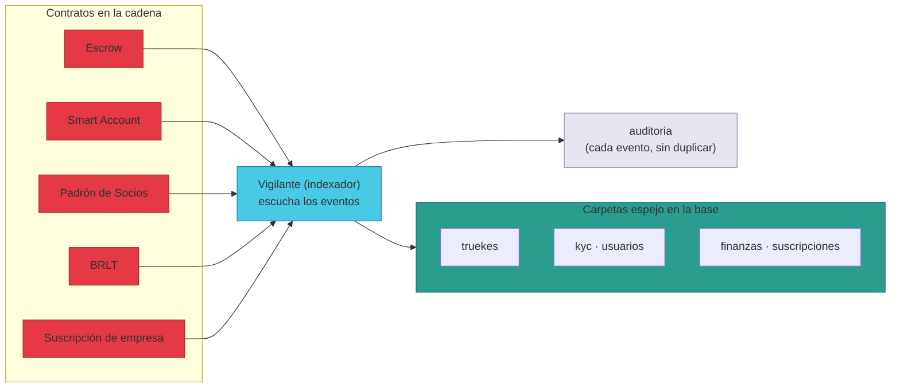
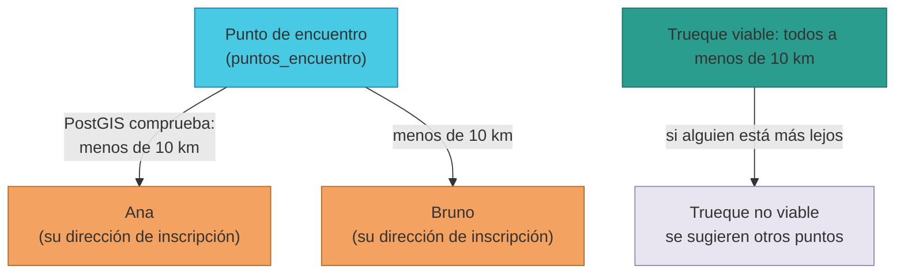
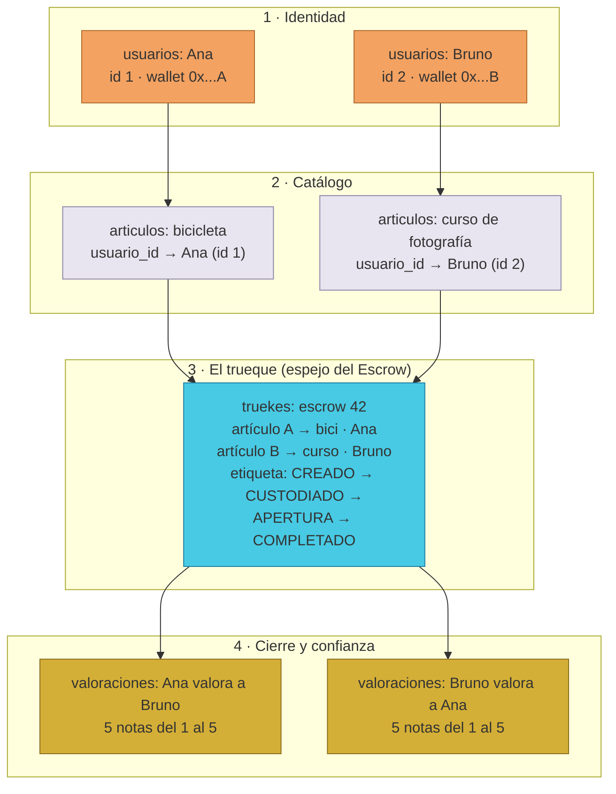

# Manual · Cómo se conectan los datos de TrueKeate

> Versión en lenguaje sencillo del manual técnico 06 — Diagrama Relacional.
> Aquí contamos cómo se unen las **21 carpetas** de datos entre sí, con la
> historia de Ana y Bruno de principio a fin.

---

## 1. Empezar en 5 minutos

En TrueKeate los datos no viven sueltos: las fichas **se apuntan unas a
otras**. Cada ficha tiene una **llave propia** (clave primaria, PK) y puede
llevar **candados** (claves foráneas, FK) que apuntan a la llave de otra
ficha. Así la base sabe que "este artículo es de Ana" o que "esta valoración
pertenece a este trueque".

La historia de Ana y Bruno, de principio a fin:

1. **Ana y Bruno se registran** → 2 fichas en `usuarios`, cada una con su
   llave propia (id 1 y id 2).
2. **Ana publica su bicicleta; Bruno, su curso** → 2 fichas en `articulos`,
   cada una con un candado que dice "soy de la usuaria 1" / "soy del
   usuario 2".
3. **Crean el trueque** → 1 ficha en `truekes` que apunta a los **2
   artículos** y guarda las **2 direcciones** de los participantes.
4. **La cadena habla** → cada movimiento del escrow (custodia, apertura,
   completado) actualiza la etiqueta de esa ficha. Es un **espejo** del
   contrato.
5. **Se encuentran cerca** → eligen un punto en `puntos_encuentro` que la
   base comprueba que esté a menos de **10 km** de ambos (PostGIS).
6. **Terminan y se valoran** → 2 fichas en `valoraciones` con candado al
   trueque: una de Ana a Bruno y otra de Bruno a Ana.

Para leer este manual necesitas 4 palabras:

| Palabra | Qué significa | En la historia |
|---|---|---|
| **Llave propia (PK)** | El número de identificación único de cada ficha | El id de Ana (1) |
| **Candado (FK)** | Un apunte que dice "esta ficha pertenece a aquella" | El artículo dice "soy de la usuaria 1" |
| **1 a muchos** | Una ficha madre puede tener muchas fichas hijas | Ana puede publicar 10 artículos |
| **Espejo** | Una ficha que copia el estado de la cadena | La ficha del trueque |

---

## 2. El mapa general de las carpetas

```mermaid
erDiagram
    USUARIOS ||--o{ KYC : "verificación de identidad"
    USUARIOS ||--o{ ARTICULOS : "publica"
    USUARIOS ||--o{ PUNTOS_ENCUENTRO : "registra"
    USUARIOS ||--o{ PUNTOS_FAVORITOS : "guarda favoritos"
    USUARIOS ||--o{ SESIONES : "inicia sesión (wallet)"
    USUARIOS ||--|| FINANZAS : "tiene una ficha financiera"
    USUARIOS ||--o{ SUSCRIPCIONES : "empresa paga (empresa_id)"
    USUARIOS ||--o{ CAMPANAS : "organiza"
    USUARIOS ||--o{ SUBASTAS : "empresa subasta (empresa_id)"
    USUARIOS ||--o{ NOTIFICACIONES : "recibe avisos (por wallet)"
    USUARIOS ||--o{ MOVIMIENTOS_VALOR : "hace movimientos (por wallet)"
    USUARIOS ||--o{ MOVIMIENTOS_BRLT : "compra BRLT (por wallet)"
    ARTICULOS ||--o{ TRUEKES : "se ofrece en un trueque"
    ARTICULOS ||--o{ SUBASTAS : "se subasta"
    TRUEKES ||--o{ VALORACIONES : "recibe notas 1-5"
    TRUEKES ||--o{ DISPUTAS : "puede tener conflictos"
    DISPUTAS ||--o{ EVIDENCIAS_DISPUTA : "fotos de cada parte"
    DISPUTAS ||--o{ VOTOS_DISPUTA : "votos de los Socios"
    PUNTOS_ENCUENTRO ||--o{ PUNTOS_FAVORITOS : "es marcado como favorito"
    PUNTOS_ENCUENTRO o|--o{ TRUEKES : "punto acordado (sin candado)"
    ARTICULOS o|--o| IMAGENES_CERTIFICADAS : "foto con sello (sin candado)"
    KYC o|--o{ IMAGENES_CERTIFICADAS : "documento y selfie (sin candado)"
    USUARIOS {
        bigint id "llave propia"
        char wallet "dirección única"
        text username "@nombre (2026-09)"
        text estado "escalera D28"
    }
    KYC {
        bigint id "llave propia"
        bigint usuario_id "candado a usuarios"
        bytea merkle_root "huella del KYC"
        boolean via_sbt "¿certificado con carné?"
        text sbt_contrato "contrato del carné"
        numeric sbt_token_id "número del carné"
        bigint documento_img_id "foto DNI (sin candado)"
        bigint selfie_img_id "selfie (sin candado)"
    }
    ARTICULOS {
        bigint id "llave propia"
        bigint usuario_id "candado a usuarios"
        text rubro "categoría"
    }
    TRUEKES {
        bigint id "llave propia"
        numeric escrow_id "número en la cadena"
        bigint articulo_a_id "candado a articulos"
        bigint articulo_b_id "candado a articulos"
        char usuario_a "dirección (sin candado)"
        char usuario_b "dirección (sin candado)"
        text estado "9 etiquetas"
    }
    VALORACIONES {
        bigint id "llave propia"
        bigint trueke_id "candado a truekes"
        smallint honestidad "nota 1-5"
    }
    DISPUTAS {
        bigint id "llave propia"
        bigint trueke_id "candado a truekes"
        char solicitante "reclamante (sin candado)"
        text estado "REPORTADA→…→RESUELTA"
        text veredicto "ANULAR o VALIDO"
    }
    EVIDENCIAS_DISPUTA {
        bigint id "llave propia"
        bigint disputa_id "candado a disputas (se borra con ella)"
        char autor "quién sube la foto"
        text tipo "RECLAMO o JUSTIFICATIVO"
    }
    VOTOS_DISPUTA {
        bigint id "llave propia"
        bigint disputa_id "candado a disputas (se borra con ella)"
        char socio "Socio votante"
        text voto "ANULAR o VALIDO"
    }
    NOTIFICACIONES {
        bigint id "llave propia"
        char wallet "destinatario"
        text tipo "tipo de aviso"
        boolean leida "¿leída?"
    }
    MOVIMIENTOS_VALOR {
        bigint id "llave propia"
        char wallet "quién movió"
        text tipo "recarga, retiro, conversión"
        char contraparte "la plataforma"
    }
    MOVIMIENTOS_BRLT {
        bigint id "llave propia"
        char wallet "comprador"
        text estado "PENDIENTE → PAGADO"
    }
    FINANZAS {
        bigint usuario_id "llave + candado (1 a 1)"
        numeric brlt "saldo"
    }
    AUDITORIA {
        bigint id "llave propia"
        char tx_hash "transacción"
    }
    PUNTOS_FAVORITOS {
        bigint id "llave propia"
        bigint usuario_id "candado a usuarios"
        bigint punto_encuentro_id "candado a puntos_encuentro"
    }
    SESIONES {
        text token "llave propia"
        char wallet "candado a usuarios (wallet)"
    }
```

<!-- GENERAR_IMAGEN: mapa-relaciones.svg -->

En el mapa hay **3 tipos de conexión**:

1. **Candado real**: la base obliga a que exista la ficha madre (por
   ejemplo, `articulos.usuario_id` no puede apuntar a nadie que no exista).
2. **Conexión lógica (sin candado)**: la ficha lleva el apunte, pero la base
   no lo vigila; lo cuida la plataforma por código.
3. **Dirección suelta**: guardamos la dirección de la cadena como texto,
   sin candado, porque puede cambiar con el tiempo (ver sección 4).

Las formas de relacionarse:

- **1 a muchos**: la más común. Una usuaria → muchos artículos; un trueque →
  varias valoraciones; **una disputa → muchas fotos de evidencia y muchos
  votos de Socios**. En 2026-09 se sumaron dos hijas de `usuarios`:
  `puntos_favoritos` (tus puntos guardados) y `sesiones` (tus inicios de
  sesión); en 2026-09-08/09, además, nacieron las hijas de `disputas`
  (`evidencias_disputa`, `votos_disputa`), la campana `notificaciones` y los
  movimientos de VALOR.
- **1 a 1**: cada persona tiene una sola ficha financiera (comparten la
  llave). También la verificación de identidad (una por persona, aunque la
  base no lo obliga del todo) y la foto con sello de un artículo.
- **Muchos a muchos**: entre personas y artículos se resuelve con la ficha
  del trueque, que guarda 2 artículos y 2 personas (sección 5).
- **Polimorfismo**: la ficha de la foto con sello apunta a un artículo, a un
  trueque o, desde 2026-09, a tu verificación de identidad, según su tipo
  (`PUBLICACION`, `RECEPCION`, `KYC_DNI` o `KYC_SELFIE`). La ficha de avisos
  (`notificaciones`) apunta a un trueke o a una disputa según su referencia.

---

## 3. Las relaciones con candado (1 a muchos reales)

Desde **usuarios** (cada persona puede tener muchas...):

| Ficha hija | Qué guarda la conexión |
|---|---|
| `kyc` | Su trámite de identidad |
| `articulos` | Sus publicaciones |
| `puntos_encuentro` | Sus puntos de encuentro |
| `puntos_favoritos` | Sus puntos guardados como favoritos (nueva, 2026-09) |
| `sesiones` | Sus inicios de sesión con la billetera (nueva, 2026-09) |
| `suscripciones` | Sus ciclos de pago (si es empresa) |
| `campanas` | Sus campañas |
| `subastas` | Sus subastas (como empresa) y también como ganadora |
| `finanzas` | Su ficha financiera (1 a 1) |

Desde **articulos**:

| Ficha hija | Qué guarda la conexión |
|---|---|
| `truekes` | El artículo se ofrece como artículo A o como artículo B |
| `subastas` | El artículo se subasta |

Desde **truekes** (la pieza central):

| Ficha hija | Qué guarda la conexión |
|---|---|
| `valoraciones` | Las notas del trueque |
| `disputas` | Los conflictos del trueque |

Desde **disputas** (las dos hijas nuevas de 2026-09-08):

| Ficha hija | Qué guarda la conexión |
|---|---|
| `evidencias_disputa` | Las fotos de cada parte (reclamo y justificativo); **se borran junto con la disputa** |
| `votos_disputa` | Los votos ANULAR/VALIDO de los Socios; **se borran junto con la disputa** |

Desde **puntos_encuentro** (cada punto puede ser favorito de muchas personas):

| Ficha hija | Qué guarda la conexión |
|---|---|
| `puntos_favoritos` | Quiénes lo guardaron como favorito |

Relaciones **por dirección (sin candado)** para las nuevas piezas:

| Ficha hija | Qué guarda la conexión |
|---|---|
| `notificaciones` | Los avisos de cada wallet (campana 🔔) |
| `movimientos_valor` | Los movimientos de cripto/BRLT de cada wallet (VALOR) |
| `movimientos_brlt` | Las compras de BRLT con tarjeta de cada wallet (Stripe) |

---

## 4. Las conexiones sin candado (y por qué existen)

| Conexión | Qué une | Por qué no lleva candado |
|---|---|---|
| Foto con sello de un artículo | `articulos` → `imagenes_certificadas` | Es lógica: la base no obliga, la plataforma lo cuida |
| Documento y selfie del KYC | `kyc` → `imagenes_certificadas` (`documento_img_id`, `selfie_img_id`) | Es lógica (2026-09): las fotos las guarda la plataforma al certificarte |
| Carné de certificación | `kyc` → la cadena (`via_sbt`, `sbt_contrato`, `sbt_token_id`) | Son datos on-chain: la plataforma los anota al certificar |
| Punto de encuentro de un trueque | `truekes` → `puntos_encuentro` | Es lógica: se acuerda fuera de la base |
| Foto polimórfica | `imagenes_certificadas` → `articulos`, `truekes` o `kyc` | Depende del tipo de foto |
| Direcciones de participantes | `truekes`, `valoraciones`, `disputas`, `evidencias_disputa`, `votos_disputa` → `usuarios` | **Historia**: guardamos la dirección tal como era |
| Avisos de la campana | `notificaciones` → `usuarios` (por `wallet`) y → `disputas`/`truekes` (`ref_tipo` + `ref_id`) | Destinatario y referencia polimórfica sin candado (2026-09-08) |
| Movimientos de VALOR | `movimientos_valor`/`movimientos_brlt` → `usuarios` (por `wallet`) | Movimientos por dirección, sin candado (2026-09-09) |
| Número del escrow | `truekes.escrow_id` → la cadena | No apunta a una tabla local: es el puente con la blockchain |

¿Por qué las **direcciones no llevan candado**? Porque tu dirección puede
cambiar: si pierdes tu cuenta y la recuperas con tus guardianes, el nuevo
dueño tiene otra dirección. Si las fichas de los trueques antiguos llevaran
candado a tu dirección actual, la historia se rompería. Por eso las fichas
guardan la dirección **del momento** como un valor que no se reescribe.

---

## 5. El trueque: la pieza central del modelo

Un trueque es la unión de **2 personas** y **2 artículos** en una sola ficha:

- `articulo_a_id` + `usuario_a` → qué ofrece Ana y quién es Ana.
- `articulo_b_id` + `usuario_b` → qué ofrece Bruno y quién es Bruno.
- Los artículos sí llevan candado real (deben existir en `articulos`); las
  direcciones se guardan sueltas (sección 4).

Un artículo puede participar en varios trueques, pero si está marcado como
**no disponible** ya no recibe nuevas ofertas.

Además, la ficha del trueque es el **espejo del contrato Escrow**:

| Evento en la cadena | Qué hace el vigilante en la ficha |
|---|---|
| `TruekeCreado` | Crea la ficha con etiqueta `CREADO` |
| `CustodiaA` / `CustodiaB` | Cambia la etiqueta a `CUSTODIADO` |
| `AperturaA` / `AperturaB` | Cambia a `APERTURA` y anota cuándo abrió cada parte |
| `TruekeCompletado` | Cambia a `COMPLETADO` |
| `TruekeCancelado` | Cambia a `ANULADO` |
| `EscrowBloqueado` | Cambia a `BLOQUEADO` |

La regla **un escrow = una fila**: el número del escrow es único, así que si
el vigilante recibe dos veces el mismo evento, actualiza la misma ficha en
vez de duplicarla.

---

## 6. El espejo de la blockchain: qué copia cada carpeta

| Carpeta de la base | Contrato de la cadena | Qué copia |
|---|---|---|
| `truekes` | Escrow | El estado de cada trueque |
| `kyc` (huella) | Smart Account | La huella merkle de tu KYC |
| `usuarios` (dirección) | Smart Account | Tu dirección actual (cambia al recuperar la cuenta) |
| `usuarios` (tipo) | Padrón de Socios | Si pasas a ser SOCIO |
| `finanzas` (BRLT) | BRLT | El saldo cuando se emite moneda |
| `suscripciones` | Suscripción de empresa | Cada ciclo de pago de 30 días |
| `auditoria` | Todos | Cada evento procesado (bitácora) |
| `indexador_checkpoint` | Todos | El último bloque leído (marcapáginas) |

<!-- GENERAR_IMAGEN: espejo-blockchain.svg -->

Y un caso especial desde 2026-09: el **carné de certificación (TrueKeateSBT)**
**no tiene espejo en la base**. El vigilante no copia sus eventos: cuando te
certificas, la propia plataforma escribe en tu ficha de `kyc` los datos del
carné (`via_sbt`, `sbt_contrato`, `sbt_token_id`) directamente desde la API.

> ⚠️ Pendiente de confirmar: algunos contratos ya emiten eventos que el
> vigilante **todavía no copia** en este ciclo: el **Fondo de Valor**
> (contribuciones, cambios de porcentaje, retiros) y los eventos de
> **disputa/resolución** del escrow (solicitud de anulación, votos,
> resolución ejecutada, sanción). Se esperan en un ciclo posterior (C8).

---

## 7. Las carpetas que escribe la plataforma (sin cadena)

Estas carpetas las llena la propia plataforma, con tu actividad:

| Carpeta | Contenido | Cómo se relaciona |
|---|---|---|
| `articulos` | Tus publicaciones | Candado a `usuarios` |
| `valoraciones` | Tus notas 1-5 (guardadas de verdad desde 2026-09-09) | Candado a `truekes` |
| `puntos_encuentro` | Tus puntos con mapa | Candado a `usuarios` |
| `disputas` | Los conflictos (flujo v2 2026-09-08) | Candado a `truekes` |
| `evidencias_disputa` | Las fotos de cada parte de la disputa (2026-09-08) | Candado a `disputas` (se borran con ella) |
| `votos_disputa` | Los votos de los Socios (2026-09-08) | Candado a `disputas` (se borran con ella) |
| `notificaciones` | Los avisos de la campana (2026-09-08) | Por `wallet` + referencia a disputa/trueke |
| `kyc` | Tu verificación de identidad y tu certificación | Candado a `usuarios`; la huella es espejo (§6) y la certificación por carné la escribe la propia plataforma (2026-09) |
| `imagenes_certificadas` | Las fotos con sello (anuncios, recepciones y, desde 2026-09, documento y selfie del KYC) | Apunte lógico a artículos, trueques o `kyc`; guardan también el archivo (`contenido`/`mime`) |
| `puntos_favoritos` | Tus puntos guardados como favoritos | Candados a `usuarios` y `puntos_encuentro` |
| `sesiones` | Tus inicios de sesión con la billetera | Candado a `usuarios` (por la dirección `wallet`) |
| `campanas` | Ventas masivas y recolectas | Candado a `usuarios` |
| `subastas` | Subastas de empresa | Candados a `usuarios` y `articulos` |
| `finanzas` | Saldos del socio | 1 a 1 con `usuarios` (y espejo parcial de BRLT) |
| `movimientos_valor` | Historial de cripto/BRLT de la sección VALOR (2026-09-09) | Por `wallet` (la contraparte es la plataforma) |
| `movimientos_brlt` | Compras de BRLT con tarjeta (Stripe) (2026-09-09) | Por `wallet`; el webhook de Stripe la confirma |

---

## 8. La regla de los 10 km (PostGIS)

La base tiene **memoria de mapas** (extensión PostGIS). Guarda coordenadas en
dos carpetas:

- `usuarios` guarda el punto de tu dirección de inscripción.
- `puntos_encuentro` guarda el punto de cada lugar de encuentro, con su radio
  (por defecto 10 km).

La regla: para que un trueque sea viable, el punto de encuentro debe estar a
**menos de 10.000 metros (10 km)** de ambos participantes. La base lo
comprueba con una consulta especial (los técnicos escriben
`ST_DWithin(..., 10000)`) y usa un índice espacial para que sea rápida.

Esto sirve para:

1. **Sugerir puntos de encuentro** cercanos a ti.
2. **Filtrar ofertas y trueques** por cercanía.
3. Buscar **establecimientos de retiro** aprobados por los Socios en tu zona.

<!-- GENERAR_IMAGEN: radio-10km.svg -->

> ⚠️ Pendiente de confirmar: la plataforma planea una consulta tipo
> "puntos cercanos a una dirección" (latitud, longitud y radio), pero el
> punto exacto de la API aún no está implementado.

---

## 9. Las garantías: nada se pierde ni se duplica

El sistema de datos tiene una cadena de garantías:

1. **Bitácora de solo añadir**: cada evento procesado se anota en
   `auditoria` y no se borra nunca.
2. **Cada evento se procesa una sola vez**: la triple llave
   (transacción + posición + contrato) lo impide.
3. **Cada escrow tiene una sola fila**: si llega dos veces el mismo evento,
   se actualiza, no se duplica.
4. **Marcapáginas para reprocesar**: el vigilante guarda el último bloque
   leído por contrato y puede volver a barrer desde cualquier bloque.
5. **Reconciliación**: el vigilante compara su copia con la cadena.
   ⚠️ Pendiente de confirmar: la comparación fina de detalles se completa en
   un ciclo posterior.

Reglas de integridad destacadas:

| Regla | Efecto |
|---|---|
| `wallet` única | No puede haber dos cuentas con la misma dirección |
| Un escrow = una fila | El número del escrow es único |
| Una valoración por persona y trueque | Nadie puede votar dos veces |
| Notas entre 1 y 5 | La base rechaza un 7 o un 0 |
| Triple llave de eventos | Ningún evento se procesa dos veces |

---

## 10. Un ejemplo de principio a fin (con las preguntas que responde la base)

Sigue la historia de Ana y Bruno **dentro de las carpetas**:

<!-- GENERAR_IMAGEN: ejemplo-ana-bruno.svg -->

Y estas son las **preguntas típicas** que la base responde al unir carpetas:

| Pregunta | Cómo la responde la base |
|---|---|
| ¿En qué estado está el trueque? | Busca la ficha en `truekes` por su número de escrow y lee la etiqueta |
| ¿Qué peldaño tiene Ana? | Lee `usuarios.estado` (la escalera D28) y su trámite en `kyc` |
| ¿Está certificada y con carné o con fotos? | Mira `kyc` (`via_sbt`, `sbt_contrato`, `sbt_token_id`) y sus fotos en `imagenes_certificadas` (`KYC_DNI`/`KYC_SELFIE`); en la cadena pregunta al contrato del carné |
| ¿Quién participó y con qué? | Lee las 2 direcciones y los 2 artículos de la ficha del trueque |
| ¿Qué notas recibió Bruno? | Busca las valoraciones del trueque |
| ¿En qué va la disputa de un trueque? | Lee `disputas` (estado y plazos) → las fotos en `evidencias_disputa` y los votos en `votos_disputa` |
| ¿Qué avisos tengo sin leer? | Cuenta las `notificaciones` de tu wallet con `leida = no` |
| ¿Cuánto ETH/BRLT tengo y qué moví? | Lee `finanzas` (saldos) y `movimientos_valor`/`movimientos_brlt` por tu wallet |
| ¿Qué puntos guardó como favoritos? | Busca en `puntos_favoritos` por su usuario |
| ¿Hay puntos de encuentro cerca? | Pregunta al mapa de PostGIS (regla de los 10 km) |
| ¿Pagó la empresa este mes? | Busca sus ciclos en `suscripciones` |
| ¿Qué eventos ya se procesaron? | Lee la bitácora `auditoria` y el marcapáginas `indexador_checkpoint` |

---

## 11. Resumen por carpeta (la ficha de cada una)

| Carpeta | Llave propia | Candados reales | Conexiones lógicas / sueltas |
|---|---|---|---|
| `usuarios` | sí | — | la dirección `wallet` y el `@nombre` (`username`) |
| `kyc` | sí | a `usuarios` | la huella (espejo), quién la revisó, el carné SBT (`via_sbt`/`sbt_contrato`/`sbt_token_id`) y sus fotos (apunte lógico) |
| `articulos` | sí | a `usuarios` | su foto con sello (sin candado) |
| `truekes` | sí | a `articulos` (×2) | número del escrow, direcciones, punto de encuentro, cierres |
| `valoraciones` | sí | a `truekes` | las direcciones de quién valora a quién |
| `puntos_encuentro` | sí | a `usuarios` | sus coordenadas en el mapa |
| `puntos_favoritos` | sí | a `usuarios` y a `puntos_encuentro` | el par (usuario, punto) es único |
| `disputas` | sí | a `truekes` | quien la pide (reclamante), plazos y veredicto |
| `evidencias_disputa` | sí | a `disputas` (se borra con ella) | el autor (dirección) y el tipo de evidencia |
| `votos_disputa` | sí | a `disputas` (se borra con ella) | el Socio votante; un voto por Socio y disputa |
| `notificaciones` | sí | — | la wallet destinataria y la referencia (disputa/trueke) |
| `imagenes_certificadas` | sí | — | apunte polimórfico a artículo, trueque o `kyc` |
| `suscripciones` | sí | a `usuarios` (empresa) | el recibo de la transacción |
| `campanas` | sí | a `usuarios` | los artículos de la campaña |
| `subastas` | sí | a `usuarios` (×2) y `articulos` | el número del escrow y el nivel del ganador |
| `finanzas` | su llave es la de `usuarios` | a `usuarios` (1 a 1) | saldos, stocks y porcentajes |
| `movimientos_valor` | sí | — | la wallet y la contraparte (la plataforma) |
| `movimientos_brlt` | sí | — | la wallet y la sesión de Stripe |
| `auditoria` | sí | — | la dirección del evento y su triple llave |
| `indexador_checkpoint` | el nombre del contrato | — | el último bloque leído |
| `sesiones` | el `token` de sesión | a `usuarios` (por `wallet`) | caduca a las 24 h |

> Conclusión sencilla: **la identidad está en `usuarios`, el intercambio en
> `truekes`, y todo lo demás cuelga de esos dos puntos con candados y
> apuntes.** Así TrueKeate puede responder cualquier pregunta sobre quién
> tiene qué, en qué estado está, y a quién hay que creerle.
