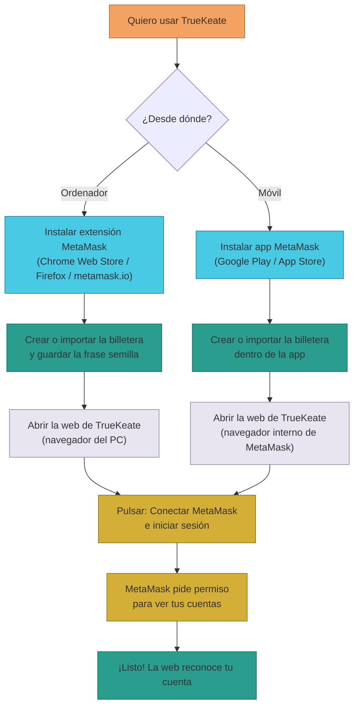
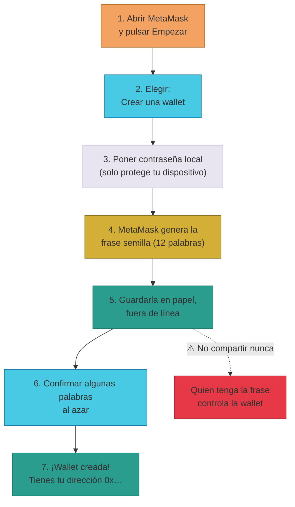

# Manual · Cómo crear tu billetera (PC y móvil)

> Versión en lenguaje sencillo del manual técnico "Instalación y creación de wallet".
> TrueKeate no lleva billetera propia: usa la billetera de tu navegador o de tu
> móvil, llamada **MetaMask**. Aquí te contamos cómo instalarla, crearla y
> dejarla lista en 5 minutos.

---

## 1. Empezar en 5 minutos

Resumen de todo lo que necesitas hacer (los detalles están más abajo):

1. **En el ordenador**: instala la extensión de MetaMask en tu navegador
   (Chrome, Edge, Brave o Firefox).
2. **En el móvil**: instala la app de MetaMask (Google Play o App Store).
3. **Crea tu billetera** y guarda muy bien la **frase semilla** (12 palabras).
4. Abre la web de TrueKeate: `https://truekeate-web-593453426217.europe-west1.run.app`
5. Pulsa el botón **"🔗 Conectar MetaMask e iniciar sesión"** y acepta el
   permiso para ver tus cuentas.

> Nota importante: esta red es de **pruebas**. El dinero que veas (ETH, BRLT…)
> es simbólico y no vale nada real. No uses aquí cuentas con dinero real.

---

## 2. La billetera que usa TrueKeate

### 2.1 TrueKeate no guarda tu billetera

- TrueKeate **no tiene su propia billetera** dentro de la web.
- La web lee la billetera que tu navegador pone a su disposición
  (se llama `window.ethereum`). Eso lo hace MetaMask, u otra billetera
  compatible.
- Si no tienes ninguna billetera instalada, la web te avisa con este mensaje:
  **"MetaMask no está instalado. Instálalo o usa una wallet compatible"**.

### 2.2 Conectar no es firmar

- Al pulsar el botón de conectar, MetaMask pide permiso **solo para ver tus
  cuentas**. No firma nada ni mueve dinero en ese momento.
- Si ya te habías conectado antes, al recargar la página la web te reconoce
  sola (guarda tu cuenta en el navegador).
- Si cambias de cuenta o bloqueas MetaMask, la web se entera al momento y
  reacciona sola.

---

## 3. Instalar MetaMask en el ordenador (PC)

### 3.1 Dónde descargarla (solo fuentes oficiales)

Descarga la extensión **únicamente** desde:

- **Chrome, Edge o Brave**: tienda "Chrome Web Store" → busca *"MetaMask"*
  (el editor oficial se llama *MetaMask* / Consensys).
- **Firefox**: "Add-ons de Firefox" → busca *"MetaMask"*.
- Página oficial: `https://metamask.io/download/` (te enlaza a las tiendas
  oficiales).

> ⚠️ Desconfía de extensiones con nombres parecidos o de anuncios. La
> extensión oficial nunca te pide tu frase semilla y pide permisos limitados.

### 3.2 Pasos de instalación

1. Pulsa **"Añadir a Chrome"** (o el botón equivalente de tu navegador).
2. Confirma en la ventana que aparece.
3. Fija el icono del zorrito en la barra de extensiones (opción "fijar") para
   tenerlo a mano.
4. Abre la extensión: te ofrecerá **"Empezar"** → podrás *Crear una wallet* o
   *Importar una wallet*.
5. Si es la primera vez, acepta el aviso de uso (no hace falta compartir
   datos).

### 3.3 Comprobar que quedó lista

- Al abrir la extensión debes ver su pantalla con saldo **0 ETH** y el
  selector de red en la parte superior.
- En la web de TrueKeate, el botón **"🔗 Conectar MetaMask e iniciar sesión"**
  dejará de mostrar el aviso de "MetaMask no está instalado".

---

## 4. Instalar MetaMask en el móvil

### 4.1 Dónde descargarla

- **Android**: Google Play → *"MetaMask – Blockchain Wallet"* (editor
  Consensys).
- **iPhone**: App Store → *"MetaMask – Crypto Wallet"* (editor Consensys).

Después de instalarla, tienes que **crear o importar la billetera** dentro de
la app (usa la misma frase semilla que en el PC si quieres la misma cuenta).

### 4.2 Cómo usar TrueKeate desde el móvil (hoy)

La versión móvil de la plataforma se entrega como **PWA** (una web que se puede
añadir a la pantalla de inicio). La forma que funciona hoy en la práctica es:

1. Abre la app de MetaMask en tu móvil.
2. Usa su **navegador interno** (botón de navegador dentro de la app).
3. Escribe la dirección de TrueKeate:
   `https://truekeate-web-593453426217.europe-west1.run.app`
4. Conecta y firma como en el PC: la app móvil hace de billetera.

> ⚠️ Pendiente de confirmar: la firma delegada desde la PWA instalada a la app
> de MetaMask (enlace profundo) está pensada en el diseño pero **no se ha
> verificado** que funcione. Hoy el método que sí funciona es el navegador
> interno de la app de MetaMask. El modo sin conexión (service worker) de la
> PWA también está **pendiente de confirmar**.

<!-- GENERAR_IMAGEN: flujo-instalacion.svg -->

---

## 5. Crear una billetera nueva

### 5.1 La frase semilla: la llave de todo

- Al crear la billetera, MetaMask genera una **frase semilla** de 12 palabras
  (también acepta importar frases de 24 palabras).
- **La frase ES tu billetera**: quien la tenga puede usar tus cuentas.
  MetaMask te pedirá confirmarla escribiendo algunas palabras al azar.

Reglas para guardarla:

1. Anótala en papel, sin conexión (nunca en capturas de pantalla, notas del
   móvil ni correos).
2. No la compartas con nadie, ni siquiera con un "soporte técnico".
3. Guarda una copia en un segundo sitio seguro. **Nadie puede recuperarla por
   ti.**

### 5.2 La contraseña o el PIN

- La contraseña (PC) o el PIN/biometría (móvil) solo protegen el acceso a la
  app en **tu** dispositivo.
- No es la clave de la billetera y **no sirve para recuperar la frase**.
- Si bloqueas MetaMask en el PC, la web guarda tu cuenta pero no podrás firmar
  hasta desbloquear la extensión.

<!-- GENERAR_IMAGEN: crear-wallet.svg -->

---

## 6. Red de pruebas: el ETH no vale dinero

- Todos los contratos de TrueKeate viven hoy en una **red de pruebas**
  (anvil, número de red 31337). No hay una red de producción definida →
  **pendiente de confirmar**.
- En esa red, el dinero es **ETH simbólico de pruebas**, sin valor real.
- ⚠️ Aunque conectes una cuenta con activos reales de otras redes, no los
  pierdes… pero **cualquier operación de prueba consume ETH de prueba**, y las
  claves de las cuentas de desarrollo son públicas (ver manual
  `03-cuentas-anvil.md`). **Nunca uses en esta red cuentas con valor real.**
- Recomendación: crea cuentas de prueba dedicadas (las del anvil) y no las
  mezcles con tu billetera personal.

---

## 7. ¿Y otras billeteras? (alternativas)

- La web acepta **cualquier billetera que se conecte al navegador** igual que
  MetaMask (por ejemplo Brave Wallet o Coinbase Wallet).
- **WalletConnect no está integrado** hoy en la plataforma: usarlo para
  conectar a TrueKeate no es posible → **pendiente de confirmar** como vía
  alternativa. Los requisitos del proyecto fijan MetaMask como billetera.
- En el móvil, la vía equivalente y sí disponible es el navegador interno de la
  app de MetaMask (apartado 4.2).

---

## 8. Ficha didáctica

| Campo | Contenido |
|---|---|
| **¿Qué es?** | Una billetera (wallet) es una aplicación que guarda tus claves y firma por ti sin mostrarlas. TrueKeate usa MetaMask: extensión en el PC y app en el móvil. |
| **¿Para qué sirve?** | Para conectarte a TrueKeate, iniciar sesión firmando un mensaje, autorizar los trueques y ver tus activos de prueba (ETH, BRLT, NFTs). |
| **Pasos clave** | 1) Instalar MetaMask (PC o móvil). 2) Crear o importar la billetera. 3) Guardar la frase semilla en papel. 4) Abrir la web de TrueKeate y pulsar "Conectar MetaMask e iniciar sesión". 5) Aceptar el permiso para ver cuentas. |
| **Errores comunes** | Descargar extensiones falsas con nombres parecidos · Confundir "conectar" (ver cuentas) con "firmar" o "enviar dinero" · Tener seleccionada otra red y no ver los saldos de prueba · Compartir la frase semilla con un supuesto soporte. |
| **Consejo de seguridad** | La frase semilla se escribe en papel y no se comparte jamás. En esta red de pruebas solo usa cuentas sin valor real: las claves de las cuentas de prueba son públicas (ver manual `03-cuentas-anvil.md`). |

---

## 9. Lo que falta por confirmar (resumen)

1. La firma delegada desde la PWA instalada a la app de MetaMask (enlace
   profundo) → **pendiente de confirmar**.
2. El modo sin conexión de la PWA (service worker) → **pendiente de
   confirmar**.
3. La integración de WalletConnect como vía alternativa → **pendiente de
   confirmar**.
4. La red de producción definitiva del proyecto (hoy todo funciona sobre la
   red de pruebas) → **pendiente de confirmar**.

---

## 10. Glosario de este manual

| Palabra | Significado |
|---|---|
| **Wallet / billetera** | Aplicación que guarda tus claves y firma por ti |
| **MetaMask** | La billetera que usa TrueKeate (extensión y app) |
| **Extensión** | Programa que se añade al navegador |
| **Frase semilla** | 12 o 24 palabras que son la llave de tu billetera |
| **Conectar** | Dar permiso a la web para ver tus cuentas (no firma nada) |
| **Firmar** | Demostrar con tu clave que un mensaje es tuyo |
| **Red de pruebas** | Red donde el dinero es simbólico y no vale nada real |
| **ETH** | La moneda de esa red de pruebas |
| **PWA** | Web que se puede instalar como una app en el móvil |
