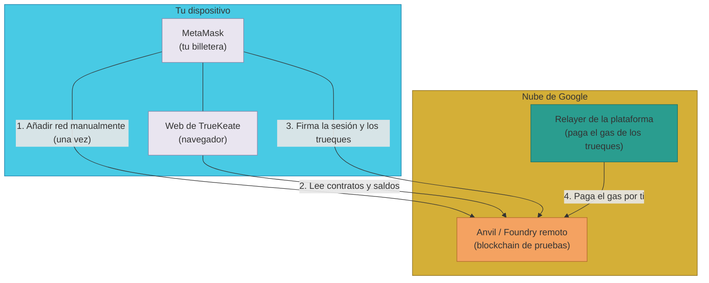

# Manual · Conecta TrueKeate a tu billetera (red RPC)

> Versión en lenguaje sencillo del manual técnico "Conexión de la wallet a la
> red del proyecto (RPC)". TrueKeate vive en una **red de pruebas** llamada
> anvil. Para ver tus saldos y firmar, tu billetera debe saber cómo llegar a
> esa red. Aquí te damos los datos y los pasos.

---

## 1. Empezar en 5 minutos

Estos son los pasos rápidos (los detalles están más abajo):

1. Abre MetaMask y pulsa el **selector de red** (arriba).
2. Pulsa **"Añadir red"** → **"Añadir una red manualmente"**.
3. Copia estos datos:

| Campo | Valor |
|---|---|
| Nombre de red | `TrueKeate Anvil (pruebas)` |
| Nueva URL de RPC | `https://mcc-foundry-anvil-slzlptbcla-ew.a.run.app` |
| ID de cadena (Chain ID) | `31337` |
| Símbolo de moneda | `ETH` |
| Explorador de bloques | *(dejar vacío)* |

4. Pulsa **Guardar**. MetaMask comprobará que la red responde.
5. Asegúrate de que la red queda **seleccionada** antes de operar en la web.

> Esto se hace **una sola vez**. La plataforma no añade la red por ti: no tiene
> código para cambiar la red de tu billetera automáticamente.

---

## 2. Los datos de la red, explicados

### 2.1 ¿Qué es una RPC?

- RPC es la "puerta" por la que tu billetera habla con la blockchain.
- La URL de RPC de TrueKeate apunta a un **anvil remoto** (una blockchain de
  pruebas alojada en la nube de Google).

### 2.2 Los parámetros auditados (2026-09-04)

| Parámetro | Valor | Notas |
|---|---|---|
| Nombre de red (sugerido) | `TrueKeate Anvil (pruebas)` | es libre, solo para que la reconozcas |
| **Nueva URL de RPC** | `https://mcc-foundry-anvil-slzlptbcla-ew.a.run.app` | anvil/Foundry remoto (Google Cloud Run) |
| **ID de cadena** | `31337` | en hexadecimal es `0x7a69` |
| Símbolo de moneda | `ETH` | moneda nativa de pruebas |
| Decimales | `18` | el estándar de ETH |
| Explorador de bloques | *(dejar vacío)* | no hay explorador configurado → **pendiente de confirmar** |

### 2.3 De dónde salen estos datos

- El número de red `31337` es el entorno de pruebas del proyecto, verificado en
  los archivos de configuración y en los tests.
- Las direcciones de los contratos de esa red están fijadas en el código de la
  web y del backend.

> Nota de trazabilidad: en documentación antigua del despliegue aparece otra URL
> de anvil. La URL de este manual es la **verificada el 2026-09-04** como la RPC
> actual del proyecto.

<!-- GENERAR_IMAGEN: red-rpc.svg -->


---

## 3. Añadir la red en MetaMask (ordenador)

### 3.1 Aviso importante

- La plataforma **no añade ni cambia la red por ti**: no existe código que lo
  haga. La red se añade **una vez, a mano**, en MetaMask.
- Estos pasos son para la extensión de MetaMask en el PC.

### 3.2 Pasos

1. Abre MetaMask y pulsa el **selector de red** en la parte superior (suele
   mostrar "Ethereum Mainnet").
2. Pulsa **"Añadir red"** → **"Añadir una red manualmente"**.
3. Rellena el formulario con los datos del apartado 2.2:
   - *Nombre de red*: `TrueKeate Anvil (pruebas)`
   - *Nueva URL de RPC*: `https://mcc-foundry-anvil-slzlptbcla-ew.a.run.app`
   - *ID de cadena*: `31337`
   - *Símbolo de moneda*: `ETH`
   - *Explorador de bloques (opcional)*: **dejar vacío**.
4. Pulsa **Guardar**. MetaMask validará la RPC (debe responder) y dejará
   seleccionada la red nueva.

### 3.3 Seleccionar la red al usar la plataforma

- Antes de operar conviene tener la red `TrueKeate Anvil (pruebas)`
  **seleccionada** en el selector.
- La lectura de saldos puede funcionar desde otra red, pero la **firma** va
  contra la red seleccionada en MetaMask: si el número de red no coincide, el
  servidor rechaza la firma (los trueques se firman con intents y el relayer
  comprueba que el `chainId` sea el esperado).

---

## 4. Añadir la red en MetaMask (móvil)

1. Abre MetaMask en el móvil.
2. Pulsa el icono de **red** (parte superior).
3. **Añadir red** → pestaña **Personalizada** (custom).
4. Introduce los mismos datos del apartado 2.2 y pulsa **Guardar**.
5. Si usas el navegador interno de MetaMask para la web, la red seleccionada en
   la app es la que se usa al firmar.

---

## 5. Comprobar que la conexión funciona

### 5.1 Desde MetaMask

- El selector debe mostrar el nombre de red que elegiste.
- Debe verse el saldo en **ETH** de la cuenta activa. Las cuentas 0 a 9 del
  anvil tienen fondos de prueba; la cuenta 10 (Irene) no — ver el manual
  `03-cuentas-anvil.md`.

### 5.2 Desde la consola (para personas técnicas)

Puedes verificar la red y un saldo con herramientas de línea de comandos:

```bash
# ¿Qué número de red responde el RPC? Debe decir 31337
cast chain-id --rpc-url https://mcc-foundry-anvil-slzlptbcla-ew.a.run.app

# Saldo de la cuenta 0 (el Owner) en esa red
cast balance 0xf39Fd6e51aad88F6F4ce6aB8827279cffFb92266 \
  --rpc-url https://mcc-foundry-anvil-slzlptbcla-ew.a.run.app
```

Los contratos del proyecto se consultan igual por esa RPC (por ejemplo, el
saldo del token BRLT o el dueño de un NFT).

---

## 6. Avisos importantes de la red de pruebas

- ⚠️ Es una red de **PRUEBAS**: el ETH es **simbólico** y las claves privadas
  de las cuentas de prueba son **públicas** (ver `03-cuentas-anvil.md`).
  **No uses fondos reales ni cuentas de producción.**
- ⚠️ El anvil remoto puede **reiniciarse** (es una operación de entorno). El
  estado podría reiniciarse o cambiar: si una cuenta pierde el saldo o un
  contrato no responde, comprueba que la red sigue viva (apartado 5.2).
- El **relayer** (la cuenta 1, de la plataforma) paga el gas de los trueques de
  los usuarios particulares: normalmente **tú no necesitas tener ETH**. En un
  plan de contingencia podría cambiar → **pendiente de confirmar**.

---

## 7. Ficha didáctica

| Campo | Contenido |
|---|---|
| **¿Qué es?** | Una red RPC es la "puerta" por la que tu billetera habla con la blockchain de pruebas de TrueKeate (anvil remoto, red 31337). |
| **¿Para qué sirve?** | Para que MetaMask sepa dónde están tus saldos de prueba (ETH, BRLT, NFTs) y para firmar la sesión y los trueques en la red correcta. |
| **Pasos clave** | 1) En MetaMask: selector de red → Añadir red → Añadir manualmente. 2) Copiar: nombre, URL de RPC, Chain ID `31337`, símbolo `ETH`. 3) Guardar y seleccionar la red. 4) Comprobar que se ve el saldo en ETH. |
| **Errores comunes** | Dejar seleccionada "Ethereum Mainnet" y no ver los saldos de prueba · Escribir mal la URL de RPC o el Chain ID · Dejar la red sin seleccionar y que el servidor rechace la firma · Esperar que la web añada la red por ti (no lo hace). |
| **Consejo de seguridad** | Es una red de pruebas con claves públicas: nunca la uses con cuentas que tengan valor real. Guarda esta red solo para probar TrueKeate. |

---

## 8. Lo que falta por confirmar (resumen)

1. Explorador de bloques para esta red → **pendiente de confirmar** (dejar el
   campo vacío).
2. El plan de contingencia en el que el usuario pagaría el gas (hoy lo paga el
   relayer) → **pendiente de confirmar**.
3. La URL de anvil documentada en manuales antiguos de despliegue frente a la
   auditada el 2026-09-04: la de este manual es la **actual**.

---

## 9. Glosario de este manual

| Palabra | Significado |
|---|---|
| **RPC** | La puerta por la que se habla con la blockchain |
| **Chain ID** | El número de identificación de la red (aquí `31337`) |
| **Red de pruebas** | Red donde el dinero es simbólico y no vale nada real |
| **Anvil** | Simulador de blockchain que usa el proyecto para probar |
| **Relayer** | La cuenta de la plataforma que paga el gas de los trueques |
| **Saldo** | Cuánto dinero tiene una cuenta |
| **Firmar** | Demostrar con tu clave que un mensaje es tuyo |
