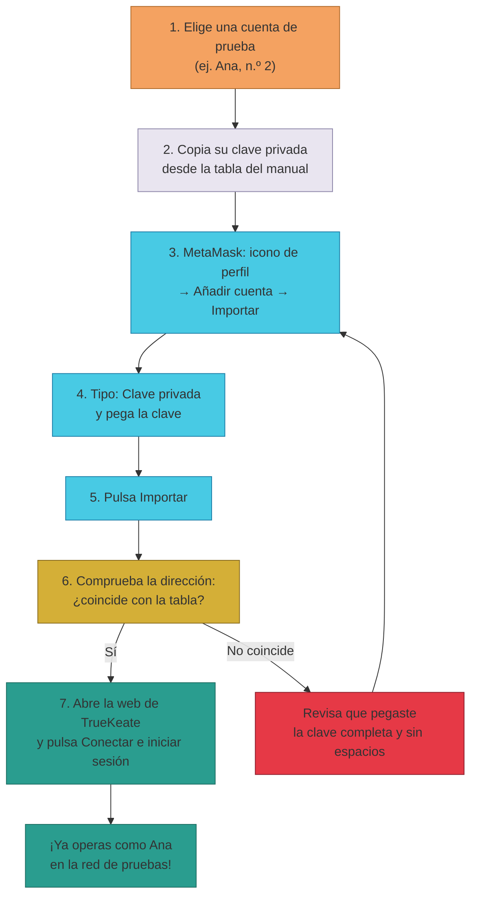

# Manual · Las cuentas de prueba (importar en tu billetera)

> Versión en lenguaje sencillo del manual técnico "Cuentas del anvil
> (desarrollo/pruebas)". TrueKeate usa **cuentas de prueba** ya creadas para
> que puedas probar con usuarios de ejemplo (Ana, Bruno, Carla…). Aquí te
> contamos cuáles son y cómo importarlas en MetaMask.

> ⚠️ **Aviso muy importante**: estas claves son **públicas** (aparecen en la
> documentación del framework) y **solo sirven para pruebas**. Nunca las uses
> con dinero real ni en producción.

---

## 1. Empezar en 5 minutos

Ejemplo: quieres entrar en la web como **Ana** (cuenta 2).

1. Copia la **clave privada** de Ana:
   `0x5de4111afa1a4b94908f83103eb1f1706367c2e68ca870fc3fb9a804cdab365a`
2. Abre MetaMask → icono de perfil (arriba a la derecha) → **"+ Añadir cuenta o
   cuenta de hardware"** → **"Importar cuenta"**.
3. Deja el *Tipo* en **Clave privada**, pega la clave y pulsa **Importar**.
4. Comprueba que la dirección nueva coincide con la de Ana:
   `0x3C44CdDdB6a900fa2b585dd299e03d12FA4293BC`
5. Abre la web de TrueKeate y pulsa **"🔗 Conectar MetaMask e iniciar sesión"**:
   ahora la plataforma te reconoce como Ana.

> Si prefieres importar todas las cuentas de golpe, puedes importar en MetaMask
> la **frase semilla completa** del anvil (apartado 2.2): como el camino de
> derivación es el mismo que usa MetaMask, obtendrás las mismas direcciones.

---

## 2. ¿Qué son las cuentas de prueba (anvil)?

### 2.1 De dónde salen

- El anvil (la blockchain de pruebas) genera por defecto **20 cuentas** a
  partir de un **mnemónico estándar conocido** y financia con ETH de prueba las
  **primeras 10** (índices 0 a 9).
- Son las cuentas con las que se despliegan los contratos, opera el relayer y
  se prueban los flujos.

### 2.2 El mnemónico estándar (público)

```
test test test test test test test test test test test junk
```

- Es el mnemónico por defecto del framework y **aparece en su documentación
  pública**: cualquiera puede derivar estas claves.
- Por eso **jamás** deben usarse fuera de pruebas.

### 2.3 El camino de derivación (solo para curiosos)

```
m/44'/60'/0'/0/N     (N = número de la cuenta: 0, 1, 2, …)
```

- Es el mismo camino que usa MetaMask para sus cuentas: por eso, si importas la
  frase semilla del anvil en MetaMask, obtienes las mismas direcciones.

### 2.4 Los dos roles operativos

| Cuenta | Quién es | Para qué sirve |
|---|---|---|
| **0** | Owner / Admin | Desplegó los contratos y es la autoridad del panel de administración. |
| **1** | Relayer / plataforma | Paga el gas de los trueques de los usuarios (meta-transacciones). Es la billetera del servidor. |

---

## 3. La tabla de cuentas de prueba (0 a 12)

| N.º | Usuario de ejemplo | Dirección (0x…) | Clave privada (0x…) | Rol / notas |
|---|---|---|---|---|
| 0 | Owner / Admin | `0xf39Fd6e51aad88F6F4ce6aB8827279cffFb92266` | `0xac0974bec39a17e36ba4a6b4d238ff944bacb478cbed5efcae784d7bf4f2ff80` | Despliega contratos; panel Owner. **Tiene fondos.** |
| 1 | Relayer / plataforma | `0x70997970C51812dc3A010C7d01b50e0d17dc79C8` | `0x59c6995e998f97a5a0044966f0945389dc9e86dae88c7a8412f4603b6b78690d` | Paga el gas (meta-tx); billetera del backend. **Tiene fondos.** |
| **2** | **Ana** | `0x3C44CdDdB6a900fa2b585dd299e03d12FA4293BC` | `0x5de4111afa1a4b94908f83103eb1f1706367c2e68ca870fc3fb9a804cdab365a` | Usuario particular de prueba. **Tiene fondos.** |
| **3** | **Bruno** | `0x90F79bf6EB2c4f870365E785982E1f101E93b906` | `0x7c852118294e51e653712a81e05800f419141751be58f605c371e15141b007a6` | Usuario particular de prueba. **Tiene fondos.** |
| **4** | **Carla** | `0x15d34AAf54267DB7D7c367839AAf71A00a2C6A65` | `0x47e179ec197488593b187f80a00eb0da91f1b9d0b13f8733639f19c30a34926a` | Usuario particular de prueba. **Tiene fondos.** |
| **5** | **Diego** | `0x9965507D1a55bcC2695C58ba16FB37d819B0A4dc` | `0x8b3a350cf5c34c9194ca85829a2df0ec3153be0318b5e2d3348e872092edffba` | Usuario particular de prueba. **Tiene fondos.** |
| **6** | **Elena** | `0x976EA74026E726554dB657fA54763abd0C3a0aa9` | `0x92db14e403b83dfe3df233f83dfa3a0d7096f21ca9b0d6d6b8d88b2b4ec1564e` | Usuario particular de prueba. **Tiene fondos.** |
| **7** | **Fabián** | `0x14dC79964da2C08b23698B3D3cc7Ca32193d9955` | `0x4bbbf85ce3377467afe5d46f804f221813b2bb87f24d81f60f1fcdbf7cbf4356` | Usuario particular de prueba. **Tiene fondos.** |
| **8** | **Gisela** | `0x23618e81E3f5cdF7f54C3d65f7FBc0aBf5B21E8f` | `0xdbda1821b80551c9d65939329250298aa3472ba22feea921c0cf5d620ea67b97` | Usuario particular de prueba. **Tiene fondos.** |
| **9** | **Héctor** | `0xa0Ee7A142d267C1f36714E4a8F75612F20a79720` | `0x2a871d0798f97d79848a013d4936a73bf4cc922c825d33c1cf7073dff6d409c6` | Usuario particular de prueba. **Tiene fondos.** |
| 10 | Irene | `0xBcd4042DE499D14e55001CcbB24a551F3b954096` | `0xf214f2b2cd398c806f84e317254e0f0b801d0643303237d97a22a48e01628897` | ⚠️ **SIN FONDOS** en este anvil (solo se financian 0–9 por defecto). |
| 11 | Javier | `0x71bE63f3384f5fb98995898A86B02Fb2426c5788` | `0x701b615bbdfb9de65240bc28bd21bbc0d996645a3dd57e7b12bc2bdf6f192c82` | Sin fondos por defecto (ver apartado 7). |
| 12 | Karen | `0xFABB0ac9d68B0B445fB7357272Ff202C5651694a` | `0xa267530f49f8280200edf313ee7af6b827f2a8bce2897751d06a843f644967b1` | Sin fondos por defecto (ver apartado 7). |

Notas de la tabla:

- "Tiene fondos" = el anvil financia por defecto los índices 0 a 9 con ETH de
  prueba.
- Los nombres (Ana, Bruno…) son **usuarios de ejemplo** para pruebas y
  manuales. Su rol concreto (particular, empresa, socio) y su estado en la base
  de datos dependen de la inscripción hecha en cada entorno → **pendiente de
  confirmar** por entorno.

---

## 4. Importar una cuenta en MetaMask (ordenador)

### 4.1 Por qué importarlas

- La web de TrueKeate solo muestra y firma con las cuentas que MetaMask tiene
  cargadas. Para que la plataforma "vea" a Ana (o a cualquier cuenta), hay que
  **importar su clave privada** en MetaMask.

### 4.2 Pasos

1. Abre MetaMask → icono de perfil (arriba a la derecha) → **"Cambiar cuenta"**
   (o *"Cuentas"*).
2. Pulsa **"+ Añadir cuenta o cuenta de hardware"** → **"Importar cuenta"**.
3. En *Tipo*, deja **Clave privada** y pega la clave de la tabla (por ejemplo,
   la de Ana, índice 2).
4. Pulsa **Importar**.
5. La cuenta aparece en el selector con su dirección. Comprueba que coincide
   con la de la tabla (¡así detectas erratas al copiar!).

Ejemplo de comprobación para personas técnicas (con la herramienta `cast`):

```bash
# La clave de Ana debe derivar en su dirección
cast wallet address --private-key \
  0x5de4111afa1a4b94908f83103eb1f1706367c2e68ca870fc3fb9a804cdab365a
# → 0x3C44CdDdB6a900fa2b585dd299e03d12FA4293BC
```

---

## 5. Importar una cuenta en MetaMask (móvil)

1. Abre MetaMask en el móvil → icono de perfil/cuentas.
2. **"Añadir cuenta"** → **"Importar cuenta"**.
3. Pega la clave privada → **Importar**.

---

## 6. Cambiar de cuenta y desconectar en la plataforma

### 6.1 Cambiar de cuenta

- Cambia la cuenta activa en MetaMask (selector de cuentas). La web se entera
  al momento y actualiza la cuenta mostrada.

### 6.2 Qué pasa al cambiar de cuenta

- La plataforma vuelve a comprobar el estado de inscripción de la **nueva**
  cuenta y **descarta la sesión de la cuenta anterior**: el permiso de sesión
  está asociado a la billetera que lo firmó.
- Con la cuenta nueva tendrás que **volver a firmar la sesión** (te lo pedirá
  la web).
- Si la lista de cuentas queda vacía (MetaMask bloqueada o cuenta eliminada),
  la web se desconecta y limpia lo guardado.

### 6.3 Desconectar

- En la barra superior de la plataforma hay un botón **"⏻ Desconectar
  billetera"**. Al pulsarlo se limpia la cuenta y la sesión.

---

## 7. Advertencias obligatorias

- ⚠️ **Irene (cuenta 10) no tiene fondos**: si un flujo necesita que Irene pague
  gas o reciba ETH, primero hay que financiarla. No hay un grifo (faucet)
  automático verificado en este entorno → **pendiente de confirmar** el
  mecanismo de financiación.
- ⚠️ Las cuentas 11 (Javier) y 12 (Karen) tampoco tienen fondos por defecto.
- ⚠️ **Solo pruebas**: el mnemónico es público y todas las claves derivadas son
  conocidas. **Nunca** uses estas cuentas (ni fondos reales) en producción.
- ⚠️ En producción, las claves del Owner y del relayer viven en el cajón de
  secretos de Google (Secret Manager); las claves de este manual solo sirven
  para el anvil de pruebas.
- ⚠️ Cualquiera que conozca la clave privada puede firmar por esa cuenta: **no
  compartas** las claves de la tabla fuera del equipo de pruebas.

<!-- GENERAR_IMAGEN: importar-cuenta.svg -->


---

## 8. Ficha didáctica

| Campo | Contenido |
|---|---|
| **¿Qué es?** | Son las cuentas de prueba que crea el anvil (la blockchain de pruebas) a partir de un mnemónico estándar público. Cada una tiene dirección y clave privada conocidas. |
| **¿Para qué sirve?** | Para probar TrueKeate con usuarios de ejemplo (Ana, Bruno, Carla…): importas una cuenta en MetaMask y la web te reconoce. La cuenta 0 es el Owner y la 1 es el relayer (paga el gas). |
| **Pasos clave** | 1) Copiar la clave privada de la cuenta elegida. 2) MetaMask → Añadir cuenta → Importar cuenta. 3) Pegar la clave (tipo "Clave privada") e importar. 4) Verificar que la dirección coincide con la tabla. 5) Conectar en la web e iniciar sesión. |
| **Errores comunes** | Pegar la clave con espacios o incompleta (la dirección no coincide) · Usar estas cuentas con dinero real · Esperar que Irene (cuenta 10), Javier (11) o Karen (12) tengan fondos: no los tienen por defecto · Importar la cuenta pero dejar otra seleccionada en MetaMask. |
| **Consejo de seguridad** | El mnemónico y todas las claves son **públicos**: solo úsalos en la red de pruebas y nunca con fondos reales. En producción las claves del Owner y del relayer viven en el Secret Manager, no en manuales. |

---

## 9. Lo que falta por confirmar (resumen)

1. El rol concreto y el estado de cada usuario de ejemplo (Ana…Karen) en la
   base de datos depende del entorno → **pendiente de confirmar** por entorno.
2. El mecanismo para financiar a Irene (cuenta 10, sin fondos) → **pendiente de
   confirmar** (no hay faucet verificado).

---

## 10. Glosario de este manual

| Palabra | Significado |
|---|---|
| **Anvil** | Simulador de blockchain que usa el proyecto para probar |
| **Mnemónico** | La frase de 12/24 palabras que genera las cuentas |
| **Clave privada** | La llave secreta de una cuenta: quien la tiene, firma por ella |
| **Dirección** | La "matrícula" pública de una cuenta (empieza por 0x) |
| **Importar cuenta** | Cargar una clave privada en MetaMask para poder usarla |
| **Owner** | Cuenta 0: la autoridad que despliega y administra |
| **Relayer** | Cuenta 1: la plataforma, paga el gas de los trueques |
| **Faucet / grifo** | Mecanismo que regala monedas de prueba |
