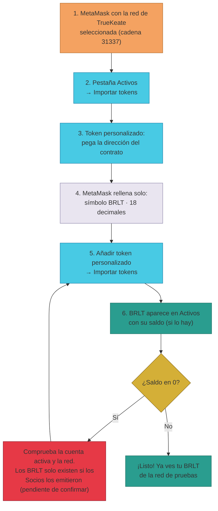

# Manual · Añade el token BRLT a tu billetera

> Versión en lenguaje sencillo del manual técnico "Agregar el token BRLT
> (BorloTokens) a la wallet". El **BRLT** es el "euro de pruebas" de TrueKeate:
> un token interno que la plataforma usa como valor de compensación. Para
> verlo en MetaMask hay que **añadirlo una vez, a mano**.

> 🔎 Datos auditados el 2026-09-04 en la red de pruebas (anvil, cadena 31337).

---

## 1. Empezar en 5 minutos

Ejemplo: quieres ver el saldo BRLT de **Ana** en tu billetera.

1. Abre MetaMask y comprueba que tienes **seleccionada la red de TrueKeate**
   (cadena 31337). Si no la tienes, sigue el manual
   [02 · Conecta TrueKeate a tu billetera](02-conexion-red-rpc.md).
2. Pestaña **"Activos"** → botón **"Importar tokens"**.
3. Elige la pestaña **"Token personalizado"** y pega esta dirección:

   ```
   0x6f6f570f45833e249e27022648a26f4076f48f78
   ```

4. Al pegar la dirección, MetaMask **rellena solo** el símbolo (`BRLT`) y los
   decimales (`18`) leyendo el contrato. Si no lo hace, escríbelos a mano.
5. Pulsa **"Añadir token personalizado"** → **"Importar tokens"**.
6. BRLT aparece en tu lista de *Activos*. Si esa cuenta tiene saldo, lo verás
   ahí mismo.

> ¿No ves saldo? Puede que sea normal: BRLT solo existe si los Socios de la
> plataforma lo emitieron (ver apartado 2.3). Comprueba también que la cuenta
> activa es la correcta y que la red es la 31337.

---

## 2. ¿Qué es BRLT?

### 2.1 Un token de contrato (ERC-20), no la moneda de la red

- BRLT es un **token estándar ERC-20**: como una ficha que se puede dividir en
  18 decimales. En la cadena vive en el contrato **BorloTokens**.
- No lo confundas con **ETH**: ETH es la moneda nativa de la red de pruebas
  (la que paga el "combustible" de las operaciones). BRLT es el valor interno
  de la plataforma.

| Dato | Valor |
|---|---|
| Dirección del contrato | `0x6f6f570f45833e249e27022648a26f4076f48f78` |
| Símbolo | `BRLT` |
| Decimales | `18` |
| Estándar | ERC-20 (`balanceOf`, `transfer`, …) |
| Nombre real del contrato | BorloTokens |

### 2.2 ¿Quién crea BRLT?

- No se "crea" desde la billetera ni desde la plataforma libremente. BRLT lo
  emite un mecanismo de la plataforma (el padrón de Socios) **solo después de
  una votación de los Socios** con quórum de al menos 2/3.
- Hay un tope inicial de emisión (1.000.000 BRLT); subir ese tope también
  necesita votación de los Socios.
- Una parte de cada emisión se reserva automáticamente para el fondo de valor
  de la comunidad.

### 2.3 ¿Quién puede ver su saldo BRLT?

Aquí hay una regla con dos caras:

- **Dentro de la plataforma web** (módulo de Finanzas): el saldo BRLT solo es
  visible y gestionable para **Socios y Owner**. Si eres un particular
  registrado, la web te mostrará un aviso: *"El saldo BRLT solo es visible y
  gestionable para Socios y Owner"*.
- **En tu billetera (MetaMask)**: la regla de la plataforma no aplica. Si una
  cuenta tiene BRLT, cualquier wallet puede leer **su propio saldo** desde la
  blockchain. La regla no te impide ver tus tokens en MetaMask.

---

## 3. Añadir BRLT en MetaMask (ordenador)

1. Abre MetaMask y selecciona la **red del proyecto** (cadena 31337).
2. Pestaña **"Activos"** → botón **"Importar tokens"**.
3. Pestaña **"Token personalizado"**:
   - *Dirección del contrato de tokens*:
     `0x6f6f570f45833e249e27022648a26f4076f48f78`
   - Al pegarla, MetaMask autocompleta símbolo (`BRLT`) y decimales (`18`); si
     no, escríbelos a mano.
4. Pulsa **"Añadir token personalizado"** → **"Importar tokens"**.
5. BRLT aparecerá en *Activos* con su saldo (si lo hay).

---

## 4. Añadir BRLT en MetaMask (móvil)

1. En MetaMask móvil, selecciona la red del proyecto (cadena 31337) en el
   selector de red (arriba).
2. Pestaña **"Activos"** → **"Importar tokens"** → pestaña **"Personalizado"**.
3. Pega la dirección `0x6f6f570f45833e249e27022648a26f4076f48f78`.
4. Verifica que el símbolo es `BRLT` y los decimales `18` → **"Importar"**.

---

## 5. Comprobar el saldo BRLT

### 5.1 Desde MetaMask

- La tarjeta "BRLT" de la pestaña *Activos* muestra el saldo de la cuenta
  activa.
- Si no aparece saldo aunque creas que debería haberlo: revisa que la cuenta
  activa es la correcta y que la red seleccionada es la 31337.

### 5.2 Por la blockchain (verificación fiable)

Para personas curiosas o técnicas, se puede preguntar directamente al
contrato cuántos BRLT tiene una dirección (en este caso, Ana, cuenta 2):

```bash
cast call 0x6f6f570f45833e249e27022648a26f4076f48f78 \
  "balanceOf(address)(uint256)" 0x3C44CdDdB6a900fa2b585dd299e03d12FA4293BC \
  --rpc-url https://mcc-foundry-anvil-slzlptbcla-ew.a.run.app
```

El número sale en unidades mínimas (18 decimales): para leerlo como BRLT,
divide entre 1.000.000.000.000.000.000. Las billeteras ya hacen esa división
por ti.

### 5.3 ¿Por qué mi saldo es 0?

- El saldo puede ser 0 **aunque la cuenta esté registrada** en la plataforma:
  los BRLT solo existen si se emitieron mediante una propuesta aprobada por
  los Socios (apartado 2.2).
- El estado actual de las emisiones en cada entorno es **pendiente de
  confirmar**: si necesitas BRLT de prueba para un flujo, consulta al equipo
  técnico si ya hay emisiones hechas.

---

## 6. Avisos importantes

- ⚠️ BRLT no está en listas públicas de tokens (es una red de pruebas): por eso
  MetaMask no lo muestra hasta que lo **importas a mano** con este manual.
- ⚠️ **Red de pruebas**: el BRLT no tiene valor real. No lo compres ni lo
  vendas.
- ⚠️ La dirección del contrato puede cambiar si se reinicia el anvil de
  pruebas → **pendiente de confirmar** por entorno. Antes de importar, verifica
  la dirección actual en el registro de contratos del proyecto
  (`backend/contratos.json`).
- ⚠️ Desconfía de un token llamado "BRLT" que apunte a **otra dirección**:
  usa siempre la dirección auditada de este manual.

<!-- GENERAR_IMAGEN: token-brlt.svg -->


---

## 7. Ficha didáctica

| Campo | Contenido |
|---|---|
| **¿Qué es?** | El BRLT es el token interno de TrueKeate (contrato BorloTokens, estándar ERC-20, 18 decimales). Vive en la red de pruebas en la dirección `0x6f6f…48f78`. |
| **¿Para qué sirve?** | Ser el valor de compensación de la plataforma. En la web solo Socios y Owner ven su saldo BRLT; en la billetera, cualquiera con BRLT puede ver el suyo. |
| **Pasos clave** | 1) Seleccionar la red 31337. 2) Activos → Importar tokens → Token personalizado. 3) Pegar la dirección `0x6f6f570f45833e249e27022648a26f4076f48f78`. 4) Verificar símbolo `BRLT` y decimales `18`. 5) Importar. |
| **Errores comunes** | Confundir BRLT con ETH · Aceptar un "BRLT" de otra dirección · Tener la red equivocada (fuera de 31337 el contrato no existe) · Esperar saldo cuando los Socios aún no emitieron BRLT. |
| **Consejo de seguridad** | El token con el mismo símbolo pero distinta dirección es un clásico del fraude: la única dirección válida del BorloTokens del proyecto es la auditada `0x6f6f…48f78`. Y recuerda: es una red de pruebas, sin valor real. |

---

## 8. Lo que falta por confirmar (resumen)

1. Estado actual de las emisiones de BRLT en cada entorno (si hay saldo que
   ver) → **pendiente de confirmar**.
2. Si la dirección del contrato cambia tras un reinicio del anvil → verificar
   antes de importar (**pendiente de confirmar** por entorno).

---

## 9. Glosario de este manual

| Palabra | Significado |
|---|---|
| **Token** | Un activo digital que vive en la blockchain |
| **ERC-20** | Estándar de tokens fungibles (todos iguales y divisibles) |
| **Decimales** | En cuántas partes se puede dividir un token (18 = muy divisible) |
| **ETH** | La moneda de la red de pruebas; paga el "combustible" (gas) |
| **Importar tokens** | Añadir un token a mano en MetaMask para poder verlo |
| **Socios** | Miembros de la comunidad que votan las decisiones (emisiones de BRLT) |
| **Quórum** | Número mínimo de votos necesario para aprobar algo |
