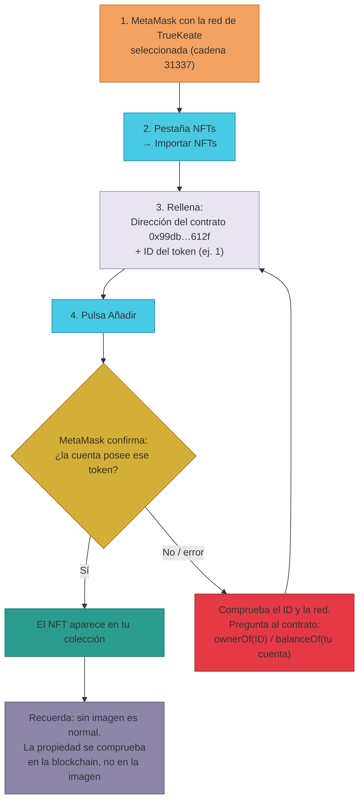

# Manual · Ver los NFTs de tus trueques en la billetera

> Versión en lenguaje sencillo del manual técnico "Verificación de los NFTs de
> los trueques en la wallet". Cuando haces un trueque en TrueKeate, el objeto
> ofrecido se representa como un **NFT** (un certificado digital único) en la
> red de pruebas. Aquí te contamos qué es ese NFT y cómo añadirlo a MetaMask
> para verlo.

> 🔎 Datos auditados el 2026-09-04 en la red de pruebas (anvil, cadena 31337).

---

## 1. Empezar en 5 minutos

Para ver un NFT necesitas **dos datos**: la dirección del contrato y el
**número del token** (su ID). Sin el ID no se puede importar.

1. Abre MetaMask y comprueba que tienes la **red de TrueKeate** (cadena 31337)
   seleccionada.
2. Pestaña **"NFTs"** (junto a "Activos") → botón **"Importar NFTs"**.
3. Rellena:
   - *Dirección*: `0x99dbe4aea58e518c50a1c04ae9b48c9f6354612f`
   - *ID*: el número del token (por ejemplo, `1`)
4. Pulsa **"Añadir"**.
5. MetaMask comprueba que el contrato es de NFTs y que la cuenta activa posee
   ese token. Si es tuya, el NFT se añade a tu colección.

> ⚠️ Antes de importar necesitas saber **qué ID tienes**. Ese dato no está en
> la web: hay que comprobarlo en la blockchain (apartado 5).

---

## 2. ¿Qué es el NFT de los trueques?

### 2.1 Un certificado único (ERC-721)

- Un **NFT** es un token **no fungible**: es único, no se puede partir ni
  cambiar por otro igual. Sirve para representar "esto es mío y es único".
- El contrato de pruebas de TrueKeate se llama **TrueKeateNFT** y su símbolo es
  **TKANFT**.

| Dato | Valor |
|---|---|
| Dirección del contrato | `0x99dbe4aea58e518c50a1c04ae9b48c9f6354612f` |
| Nombre | TrueKeate NFT |
| Símbolo | TKANFT |
| Estándar | ERC-721 (`balanceOf`, `ownerOf`, `mint`, …) |

### 2.2 Un NFT de pruebas (importante)

- TrueKeateNFT es un **contrato de pruebas** (un *mock*): en el entorno de
  desarrollo representa los objetos/certificados de los trueques.
- El contrato definitivo que representará los objetos del trueque en
  producción es **pendiente de confirmar** (hoy solo existe este mock).
- Los números de token (IDs) se asignan **en orden desde el 1**: el primer NFT
  minteado es el 1, el siguiente el 2, y así.
- En el despliegue básico **no se mintea ningún NFT**: los que existan en cada
  entorno dependen de las pruebas y flujos hechos. Qué IDs existen ahora en la
  red remota es **pendiente de confirmar**.

---

## 3. Añadir un NFT en MetaMask (ordenador)

### 3.1 Requisitos previos

1. Tener seleccionada la **red del proyecto** (cadena 31337).
2. Conocer la **dirección del contrato**:
   `0x99dbe4aea58e518c50a1c04ae9b48c9f6354612f`
3. Conocer el **ID del token** (un número entero, por ejemplo `1`).

### 3.2 Pasos

1. Abre MetaMask → pestaña **"NFTs"**.
2. Pulsa **"Importar NFTs"** (o el icono de importar).
3. Rellena los dos campos:
   - *Dirección*: `0x99dbe4aea58e518c50a1c04ae9b48c9f6354612f`
   - *ID*: el número de tu token (p. ej. `1`).
4. Pulsa **"Añadir"**. MetaMask valida que el contrato es ERC-721 y que la
   cuenta activa posee ese token.

---

## 4. Añadir un NFT en MetaMask (móvil)

1. En MetaMask móvil, selecciona la red del proyecto (cadena 31337).
2. Pestaña **"NFTs"** → **"Importar NFTs"**.
3. Pega la dirección del contrato + el token ID → **"Añadir"**.

---

## 5. Comprobar que el NFT es tuyo (la parte fiable)

### 5.1 Qué muestra MetaMask (limitación conocida)

- El contrato de pruebas **no incluye imagen ni descripción** (no define
  metadatos). Por eso MetaMask puede mostrar el NFT **sin imagen**, o fallar la
  vista previa. El comportamiento exacto de la interfaz con metadatos vacíos es
  **pendiente de confirmar**.
- No te preocupes: **la propiedad no depende de la imagen**. Se comprueba en la
  blockchain.

### 5.2 La fuente de verdad: preguntar al contrato

En la blockchain cada NFT guarda quién es su dueño. Dos preguntas útiles:

- **¿Cuántos NFTs de este contrato tiene una cuenta?** → se cuenta con
  `balanceOf`.
- **¿De quién es el token número X?** → se pregunta con `ownerOf`.

Ejemplo para personas técnicas (con la herramienta `cast`):

```bash
RPC=https://mcc-foundry-anvil-slzlptbcla-ew.a.run.app
NFT=0x99dbe4aea58e518c50a1c04ae9b48c9f6354612f

# ¿Cuántos NFTs TKANFT tiene Ana (cuenta 2)?
cast call $NFT "balanceOf(address)(uint256)" \
  0x3C44CdDdB6a900fa2b585dd299e03d12FA4293BC --rpc-url $RPC

# ¿Quién es el dueño del token 1?
cast call $NFT "ownerOf(uint256)(address)" 1 --rpc-url $RPC
```

- Si `ownerOf` da error, ese token **no existe** en esta red en este momento.
- Si `balanceOf` da 0, esa cuenta no tiene NFTs de este contrato.

> No hay un explorador de bloques configurado para el anvil remoto →
> **pendiente de confirmar**; por ahora, la verificación fiable es preguntar al
> contrato (como arriba).

### 5.3 Y dentro de la plataforma web

- El módulo de Finanzas muestra "NFTs en stock" de la cuenta conectada, pero
  ese dato es el **registrado en la base de datos** (un espejo), no una lectura
  directa de la blockchain. Para confirmar la propiedad real de un token hay
  que consultar la cadena (apartado 5.2).

---

## 6. Avisos importantes

- ⚠️ **Es un contrato de pruebas**: cualquiera puede mintear (crear) un NFT de
  este contrato para cualquier cuenta. Poseer uno **no certifica nada** sobre
  tu identidad ni tu estado en la plataforma.
- ⚠️ **Red de pruebas**: estos NFTs no tienen valor real.
- ⚠️ Los token IDs y saldos dependen del estado de cada anvil (si se reinicia,
  pueden cambiar): si `ownerOf` falla o `balanceOf` da 0, el NFT no existe en
  ese momento en esa red.

<!-- GENERAR_IMAGEN: nft-trueques.svg -->


---

## 7. Ficha didáctica

| Campo | Contenido |
|---|---|
| **¿Qué es?** | El NFT de los trueques (contrato TrueKeateNFT, estándar ERC-721, símbolo TKANFT) es un certificado digital único que representa el objeto de un trueque en la red de pruebas. Dirección: `0x99db…612f`. |
| **¿Para qué sirve?** | Para ver en tu billetera los NFTs/certificados de tus trueques de prueba y comprobar quién es el dueño de cada token en la blockchain. |
| **Pasos clave** | 1) Seleccionar la red 31337. 2) Pestaña NFTs → Importar NFTs. 3) Pegar la dirección `0x99dbe4aea58e518c50a1c04ae9b48c9f6354612f` + el ID del token. 4) Añadir. 5) Para confirmar propiedad, preguntar a la cadena (`ownerOf`/`balanceOf`). |
| **Errores comunes** | Importar sin saber el ID del token · Tener la red equivocada (no aparece) · Esperar imagen o descripción (este contrato de pruebas no tiene metadatos) · Fiarse de una captura en vez de comprobar `ownerOf`. |
| **Consejo de seguridad** | La fuente de verdad es la **blockchain** (`ownerOf`), no la interfaz: si el contrato no dice que eres el dueño, no lo eres, muestre lo que muestre la wallet. Y recuerda: es un NFT de pruebas, sin valor real. |

---

## 8. Lo que falta por confirmar (resumen)

1. Qué token IDs existen ahora en la red remota (depende de los mints hechos
   por pruebas/flujos) → **pendiente de confirmar**.
2. Cómo muestra MetaMask un NFT sin metadatos (imagen/descripción) →
   **pendiente de confirmar**.
3. El contrato definitivo de representación de objetos del trueque →
   **pendiente de confirmar** (hoy solo existe el mock de pruebas).

---

## 9. Glosario de este manual

| Palabra | Significado |
|---|---|
| **NFT** | Token no fungible: único e irrepetible |
| **ERC-721** | Estándar de NFTs (cada token es distinto) |
| **Token ID** | El número de matrícula de un NFT (1, 2, 3…) |
| **Mock** | Programa de pruebas que imita al real para poder probar |
| **Mint** | Crear (acuñar) un token nuevo |
| **ownerOf / balanceOf** | Preguntas al contrato: "¿de quién es este token?" / "¿cuántos tiene esta cuenta?" |
| **Metadatos** | La imagen y la descripción que acompañan a un NFT |
