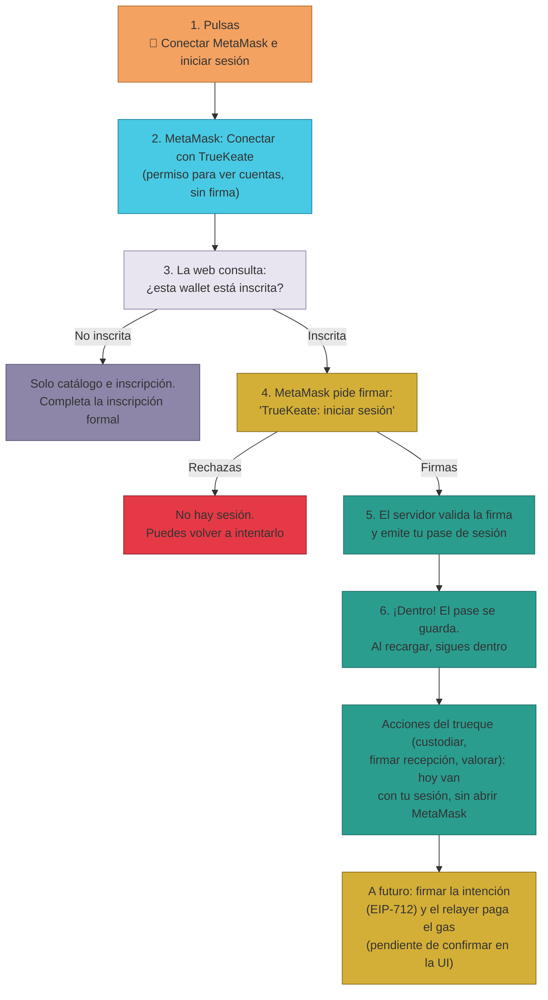

# Manual · Firmar y autorizar en la plataforma

> Versión en lenguaje sencillo del manual técnico "Interacción con la wallet en
> la plataforma". Cuando usas TrueKeate, tu billetera (MetaMask) aparece en
> momentos concretos: para **conectarte**, para **iniciar sesión firmando** y,
> en el futuro, para **autorizar los pasos de un trueque**. Aquí te explicamos
> qué significa cada cosa y cuándo te pedirán algo.

> 🔎 Datos auditados el 2026-09-04 en la red de pruebas (anvil, cadena 31337).

---

## 1. Empezar en 5 minutos

Ejemplo: quieres entrar en la web de TrueKeate como **Ana**.

1. Importa la cuenta de Ana en MetaMask (manual
   [03 · Las cuentas de prueba](03-cuentas-anvil.md)) y selecciona la red de
   TrueKeate (cadena 31337).
2. Abre la web de TrueKeate:
   `https://truekeate-web-593453426217.europe-west1.run.app`
3. Pulsa **"🔗 Conectar MetaMask e iniciar sesión"**.
4. En MetaMask aparece el diálogo **"Conectar con TrueKeate"**: es un permiso
   para **ver tus cuentas** (no firma nada). Pulsa aprobar.
5. Si la cuenta está inscrita, MetaMask te pide **firmar el mensaje de sesión**:
   *"TrueKeate: iniciar sesión"*. Firma.
6. ¡Ya estás dentro! La sesión queda guardada. Al recargar la página, la web te
   reconoce sin volver a preguntar.

> Importante: **firmar la sesión no cuesta gas ni necesita ETH**. Es solo una
> firma, no un pago.

---

## 2. Conectar la billetera: ¿qué ocurre al pulsar el botón?

### 2.1 Los tres pasos del botón oficial

El botón **"🔗 Conectar MetaMask e iniciar sesión"** hace tres cosas, en orden:

1. **Conectar**: MetaMask abre el diálogo *"Conectar con TrueKeate"*. Es un
   **permiso para ver tus cuentas**. No es una firma ni una transacción.
2. **Consultar**: la web pregunta al servidor si esa wallet está **inscrita**
   en TrueKeate.
3. **Autenticar**: si está inscrita, la web pide la **firma de sesión**
   (apartado 3).

### 2.2 ¿Y si mi cuenta no está inscrita?

- Si la wallet no está inscrita, la suite (tu área privada) queda bloqueada:
   solo podrás ver el catálogo y la pantalla de inscripción.
- Para operar hay que completar la **inscripción formal**: correo, teléfono,
  dirección y consentimiento de protección de datos.
- Los botones "Conectar MetaMask" que aparecen en otras pantallas (por ejemplo,
  en "Mi Trueke Central") solo **conectan** la cuenta: no firman la sesión. El
  botón completo para entrar es el de "Conectar **e iniciar sesión**".

### 2.3 Al recargar la página

- La web guarda tu cuenta y tu sesión en el navegador. Al recargar, restaura
  la cuenta y, si la sesión pertenece a esa misma cuenta, también la sesión:
  no tendrás que firmar otra vez.
- Si MetaMask está **bloqueada**, la web conserva la cuenta pero no puede
  firmar: te pedirá desbloquear la billetera cuando haga falta.

---

## 3. Firmar la sesión: el mensaje "TrueKeate: iniciar sesión"

### 3.1 Qué es exactamente

- Para iniciar sesión, TrueKeate pide firmar un **mensaje concreto**:
  *"TrueKeate: iniciar sesión"*.
- Firma ese mensaje con tu billetera. El servidor comprueba quién lo firmó
  (sin que tú envíes nunca tu clave privada) y emite un **pase de sesión** que
  la web guarda en el navegador.
- Ese pase se usa en todas las llamadas de tu área privada: es tu "carné"
  mientras estás dentro.

### 3.2 Qué verás en MetaMask

- MetaMask muestra un diálogo de **firma de mensaje** con el texto
  *"TrueKeate: iniciar sesión"*.
- Es una **firma, no una transacción**: **no consume gas** ni requiere saldo
  de ETH.
- Si la **rechazas**, simplemente no entras: la web registra el fallo y te
  deja sin sesión. Puedes volver a intentarlo.

### 3.3 Una sola firma para todo (login único)

- Con una sola firma de sesión accedes a todas las secciones de tu área
  privada según tu tipo y estado (particular, empresa, socio…).
- Si **cambias de cuenta** o **cierras sesión**, el pase de la cuenta anterior
  se descarta: con la nueva cuenta hay que **volver a firmar** (manual
  [03 · cuentas](03-cuentas-anvil.md), apartado 6).

---

## 4. Autorizar los pasos de un trueque

### 4.1 Qué ocurre HOY en la web (verificado)

- Las acciones de un trueque en la web — **custodiar mi lado**, **firmar la
  recepción** y **valorar** — se envían al servidor con tu **sesión** (el pase
  del apartado 3). No abren ninguna ventana de MetaMask ni piden firma.
- El servidor registra el paso en su base de datos (el "espejo" del trueque).

### 4.2 El diseño a futuro: firmar la intención y que la plataforma pague

- El diseño previsto (meta-transacciones) es que tú **firmes tu intención**
  (un documento tipado llamado EIP-712) y un servicio de la plataforma (el
  **relayer**) ejecute el paso pagando el "combustible" (gas) por ti.
- Esa parte on-chain **existe y está probada en el código** (contrato
  SmartAccount + relayer), pero **la web todavía NO te pide esa firma**: no hay
  botones en la interfaz que la soliciten hoy.
- Por lo tanto, "firmar un intent EIP-712 desde la web" queda
  **pendiente de confirmar** hasta que se integre en la interfaz.

### 4.3 Qué significa cada botón del trueque

| Botón en la web | Qué hace hoy | ¿Abre MetaMask? |
|---|---|---|
| **Custodiar mi lado** | Marca el trueque como custodiado en la base de datos | No |
| **Firmar recepción** | Registra que recibiste lo pactado | No |
| **Valorar (1–5)** | Guarda tu valoración del trueque | No |

> El avance **on-chain** del trueque (el contrato Escrow con sus estados) está
> desplegado y probado en el código, pero la gestión desde la wallet (firmar
> intents para custodiar/completar) es la parte pendiente de la integración →
> **pendiente de confirmar**.

---

## 5. ¿Firma o transacción? Lo que puede pedirte MetaMask

Cuando uses TrueKeate (ahora o en el futuro) puedes encontrarte con cuatro
tipos de ventana en MetaMask. Conviene saber distinguirlos:

| Ventana que ves | Qué es | ¿Firma o transacción? | ¿Gasta ETH? |
|---|---|---|---|
| *"Conectar con TrueKeate"* (ver cuentas) | Permiso para ver tus cuentas | Permiso (sin firma) | No |
| *"TrueKeate: iniciar sesión"* (mensaje) | Firma de sesión | Firma de mensaje | **No** (sin gas) |
| Firma de datos tipados *"TrueKeate SmartAccount"* | Tu intención de un paso del trueque (diseño) | Firma de datos | **No para ti**: la plataforma (relayer) paga el gas · hoy **sin UI** → pendiente de confirmar |
| Confirmar transacción (con gas en ETH) | Ejecutar algo directamente en la cadena | Transacción | **Sí**, gas en ETH de pruebas · sin UI verificada → pendiente de confirmar |

Regla mnemotécnica:

- **Permiso** = solo ver tus cuentas. Sin firma, sin gas.
- **Firma de mensaje** = demuestras que controlas la cuenta. Sin gas.
- **Firma de datos tipados** = autorizas una operación concreta; el relayer
  paga el gas (cuando exista la UI).
- **Transacción** = ejecutas y pagas el gas tú.

---

## 6. Avisos importantes

- ⚠️ **Conectar no es firmar**: dar permiso para ver tus cuentas no revela tu
  clave ni firma nada. La única firma que pide la app al entrar es el mensaje
  de sesión.
- ⚠️ Una firma es **vinculante**: revisa siempre el texto exacto que firmas
  (aquí, siempre *"TrueKeate: iniciar sesión"*) y comprueba que estás en la web
  oficial de TrueKeate (evita sitios suplantadores).
- ⚠️ Verifica la **red activa** (cadena 31337) antes de confirmar cualquier
  cosa en MetaMask.
- ⚠️ Si un día ves una firma de datos tipados *"TrueKeate SmartAccount"*,
  revisa que el mensaje describe exactamente la operación que quieres
  autorizar antes de firmar.

<!-- GENERAR_IMAGEN: flujo-firma.svg -->

---

## 7. Ficha didáctica

| Campo | Contenido |
|---|---|
| **¿Qué es?** | Es la forma en que tu billetera participa en TrueKeate: conectar (permiso para ver cuentas), firmar la sesión (*"TrueKeate: iniciar sesión"*) y, en el futuro, firmar intents de trueque. |
| **¿Para qué sirve?** | Para entrar en tu área privada demostrando que controlas tu cuenta (sin enviar tu clave) y para autorizar los pasos de tus trueques. Firmar la sesión **no cuesta gas**. |
| **Pasos clave** | 1) Conectar MetaMask (permiso de cuentas, sin firma). 2) Si estás inscrito, firmar *"TrueKeate: iniciar sesión"*. 3) Operar: hoy las acciones del trueque van con tu sesión (sin MetaMask). 4) Al cambiar de cuenta, volver a firmar. |
| **Errores comunes** | Confundir conectar con firmar (o firmar con pagar) · Rechazar la firma y creer que algo falló (solo no entras) · Cambiar de cuenta y esperar seguir con la misma sesión (se descarta) · Esperar que la web pida hoy la firma de intents EIP-712 (todavía no existe esa UI). |
| **Consejo de seguridad** | Revisa siempre el texto que firmas y la URL de la web. Regla: **permiso = ver · firma = autorizar (sin gas) · transacción = ejecutar y pagar gas**. En esta red el gas es ETH simbólico de pruebas, pero el hábito de revisar cada ventana se lleva a las redes reales. |

---

## 8. Lo que falta por confirmar (resumen)

1. La firma de intents EIP-712 desde la web (no existe UI hoy; la pieza
   on-chain SmartAccount + relayer sí está implementada y probada) →
   **pendiente de confirmar**.
2. El avance on-chain real de los trueques desde la wallet (escrow con sus
   estados) → **pendiente de confirmar** en esta integración.
3. Las transacciones directas con gas (casos de empresas o fallback) no tienen
   UI verificada → **pendiente de confirmar**.

---

## 9. Glosario de este manual

| Palabra | Significado |
|---|---|
| **Conectar** | Dar permiso a la web para ver tus cuentas (sin firma) |
| **Firma de mensaje** | Demostrar que controlas una cuenta firmando un texto |
| **Pase de sesión (token)** | El "carné" que la web guarda tras tu firma de entrada |
| **Gas** | El "combustible" que pagan las operaciones de la red |
| **Relayer** | Servicio de la plataforma que pagará el gas de tus trueques |
| **EIP-712** | Formato de firma de datos tipados (estructurados) usado en el diseño de trueques |
| **Escrow** | Depósito intermediario: nadie cobra hasta que ambas partes cumplen |
