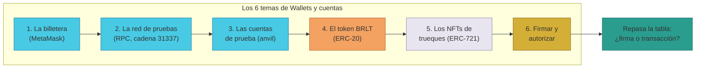

# Manual · Fichas didácticas: repaso de los 6 temas

> Compendio en lenguaje sencillo del manual técnico "Fichas didácticas
> (tarjetas de estudio)". Estas fichas resumen lo esencial de cada tema de
> **Wallets y cuentas** para repasar en 5 minutos: ¿qué es?, ¿para qué sirve?,
> pasos clave, errores comunes y consejo de seguridad.
>
> Cada ficha es la versión corta de su manual completo (archivos 01–06 de esta
> carpeta), que termina con su propia **Ficha didáctica** más detallada.

> 🔎 Datos auditados el 2026-09-04 en la red de pruebas (anvil, cadena 31337).

---

## 1. Empezar en 5 minutos: cómo usar este compendio

1. Elige el tema que quieres repasar (apartados 3 a 8).
2. Lee su ficha rápida: es la idea clave de un vistazo.
3. Si necesitas los pasos completos o los datos exactos, abre el manual
   correspondiente (cada ficha enlaza al suyo).
4. Termina con el apartado 9: la tabla *"¿firma o transacción?"* es la que
   resume el comportamiento de la billetera en toda la plataforma.

---

## 2. El mapa de las fichas

| Tema | Fichas rápidas | Manual completo |
|---|---|---|
| 1. La billetera (wallet) | Qué es · Conectar a TrueKeate | [01 · Cómo crear tu billetera](01-instalacion-wallet.md) |
| 2. La red de pruebas (RPC) | Qué es · Parámetros · Verificar red | [02 · Conecta TrueKeate a tu billetera](02-conexion-red-rpc.md) |
| 3. Las cuentas de prueba | Cuentas anvil · Roles · Con/sin fondos | [03 · Las cuentas de prueba](03-cuentas-anvil.md) |
| 4. El token BRLT | Qué es · Saldo y transferencias | [04 · Añade el token BRLT a tu billetera](04-token-brlt.md) |
| 5. Los NFTs de trueques | Qué es · Verificar propiedad | [05 · Ver los NFTs de tus trueques](05-nfts-trueques.md) |
| 6. Firmar y autorizar | Login · Intents y relayer · Firma vs transacción | [06 · Firmar y autorizar en la plataforma](06-interactuar-wallet.md) |

<!-- GENERAR_IMAGEN: mapa-fichas.svg -->

---

## 3. Ficha 1 · La billetera (wallet)

**¿Qué es?** Una aplicación que guarda tus **claves privadas** y firma por ti
sin exponerlas. En TrueKeate la billetera es **MetaMask** (extensión en el
ordenador, app en el móvil). La billetera **no guarda tus tokens**: guarda las
claves; los saldos viven en la blockchain y ella solo los lee y muestra.

**¿Para qué sirve?** Conectarte a TrueKeate, firmar el inicio de sesión y ver
tus activos de la red de pruebas: ETH (moneda de la red), BRLT (token interno)
y los NFTs de los trueques.

**Pasos clave** 1) Instalar MetaMask (solo fuentes oficiales). 2) Añadir una
vez la red de TrueKeate (cadena 31337) — la plataforma no la añade por ti.
3) Importar una cuenta de prueba (por ejemplo la de Ana, con su clave privada).
4) Entrar en la web y pulsar "Conectar MetaMask e iniciar sesión".

**Errores comunes** Tener seleccionada otra red (los saldos "no aparecen") ·
Confundir conectar (permiso para ver) con firmar o pagar · Usar estas cuentas
de prueba con dinero real.

**Consejo de seguridad** El mnemónico del anvil
(`test test test test test test test test test test test junk`) es **público**:
nunca lo uses con fondos reales ni en producción. La frase semilla no se
comparte jamás.

> Manual completo: [01 · Cómo crear tu billetera](01-instalacion-wallet.md) →
> su sección **Ficha didáctica**.

---

## 4. Ficha 2 · La red de pruebas (RPC)

**¿Qué es?** La red donde vive TrueKeate de pruebas: un nodo **anvil/Foundry
remoto** con cadena **31337** y moneda nativa **ETH** (simbólico de pruebas).
Su RPC es:
`https://mcc-foundry-anvil-slzlptbcla-ew.a.run.app`. En esa red están los
contratos del proyecto (Escrow, BRLT, TrueKeateNFT, …).

**¿Para qué sirve?** Que tu billetera sepa a qué cadena conectarse. Si la
billetera apunta a otra red, no encontrará tus BRLT ni tus NFTs, aunque la
cuenta sea la correcta.

**Pasos clave** 1) MetaMask → selector de red → "Añadir red" → "Añadir una red
manualmente". 2) Rellenar: nombre sugerido "TrueKeate Anvil (pruebas)", RPC de
arriba, Chain ID `31337`, símbolo `ETH`, decimales `18`, explorador vacío.
3) Guardar y verificar que la red queda seleccionada.

**Errores comunes** Escribir mal la URL del RPC · Confundir el RPC con la URL
de la web o de la API (son servicios distintos) · Poner el Chain ID de otra
cadena.

**Consejo de seguridad** El ETH de esta red es **simbólico de pruebas**: nunca
confundas esta cadena con Ethereum real (Chain ID 1) ni conectes a ella una
billetera con fondos reales.

> Manual completo: [02 · Conecta TrueKeate a tu billetera](02-conexion-red-rpc.md) →
> su sección **Ficha didáctica**.

---

## 5. Ficha 3 · Las cuentas de prueba (anvil)

**¿Qué es?** Las cuentas que crea el anvil a partir de un **mnemónico estándar
público**. Anvil financia con ETH de prueba las **10 primeras (índices 0–9)**.
La cuenta 0 es el **Owner/Admin**, la 1 es el **Relayer** (paga el gas de los
trueques) y las cuentas 2–9 son usuarios de ejemplo: **Ana** (2), Bruno (3),
Carla (4), Diego (5), Elena (6), Fabián (7), Gisela (8), Héctor (9). Irene
(10), Javier (11) y Karen (12) **no tienen fondos** por defecto.

**¿Para qué sirve?** Probar la plataforma con usuarios de ejemplo: importas la
cuenta de Ana en MetaMask y la web te reconoce como Ana.

**Pasos clave** 1) Elegir la cuenta en la tabla del manual 03. 2) MetaMask →
"Añadir cuenta" → "Importar cuenta" → pegar su **clave privada** (tipo "Clave
privada"). 3) Comprobar que la dirección resultante coincide con la de la
tabla. 4) Conectar en la web e iniciar sesión.

**Errores comunes** Mezclar claves entre cuentas (cada clave deriva en UNA
dirección) · Pensar que las 20 cuentas tienen fondos (solo 0–9) · Usar estas
cuentas fuera de pruebas.

**Consejo de seguridad** Cualquiera que conozca una clave privada puede firmar
por esa cuenta: estas claves son **solo para el anvil de pruebas**. En
producción, las claves del Owner y del relayer viven en el cajón de secretos
(Secret Manager), no en manuales.

> Manual completo: [03 · Las cuentas de prueba](03-cuentas-anvil.md) → su
> sección **Ficha didáctica**.

---

## 6. Ficha 4 · El token BRLT

**¿Qué es?** El token interno de TrueKeate (contrato **BorloTokens**, estándar
**ERC-20**, **18 decimales**), desplegado en la red 31337 en la dirección
`0x6f6f570f45833e249e27022648a26f4076f48f78`. Es la "stablecoin" de la
plataforma: se emite solo tras votación de los **Socios** (quórum ≥2/3), no se
crea desde la billetera.

**¿Para qué sirve?** Ser el valor de compensación interno. En la **web**, el
saldo BRLT solo es visible para **Socios y Owner**; en tu **billetera**, si
tienes BRLT puedes ver el tuyo sin problema.

**Pasos clave** 1) Red 31337 seleccionada. 2) MetaMask → Activos → "Importar
tokens" → "Token personalizado". 3) Pegar la dirección de arriba: MetaMask
autocompleta símbolo `BRLT` y decimales `18`. 4) "Añadir token personalizado"
→ Importar.

**Errores comunes** Confundir BRLT con ETH (ETH es la moneda que paga el gas) ·
Aceptar un "BRLT" de otra dirección · Esperar saldo cuando los Socios aún no
emitieron BRLT (puede ser 0 aunque estés registrado) · Leer el saldo con la red
equivocada.

**Consejo de seguridad** Tokens con el mismo símbolo pero distinta dirección
son un clásico del fraude: la única dirección válida del BorloTokens es
`0x6f6f…48f78`. Las transferencias son **irreversibles**: revisa la dirección
destino completa antes de enviar, incluso en pruebas.

> Manual completo: [04 · Añade el token BRLT a tu billetera](04-token-brlt.md) →
> su sección **Ficha didáctica**.

---

## 7. Ficha 5 · Los NFTs de trueques

**¿Qué es?** Un **NFT** es un certificado digital único (estándar **ERC-721**).
El de TrueKeate es el contrato **TrueKeateNFT** (símbolo **TKANFT**), dirección
`0x99dbe4aea58e518c50a1c04ae9b48c9f6354612f`, y es un **contrato de pruebas**
(mock): representa los objetos/certificados de los trueques en el entorno de
desarrollo.

**¿Para qué sirve?** Ver en tu billetera los NFTs de tus trueques de prueba y
comprobar quién es el dueño de cada token.

**Pasos clave** 1) Red 31337 seleccionada. 2) MetaMask → pestaña "NFTs" →
"Importar NFTs". 3) Pegar la dirección del contrato + el **ID del token**
(número entero, p. ej. `1`; los IDs van en orden desde el 1). 4) "Añadir".
5) Para confirmar propiedad, preguntar al contrato (`ownerOf`/`balanceOf`).

**Errores comunes** Importar sin saber el ID del token · Tener la red
equivocada · Esperar imagen o descripción (este contrato de pruebas no tiene
metadatos: puede verse sin imagen) · Fiarse de una captura en vez de
comprobar en la cadena quién es el dueño.

**Consejo de seguridad** Cualquiera puede mintear (crear) NFTs de este contrato
de pruebas: poseer uno **no certifica nada** fuera del desarrollo. La fuente de
verdad es la blockchain (`ownerOf`), no la imagen.

> Manual completo: [05 · Ver los NFTs de tus trueques](05-nfts-trueques.md) →
> su sección **Ficha didáctica**.

---

## 8. Ficha 6 · Firmar y autorizar

**¿Qué es?** La forma en que tu billetera participa en TrueKeate: **conectar**
(permiso para ver cuentas, sin firma), **firmar la sesión** (*"TrueKeate:
iniciar sesión"*, sin gas) y, en el futuro, **firmar intents de trueque**.

**¿Para qué sirve?** Entrar en tu área privada demostrando que controlas tu
cuenta (sin enviar tu clave privada) y autorizar los pasos de tus trueques. El
diseño previsto: tú firmas tu intención (formato EIP-712) y el **relayer**
(pieza de la plataforma) paga el gas.

**Pasos clave** 1) Pulsar "Conectar MetaMask e iniciar sesión". 2) Aprobar el
permiso de cuentas. 3) Si estás inscrito, firmar el mensaje de sesión.
4) Operar: hoy las acciones del trueque (custodiar, firmar recepción, valorar)
van con tu sesión, sin abrir MetaMask. 5) Al cambiar de cuenta, volver a
firmar.

**Errores comunes** Confundir conectar con firmar (o firmar con pagar) ·
Rechazar la firma y creer que algo falló (solo no entras) · Cambiar de cuenta
y esperar conservar la sesión anterior · Esperar que la web pida hoy la firma
de intents EIP-712 (esa UI todavía no existe).

**Consejo de seguridad** Revisa siempre el texto exacto que firmas y la URL de
la web (evita sitios suplantadores). Regla mnemotécnica: **permiso = ver ·
firma = autorizar (sin gas) · transacción = ejecutar y pagar gas**.

> Manual completo: [06 · Firmar y autorizar en la plataforma](06-interactuar-wallet.md) →
> su sección **Ficha didáctica**.

---

## 9. La tabla que lo resume todo: ¿firma o transacción?

| Ventana en MetaMask | Qué es | ¿Firma o transacción? | ¿Gasta ETH? |
|---|---|---|---|
| "Conectar con TrueKeate" (ver cuentas) | Permiso para ver tus cuentas | Permiso (sin firma) | No |
| "TrueKeate: iniciar sesión" | Firma de sesión | Firma de mensaje | **No** (sin gas) |
| Firma de datos tipados "TrueKeate SmartAccount" | Tu intención de un paso del trueque (diseño) | Firma de datos | **No para ti**: el relayer paga · hoy **sin UI** → pendiente de confirmar |
| Confirmar transacción (con gas en ETH) | Ejecutar algo directamente en la cadena | Transacción | **Sí**, gas en ETH de pruebas · sin UI verificada → pendiente de confirmar |

---

## 10. Ficha didáctica del compendio

| Campo | Contenido |
|---|---|
| **¿Qué es?** | Un repaso rápido en fichas de los 6 temas de Wallets y cuentas: billetera, red RPC, cuentas de prueba, BRLT, NFTs y firma. |
| **¿Para qué sirve?** | Recordar en pocos minutos la idea de cada tema y saber a qué manual completo ir cuando necesitas los pasos o datos exactos. |
| **Pasos clave** | 1) Repasar las fichas 1–6 (apartados 3–8). 2) Memorizar la regla: permiso = ver · firma = sin gas · transacción = pagar gas (apartado 9). 3) Ante la duda, abrir el manual del tema. |
| **Errores comunes** | Estudiarse solo la ficha sin mirar el manual cuando se va a operar · Confundir los activos (ETH vs BRLT vs NFT) · Confundir conectar, firmar y pagar. |
| **Consejo de seguridad** | Repasa siempre dos datos antes de operar: la **red activa** (cadena 31337) y el **texto exacto que firmas**. Todo lo de este compendio es de la red de pruebas: nada tiene valor real. |

---

## 11. Lo que falta por confirmar (resumen)

1. Firma de intents EIP-712 desde la web (no existe UI hoy; la pieza on-chain
   SmartAccount + relayer está implementada y probada) → **pendiente de
   confirmar**.
2. Avance on-chain real de los trueques desde la wallet (escrow con sus
   estados) → **pendiente de confirmar** en esta integración.
3. Qué token IDs de TrueKeateNFT existen ahora en la red remota y estado de
   emisiones de BRLT → **pendiente de confirmar** por entorno.
4. Comportamiento de MetaMask con NFTs sin metadatos y contratos definitivos de
   representación de objetos → **pendiente de confirmar**.

---

## 12. Glosario de este compendio

| Palabra | Significado |
|---|---|
| **Wallet / billetera** | Aplicación que guarda tus claves y firma por ti (MetaMask) |
| **RPC** | La "dirección" del nodo al que se conecta la billetera |
| **Chain ID** | El número de identidad de una cadena (aquí, 31337) |
| **Anvil** | El simulador de blockchain de pruebas del proyecto |
| **Clave privada** | La llave secreta de una cuenta: quien la tiene, firma por ella |
| **ETH** | Moneda de la red de pruebas; paga el gas |
| **BRLT** | Token interno ERC-20 de la plataforma |
| **NFT** | Certificado digital único (ERC-721) |
| **Gas** | El "combustible" que pagan las operaciones |
| **Relayer** | Servicio de la plataforma que paga el gas de los trueques |
| **EIP-191 / EIP-712** | Formatos de firma (mensaje simple / datos estructurados) |
| **Pendiente de confirmar** | Dato o función que aún no se ha podido verificar |
