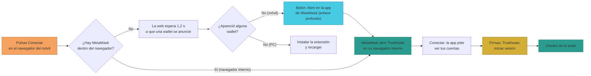

# Manual · Conecta tu billetera desde el móvil

> Versión en lenguaje sencillo del manual técnico
> "Conexión de wallet en móvil (deep link / navegador interno)"
> (`RepoTecnico/Manuales/07-Wallets-y-Cuentas/09-conexion-wallet-movil.md`).
> Aquí contamos cómo usar TrueKeate desde el **móvil** con MetaMask, cuando
> el navegador del teléfono no tiene extensiones. Comprobado en un teléfono
> real el 2026-09-08. Complementa a "Cómo crear tu billetera"
> (`01-instalacion-wallet.md`) y a "Conectar la wallet a la red del
> proyecto" (`02-conexion-red-rpc.md`).

---

## 1. Empezar en 5 minutos

Si quieres usar TrueKeate desde tu móvil hoy, el método que funciona es
este:

1. **Instala la app de MetaMask** en tu móvil (Google Play o App Store) y
   crea o importa tu billetera.
2. Asegúrate de que la app tiene **la red del proyecto** (anvil 31337)
   configurada — ver manual `02-conexion-red-rpc.md`.
3. **Vía automática**: en la web de TrueKeate pulsa **"Conectar"** y luego
   **"📲 Abrir en la app de MetaMask"**. La app se abre sola con la web
   dentro de su navegador.
4. **Vía manual**: dentro de la app de MetaMask abre su **Navegador**
   (menú ⋮) y escribe la dirección de TrueKeate.
5. Conecta y firma el mensaje "TrueKeate: iniciar sesión" → ¡dentro!

> ⚠️ Recuerda: esta red es de **pruebas** y el dinero es simbólico. No uses
> cuentas con valor real (ver manual `03-cuentas-anvil.md`).

---

## 2. El problema: los navegadores del móvil no tienen extensiones

### 2.1 Por qué la app se quedaba bloqueada

- En el ordenador, MetaMask es una **extensión** que se mete dentro del
  navegador. En Android/iPhone **no existen extensiones**: el navegador del
  móvil no tiene a MetaMask dentro, así que la web de TrueKeate mostraba
  "MetaMask no está instalado…" y no dejaba entrar a la suite.

### 2.2 La solución elegida (decisión del director, 2026-09-08)

Se adoptaron **dos caminos** que sí funcionan en móvil:

1. **Enlace profundo (deep link)**: la web te manda a la **app de
   MetaMask**, que abre la misma página de TrueKeate dentro de su propio
   navegador (ahí MetaMask sí está "dentro").
2. **Navegador interno**: tú mismo abres el navegador que trae la app de
   MetaMask y escribes la dirección de TrueKeate.

> El estándar universal WalletConnect (conectar con cualquier wallet) queda
> anotado como **mejora futura**: necesita una clave de proyecto externa que
> hoy no está configurada.

### 2.3 Dónde vive esta lógica en el código

| Pieza | Dónde está | Qué hace |
|---|---|---|
| Detector de móvil | `web/lib/ethereum.tsx` | Detecta si navegas desde un teléfono |
| Espera de wallet | `web/lib/ethereum.tsx` | Espera 1,2 segundos a que una wallet se anuncie sola |
| Adopción de la wallet | `web/lib/ethereum.tsx` | Si no hay MetaMask en el navegador, adopta la que se anuncie |
| Enlace a la app | `web/lib/ethereum.tsx` | Construye el enlace `metamask.app.link/dapp/<web>` |
| Tarjeta de ayuda móvil | `web/components/SuiteGuard.tsx` | Te ofrece los dos caminos: botón "Abrir en la app" o pasos del navegador interno |

<!-- GENERAR_IMAGEN: conexion-wallet-movil.svg -->

---

## 3. Cómo funciona la conexión en el móvil, paso a paso

### 3.1 Paso 1 — Pulsas "Conectar" en el navegador

- Cuando entras en una sección de la suite sin billetera conectada, la web
  te muestra la pantalla de conexión con el botón **"🔗 Conectar MetaMask
  e iniciar sesión"**.

### 3.2 Paso 2 — La web espera a que una wallet se presente

- El navegador del móvil no tiene `window.ethereum` (la "ventanilla" por la
  que MetaMask se asoma en el PC). Por eso la web **espera 1,2 segundos**
  por si alguna wallet se anuncia sola (es el estándar EIP-6963: las apps
  de wallet se presentan cuando cargan).
- Si no aparece ninguna, la web te muestra un mensaje distinto según tu
  aparato: en **móvil** te ofrece abrir la app de MetaMask; en el
  **ordenador** te pide instalar la extensión.

### 3.3 Paso 3 — La web te abre la app de MetaMask (enlace profundo)

1. En la pantalla de conexión verás el botón **"📲 Abrir en la app de
   MetaMask"**.
2. Al pulsarlo, tu móvil **abre la app de MetaMask** y esta carga la misma
   página de TrueKeate dentro de su **navegador interno**.
3. Dentro de ese navegador, MetaMask sí está disponible: el flujo continúa
   normal pidiéndote permiso para ver tus cuentas.

### 3.4 Paso 3' — La vía manual: el navegador interno de MetaMask

Si prefieres hacerlo a mano:

1. Abre la **app de MetaMask**.
2. Pulsa el menú **⋮ → Navegador**.
3. Escribe la dirección de TrueKeate (la web te muestra en pantalla el
   dominio al que tienes que ir).
4. **Importante**: la app debe tener configurada la **red del proyecto**
   (anvil 31337); si no, no podrá firmar ni ver tus saldos de prueba (ver
   manual `02-conexion-red-rpc.md`).

### 3.5 Paso 4 — Firma y sesión

1. Dentro del navegador interno, MetaMask pide permiso para **ver tus
   cuentas**.
2. Luego viene el **inicio de sesión único**: firmas el mensaje
   *"TrueKeate: iniciar sesión"* (aparece el botón "Firmar" en la app).
3. Con eso ya tienes sesión y ves tus secciones según tu tipo de usuario,
   igual que en el ordenador.

---

## 4. Comportamientos del código que conviene saber

### 4.1 La wallet se adopta una sola vez

- Si el navegador interno de la wallet ya inyecta MetaMask al cargar, esa
  es la que se usa. La espera de 1,2 segundos solo actúa **si aún no hay
  ninguna** wallet disponible.

### 4.2 En el ordenador la tarjeta es distinta

- Si el fallo ocurre en el **PC** (no hay wallet), la tarjeta te pide
  **instalar la extensión** y recargar la página. No hay enlace a la app en
  el ordenador.

### 4.3 En la barra superior del móvil

- En el móvil, la barra superior no muestra el botón completo de conectar:
  aparece una píldora "Sin billetera" y la navegación la lleva la barra
  inferior. Sin sesión, solo puedes ver el **Mercado**; para el resto hay
  que conectar la billetera primero.

---

## 5. Comprobado en un teléfono real, y lo que falta

### 5.1 Validado en dispositivo real (2026-09-08)

- El director probó el flujo en su **teléfono real** y confirmó: al pulsar
  Conectar aparece la tarjeta móvil, el botón "Abrir en la app de MetaMask"
  abre la app, y dentro del navegador interno la conexión y la sesión se
  completan con normalidad.

### 5.2 Pendientes de confirmar

1. **WalletConnect universal** (funcionar con cualquier wallet del móvil):
   necesita una clave de proyecto externa → mejora futura.
2. **Probar en local con el teléfono**: en desarrollo la web vive en
   `127.0.0.1:3000`, que el móvil no puede alcanzar; haría falta exponerla
   en la red local o usar la versión de la nube.
3. **Casos borde**: la detección de móvil se basa en el navegador; una
   tablet con navegador interno de wallet podría comportarse como "sin
   wallet" (no probado).

---

## 6. Glosario de este manual

| Palabra | Significado |
|---|---|
| **Deep link / enlace profundo** | Enlace que abre directamente una app en el móvil |
| **Navegador interno** | El navegador que trae la app de MetaMask dentro |
| **EIP-6963** | Estándar por el que las wallets "se presentan" solas a la web |
| **window.ethereum** | La ventanilla por la que la wallet se asoma en el navegador |
| **Proveedor (provider)** | La wallet que la web usa para firmar y ver cuentas |
| **Red 31337** | La red de pruebas del proyecto (anvil) |
| **Suite** | La zona privada de TrueKeate tras iniciar sesión |
