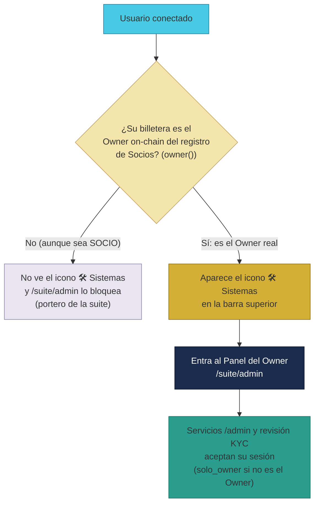
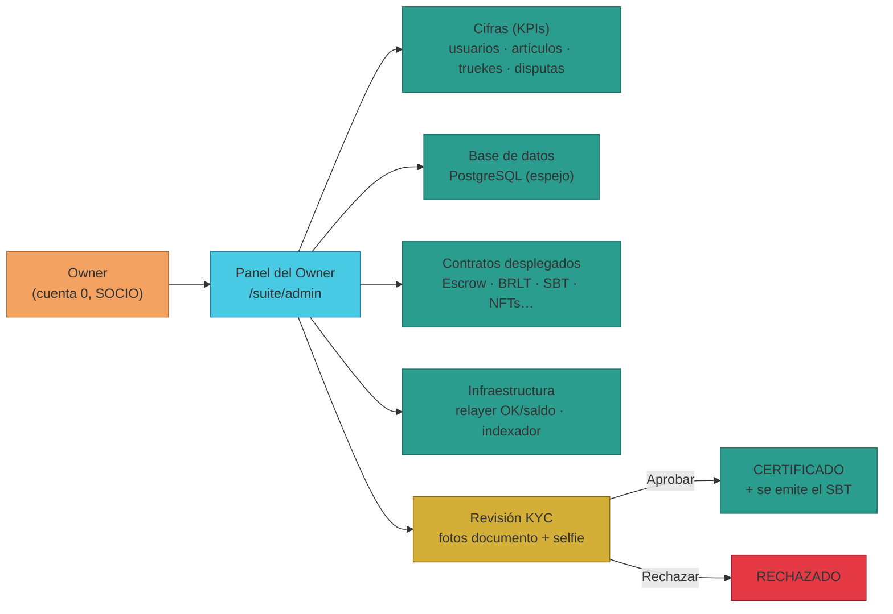

# Manual · Sistemas · El Panel del Owner: el cuadro de mandos de TrueKeate

> Versión en lenguaje sencillo del manual técnico
> "Panel del Owner / Sistemas" (`RepoTecnico/Manuales/08-Suite-Sistemas/01-panel-sistemas.md`).
> Aquí contamos qué ve y qué puede hacer la **persona responsable de
> TrueKeate** (el Owner) en su panel de control: cifras del momento,
> revisión de identidades con fotos, contratos desplegados, salud de los
> servidores y la **Biblioteca de Sistemas** (los manuales técnicos en PDF).
> Pensado para público general y para el propio Owner.

---

## 1. Empezar en 5 minutos

El **Panel del Owner** es la "sala de máquinas" de TrueKeate. Con él puedes:

1. **Ver las cifras del momento** (KPIs): cuántos usuarios hay, cuántos
   artículos se ofrecen, cuántos trueques se han hecho y cuántas disputas
   hay abiertas.
2. **Revisar solicitudes de certificación**: ver las **fotos (documento +
   selfie)** de quien quiere certificarse y **aprobar o rechazar**.
3. **Mirar la base de datos**: cuántas filas hay en las "carpetas"
   principales (usuarios, artículos, truekes).
4. **Mirar los contratos desplegados**: las direcciones de la "caja
   fuerte" y demás piezas en la cadena.
5. **Comprobar la salud de los servidores**: si el relayer (el que firma
   por ti) y el indexador (el que copia la cadena a la base) están OK.
6. **Descargar la Biblioteca de Sistemas**: los manuales técnicos en PDF.

> Para entrar necesitas ser el **Owner real**: la billetera **dueña
> on-chain del registro de Socios** (`owner()` del `SociosRegistry`), con
> sesión iniciada. Desde 2026-09-09 ya **no** basta con ser "SOCIO" en la
> base: el icono 🛠️ Sistemas solo aparece si la billetera conectada es el
> Owner. Cómo preparar la cuenta: manual
> `04-Despliegue/02-reinicio-y-bootstrap.md`.

---

## 2. Qué es el Panel del Owner

### 2.1 Propósito y alcance

- Es una pantalla **real** de TrueKeate (no un dibujo): la encuentras en
  **`/suite/admin`** con el título "🛠️ Sistemas · Panel del Owner".
- Reúne en una sola página: cifras (KPIs), estado de la base de datos,
  contratos desplegados, salud de los servidores, la **revisión de
  certificaciones** con fotos y la **Biblioteca de Sistemas** (los manuales
  técnicos en PDF, descargables solo por el Owner).

### 2.2 Quién puede usarlo (solo el Owner real)

El acceso está vigilado en varias capas, todas a la vez. **Desde 2026-09-09**
ya no se mira el "tipo SOCIO" de la base: la verdad del Owner la decide la
**cadena**.

| Capa | Qué comprueba |
|---|---|
| **Menú y dirección (web)** | El icono 🛠️ Sistemas **solo aparece si tu billetera es el Owner real** (`esOwner`, lo calcula el servidor contra el `owner()` on-chain del registro de Socios) |
| **Portero de la suite (URL)** | Si escribes `/suite/admin` sin ser el Owner, el portero te bloquea |
| **Aviso en la página** | Si entras sin ser el Owner, la web te avisa en rojo: "el backend rechazará las consultas" |
| **Servicios `/admin`** | Exigen sesión iniciada **y** ser el **Owner on-chain** (403 "solo_owner") |
| **Servicios de certificación** | Exigen ser el mismo **Owner on-chain** (el dueño del registro de Socios) |
| **Registro en la base** | El Owner debe estar dado de alta como CERTIFICADO + SOCIO (script de bootstrap) para operar el panel |
| **Consulta pública** | Hay un único servicio sin candado: `GET /admin/owner` responde "quién es el Owner" (solo la billetera, sin datos privados) — la usa la web para mostrar/ocultar el icono |

> Detalle fino: Ana y Bruno figuran como `tipo=SOCIO` en la base, pero **no
> ven Sistemas**: solo la wallet que responde al `owner()` del registro de
> Socios es el Owner. En producción (GCP) la comprobación es siempre
> on-chain.

<!-- GENERAR_IMAGEN: acceso-sistemas-owner.svg -->

---

## 3. La página del panel, pieza a pieza

### 3.1 La estructura

- **Cabecera**: el título, tu billetera corta (por ejemplo `0xf39F…2266`)
  y el botón **"↻ Refrescar"** para volver a pedir todos los datos.
- **Sin billetera conectada**: ves una tarjeta "Conecta la billetera del
  Owner".
- **Biblioteca de Sistemas** (solo Owner): una grilla de los manuales
  técnicos en PDF con sus portadas, para descargarlos.
- Los datos solo se pintan cuando **los servicios responden**: mientras
  tanto ves un indicador de carga.

### 3.2 Las tarjetas de cifras (KPIs)

Cuatro números con su icono:

- 👥 **Usuarios inscritos**
- 📦 **Artículos publicados**
- ⇄ **Trueques (espejo)** — los acuerdos registrados
- ⚖️ **Disputas abiertas**

### 3.3 La revisión de certificaciones (con fotos)

- En el panel vive el bloque de **KYC pendientes**: solicitudes de personas
  que subieron documento + selfie y esperan tu decisión. Se explica en la
  sección 4.

### 3.4 La base de datos off-chain

- Una tarjeta resume la base de datos (PostgreSQL en la nube): cuántos
  **usuarios**, **artículos** y **trueques** hay guardados. Recuerda que esa
  base es un **espejo** de lo que ocurre en la cadena: la llenan los
  eventos que emiten los contratos.

### 3.5 Los contratos desplegados

- La tarjeta "Contratos desplegados" lista las piezas de la cadena **con
  dirección real** (ignora las vacías): el Escrow (la caja fuerte), la
  fábrica de cuentas, el registro de Socios, la moneda BRLT, las
  suscripciones de empresas, los NFTs de trueques y el **TrueKeateSBT** de
  certificación (desde 2026-09).

### 3.6 La infraestructura (relayer e indexador)

- 🤖 **Relayer EIP-712** (el que firma las operaciones sin gas): muestra si
  está **OK** o **caído**, su billetera y un aviso de **"Saldo bajo:
  SÍ (recargar)"** si se está quedando sin fondos.
- 👁️ **Indexador** (el que copia la cadena a la base): muestra hasta qué
  bloque ha leído (**cabeza**), cuántos eventos ha procesado y cuántos han
  fallado.
- Si el servicio no está activado en ese despliegue, la tarjeta lo dice:
  "No configurado en este despliegue".

<!-- GENERAR_IMAGEN: biblioteca-sistemas-owner.svg -->

---

## 4. Revisar certificaciones: el bloque de KYC pendientes

### 4.1 Qué ves y cómo se cargan las fotos

- El panel pide la lista de solicitudes **PENDIENTES** y muestra, por cada
  persona: su **billetera**, su **tipo · nivel · medalla** (por ejemplo
  "Particular · Nivel 2 · 🥈") y las **dos fotos**: el **documento** y la
  **selfie**.
- Las fotos son privadas: la web las descarga con tu sesión de Owner (nadie
  más puede verlas, ni siquiera en el navegador, sin autorización).

### 4.2 Aprobar o rechazar

- **✅ Aprobar** → la persona pasa a **CERTIFICADO** y la plataforma le
  **emite su SBT** (su credencial digital). Ves un aviso en verde.
- **Rechazar** → el trámite de esa persona queda **RECHAZADO**.
- Después puedes pulsar "↻ Refrescar" para ver el resto de la cola y las
  cifras actualizadas.

> Si tienes dudas sobre qué es el SBT y por qué se emite al certificar,
> consulta el manual `03-Implementacion/09-certificacion-sbt.md`.

---

## 5. Los servicios que alimentan el panel (para curiosos)

### 5.1 Los servicios `/admin`

| Servicio | Qué devuelve | Quién puede |
|---|---|---|
| `GET /admin/usuarios` | Total de usuarios | Solo el Owner real |
| `GET /admin/contratos` | El mapa de contratos con sus direcciones | Solo el Owner real |
| `GET /admin/kpis-disputas` | Total de trueques y disputas abiertas | Solo el Owner real |
| `GET /admin/db` | Conteos de usuarios, artículos y trueques en la base | Solo el Owner real |
| `GET /admin/infra/health` | Salud del relayer y del indexador | Solo el Owner real |
| `GET /admin/owner` | La billetera del Owner resuelta | **Público** (sin sesión): la web lo usa para mostrar el icono |

### 5.2 Los servicios de certificación del Owner

- Listar pendientes, ver una imagen concreta y aprobar/rechazar: tres
  servicios reservados al Owner (detalles en el manual de certificación).

### 5.3 El cliente de la web

- La página del panel tiene su "cartero" que habla con cada servicio y
  trae los datos: uno por cada tarjeta (contratos, base de datos, KPIs,
  infraestructura y usuarios).

---

## 6. Operación guiada para el Owner

### 6.1 Preparar el terreno (una sola vez)

1. Da de alta al Owner (cuenta 0) como **CERTIFICADO + SOCIO** en la base
   con el script de bootstrap (manual `04-Despliegue/02-reinicio-y-bootstrap.md`).
2. Asegúrate de que esa cuenta es el **Owner on-chain** del registro de
   Socios (el `owner()` del `SociosRegistry`): sin red, define la variable
   `OWNER_WALLET` con esa dirección.
3. Conecta la billetera del Owner en el navegador e inicia sesión (una
   firma). Si la billetera es el Owner real, verás el icono 🛠️ Sistemas en
   la barra superior.

### 6.2 Revisar certificaciones pendientes

1. Entra en `/suite/admin` pulsando el icono **🛠️ Sistemas** de la barra
   superior (visible **solo** para la billetera del Owner; o escribe la URL
   directa — el portero la bloqueará a quien no sea el Owner).
2. En "KYC pendientes de revisión (DNI + selfie)" revisa cada solicitud con
   sus dos fotos.
3. Pulsa **Aprobar** (pasa a CERTIFICADO y se emite su SBT) o **Rechazar**.
4. Pulsa "↻ Refrescar" para recargar cifras y cola.

### 6.3 Leer cifras, base de datos, contratos e infraestructura

- **Cifras**: usuarios, artículos, trueques y disputas.
- **Base de datos**: conteos de la BD espejo (en la nube).
- **Contratos**: direcciones vivas de todas las piezas.
- **Infraestructura**: salud del relayer (estado y saldo) y del indexador
  (bloque leído, procesados y fallidos).

### 6.4 Verificación registrada en producción

- El 2026-09-08 se probó el flujo completo en producción: una usuaria sin
  SBT subió documento + selfie por la interfaz (PENDIENTE), el Owner la
  aprobó desde el panel → CERTIFICADO con su SBT emitido; otro usuario quedó
  CERTIFICADO por la vía automática del SBT. Queda registrado en
  `RepoTecnico/estado_proyecto.md` con capturas.

---

## 7. Lo que falta por confirmar (resumen)

1. ~~El servicio que lista los contratos no exige rol de Owner~~ →
   **resuelto 2026-09-09**: todas las rutas `/admin/*` exigen ser el Owner
   on-chain. El único servicio público es `GET /admin/owner` (solo expone la
   billetera del Owner, sin datos privados), que la web usa para mostrar u
   ocultar el icono.
2. Las cifras de disputas se calculan sobre el **espejo** de la base, no
   directamente sobre la cadena (y la API escribe los estados de disputa en
   el espejo en el flujo de cierre — ver manual 03 · 06 §10).
3. La comprobación del Owner es **on-chain** (`owner()` del registro de
   Socios). Existe un tercer nivel de respaldo del código que busca una
   columna `rol='OWNER'` en la base, pero **esa columna no existe** en el
   esquema: ese respaldo solo aplica a las pruebas en memoria; en
   producción siempre gana la comprobación en la cadena.

---

## 8. Glosario de este manual

| Palabra | Significado |
|---|---|
| **Owner** | La persona responsable de TrueKeate: la billetera dueña on-chain del registro de Socios (cuenta 0) |
| **Sistemas / Panel del Owner** | La sección `/suite/admin`, solo visible y utilizable por el Owner real |
| **esOwner** | El "sí/no" que calcula el servidor: ¿esta billetera es el Owner? |
| **Panel / dashboard** | Pantalla de control con cifras y acciones |
| **KPI** | Indicador: un número que resume el estado (usuarios, trueques…) |
| **Espejo** | La base de datos que copia lo que ocurre en la cadena |
| **KYC** | Trámite de certificación de identidad con fotos |
| **Relayer** | El servidor que firma operaciones sin que pagues gas |
| **Indexador** | El servicio que lee la cadena y llena la base espejo |
| **SBT** | Credencial digital emitida al certificar (ver manual 03·09) |
| **On-chain** | Lo que vive en la cadena (contratos y sus direcciones) |
| **Biblioteca de Sistemas** | Los manuales técnicos en PDF descargables desde el panel (solo Owner) |
