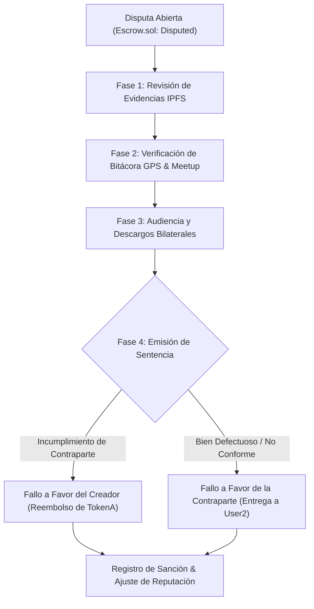

# ⚖️ Manual del Árbitro Comunitario — TrueKeat

Este documento establece el **código de conducta, procedimientos de investigación y resolución de disputas** aplicables a los Socios Árbitros designados por el protocolo TrueKeat.

---

## 1. Misión y Principios del Árbitro

El Árbitro Comunitario actúa como custodio de la justicia y la imparcialidad en el ecosistema descentralizado:
1. **Presunción de Buena Fe**: Toda parte se presume honesta hasta que las evidencias demuestren lo contrario.
2. **Criterio de Evidencia On-Chain y Multimedia**: Las decisiones se fundamentan en las fotografías IPFS previas al trueque, la bitácora GPS de los encuentros y los plazos pactados en el contrato.
3. **No Retención de Fondos**: El árbitro nunca custodia ni retiene fondos para sí mismo; únicamente emite la instrucción criptográfica al contrato `Escrow.sol` para que libere los fondos a la parte con derecho legítimo.

---

## 2. Protocolo de Resolución de Disputas Paso a Paso

### Paso 1: Notificación de la Disputa
Al activarse una disputa, el árbitro recibe un expediente con:
* Identificador de la operación (`operationId`).
* Direcciones de las partes (`user1` y `user2`) y sus historiales de reputación.
* Activos en custodia y plazo de expiración.

### Paso 2: Evaluación Técnica
* Comparar el estado del bien entregado contra las fotografías y especificaciones registradas en IPFS en el momento de la publicación.
* Revisar el registro de geolocalización del encuentro: verificar si ambas partes estuvieron en el punto acordado a la hora programada.

### Paso 3: Ejecución de la Sentencia
En el panel del Árbitro:
* Ejecutar `resolveDispute(operationId, favorUser1 = true)` para restituir el activo al creador.
* Ejecutar `resolveDispute(operationId, favorUser1 = false)` para entregar la custodia a la contraparte si esta cumplió íntegramente con sus obligaciones.
* En caso de faltas graves o fraude comprobado, elevar una propuesta de sanción en `Governance.sol` para revocar el nivel de identidad o suspender la cuenta infractora.
