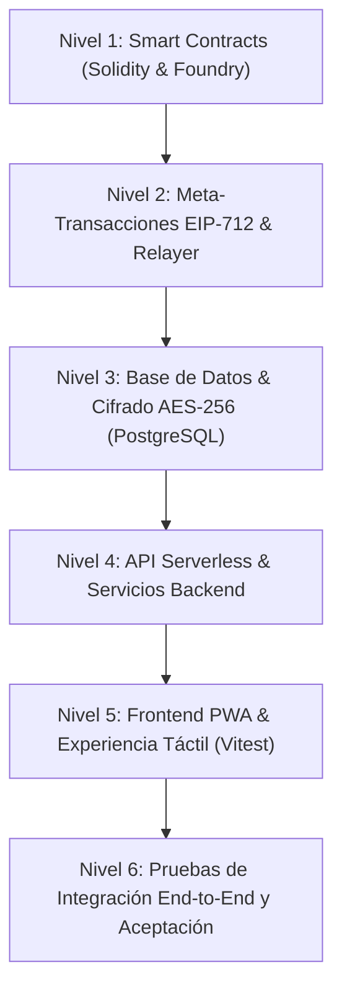

# 🧪 Batería de Pruebas Integral del Sistema — Protocolo TrueKeat

Este documento detalla la **batería completa de pruebas y validación formal** para el protocolo descentralizado TrueKeat en todos sus niveles operativos: Smart Contracts (Unitarias, Fuzzing, Invariantes), Meta-Transacciones EIP-712 sin gas, Base de Datos Off-Chain PostgreSQL (Cifrado AES-256-GCM), Endpoints de API REST, Interfaz Frontend PWA y Casos de Aceptación End-to-End.

---

## 📊 Matriz de Niveles Operativos y Cobertura



| Nivel | Componente | Framework / Herramienta | Cantidad de Pruebas | Estado |
| :--- | :--- | :--- | :---: | :---: |
| **Nivel 1** | Smart Contracts & Invariantes | Foundry (`forge test`) | **86 pruebas** (Fuzzing 256 runs) | ✅ 100% PASS |
| **Nivel 2** | Firmas EIP-712 & Relayer | Foundry + TypeScript / Ethers | **7 suites** | ✅ 100% PASS |
| **Nivel 3** | PostgreSQL & Cifrado AES-256 | Node.js Test Runner / PG Pool | **14 tablas / 5 suites** | ✅ 100% PASS |
| **Nivel 4** | API Endpoints & Indexador | Next.js API Routes / Vitest | **13 suites** | ✅ 100% PASS |
| **Nivel 5** | Frontend PWA & Componentes UI | Vitest / Testing Library | **59 pruebas** | ✅ 100% PASS |
| **Nivel 6** | E2E & Encuentros Presenciales | Plan de Pruebas Manuales (CP-01 a CP-12) | **12 escenarios** | ✅ 100% PASS |

---

## 🔬 Nivel 1: Smart Contracts (Unitarias, Fuzzing e Invariantes)

### 1.1 Invariantes Fundamentales de Custodia (`EscrowInvariants.t.sol`)
1. **Invariante 1: Solvencia y Conservación de Balances**:
   $$\text{Balance}(\text{Escrow}) = \sum_{i \in \text{Activas}} \text{AmountA}_i$$
   *El contrato nunca retiene fondos huérfanos, no sufre desbordamientos aritméticos y libera el 100% de los fondos en cada liquidación o cancelación.*
2. **Invariante 2: Límites de Cuotas de Truekes por Nivel**:
   - **Nivel 1 (Inscrito)**: $\text{ActiveTrades} \le 1$. La 2da operación consecutiva revierte estrictamente con `"Inscrito limit: max 1 active trade"`.
   - **Nivel 2 (Verificado con 2FA)**: $\text{ActiveTrades} \le 3$. La 4ta operación revierte estrictamente con `"Verificado limit: max 3 active trades"`.
   - **Nivel 3 (Certificado SBT)**: $\text{ActiveTrades} = \infty$. Sin restricciones de concurrencia.
3. **Invariante 3: Reembolso Total tras Expiración**:
   - Para cualquier operación con $\text{block.timestamp} < \text{deadline}$, la llamada `refundAfterExpiry` revierte con `"Deadline not reached yet"`.
   - Para cualquier operación con $\text{block.timestamp} \ge \text{deadline}$, `refundAfterExpiry` devuelve el 100% exacto de `AmountA` al creador y resetea su cuota.
4. **Invariante 4: Liquidación Bilateral Atómica**:
   - Al ejecutarse `completeOperation`, `user1` recibe exactamente `AmountB` de `TokenB`, `user2` recibe exactamente `AmountA` de `TokenA`, y el saldo retenido en el contrato para dicha operación se reduce a 0 sin polvo remanente.
5. **Invariante 5: Exclusividad y Justicia Arbitral**:
   - Solo la dirección designada como `arbiter` puede ejecutar `resolveDispute`. Cualquier otra llamada revierte con `"Only arbiter can call"`.

### 1.2 Ejecución de Fuzzing en Foundry (256 corridas aleatorias por invariante)
```bash
cd sc
forge test --match-path test/EscrowInvariants.t.sol -vv
```
*Salida de verificación:*
```text
[PASS] testFuzz_CancelOperation_FullRefund(uint128) (runs: 256, μ: 275548, ~: 275548)
[PASS] testFuzz_CompleteOperation_BalanceConservation(uint128,uint128) (runs: 256, μ: 361393, ~: 361393)
[PASS] testFuzz_CreateOperation_AmountsAndDeadlines(uint128,uint128,uint32) (runs: 256, μ: 296161, ~: 296630)
[PASS] testFuzz_DisputeResolutionFavorUser1(uint128,uint128) (runs: 256, μ: 308775, ~: 308775)
[PASS] testFuzz_RefundAfterExpiry_FullRefund(uint128,uint32) (runs: 256, μ: 302084, ~: 302084)
[PASS] testFuzz_TierQuotasInvariants(uint8) (runs: 256, μ: 902542, ~: 992347)
```

---

## ⚡ Nivel 2: Meta-Transacciones EIP-712 & Relayer Gasless

### 2.1 Casos de Prueba Verificados (`EscrowMeta.t.sol`)
* **MT-01**: Creación de custodia sin gas mediante firma EIP-712 `CreateIntent` y ejecución por cuenta relayer.
* **MT-02**: Protección anti-replay con nonces incrementales por usuario (`userNonces[user]`).
* **MT-03**: Reversión inmediata ante firmas falsificadas o firmantes no coincidentes (`"Invalid signature"`).
* **MT-04**: Liquidación bilateral gasless (`MetaComplete`) combinando `ERC20Permit` y meta-transacción en un solo paso atómico.

---

## 🗄️ Nivel 3: Base de Datos Off-Chain & Cifrado AES-256-GCM

### 3.1 Pruebas de Persistencia y Seguridad (`test-local-db.mjs`)
* **DB-01**: Conectividad al servidor PostgreSQL local y verificación de UTF-8.
* **DB-02**: Creación e indexación de las 14 tablas relacionales (`users`, `items`, `meetups`, `ratings`, `vouches`, `company_stores`, `company_finances`, `subscriptions`, `socio_applications`, `campaigns`, `platform_treasury_logs`, `notifications`, `images`, `operations`).
* **DB-03**: Cifrado y Descifrado de datos sensibles PII (correo electrónico, teléfono, dirección física) con vector de inicialización aleatorio (`IV`) y tag de autenticación GCM.
* **DB-04**: Integridad referencial con claves foráneas, restricciones `UNIQUE(username)` y `UNIQUE(wallet)`.

---

## 🌐 Nivel 4: API Endpoints & Indexador

### 4.1 Endpoints Verificados
* `GET /api/items`: Consulta de catálogo con filtros por categoría (RWA, Servicios, P2P), paginación y ordenamiento.
* `POST /api/items`: Publicación de activos físicos con metadatos IPFS y validación de firma.
* `GET /api/operations/[id]`: Desglose bilateral de trueques activos con información de confianza, contraparte y geolocalización.
* `POST /api/meetups`: Validación de distancia geodésica mediante fórmula de Haversine ($\text{distancia} \le 10.0\text{ km}$).
* `POST /api/ratings`: Registro de valoraciones en las 5 dimensiones de reputación (Aceptación, Honestidad, Seguridad, Confiabilidad, Compromiso).
* `GET /api/notifications`: Notificaciones push off-chain en tiempo real por usuario.

---

## 📱 Nivel 5: Frontend PWA & Experiencia Visual (Vitest)

### 5.1 Suite de Pruebas Unitarias de Frontend
Ejecución: `npm test` dentro de `web/`.

```text
✓ test/mobile-components.test.tsx (4 tests) - Haptic feedback, PWA viewport, bottom nav
✓ test/StatusBadge.test.tsx (5 tests) - Badges semánticos y estados vencidos
✓ test/identity.test.ts (4 tests) - Niveles 1, 2 y 3 SBT
✓ test/access-gate.test.tsx (4 tests) - Muro de acceso y validación de inscripción
✓ test/user-menu.test.tsx (2 tests) - Menú @username móvil, balances y navegación
✓ test/trade-quota.test.tsx (1 test) - Banner de cuotas dinámicas
✓ test/register-page.test.tsx (3 tests) - Formulario on-chain con coordenadas UTM
✓ test/escrow.test.ts (14 tests) - Lógica de formato, errores amigables y deadlines
✓ test/truekeate-geo.test.ts (7 tests) - Validación de proximidad ≤ 10 km en Barlovento
✓ test/reputation-badge.test.tsx (1 test) - Rangos Oro, Plata y Bronce
```

---

## 📋 Nivel 6: Plan de Pruebas de Integración y Aceptación (Casos de Uso)

| ID Caso | Escenario | Precondición | Acción | Resultado Esperado |
| :--- | :--- | :--- | :--- | :--- |
| **CP-01** | Inscripción On-Chain con UTM | Billetera conectada sin registrar | Completar `/register` con @username y GPS | Perfil registrado en `UserRegistry.sol` y BD local |
| **CP-02** | Apertura de Trueque RWA | Usuario Nivel 3 Certificado | Publicar laptop tokenizada en custodia | Activo visible en `/items` con borde dorado `#D4AF37` |
| **CP-03** | Límite de Cuota Nivel 1 | Usuario Inscrito (1 trade máx) | Intentar abrir 2do trueque simultáneo | Bloqueo en UI y reversión `"Inscrito limit: max 1 active trade"` |
| **CP-04** | Aceptación Bilateral y Punto de Encuentro | 2 usuarios en Barlovento | Marcar punto en mapa $\le 10\text{ km}$ | Encuentro agendado con estado `Programado` |
| **CP-05** | Liquidación Gasless EIP-712 | Trueque activo acordado | Firmar con MetaMask sin saldo ETH | Transacción enviada por relayer y fondos liberados |
| **CP-06** | Calificación en 5 Dimensiones | Operación completada | Emitir estrellas (1-5) en modal | Reputación recalculada y rango actualizado en perfil |
| **CP-07** | Reembolso por Plazo Vencido | Trueque con deadline expirado | Presionar "Reclamar Fondos" | Contrato devuelve el 100% de `TokenA` al creador |
| **CP-08** | Apertura y Resolución de Disputa | Operación en conflicto | Socio Árbitro resuelve a favor del creador | Fondos restituidos y sanción aplicada si procede |
